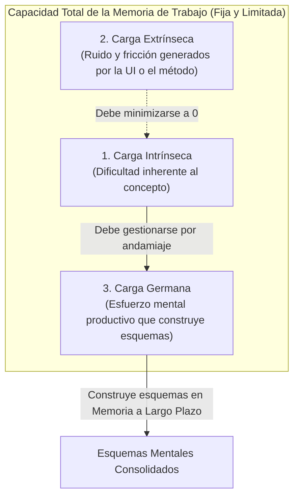
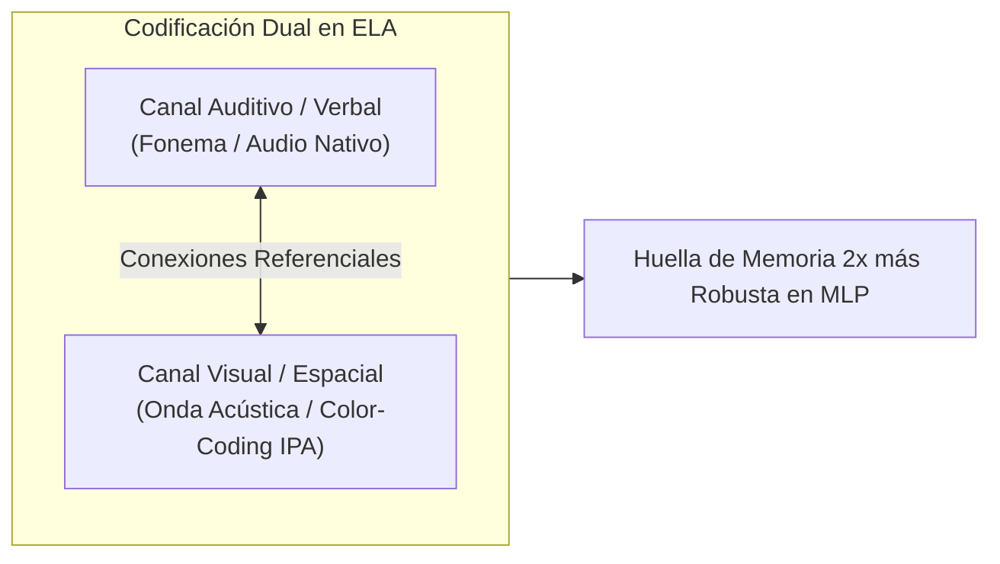
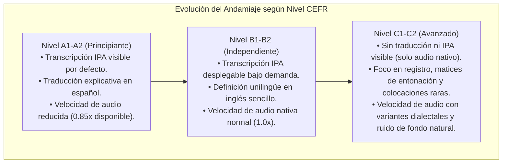

# Teoría de la Carga Cognitiva y Principios de Aprendizaje Multimedia
## English Learning Assistant (ELA)

Este documento define los principios de la **Teoría de la Carga Cognitiva (Cognitive Load Theory - CLT)** y el **Aprendizaje Multimedia** que rigen el diseño de la interfaz de usuario (UI), la presentación audiovisual de la fonética y la arquitectura de interacción de ELA.

El cuello de botella universal del cerebro humano es la **Memoria de Trabajo (*Working Memory*)**, cuya capacidad está limitada a apenas $4 \pm 1$ unidades de información activa simultánea (Cowan, 2001). Cualquier aplicación que sobrecargue este canal frustra el aprendizaje y provoca el abandono del usuario.

---

## 1. La Arquitectura Tripartita de la Carga Cognitiva (John Sweller)

John Sweller (1988, 2011) demostró que durante cualquier tarea de aprendizaje, la memoria de trabajo se divide en tres tipos de carga:

### 1.1. Los Tres Tipos de Carga en el Aprendizaje de Idiomas

| Tipo de Carga | Definición y Origen | Enfoque de Diseño en ELA |
| :--- | :--- | :--- |
| **Carga Intrínseca (*Intrinsic Load*)** | Depende de la interactividad entre elementos (*element interactivity*). Por ejemplo, aprender un verbo aislado es de baja interactividad; dominar una regla de Habla Conectada con enlace consonántico, cambio vocálico y acento oracional es de altísima interactividad. | Se gestiona mediante **segmentación progresiva**: nunca se expone al alumno a la frase compleja completa sin haber aislado previamente el contraste fonético crítico. |
| **Carga Extrínseca (*Extraneous Load*)** | Ruido mental provocado por mala diagramación, menús laberínticos, tipografía poco legible, instrucciones ambiguas o distracciones gamificadas inútiles. | **Se elimina de raíz**: Interfaz "Warm Minimalist & Editorial Tech", sin barras de energía ficticias ni animaciones estrepitosas. Navegación directa en 1 clic. |
| **Carga Germana (*Germane Load*)** | Esfuerzo cognitivo dedicado a procesar la información, comparar hipótesis, notar la brecha y fijar esquemas en la memoria a largo plazo. | **Se maximiza**: La memoria de trabajo liberada de fricción se enfoca exclusivamente en la resolución activa de ejercicios socráticos y drilss de velocidad. |

---

## 2. Teoría de la Codificación Dual (Allan Paivio)

Allan Paivio (1986, 2006) demostró que el cerebro procesa la información a través de dos subsistemas independientes pero interconectados:
1. **El Canal Verbal (Logogens):** Procesa texto escrito, palabras habladas y estructuras sintácticas.
2. **El Canal No Verbal / Visual (Imagens):** Procesa imágenes, formas espaciales, colores y movimientos.

### 2.1. El Beneficio Aditivo
Cuando una palabra o fenómeno fonético se codifica simultáneamente en ambos canales mediante asociaciones congruentes (p. ej. escuchar el sonido `/ɪ/` al tiempo que se visualiza su posición central en el cuadrilátero vocálico y su código de color contrastado frente a `/iː/`), el cerebro genera dos vías de acceso independientes en la memoria a largo plazo. Si una vía se debilita, la otra permite recuperar el concepto.

---

## 3. Principios de Aprendizaje Multimedia Aplicados a ELA (Richard Mayer)

Richard Mayer (2009, 2020) formuló principios basados en evidencia científica para el diseño de entornos educativos digitales. ELA adopta rigurosamente los siguientes:

### 3.1. Principio de Modalidad (*Modality Principle*)
- **Regla:** Los estudiantes aprenden mejor cuando la información explicativa se presenta mediante **audio y gráficos**, en lugar de gráficos y texto escrito denso.
- **Aplicación en ELA:** En el Laboratorio Fonético, la explicación de cómo se mueven la lengua y los labios se presenta con animación gráfica anatómica y narración en audio nativo, evitando que los ojos tengan que alternar constantemente entre leer un párrafo y mirar el gráfico.

### 3.2. Principio de Atención Dividida (*Split-Attention Principle*)
- **Regla:** Separar físicamente un diagrama de su texto explicativo obliga a la memoria de trabajo a gastar recursos buscando correspondencias visuales.
- **Aplicación en ELA:** En los análisis de *Connected Speech*, las etiquetas fonéticas (elisión, asimilación, enlace) se muestran integradas directamente sobre las palabras de la oración, no en leyendas al pie de página ni en tablas desconectadas.

### 3.3. Principio de Redundancia (*Redundancy Principle*)
- **Regla:** Leer en voz alta exactamente el mismo bloque de texto que el usuario ya está leyendo visualmente satura el canal verbal de la memoria de trabajo y disminuye la comprensión.
- **Aplicación en ELA:** Los audios del sistema nunca narran párrafos de instrucciones que ya están escritos en pantalla. El audio se reserva exclusivamente para los modelos acústicos nativos de las oraciones y pares mínimos.

### 3.4. Principio de Señalización (*Signaling / Cueing Principle*)
- **Regla:** Los aprendices aprenden mejor cuando se añaden pistas visuales que dirigen la atención hacia los elementos esenciales.
- **Aplicación en ELA:** En las oraciones de habla rápida, se utilizan marcadores de color específicos y sutiles:
  - 🔵 **Azul:** Enlaces consonante-vocal (Catenación).
  - 🔴 **Rojo tachado:** Elisiones (sonidos suprimidos).
  - 🟡 **Amarillo:** Asimilaciones regresivas o coalescentes.
  - 🟢 **Verde:** Reducciones vocálicas al Schwa `/ə/`.

### 3.5. Principio de Coherencia (*Coherence Principle*)
- **Regla:** Eliminar todo material secundario o decorativo (música de fondo, efectos de sonido de videojuego o ilustraciones anecdóticas) incrementa significativamente el aprendizaje.
- **Aplicación en ELA:** Cero música de fondo o animaciones de relleno. Cada elemento gráfico en pantalla cumple una función mnemotécnica o lingüística precisa.

---

## 4. El Efecto de Inversión de la Experiencia (Expertise Reversal Effect - Slava Kalyuga)

### 4.1. El Principio
Las estrategias instruccionales que son altamente beneficiosas para un principiante (A1-A2), como el andamiaje paso a paso, las transcripciones fonéticas completas y las traducciones al español, se vuelven **contraproducentes y generan sobrecarga extrínseca** a medida que el aprendiz avanza hacia niveles B2 y C1 (Kalyuga, 2007).

### 4.2. Andamiaje Adaptativo en ELA

