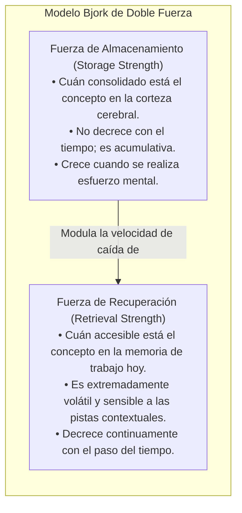
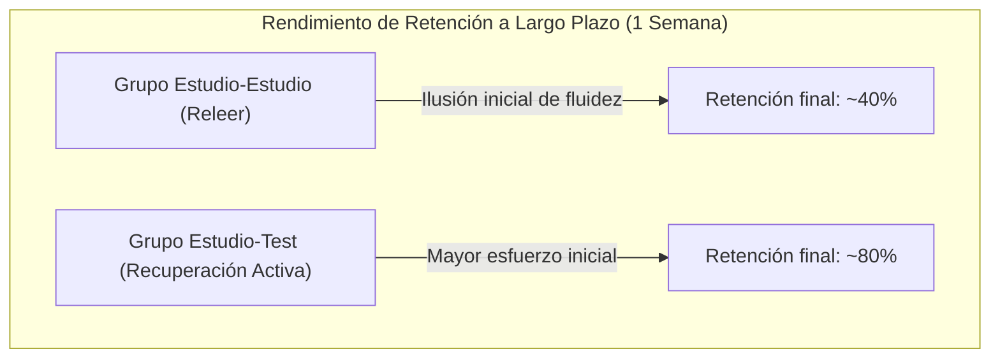
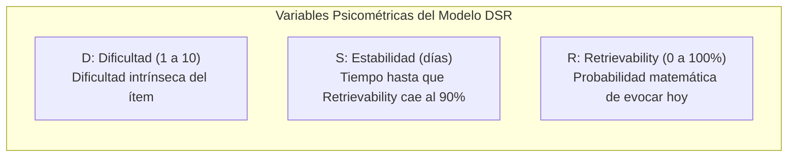

# Ciencias de la Memoria, Recuperación Activa y Repetición Espaciada
## English Learning Assistant (ELA)

Este documento expone los fundamentos de la **Psicología Cognitiva de la Memoria** que gobiernan el motor de repetición espaciada y los mecanismos de práctica de ELA. Diseñar un software educativo sin considerar la arquitectura de la memoria a largo plazo conduce invariablemente a la rápida decadencia del recuerdo o al agotamiento del usuario por sobre-repaso ineficiente.

---

## 1. La Dinámica de la Memoria: Fuerza de Almacenamiento vs. Fuerza de Recuperación (Bjork & Bjork)

Robert y Elizabeth Bjork (1992, 2011) formularon la "Nueva Teoría del Desuso" (*New Theory of Disuse*), que demuestra que cualquier huella de memoria posee dos dimensiones independientes:

### 1.1. Las Cuatro Combinaciones de Memoria

| Condición | Fuerza de Almacenamiento (SS) | Fuerza de Recuperación (RS) | Ejemplo en el Aprendizaje de Idiomas |
| :--- | :--- | :--- | :--- |
| **Bajo SS, Alto RS** | Baja | Alta | Acabas de leer una lista de 10 palabras nuevas hace 2 minutos. Crees que ya las sabes (ilusión de competencia), pero mañana habrás olvidado el 80%. |
| **Bajo SS, Bajo RS** | Baja | Baja | Una palabra en inglés que viste una sola vez hace tres meses en una película y nunca volviste a repasar. Totalmente inaccesible. |
| **Alto SS, Bajo RS** | Alta | Baja | Una regla o palabra que dominabas perfectamente en el colegio, pero tras 5 años sin usar el inglés, no la recuerdas en una conversación. Sin embargo, con un solo recordatorio la reactivas instantáneamente (*savings effect*). |
| **Alto SS, Alto RS** | Alta | Alta | Palabras ultraconvalidadas como *"hello"*, *"water"* o tu propio nombre en inglés. Disponibles en milisegundos con cero esfuerzo. |

### 1.2. El Principio de las Dificultades Deseables (Desirable Difficulties)
El hallazgo crucial de Bjork es que **el incremento en la Fuerza de Almacenamiento ($SS$) es inversamente proporcional a la Fuerza de Recuperación ($RS$) en el momento del repaso**:
- Si repasas una palabra cuando su $RS$ es del $100\%$ (p. ej. 30 segundos después de verla), el esfuerzo cognitivo es nulo y la ganancia en $SS$ es prácticamente cero.
- Si repasas la palabra en el punto de dificultad deseable (cuando la probabilidad de evocarla ha caído cerca del $85-90\%$, requiriendo un esfuerzo mental consciente pero alcanzable), el cerebro reestructura sus redes sinápticas y el incremento en $SS$ es máximo.

---

## 2. El Efecto de Evaluación y la Práctica de Recuperación (Roediger & Karpicke)

### 2.1. El Estudio Emblemático (2006)
Henry Roediger y Jeffrey Karpicke demostraron que la evaluación (*testing*) no es un instrumento para medir pasivamente lo que el alumno sabe, sino **el mecanismo mnemotécnico más potente que existe para consolidar recuerdos**.

### 2.2. Por qué Fallan las Aplicaciones Tradicionales: Reconocimiento vs. Evocación Cued/Free
- **La Falacia del Reconocimiento (Recognition Memory):** Presentar cuatro opciones en un test múltiple activa la corteza perirrinal y permite adivinar por familiaridad visual, sin construir vías de recuperación robustas en el hipocampo y la neocorteza. El estudiante siente que "sabe", pero cuando debe hablar en la vida real, se queda en blanco.
- **La Solución en ELA:** El motor de repaso utiliza **Recuperación con Pistas Mínimas (*Cued Recall*)** y **Generación Forzada (*Generation Effect*)**:
  - En lugar de elegir *"A, B, C o D"*, el usuario debe escribir o pronunciar activamente el término objetivo en un contexto oracional (*Cloze test*).

---

## 3. El Efecto de Hipercorrección (Janet Metcalfe)

### 3.1. Dinámica del Error en la Memoria
Tradicionalmente se temía que cometer errores en el aprendizaje de idiomas causara la "fosilización del error". La neurociencia contemporánea ha refutado esta idea:
- Janet Metcalfe (2017) descubrió el **Efecto de Hipercorrección (*Hypercorrection Effect*)**: cuando un estudiante comete un error estando **altamente seguro de su respuesta**, y se le suministra feedback correctivo explicativo inmediato, la corrección se recuerda a largo plazo con una tasa de retención sustancialmente mayor que si hubiera acertado por casualidad.
- **Mecanismo Neurobiológico:** El choque entre la expectativa de acierto y la realidad del error desencadena una respuesta dopaminérgica de "error de predicción" (*prediction error*), enfocando la atención plena del cerebro en la información correctiva.

### 3.2. Implementación en ELA
- El sistema no penaliza los errores como fracasos punitivos.
- Cuando el usuario falla un falso amigo con alta certeza (p. ej. confunde *actually* con *actualmente*), el motor de diagnóstico activa una tarjeta especial de *Deep Contrast* con feedback etimológico y colocacional.

---

## 4. Evolución de los Modelos Matemáticos de Repetición: De SM-2 a FSRS

### 4.1. Las Limitaciones Insuperables del Algoritmo SM-2 (1987)
Durante 35 años, el software de flashcards dependió de SuperMemo-2 (SM-2):
- Asume un factor de facilidad constante (*Easiness Factor*).
- No modela la probabilidad real de olvido de forma continua.
- Provoca el fenómeno de "infierno de repasos" (*review hell*), acumulando miles de tarjetas repetitivas cuando el usuario suspende un día de estudio.

### 4.2. El Algoritmo FSRS (Free Spaced Repetition Scheduler) y el Modelo DSR
ELA implementa el estado del arte: **FSRS**, basado en tres variables psicométricas continuas:

#### Ecuación de Retrievability (Decaimiento de la Memoria):
$$R(t) = \left(1 + F \cdot \frac{t}{S}\right)^{-w}$$
Donde:
- $t$ es el tiempo transcurrido desde el último repaso (en días).
- $S$ es la estabilidad actual calculada para esa tarjeta.
- $F$ y $w$ son constantes empíricas de calibración.

#### Programación Óptima del Intervalo:
El intervalo para el siguiente repaso ($I$) se calcula exactamente fijando la retención deseada ($R_{\text{deseada}} = 0.90$):
$$I = S \cdot \frac{R_{\text{deseada}}^{-1/w} - 1}{F}$$

### 4.3. Ventajas de FSRS en ELA
1. **Reducción del 30-40% en repasos innecesarios** comparado con SM-2, manteniendo exactamente la misma tasa de retención a largo plazo ($90\%$).
2. **Resiliencia ante repasos tardíos o adelantados:** Si el usuario repasa antes de tiempo o tras una pausa de vacaciones, FSRS calcula el nuevo valor de $S$ en función del $R$ real en ese instante matemático, evitando descalibraciones en la cola.

---

## 5. Directrices Técnicas para el Motor de Repaso de ELA

1. **Retención Objetivo Configurable:** El sistema opera por defecto con una retención programada de $90\%$, ajustable por el usuario entre $85\%$ y $95\%$.
2. **Generación Activa Obligatoria:** Las tarjetas léxicas y gramaticales exigen recuperación mediante huecos (*Cloze*) o producción fonética, prohibiendo la calificación pasiva sin esfuerzo mental.
3. **Desagrupación Semántica (Interleaving):** El motor no presenta tarjetas del mismo campo léxico en bloque para evitar la interferencia de proacción y retroacción.
