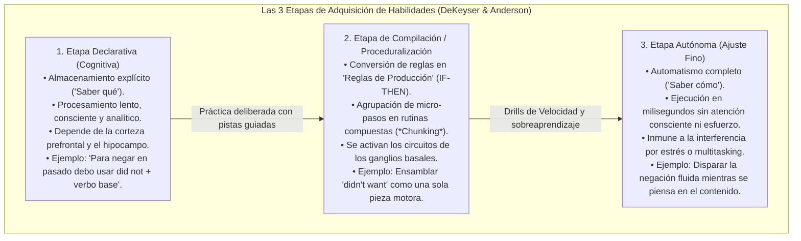
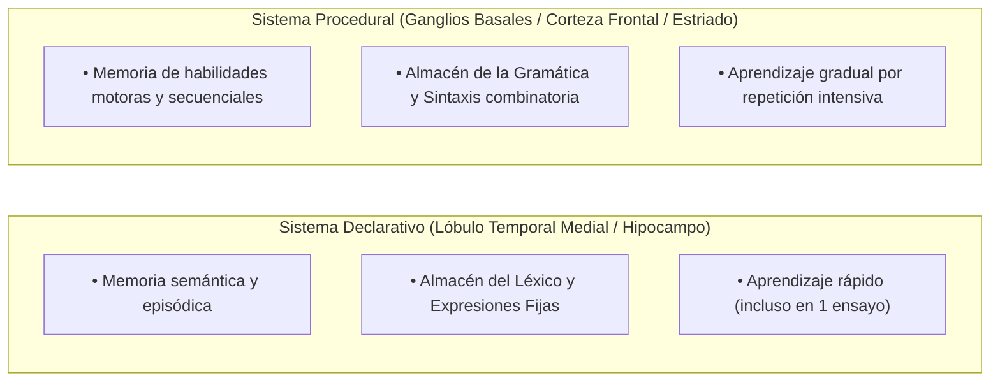
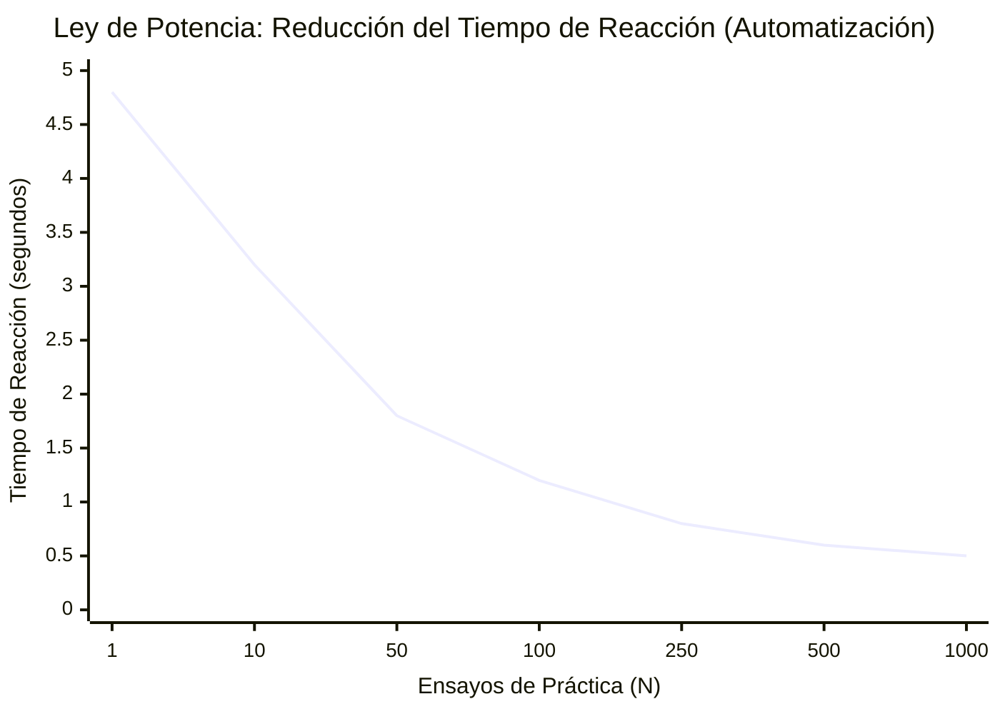
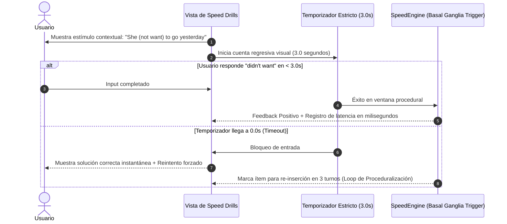

# Teoría de Adquisición de Habilidades, Automaticidad y el Modelo DP
## English Learning Assistant (ELA)

Este documento detalla los principios de la **Teoría de Adquisición de Habilidades Cognitivas (Cognitive Skill Acquisition Theory)**, la arquitectura **ACT-R** y el **Modelo Declarativo/Procedural (DP)** de la neurobiología del lenguaje. Explica por qué saber conscientemente una regla gramatical no permite hablar con fluidez, y define el mecanismo exacto para transformar el conocimiento explícito en automatismo motor e intuitivo.

---

## 1. El Dilema del Aprendiz Adulto: Saber la Regla vs. Poder Usarla

El problema más recurrente de los hispanohablantes en niveles intermedios (el "plateau" de B1-B2) se resume en una paradoja:
> *"Sé perfectamente que en tercera persona singular se agrega una 's', o que después de preposición va gerundio; pero cuando hablo en una reunión o en una conversación real, sigo cometiendo el mismo error o me trabo pensando en la conjugación."*

La ciencia cognitiva contemporánea demostró que esto no se debe a "falta de inteligencia" ni a "falta de estudio", sino a que **el conocimiento está confinado en el sistema cerebral equivocado**: en la memoria declarativa en lugar de la memoria procedural.

---

## 2. La Teoría de Adquisición de Habilidades (Robert DeKeyser & John R. Anderson)

John R. Anderson (arquitectura ACT-R) y Robert DeKeyser (2007, 2020) establecieron que aprender una segunda lengua en la adultez sigue exactamente las mismas leyes neurocognitivas que aprender a pilotar un avión, tocar el piano o jugar al ajedrez. El aprendizaje transita por tres etapas obligatorias e irreversibles:

---

## 3. El Modelo Declarativo / Procedural de Michael Ullman

Michael Ullman (2001, 2016) identificó las bases neuroanatómicas disociadas del lenguaje:

### 3.1. La Gran Discrepancia entre L1 y L2
- **En la Lengua Materna (L1):** Los niños adquieren el vocabulario en el sistema declarativo, pero adquieren toda la gramática y fonología de manera natural en el **sistema procedural**. Por eso un nativo habla fluidamente sin conocer la terminología técnica de la gramática.
- **En la Segunda Lengua (L2) en Adultos:** Debido a la maduración cerebral, el cerebro adulto tiende a canalizar **tanto el vocabulario como la gramática dentro del sistema declarativo**. El estudiante almacena las reglas sintácticas como si fueran datos históricos ("la capital de Francia es París"). 

### 3.2. Consecuencia
En una conversación en tiempo real (que demanda un ritmo de producción de 130 a 160 palabras por minuto), el sistema declarativo colapsa por sobrecarga computacional. El usuario experimenta bloqueos (*anomia momentánea*), titubeos y recurre a la traducción mental desde el español.

---

## 4. La Ley de Potencia de la Práctica (Power Law of Learning)

Newell y Rosenbloom (1981) demostraron que la velocidad y el tiempo de reacción ($RT$) en la ejecución de una habilidad siguen una función potencial decreciente en función del número de repeticiones de práctica ($N$):

$$RT = a + b \cdot N^{-c}$$

Donde:
- $a$ es el tiempo mínimo fisiológico irreducible (límite neuro-motor).
- $b$ es la ganancia potencial inicial.
- $c$ es la tasa de aprendizaje.

**Conclusión pedagógica:** La proceduralización exige un volumen concentrado de práctica inmediata. Las primeras decenas de ensayos producen un salto drástico en la velocidad de respuesta, liberando la memoria de trabajo para tareas de orden superior.

---

## 5. Procesamiento Apropiado para la Transferencia (Transfer-Appropriate Processing - TAP)

Morris, Bransford y Franks (1977) formularon el principio de **Transfer-Appropriate Processing (TAP)**:
> *"La recuperación de una memoria o habilidad es exitosa únicamente en la medida en que las operaciones cognitivas llevadas a cabo durante la fase de entrenamiento coinciden con las operaciones requeridas en la situación real de uso."*

### Por qué fallan los ejercicios de libro o las apps tradicionales:
- **En los ejercicios de rellenar espacios estáticos:** El alumno tiene 2 o 3 minutos para pensar, analizar la regla con calma, borrar y volver a escribir.
- **En la vida real:** Un interlocutor espera una respuesta en un intervalo de **200 a 500 milisegundos**. Si no se responde en ese lapso, la interacción conversacional se corta.
- **El Desajuste de TAP:** Entrenar sin restricción temporal entrena al cerebro para ser un "analista gramatical lento", no un "hablante fluido en tiempo real".

---

## 6. Especificación de Software: Los Drills de Velocidad (Speed Drills) en ELA

Para materializar las teorías de DeKeyser, Anderson y Ullman, el módulo `SpeedEngine` de ELA opera bajo las siguientes reglas algorítmicas:

### Reglas de Diseño de los Drills de Velocidad:
1. **Límite Temporal Estricto (3 a 5 segundos):** Impide que la corteza prefrontal ejecute la traducción deliberada L1 $\rightarrow$ L2. La presión temporal fuerza a los ganglios basales a disparar la colocación como un bloque motor indivisible.
2. **Estímulos de Reacción Inmediata:** Transformación de oraciones (Afirmativa $\rightarrow$ Negativa $\rightarrow$ Pregunta), o sustitución de sujetos (*He* $\rightarrow$ *They* $\rightarrow$ *She*).
3. **Métrica de Latencia de Proceduralización:** ELA no solo registra "correcto/incorrecto", sino el tiempo exacto en milisegundos ($RT$). Un ítem solo se considera **"Proceduralizado"** cuando el usuario acierta en tres sesiones distintas con un $RT < 1.5$ segundos.
