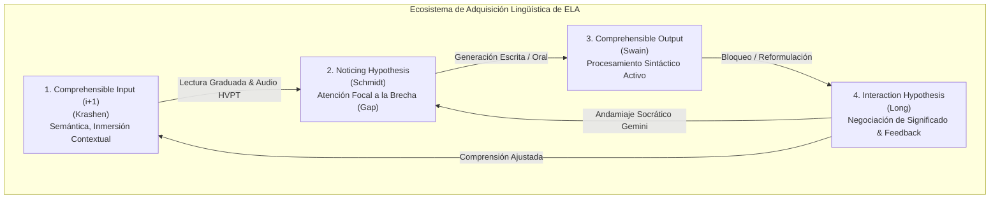
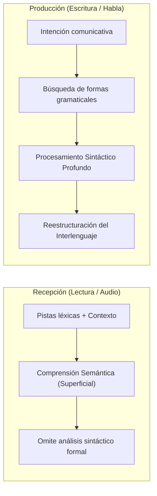

# Hipótesis Fundamentales de Adquisición de Segundas Lenguas (SLA)
## English Learning Assistant (ELA)

Este documento detalla las cuatro hipótesis centrales de la **Lingüística Aplicada y la Adquisición de Segundas Lenguas (SLA)** que sustentan la arquitectura funcional de ELA. Superando la dicotomía simplista entre "estudio puramente gramatical" e "inmersión pasiva", este marco articula cómo se produce la verdadera reestructuración del interlenguaje en aprendices adultos.

---

## 1. El Modelo de Interacción Cuádruple en ELA

---

## 2. Hipótesis del Input Comprensible ($i+1$) y el Monitor (Stephen Krashen)

### 2.1. Los Cinco Postulados de Krashen y su Validez Contemporánea
1. **La distinción Adquisición vs. Aprendizaje:** La adquisición es un proceso subconsciente e implícito (similar a L1); el aprendizaje es explícito y consciente (reglas y metalingüística).
2. **La Hipótesis del Input Comprensible:** La adquisición solo ocurre cuando el estudiante comprende mensajes que contienen estructuras situadas un paso más allá de su competencia actual ($i+1$).
3. **El Orden Natural:** Los morfemas y estructuras gramaticales se adquieren en un orden predecible, independientemente de la instrucción formal.
4. **El Monitor:** El conocimiento aprendido conscientemente solo actúa como un editor o "monitor" posterior a la producción natural, condicionado por tener tiempo suficiente, foco en la forma y conocimiento explícito de la regla.
5. **El Filtro Afectivo:** Variables como la ansiedad, la baja autoestima y la falta de motivación actúan como una barrera mental que bloquea la entrada del input al centro de adquisición del lenguaje.

### 2.2. Crítica Científica y Ajustes en ELA
- **La Limitación de Krashen:** El input masivo por sí solo es insuficiente para que los adultos alcancen precisión sintáctica y fluidez en producción (como demostró Swain en los programas de inmersión canadienses). Un estudiante puede consumir cientos de horas de lectura o audio infiriendo el significado por el contexto global sin jamás adquirir las terminaciones verbales, preposiciones o regímenes sintácticos.
- **Implementación en ELA:**
  - El *Smart Graded Reader* no expone al usuario a un texto plano: analiza algorítmicamente la densidad léxica del documento para asegurar que se encuentre estrictamente entre el $95\%$ y el $98\%$ de comprensibilidad.
  - El conocimiento explícito no se relega a un simple "monitor pasivo": se utiliza como catalizador cognitivo para acelerar el *noticing* y la compilación procedimental.

---

## 3. La Hipótesis del Noticing (Richard Schmidt)

### 3.1. Principio Cognitivo
Richard Schmidt (1990, 2001) demostró que el aprendizaje incidental puramente subliminal no existe para las características gramaticales complejas en adultos. Para que una característica del input se transforme en **intake** (información asimilada que modifica la gramática interna del aprendiz), debe ser **atendida y notada conscientemente** (*noticing at the level of awareness*).

### 3.2. La Brecha entre el Interlenguaje y la Lengua Meta (*Noticing the Gap*)
El proceso de adquisición requiere tres niveles de atención consciente:
1. **Noticing:** Darse cuenta de que una forma lingüística específica existe en el input (p. ej. notar que el nativo dice *"depends on"* y no *"depends of"*).
2. **Noticing the Gap:** Percibir conscientemente la discrepancia entre la forma producida por el propio interlenguaje del usuario y la forma correcta del hablante nativo.
3. **Understanding:** Comprender el principio o regla subyacente que rige dicha diferencia.

### 3.3. Implementación en ELA
- **Resaltado Visual de Brechas (Gap Highlighting):** En el Taller de Redacción con Gemini, el sistema no entrega una corrección opaca. Coloca en paralelo la producción del usuario y la versión nativa, coloreando exactamente el elemento léxico, fonético o morfosintáctico que causó la discrepancia.
- **Conciencia Fonológica:** En el módulo de *Connected Speech*, el software hace explícitas las fronteras silábicas borradas (elisiones, enlaces, formas débiles) mediante código de color, forzando al aparato auditivo a notar los sonidos que el "filtro perceptivo L1" tiende a ignorar.

---

## 4. La Hipótesis del Output Comprensible (Merrill Swain)

### 4.1. Del Procesamiento Semántico al Procesamiento Sintáctico
Merrill Swain (1985, 1995, 2005) revolucionó la lingüística aplicada al demostrar que escuchar y leer activan un **procesamiento semántico superficial**: el cerebro deduce el significado general apoyándose en pistas léxicas clave, el contexto y el conocimiento previo del mundo, sin necesidad de analizar la morfología ni el orden de las palabras.

Por el contrario, **producir lenguaje (escribir o hablar)** fuerza al estudiante a transitar de un modo semántico a un **procesamiento sintáctico profundo**: para hablar o redactar, el usuario debe decidir activamente la estructura gramatical, las preposiciones, la concordancia y los tiempos verbales.

### 4.2. Las Tres Funciones del Output en ELA
1. **Función de Detección de Brechas (Noticing / Triggering Function):** Al intentar escribir una idea compleja, el estudiante se "traba" y descubre en tiempo real lo que no sabe decir (*"Sé lo que quiero expresar, pero no sé qué preposición usar aquí"*).
2. **Función de Comprobación de Hipótesis (Hypothesis-Testing Function):** La producción representa la puesta a prueba de una hipótesis sobre cómo funciona el inglés. El feedback inmediato de la IA confirma o desmiente dicha hipótesis.
3. **Función Metalingüística (Metalinguistic Function):** Permite reflexionar sobre la naturaleza del lenguaje y consolidar el conocimiento explícito en esquemas procedimentales.

### 4.3. Implementación en ELA
- Prohibición de ejercicios basados exclusivamente en reconocimiento pasivo (como tarjetas flash de solo presionar un botón).
- **Taller de Redacción Socrática:** Ejercicios guiados de producción escrita activa usando estructuras léxicas complejas recién aprendidas con auto-corrección reflexiva.
- **Producción Fonética Activa:** El usuario debe grabar y contrastar su propia onda acústica frente al modelo nativo en el Laboratorio Fonético.

---

## 5. La Hipótesis de Interacción y Negociación de Significado (Michael Long)

### 5.1. El Mecanismo de Modificación Interaccional
Michael Long (1983, 1996) postuló que la adquisición se optimiza cuando los interlocutores enfrentan una ruptura en la comunicación y se ven obligados a **negociar el significado** (*negotiation of meaning*).

En una conversación natural o en una tutoría interactiva, esta negociación se logra mediante:
- **Peticiones de Clarificación (Clarification Requests):** *"What do you mean by X?"*
- **Comprobaciones de Comprensión (Comprehension Checks):** *"Does that make sense?"*
- **Confirmaciones de Recepción (Confirmation Checks):** *"Are you saying that...?"*
- **Recasts Pedagógicos:** Reformulaciones correctivas donde el interlocutor nativo repite el enunciado erróneo del aprendiz transformándolo en su forma gramatical correcta sin interrumpir el flujo comunicativo.

### 5.2. Implementación en ELA
- **Interacción Socrática con Google Gemini:** La IA está configurada para no comportarse como un simple corrector ortográfico estático que emite un informe final. En su lugar, abre un diálogo de dos turnos:
  1. *Turno 1:* Señala sutilmente la ambigüedad generada por el error y solicita al usuario que reconsidere una estructura concreta (*Clarification / Metalinguistic clue*).
  2. *Turno 2:* Si el usuario se autocorrige con éxito, refuerza la conexión sináptica; si persiste la duda, provee un *recast* con modelado contrastivo.

---

## 6. Matriz de Síntesis: De las Teorías SLA al Motor de Software

| Hipótesis SLA | Autor Principal | Función Cognitiva | Directiva Arquitectónica en ELA |
| :--- | :--- | :--- | :--- |
| **Comprehensible Input ($i+1$)** | Stephen Krashen | Construcción de representaciones semánticas implícitas. | Graduación algorítmica del *Smart Reader* garantizando $95-98\%$ de vocabulario conocido. |
| **Noticing Hypothesis** | Richard Schmidt | Transformación de input pasivo en *intake* mediante atención consciente. | Resaltado visual en 2 colores de la brecha morfosintáctica y fonética (*Gap Highlighting*). |
| **Comprehensible Output** | Merrill Swain | Forzamiento del procesamiento sintáctico y prueba de hipótesis lingüísticas. | Obligatoriedad de generación de oraciones contextualizadas en FSRS y Taller de Redacción. |
| **Interaction Hypothesis** | Michael Long | Negociación de significado y reestructuración en tiempo real del interlenguaje. | Flujo interactivo multi-borrador en el Taller Socrático con Google Gemini. |
