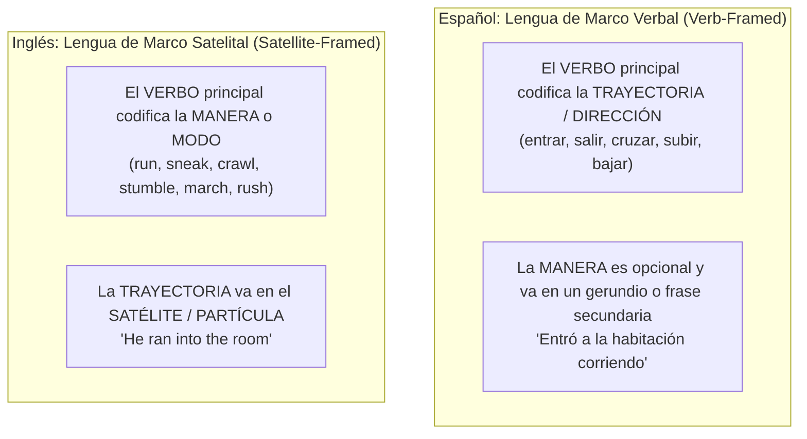
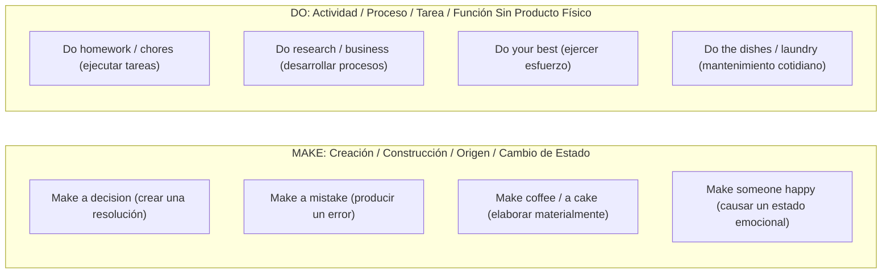
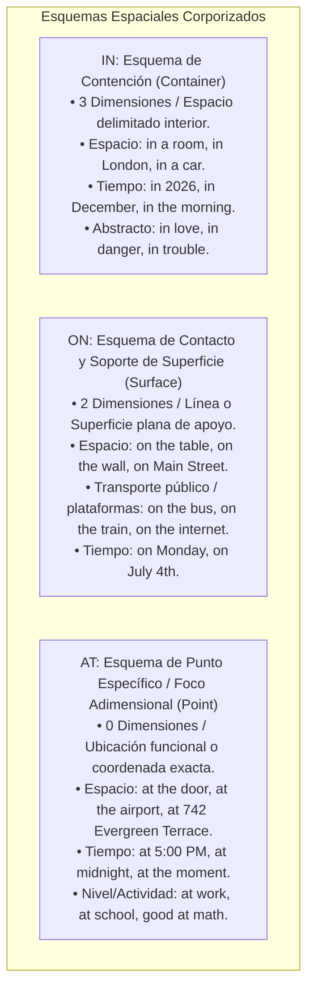

# Tipología Conceptual, "Thinking for Speaking" y Polisemia
## English Learning Assistant (ELA)

Este documento aborda la dimensión semántica y tipológica del lenguaje: cómo difiere la estructuración del pensamiento entre hablantes nativos de español y de inglés. Aplica la hipótesis **"Thinking for Speaking"** de Dan Slobin, la tipología de eventos de movimiento de Leonard Talmy y la semántica cognitiva de George Lakoff para resolver las confusiones de polisemia crónica que sufren los hispanohablantes.

---

## 1. Tipología Lingüística y "Thinking for Speaking" (Dan Slobin & Leonard Talmy)

Dan Slobin (1996, 2004) demostró que el lenguaje que hablamos no solo comunica pensamientos preexistentes, sino que **entrena a la mente a prestar atención selectiva a aspectos específicos de la realidad mientras se prepara para hablar** (*Thinking for Speaking*).

Una de las diferencias tipológicas más profundas entre el español y el inglés radica en cómo codifican los **Eventos de Movimiento (*Motion Events*)**:

### 1.1. El Síntoma del Hispanohablante en Inglés
- Por transferencia L1, los hispanohablantes tienden a usar exclusivamente verbos genéricos de raíz latina (*enter, exit, ascend, descend, cross*), sonando excesivamente formales, rígidos o descriptivamente pobres:
  - *"He entered the room quickly."* (Gramaticalmente correcto, pero no nativo).
  - Hablante nativo natural: *"He rushed into the room"* o *"He sneaked into the room"*.
- **Estrategia en ELA:** El motor de vocabulario y redacción incluye un módulo especializado de **Verbos de Manera con Satélites Preposicionales**, entrenando al usuario a integrar la emoción, velocidad y textura del movimiento en la raíz verbal.

---

## 2. Desmitificación de Pares de Verbos de Alta Confusión Polisémica

El español suele utilizar una sola palabra polivalente para cubrir conceptos que el inglés fragmenta en verbos semánticamente disociados:

### 2.1. Make vs. Do (Hacer)

### 2.2. Say vs. Tell vs. Speak vs. Talk (Decir / Hablar)

| Verbo | Estructura Sintáctica Obligatoria | Enfoque Semántico | Ejemplo en Inglés |
| :--- | :--- | :--- | :--- |
| **Say** | $V + \text{lo dicho} \ (+ \text{to someone})$ | El contenido textual exacto de las palabras. **Nunca** lleva objeto indirecto directo sin *to*. | *"He said that he was tired."* (No: *said me*). |
| **Tell** | $V + \textbf{Persona} + \text{información}$ | Transmisión de instrucciones, datos o relatos a un receptor explícito. | *"She told me the truth."* / *"Tell him to come."* |
| **Speak** | $V \ (+ \text{with/to}) \ (+ \text{idioma})$ | Acto formal, unilateral o dominio de una lengua. | *"I speak three languages."* / *"The president spoke to the nation."* |
| **Talk** | $V \ (+ \text{with/to}) \ (+ \text{about topic})$ | Conversación interactiva, informal y recíproca. | *"We talked about our plans for hours."* |

### 2.3. Hear vs. Listen to (Oír vs. Escuchar)
- **Hear:** Percepción involuntaria pasiva del aparato auditivo (*"Did you hear that thunder?"*).
- **Listen (to):** Atención deliberada y voluntaria (*"Please listen to the instructions"*). Rige siempre la preposición *to* ante objeto.

### 2.4. See vs. Look (at) vs. Watch (Ver vs. Mirar)
- **See:** Percepción visual espontánea (*"I saw an eagle in the sky"*).
- **Look (at):** Fijación voluntaria de la mirada en un punto estático (*"Look at this painting"*).
- **Watch:** Seguimiento temporal activo de algo en movimiento o evolución (*"Watch a movie"*, *"Watch a football match"*, *"Watch out"*).

### 2.5. Borrow vs. Lend (Pedir prestado vs. Prestar)
- **Borrow (from):** Movimiento de entrada; recibir algo prestado temporalmente (*"Can I borrow your pen?"*).
- **Lend (to):** Movimiento de salida; dar algo propio en préstamo a otro (*"I will lend you my car"*).

### 2.6. Win vs. Earn vs. Gain (Ganar)
- **Win:** Ganar en una competencia, rifa o juego de azar (*"Win a prize"*, *"Win a lottery"*, *"Win the match"*).
- **Earn:** Percibir remuneración por trabajo, esfuerzo o mérito (*"Earn a salary"*, *"Earn respect"*).
- **Gain:** Incremento cuantitativo o gradual de algo intangible o medible (*"Gain weight"*, *"Gain experience"*, *"Gain speed"*).

### 2.7. Miss vs. Lose (Perder)
- **Miss:** Extrañar afectivamente a alguien (*"I miss you"*), o no alcanzar una oportunidad o transporte (*"Miss the train"*, *"Miss the deadline"*).
- **Lose:** Dejar de poseer un objeto físico o una cualidad (*"Lose my keys"*, *"Lose patience"*, *"Lose the game"*).

---

## 3. Esquemas Espaciales Corporizados de Preposiciones (Lakoff & Johnson)

George Lakoff y Mark Johnson (1980, 1999) demostraron en su teoría de la **Metáfora Conceptual** que el lenguaje abstracto se fundamenta en esquemas espaciales corporizados (*Image Schemas*).

Las preposiciones *IN*, *ON* y *AT* no son traducciones aleatorias de la palabra española *"EN"*, sino tres esquemas topológicos diferenciados:

### Aplicación Didáctica en ELA:
El software no enseña preposiciones mediante tablas de traducción estáticas, sino a través de **diagramas interactivos topológicos** (Contenedor $\rightarrow$ Superficie $\rightarrow$ Coordenada puntual), eliminando la confusión provocada por la polisemia del español *"en"*.
