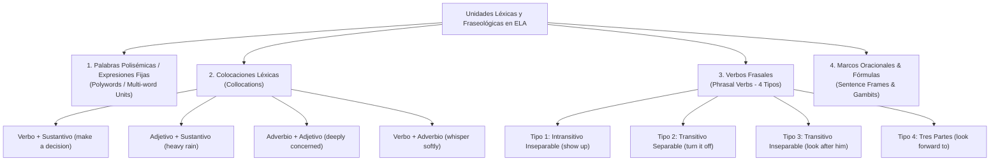
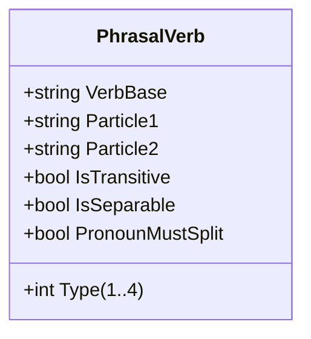

# El Enfoque Léxico y la Estructura de Unidades Fraseológicas (Chunks)
## English Learning Assistant (ELA)

Este documento expone los fundamentos del **Enfoque Léxico (The Lexical Approach)** de Michael Lewis y la teoría contemporánea de unidades prefabricadas (*formulaic language* y *lexical chunks*). Define la taxonomía y el modelo de datos con el que ELA almacena, entrena y evalúa el vocabulario.

---

## 1. El Paradigma de Michael Lewis: "El lenguaje consiste en léxico gramaticalizado, no en gramática lexicalizada"

Durante décadas, la enseñanza tradicional operó bajo el modelo de la "ranura y el relleno" (*slot-and-filler model*): se enseñaba una estructura abstracta (como *Sujeto + Verbo + Objeto*) y luego se rellenaba con palabras sueltas extraídas de un diccionario bilingüe.

La lingüística de corpus moderna (John Sinclair, Michael Lewis, Alison Wray) demostró que este modelo produce un inglés antinatural, torpe y propenso a errores:
- **El Principio del Idioma (Sinclair, 1991):** La gran mayoría de los enunciados de los hablantes nativos no se construyen combinando palabras individuales desde cero mediante reglas gramaticales, sino ensamblando **bloques fraseológicos previamente memorizados y almacenados en bloque (*chunks*)**.
- **Ventaja Neurocognitiva del Chunking:** La memoria de trabajo está limitada a $4 \pm 1$ unidades activas (Cowan). Si un estudiante hispanohablante intenta procesar *"take advantage of"* como tres palabras independientes y buscar la preposición correcta, agota el $75\%$ de su memoria de trabajo. Si almacena `[take advantage of]` como un **único chunk prefabricado**, ocupa solo 1 unidad mental, dejando el $75\%$ de su capacidad libre para planificar el resto del discurso.

---

## 2. Taxonomía de Cuatro Niveles de Unidades Fraseológicas en ELA

---

## 3. Las Colocaciones Léxicas (Collocations)

Una colocación es la tendencia estadística demostrable de dos o más palabras a coocurrir con una frecuencia notablemente superior a la probabilidad del azar.

### 3.1. Tipología de Colocaciones en la Base de Datos de ELA

| Tipo de Colocación | Estructura Sintáctica | Ejemplo Correcto en Inglés | Error Común por Transferencia L1 |
| :--- | :--- | :--- | :--- |
| **Verbo + Sustantivo** | $V + N$ | *Make a mistake* / *Take an exam* | *"Do a mistake"* / *"Make an exam"* |
| **Adjetivo + Sustantivo** | $Adj + N$ | *Heavy traffic* / *Harsh reality* | *"Big traffic"* / *"Strong reality"* |
| **Adverbio + Adjetivo** | $Adv + Adj$ | *Bitterly cold* / *Highly unlikely* | *"Strongly cold"* / *"Very unlikely"* |
| **Sustantivo + Verbo** | $N + V$ | *The plane takes off* / *Prices soar* | *"The plane leaves"* / *"Prices grow"* |
| **Verbo + Expresión Preposicional** | $V + Prep + N$ | *Burst into tears* / *Come into effect* | *"Break in tears"* / *"Enter in effect"* |

### 3.2. Los Verbos Deslexicalizados (*De-lexicalised Verbs*)
Son los verbos más frecuentes del idioma (*have, take, make, give, do, get, set*), cuyo significado reside casi en su totalidad en el sustantivo que los acompaña, no en el verbo mismo:
- *Have:* *have a drink, have a shower, have a word, have an argument*.
- *Take:* *take a break, take a look, take care, take a risk*.
- *Make:* *make an effort, make arrangements, make a phone call, make sense*.
- *Do:* *do business, do research, do a favor, do homework*.

**Regla de Software:** ELA no permite tarjetas flash aisladas para verbos deslexicalizados. Cada entrada se asocia obligatoriamente a una colocación binaria inseparable.

---

## 4. Taxonomía Sintáctica Rigurosa de Phrasal Verbs

Los *phrasal verbs* son el mayor obstáculo de fluidez para los hispanohablantes debido a su naturaleza combinatoria y no composicional. ELA los clasifica en 4 tipos sintácticos estricto:

### 4.1. Tipo 1: Intransitivos e Inseparables
- **Propiedad Sintáctica:** No admiten objeto directo ($V + P$). No pueden separarse.
- **Ejemplos:**
  - *The car broke down.* (Correcto)
  - *He showed up late.* (Correcto)
  - *My plane took off.* (Correcto)

### 4.2. Tipo 2: Transitivos y Separables (Separable Phrasal Verbs)
- **Propiedad Sintáctica:** El objeto nominal puede colocarse después de la partícula o en medio. Sin embargo, **si el objeto es un pronombre personal (*it, them, him, her*), es gramaticalmente obligatorio colocarlo en medio ($V + Pron + P$)**:
  - *Turn off the light.* (Correcto)
  - *Turn the light off.* (Correcto)
  - *Turn it off.* (Correcto)
  - ❌ *Turn off it.* (**Error grave** que delata a los hablantes no nativos).

### 4.3. Tipo 3: Transitivos e Inseparables (Inseparable Phrasal Verbs)
- **Propiedad Sintáctica:** Exigen un objeto directo, pero la partícula debe permanecer pegada al verbo bajo cualquier circunstancia ($V + P + Obj$).
  - *I ran into my former boss.* (Correcto)
  - *I ran into him.* (Correcto)
  - ❌ *I ran him into.* (**Error gramatical agramatical**).
  - Otros ejemplos: *look after, come across, call on, deal with*.

### 4.4. Tipo 4: Frasales-Preposicionales de Tres Partes (Three-part Phrasal Verbs)
- **Propiedad Sintáctica:** Están formados por un verbo base + dos partículas/preposiciones ($V + P_1 + P_2 + Obj$). Son **100% inseparables y transitivos**.
  - *I look forward to hearing from you.* (La partícula final *to* es preposición, por lo que exige gerundio *-ing*).
  - *We ran out of coffee.*
  - *I can't put up with his behavior.*
  - *He gets along with his coworkers.*

### 4.5. Semántica de Partículas y Metáforas Conceptuales (Lakoff & Johnson)
Los phrasal verbs no son combinaciones arbitrarias: sus partículas reflejan esquemas cognitivos corporizados:
- **UP como Finalización o Plenitud (*Completion*):** *eat up* (comer todo hasta el final), *drink up*, *clean up*, *pack up*, *use up*.
- **UP como Incremento de Visibilidad o Magnitud:** *speak up* (hablar más alto), *turn up* (subir el volumen), *show up* (hacerse visible).
- **OUT como Extinción o Distribución:** *die out* (extinguirse), *blow out* (apagar una vela), *hand out* (repartir).

---

## 5. Marcos Oracionales y Fórmulas Conversacionales (Sentence Frames & Gambits)

Son estructuras sintácticas semi-fijas que sirven como "esqueleto" para organizar ideas, modular la cortesía o negociar el turno de palabra en una conversación:

### 5.1. Gambits de Cortesía y Modulación Pragmática
- *I was wondering if you could possibly...* (Andamiaje para peticiones formales indirectas).
- *Would you mind if I... [Past Simple]?* (*Would you mind if I opened the window?*).
- *If you don't mind my asking,...*

### 5.2. Gambits de Gestión Discursiva y Argumentación
- *On the one hand..., on the other hand...*
- *As far as I'm concerned,...*
- *The point I'm trying to make is that...*
- *Having said that, we must take into account...*

---

## 6. Mapeo en el Modelo de Datos de ELA

Cada entrada léxica registrada en el sistema se almacena vinculada a su taxonomía funcional:
1. **Entidades Simples:** Registradas en `vocab_items` con categorización de parte de la oración y características morfológicas.
2. **Entidades Fraseológicas:** Registradas en `phraseological_units` vinculando su tipo exacto (Colocación, Phrasal Tipo 1-4, Expresión Fija, Gambit) y sus restricciones sintácticas (separabilidad obligatoria de pronombres).
3. **Validación Automática por Gemini:** Cualquier entrada registrada a través de la IA se enriquece de inmediato con su clasificación en esta taxonomía.
