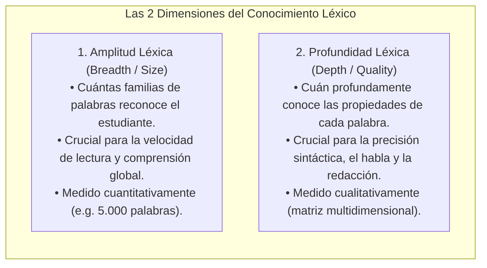
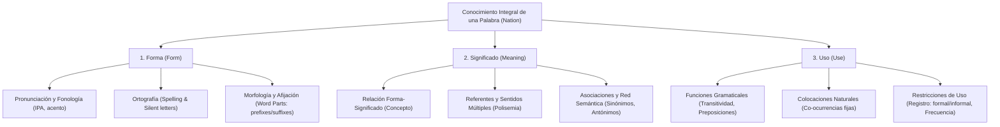
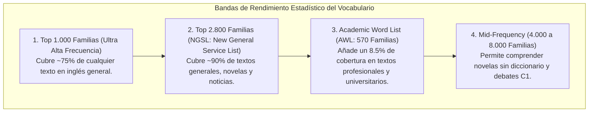

# Amplitud, Profundidad Léxica y Frecuencia de Corpus
## English Learning Assistant (ELA)

Este documento expone los principios de la **Lingüística de Corpus** y la investigación en adquisición léxica de Paul Nation y Norbert Schmitt. Establece las dimensiones de **amplitud (*breadth*) vs. profundidad (*depth*)** del vocabulario, los umbrales de cobertura estadística y la jerarquía de corpus que gobierna la base de datos de ELA.

---

## 1. Las Dos Dimensiones del Dominio Léxico (Nation & Schmitt)

Un error habitual en el aprendizaje de segundas lenguas es medir el progreso únicamente por la cantidad bruta de palabras memorizadas ("conozco 3.000 palabras"). La psicolingüística contemporánea disocia el conocimiento léxico en dos dimensiones ortogonales:

---

## 2. ¿Qué Significa Realmente "Conocer una Palabra"? (El Modelo de Paul Nation)

Paul Nation (2001, 2013) demostró que el conocimiento integral de un elemento léxico abarca nueve componentes interdependientes agrupados en tres dominios:

### Directiva de Software para ELA:
Un ítem no puede marcarse como "Dominado" en el algoritmo FSRS si el usuario solo puede traducirlo pasivamente al español. La profundidad léxica se verifica evaluando su **ortografía**, su **pronunciación acústica** y su **régimen preposicional en contexto oracional**.

---

## 3. Unidades de Medida: Tokens, Lemas y Familias de Palabras (Word Families)

En lingüística aplicada, contar palabras exige precisión terminológica:
1. **Token:** Cualquier aparición individual de una palabra en un texto (*"to be or not to be"* contiene 6 tokens).
2. **Lema (Lemma):** La forma canónica de diccionario junto con sus variantes flexivas gramaticales (*play, plays, played, playing* forman 1 solo lema).
3. **Familia de Palabras (Word Family):** Comprende el lema base más todas sus formas derivadas por prefijación y sufijación (*care, careful, carefully, careless, carelessness, caring* forman 1 sola familia de palabras).

**Principio Psicolingüístico:** La mente humana almacena el léxico en **familias morfológicas transparentes**. Aprender los mecanismos de derivación del inglés multiplica exponencialmente la capacidad de comprensión sin necesidad de memorizar cada término como una entidad aislada.

---

## 4. Corpus de Referencia y Jerarquía de Frecuencia

Para maximizar el retorno de inversión del tiempo de estudio, ELA prioriza rigurosamente los ítems de mayor rendimiento estadístico en la lengua inglesa:

### 4.1. Listas de Corpus Integradas en ELA
- **NGSL (New General Service List - Browne, Culligan & Phillips, 2013):** 2.809 palabras fundamentales seleccionadas del corpus de 273 millones de palabras de Cambridge.
- **NAWL (New Academic Word List):** 963 palabras esenciales para contextos académicos y profesionales.
- **COCA (Corpus of Contemporary American English):** El corpus más grande del mundo (1.000 millones de palabras) para extraer frecuencias de colocaciones auténticas y ejemplos de habla real.
- **CEFR English Profile (Cambridge):** Clasificación estricta de cada término y colocación en los niveles A1, A2, B1, B2, C1 y C2.

---

## 5. El Abismo entre Vocabulario Receptivo y Productivo

La investigación en SLA revela una brecha constante:
- **Vocabulario Receptivo (Pasivo):** Palabras que el usuario comprende al leerlas o escucharlas con apoyo del contexto.
- **Vocabulario Productivo (Activo):** Palabras que el usuario es capaz de evocar espontáneamente al hablar o redactar.

En la mayoría de los estudiantes intermedios, el vocabulario productivo representa apenas entre el **$30\%$ y el $50\%$** de su vocabulario receptivo.

### La Estrategia de Conversión Activa en ELA:
1. **Fase 1 (Recepción Comprensiva):** El ítem se reconoce por primera vez en el *Smart Graded Reader*.
2. **Fase 2 (Recuperación Guiada):** El ítem se entrena en FSRS mediante *Cloze deletions* con pistas de traducción.
3. **Fase 3 (Proceduralización Activa):** El ítem se exige obligatoriamente en el módulo de *Micro-Writing* y en los *Speed Drills*, cerrando la brecha entre el saber pasivo y la producción fluida.

---

## 6. Umbrales Matemáticos de Cobertura Léxica para la Lectura (Nation & Laufer)

Paul Nation y Batia Laufer establecieron matemáticamente los porcentajes de cobertura léxica necesarios para que un lector procese un texto en segunda lengua:

| Cobertura Léxica del Texto | Relación de Desconocidas | Estado Cognitivo del Lector | Viabilidad Pedagógica |
| :--- | :--- | :--- | :--- |
| **$< 90\%$** | Más de 1 palabra de cada 10 es desconocida. | **Frustración y Colapso Cognitivo.** El lector no puede inferir el sentido general; la memoria de trabajo se agota buscando en diccionarios. | Inviable pedagógicamente. Provoca abandono inmediato. |
| **$95\%$** | 1 palabra desconocida cada 20 palabras. | **Lectura Asistida e Instruccional.** El estudiante comprende la trama general con apoyo de un tutor o software interactivo. | Ideal para el *Smart Graded Reader* en modo guiado con captura en 1 clic. |
| **$\ge 98\%$** | 1 palabra desconocida cada 50 palabras. | **Lectura Extensiva Fluida e Incidental.** El contexto es tan transparente que el estudiante deduce los términos nuevos sin esfuerzo y experimenta disfrute (*Flow state*). | El umbral dorado de Krashen ($i+1$) para la adquisición incidental autónoma. |

**Regla Algorítmica de ELA:** Cuando el usuario carga un texto o artículo en el *Smart Graded Reader*, el sistema calcula instantáneamente su cobertura léxica contra el vocabulario conocido del perfil del estudiante y emite una advertencia previa:
- Verde ($\ge 98\%$): "Lectura fluida óptima".
- Amarillo ($95 - 97\%$): "Lectura guiada recomendada; 1 clic en desconocidas".
- Rojo ($< 95\%$): "Texto con alta sobrecarga léxica; se recomienda simplificar con IA antes de leer".
