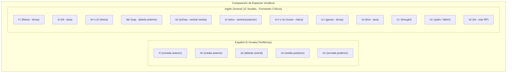
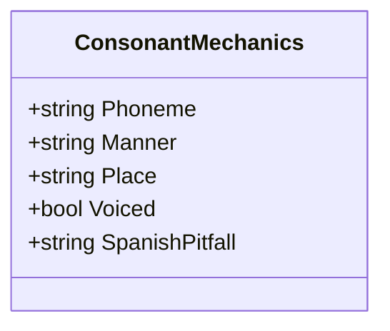
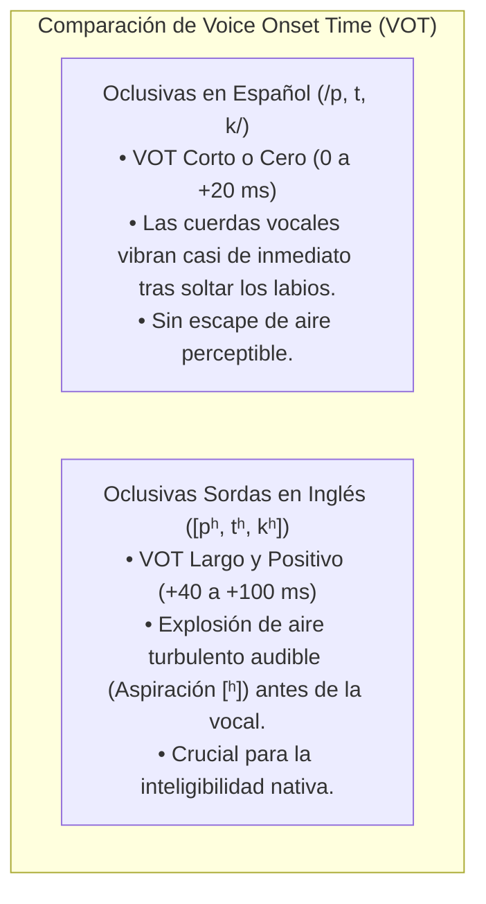

# Mecánica Articulataria, Fonemas IPA y Fonología Contrastiva
## English Learning Assistant (ELA)

Este documento es el manual técnico de **Fisiología Articulataria y Fonética Acústica** de ELA. Describe la posición exacta de los órganos del aparato fonador (lengua, labios, paladar, cuerdas vocales) para producir los fonemas del inglés que no existen en el sistema del español, y detalla los principios acústicos como el **Voice Onset Time (VOT)** y los formantes vocálicos.

---

## 1. El Cuadrilátero Vocálico: Español (5) vs. Inglés (12+)

El sistema vocálico del español es plano y simétrico, con 5 vocales periféricas puras (/a, e, i, o, u/). En contraste, el inglés posee entre 11 y 12 mono-optongos y hasta 8 diptongos, organizados según dos formantes acústicos principales:
- **$F_1$ (Altura de la lengua / Apertura mandibular):** Cuanto más baja la mandíbula, más alto el $F_1$.
- **$F_2$ (Posición anteroposterior de la lengua):** Cuanto más adelantada la lengua hacia los incisivos, más alto el $F_2$.

---

## 2. Los Grandes Contrastes Vocálicos Críticos

### 2.1. El Contraste Tenso vs. Laxo: /iː/ vs. /ɪ/
- **/iː/ (Tensa - *Fleece*):** 
  - *Mecánica:* Labios en sonrisa tensa; cuerpo de la lengua muy alto y adelantado contra el paladar duro. Duración temporal más prolongada ($> 200 \text{ ms}$).
  - *Ejemplos:* *sheep, reach, heat, leave, seek*.
- **/ɪ/ (Laxa - *Kit*):**
  - *Mecánica:* Mandíbula ligeramente más relajada y abierta ($F_1$ más alto); lengua ligeramente retraída hacia el centro ($F_2$ más bajo); labios neutros, nunca en sonrisa. Duración temporal breve ($< 120 \text{ ms}$).
  - *Ejemplos:* *ship, rich, hit, live, sick*.
- **La Trampa del Hispanohablante:** Los hispanohablantes intentan diferenciar estos sonidos solo por la "duración" (larga vs. corta), pero la diferencia acústica primordial es el **timbre espectral** (posición más abierta y central de la lengua).

### 2.2. El Contraste /uː/ vs. /ʊ/
- **/uː/ (Tensa - *Goose*):** Labios fuertemente abocinados y redondeados en círculo pequeño; dorso lingual muy elevado contra el velo del paladar (*boot, pool, Luke*).
- **/ʊ/ (Laxa - *Foot*):** Labios solo ligeramente redondeados, mandíbula caída unos milímetros; lengua más centralizada (*book, pull, look*).

### 2.3. La Tríada Anterior Abierta: /e/ vs. /æ/ vs. /ʌ/
- **/e/ o /ɛ/ (*Dress*):** Boca a media apertura, similar a la /e/ española (*bed, men, pen*).
- **/æ/ (*Trap*):** Descenso mandibular pronunciado; las comisuras de los labios se estiran hacia atrás; dorso de la lengua aplanado en el piso de la boca (*bad, man, pan*). Es un sonido entre la /e/ y la /a/ del español.
- **/ʌ/ (*Strut*):** Boca relajada, lengua descansando en la zona media posterior sin tensión (*bud, run, cut*).

---

## 3. Fisiología de las Consonantes Inglesas Problemáticas

### 3.1. Fricativas Dentales: /θ/ y /ð/
- **/θ/ (Fricativa Dental Sorda - *Think, Bath, Tooth*):**
  - *Mecánica:* La punta o lámina de la lengua hace un contacto suave contra el borde de los incisivos superiores o asoma milimétricamente entre los dientes (*interdental*). El aire sale con fricción constante. Sin vibración laríngea.
  - *Error hispano:* Sustituirla por /s/ (*sink* en vez de *think*) o por /t/ (*tink*).
- **/ð/ (Fricativa Dental Sonora - *This, That, Mother*):**
  - *Mecánica:* Idéntica posición lingual que /θ/, pero las cuerdas vocales vibran activamente.
  - *Error hispano:* Pronunciarla como una oclusiva alveolar dura [d].

### 3.2. La Labiodental Sonora /v/ frente a la Bilabial /b/
- En español no existe el fonema /v/: las letras 'b' y 'v' se articulan con ambos labios juntos ([b] o [β]).
- **/v/ en Inglés:** Es una **fricativa labiodental sonora**:
  - *Mecánica:* Los dientes incisivos superiores se apoyan suavemente sobre la superficie húmeda interior del labio inferior. El aire pasa con fricción mientras las cuerdas vocales vibran.
  - *Pares Mínimos Críticos:* *berry* (/b/) vs. *very* (/v/), *best* vs. *vest*, *ban* vs. *van*.

### 3.3. Sibilantes Postalveolares y Africadas: /ʃ/, /ʒ/, /tʃ/, /dʒ/
- **/ʃ/ (Fricativa Postalveolar Sorda - *Shoe, Wash*):** Labios redondeados proyectados hacia adelante (*pursed lips*); lengua en la zona postalveolar sin tocar el paladar. Flujo de aire continuo ("shhh").
- **/tʃ/ (Africada Postalveolar Sorda - *Choose, Watch*):** Bloqueo completo con la punta de la lengua y liberación explosiva con fricción. (El sonido de *"chico"* en español).
- **/ʒ/ (Fricativa Postalveolar Sonora - *Vision, Measure, Pleasure*):** Equivalente sonoro continuo de /ʃ/.
- **/dʒ/ (Africada Postalveolar Sonora - *Job, Bridge, Age*):** Bloqueo explosivo sonoro. (Equivalente sonoro de /tʃ/).

### 3.4. La 'L' Oscura (*Dark L* - [ɫ])
- En español, toda 'l' es alveolar clara ([l]), con la punta de la lengua en los alvéolos.
- En inglés, cuando la 'L' va después de una vocal o al final de sílaba (*milk, call, bottle, world*), se transforma en la **Dark L [ɫ] velarizada**:
  - *Mecánica Dual:* Mientras la punta de la lengua toca los alvéolos, la parte posterior de la lengua (el dorso) se eleva simultáneamente hacia el velo del paladar, produciendo una resonancia similar a una vocal posterior oscura.

---

## 4. Voice Onset Time (VOT) y la Aspiración de Oclusivas Sordas

El **Voice Onset Time (VOT)** es el intervalo de tiempo medido en milisegundos que transcurre entre la liberación de una consonante oclusiva (/p, t, k/) y el inicio de la vibración de las cuerdas vocales para la vocal siguiente.

### La Consecuencia Crítica para la Inteligibilidad:
En inglés, las oclusivas sonoras (/b, d, ɡ/) en posición inicial suelen desonorizarse parcialmente ($[b̥, d̥, ɡ̊]$) con un VOT cercano a cero.
- Por tanto, el oído anglosajón **no distingue /p/ de /b/ por la vibración de las cuerdas vocales, sino por la presencia o ausencia de ASPIRACIÓN ($[p^h]$)**.
- Si un hispanohablante pronuncia la palabra *"pin"* con la /p/ no aspirada del español, el nativo anglosajón escuchará invariablemente **"bin"**.
- **Entrenamiento en ELA:** Detección acústica del soplo de aspiración en posición inicial tónica mediante ejercicios de contraste visual de onda acústica.
