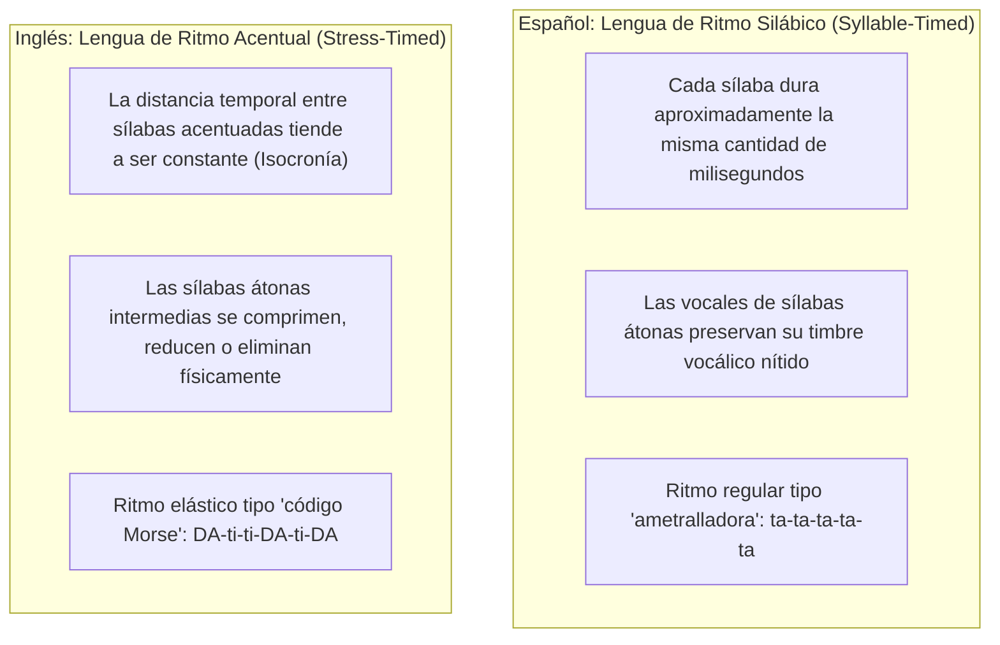
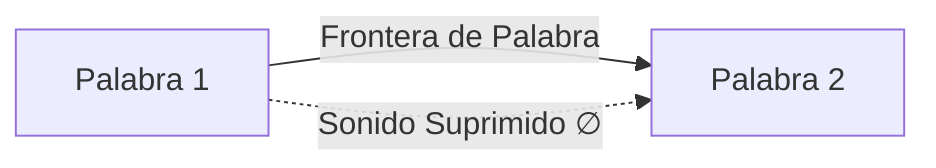
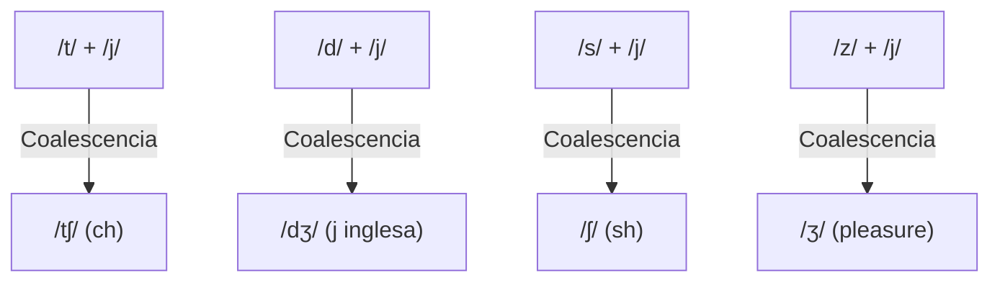
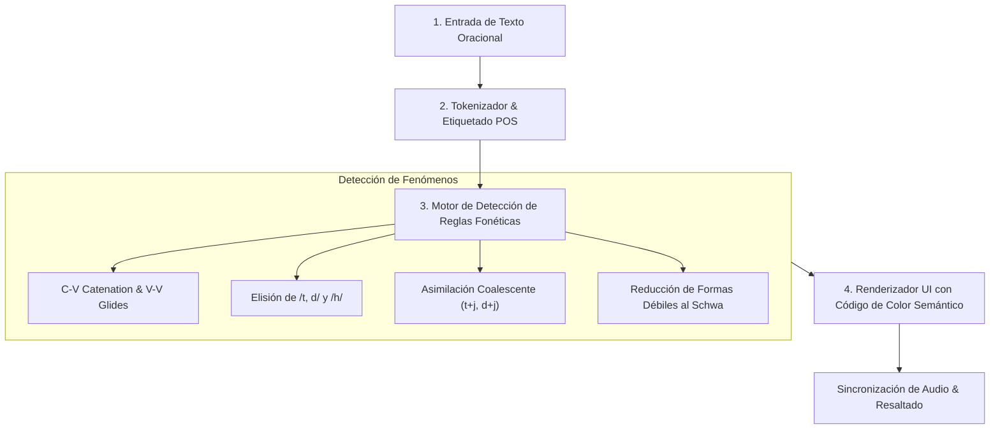

# Mecanismos de Habla Conectada (Connected Speech) y Fonología del Discurso
## English Learning Assistant (ELA)

Este documento es la especificación técnica integral de los fenómenos fonológicos que transforman las palabras aisladas (*citation forms*) en el flujo continuo del habla rápida natural en inglés (*Connected Speech*). Define las reglas algorítmicas con las que el motor `PhoneticEngine` de ELA analiza, segmenta y visualiza oraciones en tiempo real.

---

## 1. El Conflicto Rítmico Fundamental: Isocronía Acentual vs. Silábica

El principal obstáculo de comprensión auditiva para un hispanohablante radica en que el inglés y el español operan bajo principios métricos opuestos:

### La Consecuencia Psicoacústica:
Cuando un nativo pronuncia *"I should have told you about it"*, el hispanohablante espera escuchar 8 sílabas simétricas claras. En su lugar, el inglés comprime la frase en dos pulsos acentuales rítmicos:  
`[aɪ ʃəd əv ˈtəʊldʒuː əˈbaʊt ɪt]`, reduciendo a Schwa o fusionando la mayoría de los elementos funcionales.

---

## 2. Fenómeno 1: Elisión (Elision - Omisión Física de Sonidos)

La elisión es la desaparición articulatoria completa de un sonido consonántico o vocálico para maximizar la economía motora del aparato fonador.

### 2.1. Elisión de Oclusivas Alveolares (/t/ y /d/)
Es la elisión más ubicua del inglés. Ocurre cuando /t/ o /d/ se encuentran al final de una palabra o sílaba, precedidas por una consonante y seguidas inmediatamente por otra consonante:
$$\text{Consonante}_1 + \text{/t, d/} + \text{Consonante}_2 \longrightarrow \text{Consonante}_1 + \emptyset + \text{Consonante}_2$$

| Frase Escrita | Transcripción de Diccionario | Habla Conectada Real | Sonido Suprimido |
| :--- | :--- | :--- | :--- |
| *"last night"* | `/lɑːst naɪt/` | `[lɑːs naɪt]` | Desaparece la **/t/** |
| *"next door"* | `/nekst dɔːr/` | `[neks dɔːr]` | Desaparece la **/t/** |
| *"stand there"* | `/stænd ðeər/` | `[stæn ðeər]` | Desaparece la **/d/** |
| *"hold tight"* | `/həʊld taɪt/` | `[həʊl taɪt]` | Desaparece la **/d/** |
| *"you and me"* | `/juː ænd miː/` | `[juː ən miː]` | Desaparece la **/d/** |

### 2.2. Síncopa de Vocales Átonas en Palabras Polisilábicas
En el habla fluida, las vocales neutras /ə/ o /ɪ/ se omiten entre dos consonantes, reduciendo el recuento silábico total de la palabra:
- *"camera"* $\rightarrow$ No se pronuncia ca-me-ra (3 sílabas), sino `[ˈkæmrə]` (2 sílabas).
- *"family"* $\rightarrow$ `[ˈfæmli]` (2 sílabas).
- *"history"* $\rightarrow$ `[ˈhɪstri]` (2 sílabas).
- *"chocolate"* $\rightarrow$ `[ˈtʃɒklət]` (2 sílabas).
- *"restaurant"* $\rightarrow$ `[ˈrestrɒnt]` (2 sílabas).
- *"police"* $\rightarrow$ `[pliːs]` (la vocal débil inicial se elide en habla rápida).

### 2.3. Caída de Aspiración /h/ (H-Dropping en Auxiliares y Pronombres)
En pronombres y auxiliares átonos (*he, him, his, her, have, has, had*), la consonante fricativa /h/ se omite por completo a menos que encabece el enunciado absoluto:
- *"Tell him"* $\rightarrow$ `/tel ɪm/` (suena idéntico a *"tell 'em"*).
- *"Ask her"* $\rightarrow$ `/ɑːsk ər/` o `/æsk ər/`.
- *"What have you done?"* $\rightarrow$ `/wɒt əv juː dʌn/`.
- *"He thinks he's right"* $\rightarrow$ `[hi ˈθɪŋks iz raɪt]`.

### 2.4. Elisión de /v/ en la Preposición "of"
Antes de cualquier consonante, la /v/ de *of* desaparece habitualmente:
- *"Cup of tea"* $\rightarrow$ `[kʌp ə tiː]`.
- *"Matter of fact"* $\rightarrow$ `[mætər ə fækt]`.

---

## 3. Fenómeno 2: Asimilación (Assimilation - Mutación de Fonemas)

Ocurre cuando un fonema adopta el punto, modo o sonoridad de un sonido vecino para minimizar el recorrido muscular de los articuladores.

### 3.1. Asimilación Regresiva de Punto de Articulación
Las consonantes alveolares finales (/t/, /d/, /n/) mutan su punto de articulación antes de consonantes bilabiales (/p, b, m/) o velares (/k, ɡ/):

| Fonema Original | Siguiente Fonema | Fonema Resultante | Texto Escrito | IPA Cita | IPA Habla Real |
| :--- | :--- | :--- | :--- | :--- | :--- |
| **/n/** (alveolar) | **/b, p, m/** (bilabial) | **/m/** (bilabial) | *"ten boys"* | `/ten bɔɪz/` | `[tem bɔɪz]` |
| **/n/** (alveolar) | **/b, p, m/** (bilabial) | **/m/** (bilabial) | *"in Paris"* | `/ɪn ˈpærɪs/` | `[ɪm ˈpærɪs]` |
| **/t/** (alveolar) | **/p, b, m/** (bilabial) | **/p/** (bilabial) | *"hot potato"* | `/hɒt pəˈteɪtəʊ/`| `[hɒp pəˈteɪtəʊ]` |
| **/d/** (alveolar) | **/b, p, m/** (bilabial) | **/b/** (bilabial) | *"good boy"* | `/ɡʊd bɔɪ/` | `[ɡʊb bɔɪ]` |
| **/n/** (alveolar) | **/k, ɡ/** (velar) | **/ŋ/** (velar) | *"ten cups"* | `/ten kʌps/` | `[teŋ kʌps]` |
| **/t/** (alveolar) | **/k, ɡ/** (velar) | **/k/** (velar) | *"white coffee"* | `/waɪt ˈkɒfi/` | `[waɪk ˈkɒfi]` |
| **/d/** (alveolar) | **/k, ɡ/** (velar) | **/ɡ/** (velar) | *"bad girl"* | `/bæd ɡɜːrl/` | `[bæɡ ɡɜːrl]` |

### 3.2. Asimilación Coalescente (Yod-Coalescence)
Es la fusión más frecuente e indispensable para el dominio conversacional. Una consonante alveolar final choca con la semivocal palatal /j/ (la "y" de *you, your, yesterday*), fusionándose en una consonante postalveolar:

- **/t/ + /j/ $\longrightarrow$ /tʃ/:**
  - *"Don't you"* $\rightarrow$ `/ˈdəʊntʃuː/` ("don-chu").
  - *"Meet you"* $\rightarrow$ `/ˈmiːtʃuː/` ("mi-chu").
  - *"Can't you"* $\rightarrow$ `/ˈkɑːntʃuː/` o `/ˈkæntʃuː/`.
  - *"Not yet"* $\rightarrow$ `/nɒtʃet/`.
- **/d/ + /j/ $\longrightarrow$ /dʒ/:**
  - *"Did you"* $\rightarrow$ `/ˈdɪdʒuː/` ("di-ju").
  - *"Would you"* $\rightarrow$ `/ˈwʊdʒuː/` ("wu-ju").
  - *"Could you"* $\rightarrow$ `/ˈkʊdʒuː/` ("cou-ju").
  - *"Educate"* $\rightarrow$ `/ˈedʒukeɪt/` (coalescencia intra-palabra histórica).
- **/s/ + /j/ $\longrightarrow$ /ʃ/:**
  - *"Bless you"* $\rightarrow$ `[ˈbleʃuː]`.
  - *"This year"* $\rightarrow$ `[ðɪʃ jɪər]`.
- **/z/ + /j/ $\longrightarrow$ /ʒ/:**
  - *"As you know"* $\rightarrow$ `[əʒ uː nəʊ]`.

### 3.3. Asimilación de Sonoridad (Voice Devoicing)
- *"have to"* $\rightarrow$ La consonante sonora /v/ se ensordece en /f/ por la influencia de /t/: `[ˈhæftuː]`.
- *"used to"* $\rightarrow$ La sonora /z/ se ensordece en /s/: `[ˈjuːstuː]`.

---

## 4. Fenómeno 3: Enlace Fonético (Linking & Liaison)

En inglés estándar, **nunca existe un golpe glótico abrupto ni un silencio entre palabras** pertenecientes al mismo grupo de entonación (*Thought Group*).

### 4.1. Enlace Consonante a Vocal (Catenación / Resilabeo)
La consonante final de una palabra se desplaza fonéticamente hacia adelante para convertirse en el ataque silábico de la siguiente vocal:
- *"Hold on"* $\rightarrow$ `[həʊl - dɒn]`.
- *"Take off"* $\rightarrow$ `[teɪ - kɒf]`.
- *"Wake up"* $\rightarrow$ `[weɪ - kʌp]`.
- *"Turn it off"* $\rightarrow$ `[tɜː - nɪ - tɒf]`.
- **En Inglés Americano (Alveolar Flap/Tap [ɾ]):** Si la consonante es /t/ o /d/ y queda situada entre dos vocales átonas, se convierte en un flap lingual idéntico a la 'r' simple española (*pero*):
  - *"Check it out"* $\rightarrow$ `[tʃe - kɪ - ɾaʊt]`.
  - *"Get out of here"* $\rightarrow$ `[ɡe - ɾaʊ - ɾəv - hɪər]`.

### 4.2. Enlace Vocal a Vocal mediante Semivocales Intrusivas (Intrusive Glides)
Cuando una palabra culmina en sonido vocálico y la siguiente inicia en vocal, el aparato articulatorio inserta un puente de transición para no cortar el flujo de aire:

#### A. Intrusión de /j/ (Glide Palatal):
Se activa si la primera palabra culmina en una vocal anterior cerrada o diptongo que culmina en /ɪ/ o /iː/ (`/iː, ɪ, eɪ, aɪ, ɔɪ/`):
- *"I agree"* $\rightarrow$ `[aɪ - j - əˈɡriː]`.
- *"See it"* $\rightarrow$ `[siː - j - ɪt]`.
- *"They are"* $\rightarrow$ `[ðeɪ - j - ɑːr]`.
- *"My eyes"* $\rightarrow$ `[maɪ - j - aɪz]`.

#### B. Intrusión de /w/ (Glide Labiovelar):
Se activa si la primera palabra culmina en una vocal posterior redondeada o diptongo que culmina en /ʊ/ o /uː/ (`/uː, ʊ, əʊ, aʊ/`):
- *"Go out"* $\rightarrow$ `[ɡəʊ - w - aʊt]`.
- *"You are"* $\rightarrow$ `[juː - w - ɑːr]`.
- *"Do it"* $\rightarrow$ `[duː - w - ɪt]`.
- *"How is it?"* $\rightarrow$ `[haʊ - w - ɪz ɪt]`.

#### C. Linking 'R' e Intrusive 'R' (Acentos no róticos como RP):
- **Linking 'r':** Si la palabra termina en 'r' ortográfica, se pronuncia solo si la siguiente palabra inicia en vocal:
  - *"Four"* `/fɔː/` $\rightarrow$ *"Four apples"* `[fɔːr ˈæplz]`.
- **Intrusive 'r':** Si la palabra termina en /ə/, /ɔː/ o /ɑː/ (sin 'r' ortográfica) y la siguiente inicia en vocal, los nativos insertan una /r/ epentética:
  - *"Law and order"* $\rightarrow$ `[lɔːr ənd ˈɔːdə]`.
  - *"The idea of it"* $\rightarrow$ `[ði aɪˈdɪər əv ɪt]`.

### 4.3. Geminación Consonántica (Twin Consonants)
Si el sonido consonántico final es idéntico al consonántico inicial de la palabra siguiente, se pronuncia una sola consonante prolongada sin pausa intermedia:
- *"Black cat"* $\rightarrow$ `[blækːæt]`.
- *"Bad day"* $\rightarrow$ `[bædːeɪ]`.
- *"Social life"* $\rightarrow$ `[ˈsəʊʃəlːaɪf]`.

---

## 5. Formas Débiles (Weak Forms) y la Reducción al Schwa /ə/

Más de 40 palabras funcionales del inglés poseen dos pronunciaciones: una **Forma Fuerte (*Strong Form*)** usada exclusivamente en aislamiento o énfasis contrastivo, y una **Forma Débil (*Weak Form*)** que rige el 98% del habla cotidiana.

| Palabra Funcional | Forma Fuerte (Aislada) | Forma Débil (En Discurso) | Ejemplo en Oración | Transcripción Real |
| :--- | :--- | :--- | :--- | :--- |
| **to** | `/tuː/` | `/tə/` (o `/tʊ/` ante vocal) | *"Go to work"* | `[ɡəʊ tə wɜːk]` |
| **of** | `/ɒv/` | `/əv/` o `/ə/` | *"Most of all"* | `[məʊst əv ɔːl]` |
| **for** | `/fɔːr/` | `/fər/` o `/fə/` | *"Wait for me"* | `[weɪt fə miː]` |
| **and** | `/ænd/` | `/ənd/` o `/ən/` | *"Rock and roll"* | `[rɒk ən rəʊl]` |
| **can** | `/kæn/` | `/kən/` | *"I can hear you"* | `[aɪ kən hɪər juː]` *(Solo se dice /kæn/ en can't o énfasis)* |
| **was** | `/wɒz/` | `/wəz/` | *"He was late"* | `[hi wəz leɪt]` |
| **at** | `/æt/` | `/ət/` | *"Look at that"* | `[lʊk ət ðæt]` |
| **from** | `/frɒm/` | `/frəm/` | *"Back from school"* | `[bæk frəm skuːl]` |
| **some** | `/sʌm/` | `/səm/` | *"Have some tea"* | `[hæv səm tiː]` |
| **them** | `/ðem/` | `/ðəm/` o `/əm/` | *"Call them now"* | `[kɔːl əm naʊ]` |

---

## 6. Arquitectura del Motor Fonético de ELA (`PhoneticEngine`)

El motor de software ejecuta un pipeline de 4 fases para procesar cualquier oración:

### Código de Color Estandarizado en la UI:
- 🔵 **Azul (`#2563EB`):** Enlace / Catenación o Glides intrusivos (`_j_`, `_w_`).
- 🔴 **Rojo Tachado (`#DC2626`):** Elisión (letras que desaparecen fonéticamente).
- 🟡 **Amarillo / Ámbar (`#D97706`):** Asimilación (sonidos que mutan o coalescen).
- 🟢 **Verde Esmeralda (`#059669`):** Formas débiles y reducciones al Schwa `/ə/`.
