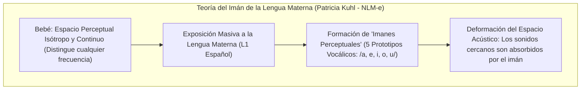
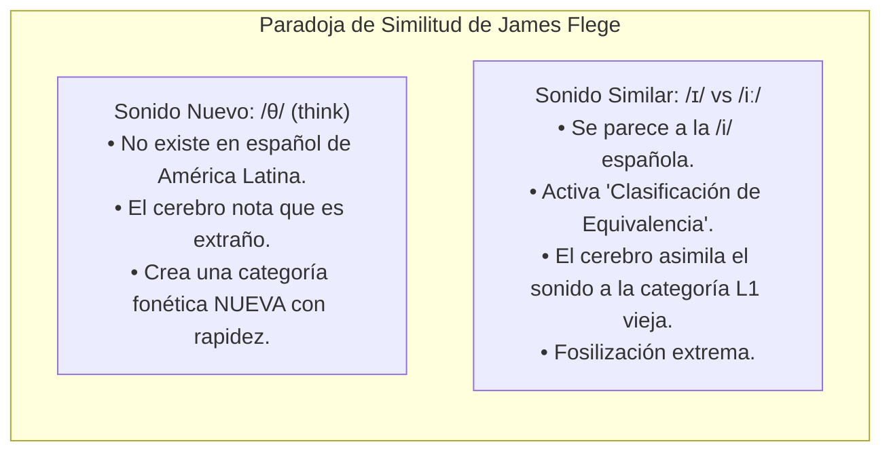
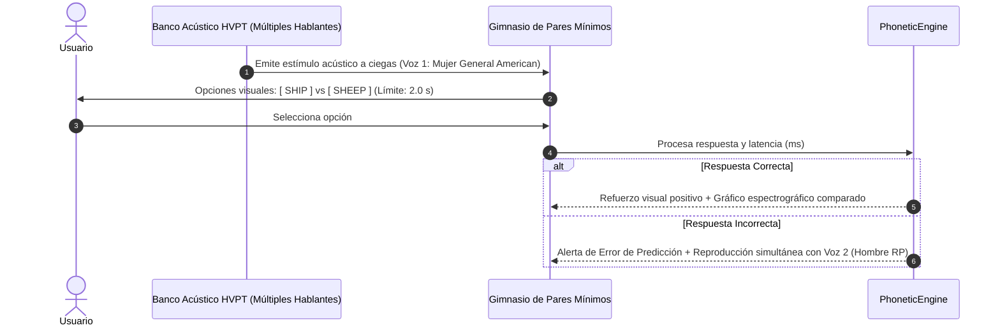

# Percepción del Habla, Modelos Psicoacústicos y Entrenamiento HVPT
## English Learning Assistant (ELA)

Este documento expone las bases neurobiológicas y psicoacústicas de la percepción del habla. Explica por qué los adultos hispanohablantes no "oyen" ciertos sonidos del inglés y fundamenta la metodología del **Gimnasio de Pares Mínimos** mediante el modelo **HVPT (High-Variability Phonetic Training)** y las teorías de Kuhl, Flege y Best.

---

## 1. El Filtro Neurosensorial: El Imán de la Lengua Materna (Patricia Kuhl)

Durante el primer año de vida, los bebés son "oyentes universales" capaces de discriminar cualquier contraste fonético de todas las lenguas humanas. Hacia los 10-12 meses, ocurre el fenómeno de **Compromiso Neuronal (*Neural Commitment*)**:

### El Efecto Imán (*The Magnet Effect*):
- En el cerebro del hispanohablante adulto, el espacio acústico entre 2.000 Hz y 3.500 Hz (formantes $F_1$ y $F_2$) está deformado por el imán de la vocal española `/i/`.
- Cuando el nativo pronuncia la vocal laxa `/ɪ/` (de *ship*), el oído del hispanohablante registra las frecuencias físicas reales, pero la corteza auditiva primaria **atrae el sonido hacia el prototipo L1 `/i/`**, provocando que el aprendiz "escuche" exactamente lo mismo que en *sheep* `/iː/`.
- **Conclusión neurobiológica:** El estudiante no pronuncia mal porque tenga un "problema en la lengua o labios", sino porque **su corteza auditiva percibe erróneamente el estímulo acústico de entrada**. No se puede producir conscientemente un sonido que el cerebro no puede categorizar.

---

## 2. El Modelo de Aprendizaje del Habla (Speech Learning Model - SLM-r, James Flege)

James Flege (1995, 2005) postuló una regla aparentemente contraintuitiva sobre la adquisición de sonidos extranjeros:

> *"Los sonidos de la L2 que son **SIMILARES** a sonidos de la L1 son drásticamente más difíciles de adquirir que los sonidos de la L2 que son **COMPLETAMENTE NUEVOS**."*

### El Mecanismo de Clasificación de Equivalencia (*Equivalence Classification*):
Cuando un fonema de la L2 tiene suficiente proximidad acústica con un fonema de la L1, el cerebro bloquea la creación de un nuevo almacén fonológico y lo procesa mediante la categoría preexistente de la lengua materna.

---

## 3. El Modelo de Asimilación Perceptual (PAM-L2, Catherine Best)

Catherine Best (1995, 2007) categorizó cómo los contrastes fonológicos de una segunda lengua son asimilados por el sistema de la lengua materna, determinando matemáticamente la dificultad de discriminación:

| Tipo de Asimilación (PAM) | Comportamiento Perceptual | Discriminabilidad | Prioridad en ELA |
| :--- | :--- | :--- | :--- |
| **Single-Category (SC)** | Ambos sonidos de la L2 se asimilan exactamente al **mismo fonema de la L1** (p. ej. `/iː/` y `/ɪ/` se escuchan ambos como la `/i/` española). | **Pésima (< 50%)** (Puro azar). | 🔴 **Máxima Prioridad:** Requiere reentrenamiento auditivo intensivo con pares mínimos forzados. |
| **Category-Goodness (CG)** | Ambos sonidos se asimilan al mismo fonema L1, pero uno suena como un "buen ejemplo" y el otro como un "ejemplo deforme o extraño". | **Moderada (60-75%)**. | 🟡 **Prioridad Media:** Requiere afinar el límite de frontera categorial. |
| **Two-Category (TC)** | Cada sonido de la L2 se asigna naturalmente a **dos fonemas diferentes de la L1** (p. ej. `/p/` y `/b/`). | **Excelente (> 95%)**. | 🟢 **Baja Prioridad:** No requiere entrenamiento específico; se discrimina de forma natural. |
| **Both Uncategorized (UU)** | Dos sonidos que caen fuera del espacio fonológico de la L1 pero se perciben diferentes entre sí. | **Variable**. | 🟡 **Media:** Depende de la distancia acústica euclidiana entre formantes. |

---

## 4. Entrenamiento Auditivo de Alta Variabilidad (High-Variability Phonetic Training - HVPT)

### 4.1. El Fracaso del Entrenamiento Tradicional con un Solo Hablante
Logan, Lively y Pisoni (1991, 1993) demostraron que entrenar a estudiantes utilizando grabaciones de un único profesor nativo produce un aprendizaje **frágil y no generalizable**:
- El alumno aprende a reconocer la frecuencia fundamental ($F_0$), el tono y la resonancia específica del tracto vocal de *ese individuo en particular*, pero al escuchar a una mujer, a un anciano o a un nativo de otra región, su capacidad de discriminación colapsa.

### 4.2. El Protocolo HVPT en ELA
Para forzar al cerebro a construir una **representación fonológica abstracta e invariable**, el Gimnasio de Pares Mínimos de ELA implementa el estándar riguroso de HVPT:

### 4.3. Parámetros del Protocolo HVPT en ELA:
1. **Diversidad Acústica de Voces:** El banco de pares mínimos integra al menos **4 a 6 voces nativas distintas** por cada contraste fonético:
   - 2 voces masculinas (timbre grave, tracto vocal largo).
   - 2 voces femeninas (timbre agudo, formantes desplazados hacia arriba).
   - 2 variantes dialectales (General American y Received Pronunciation británica).
2. **Entrenamiento de Elección Forzada a Ciegas (*Forced-Choice Identification*):** El audio se reproduce antes de mostrar el texto ortográfico, obligando a la corteza auditiva a procesar la señal acústica pura sin el sesgo cognitivo de la escritura.
3. **Restricción Temporal (2.0 segundos):** La decisión debe tomarse en menos de 2 segundos para evaluar la percepción categorial automática y evitar la duda consciente.
4. **Generalización al Aparato Motor:** Los estudios de Bradlow et al. (1997) confirmaron que el reentrenamiento perceptual mediante HVPT **mejora automáticamente la pronunciación y producción del alumno**, incluso sin haber practicado activamente con la boca, gracias a la sincronización del bucle sensorio-motor fronto-temporal.
