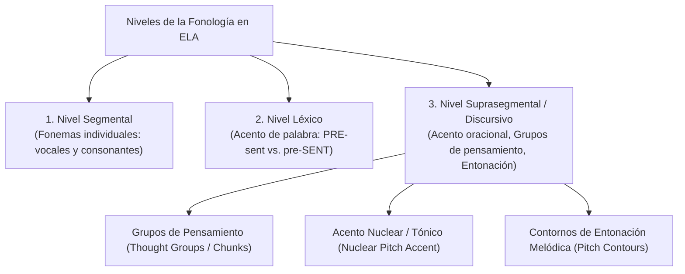
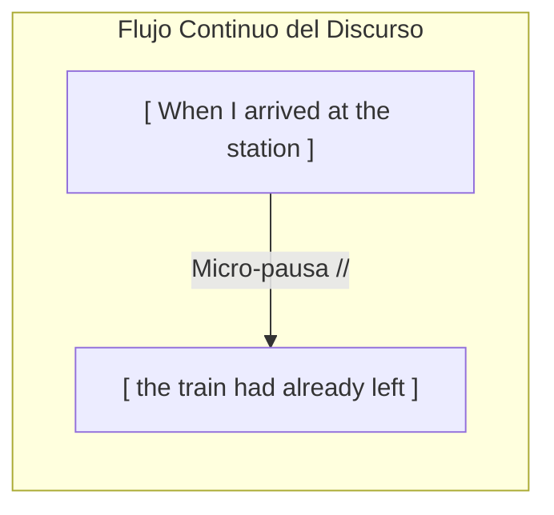
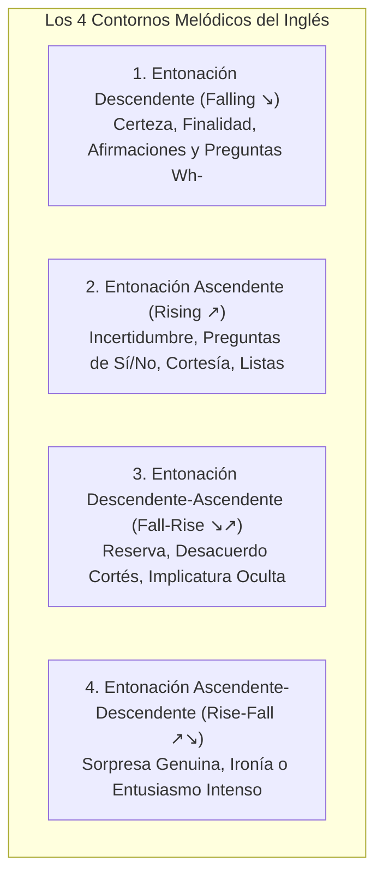

# Fonología Suprasegmental: Acento Nuclear, Grupos de Pensamiento y Entonación
## English Learning Assistant (ELA)

Este documento expone los fundamentos de la **Prosodia y la Fonología Suprasegmental** en inglés. Derwing y Munro (1997, 2015) demostraron empíricamente que los rasgos suprasegmentales (ritmo, acento oracional y melodía entonativa) tienen un **impacto sustancialmente mayor en la inteligibilidad real y en la percepción de acento nativo** que la pronunciación perfecta de fonemas individuales aislados.

---

## 1. La Jerarquía Fonológica: Más Allá de los Fonemas Aislados

---

## 2. Acento Nuclear de Frase (Tonic / Nuclear Pitch Accent)

En toda unidad de entonación existe una única sílaba que recibe el **acento primario o prominencia tónica más fuerte** (*Nuclear Stress*). En esa sílaba se produce un cambio brusco en la frecuencia fundamental ($F_0$), un incremento en la duración temporal y una mayor amplitud sonora.

### 2.1. El Caso Emblemático de Acento Contrastivo
Una misma secuencia ortográfica en inglés puede comunicar **siete significados pragmáticos radicalmente opuestos** dependiendo exclusivamente de qué palabra reciba el acento nuclear:

> Frase base: *"I didn't say she stole my money"*

| Palabra con Acento Nuclear | Intención Pragmática / Significado Real |
| :--- | :--- |
| **I** didn't say she stole my money | *"Alguien más lo dijo, pero yo no fui."* |
| I **DIDN'T** say she stole my money | *"Niego rotundamente haber afirmado semejante cosa."* |
| I didn't **SAY** she stole my money | *"No lo dije textualmente; solo lo insinué o sugerí."* |
| I didn't say **SHE** stole my money | *"Dije que el dinero fue robado, pero por otra persona."* |
| I didn't say she **STOLE** my money | *"Ella lo tomó prestado o lo encontró; no lo robó."* |
| I didn't say she stole **MY** money | *"Ella robó dinero, pero no era el mío (era de otro)."* |
| I didn't say she stole my **MONEY** | *"Ella robó otra cosa (mis joyas, mi reloj), no mi dinero."* |

### 2.2. Acento por Defecto (Información Nueva vs. Información Dada)
En una oración enunciativa neutra, el acento nuclear recae por defecto sobre la **última palabra de contenido (sustantivo, verbo o adjetivo)** del grupo de entonación, marcando el foco de información nueva:
- *"I'm looking for my **KEYS**."* (Información nueva: *keys*).
- *"Here are your keys."* $\rightarrow$ *"Thank you, I found them in my **CAR**."*

---

## 3. Grupos de Pensamiento y Pausas Significativas (Thought Groups)

Los hablantes nativos no articulan un párrafo completo de un tirón: dividen el discurso en **unidades de información coherentes (*Thought Groups*)** separadas por micro-pausas y restablecimiento del tono.

### El Impacto Pragmático de la Segmentación:
Una segmentación errónea de los grupos de pensamiento cambia totalmente el sentido lógico:
- *"Woman // without her man // is nothing."* (Sentido patriarcal).
- *"Woman // without her // man is nothing."* (Sentido feminista).

**Regla de ELA:** En los ejercicios de lectura en voz alta (*Shadowing*), el sistema visualiza los límites de cada *Thought Group* mediante barras de respiración semántica (`//`), enseñando al usuario dónde pausar naturalmente.

---

## 4. Contornos de Entonación Melódica y sus Funciones Pragmáticas

El inglés utiliza cuatro curvas melódicas principales en la frecuencia fundamental ($F_0$):

### 4.1. Entonación Descendente ($\searrow$)
- **Enunciados declarativos concluyentes:** *"We have finished the project $\searrow$."*
- **Preguntas con partículas interrogativas (*Wh- questions*):** *"Where do you live $\searrow$?"*, *"What time is it $\searrow$?"* (El hispanohablante suele equivocarse elevando el tono aquí por transferencia L1).
- **Órdenes e imperativos:** *"Sit down $\searrow$."*

### 4.2. Entonación Ascendente ($\nearrow$)
- **Preguntas polares (de Sí o No):** *"Are you ready $\nearrow$?"*, *"Did you call him $\nearrow$?"*
- **Petición de repetición o aclaración:** *"Pardon $\nearrow$?"*, *"What did you say $\nearrow$?"*
- **Listas no concluidas (indica que el mensaje continúa):** *"I bought apples $\nearrow$, oranges $\nearrow$, bananas $\nearrow$, and milk $\searrow$."*

### 4.3. Entonación Descendente-Ascendente ($\searrow\nearrow$ - Fall-Rise)
Es el contorno más sutil y esencial para la cortesía profesional y la diplomacia en inglés:
- **Reserva mental o implicatura oculta:**
  - Pregunta: *"Did you like the movie?"*
  - Respuesta: *"Well... the acting was good $\searrow\nearrow$..."* (La curva melódica comunica implícitamente: *"pero la película fue un desastre total"*).
- **Corrección o desacuerdo mitigado:** *"I think it starts at five."* $\rightarrow$ *"Actually, it starts at six $\searrow\nearrow$."*

### 4.4. La Entonación en las Question Tags
Una *question tag* cambia de significado según la melodía final:
- **Tono Descendente ($\searrow$):** No es una pregunta real; es una búsqueda de confirmación o consenso obvio: *"It's a beautiful day, isn't it $\searrow$?"*
- **Tono Ascendente ($\nearrow$):** Es una pregunta auténtica con incertidumbre genuina: *"You haven't seen my glasses, have you $\nearrow$?"*

---

## 5. Implementación en la Interfaz de Usuario de ELA

El módulo fonético de ELA complementa el entrenamiento de Habla Conectada con herramientas visuales de prosodia:
1. **Curva de Tono Interactiva ($F_0$ Pitch Tracker):** Muestra una línea continua sobre la oración indicando las subidas y bajadas melódicas nativas.
2. **Punto Tónico Focal (Tonic Dot):** Resalta la sílaba con acento nuclear oracional en un cuerpo tipográfico superior o con un indicador de calor visual.
3. **Módulo de Shadowing Prosódico:** El usuario graba su voz imitando la curva melódica y el sistema superpone su contorno de tono frente al modelo nativo en tiempo real.
