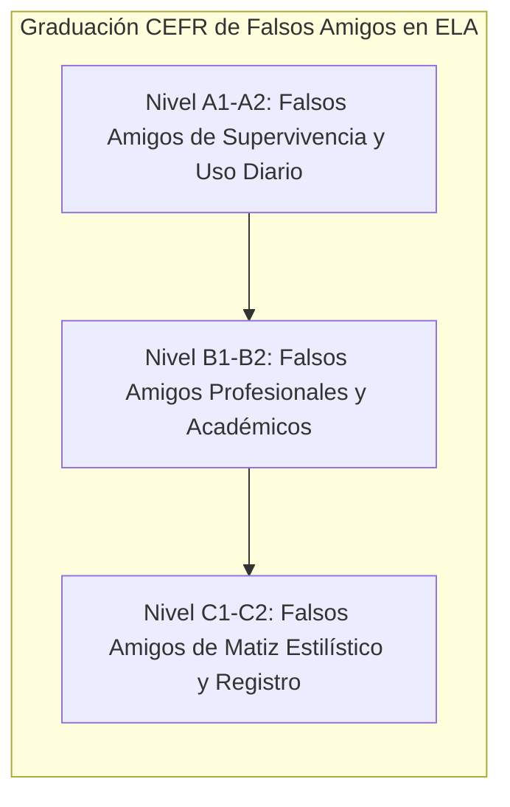
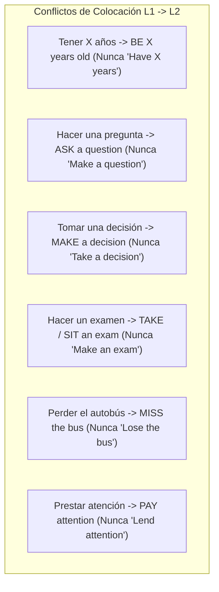

# Catálogo Exhaustivo de Falsos Amigos (False Cognates) y Choque de Colocaciones
## English Learning Assistant (ELA)

Este documento es el diccionario contrastivo de referencia para el motor de diagnóstico léxico de ELA. Cataloga de manera exhaustiva los **Falsos Cognados (*False Friends*)** clasificados por nivel de competencia (CEFR A1 a C1) y analiza las discrepancias colocacionales más frecuentes causadas por la traducción literal desde el español.

---

## 1. El Fenómeno del Falso Cognado: Divergencia Semántica Histórica

Aproximadamente el 60% del vocabulario del inglés culto proviene del latín o del francés normando. Sin embargo, a lo largo de los siglos, cientos de palabras evolucionaron hacia campos semánticos radicalmente distintos en inglés y en español.
- **La Ilusión de Familiaridad:** El cerebro del hispanohablante reconoce la raíz gráfica e infiere de inmediato el significado de su lengua materna con un alto grado de certidumbre.
- **Efecto de Hipercorrección en ELA:** Como el estudiante cree "saber" la palabra con total seguridad, cometer este error genera el mayor error de predicción dopaminérgico. El feedback contrastivo guiado por esta matriz produce anclajes mnemotécnicos permanentes.

---

## 2. Catálogo Graduado de Falsos Amigos por Nivel CEFR

### 2.1. Nivel A1 - A2 (Falsos Amigos de Supervivencia y Uso Cotidiano)

| Palabra en Inglés | Parece en Español... | Significado REAL en Inglés | ¿Cómo se dice lo que creías en inglés? | Ejemplo de Uso Correcto |
| :--- | :--- | :--- | :--- | :--- |
| **Actually** | *Actualmente* | En realidad / De hecho | *Currently / Nowadays / At present* | *"Actually, I don't like coffee."* |
| **Realize** | *Realizar* (hacer/ejecutar) | Darse cuenta de algo | *To make / To carry out / To perform* | *"I didn't realize you were waiting."* |
| **Sensible** | *Sensible* (emocional) | Sensato / Razonable / Prudente | *Sensitive* | *"It was a very sensible decision."* |
| **Sensitive** | *Sensitivo* | Sensible / Delicado / Susceptible | *Sensible* | *"My skin is very sensitive to sunlight."* |
| **Embarrassed** | *Embarazada* | Avergonzado / Apenado | *Pregnant* | *"I was so embarrassed when I fell."* |
| **Library** | *Librería* (tienda) | Biblioteca pública o comunitaria | *Bookstore / Bookshop* | *"You can borrow books from the library."* |
| **Assist** | *Asistir* (ir a un evento) | Ayudar o socorrer a alguien | *To attend (a meeting/class)* | *"Can I assist you with your luggage?"* |
| **Attend** | *Atender* (prestar atención) | Asistir / Ir presencialmente a un lugar | *To pay attention / To look after* | *"I attended the conference yesterday."* |
| **Large** | *Largo* (longitud) | Grande / Amplio / Voluminoso | *Long* | *"They live in a large house."* |
| **Exit** | *Éxito* (triunfo) | Salida (puerta de escape) | *Success* | *"Please use the emergency exit."* |
| **Contest** | *Contestar* (responder) | Concurso / Competición | *To answer / To reply* | *"She won the photography contest."* |
| **Notice** | *Noticia* (información) | Notar / Percibir / Aviso escrito | *News / Piece of news* | *"Did you notice her new haircut?"* |
| **Record** | *Recordar* (en la mente) | Grabar audio/video o registrar datos | *To remember / To recall* | *"We recorded the entire interview."* |

---

### 2.2. Nivel B1 - B2 (Falsos Amigos Profesionales y de Negocios)

| Palabra en Inglés | Parece en Español... | Significado REAL en Inglés | ¿Cómo se dice lo que creías en inglés? | Ejemplo de Uso Correcto |
| :--- | :--- | :--- | :--- | :--- |
| **Eventually** | *Eventualmente* (a veces/quizás)| Con el tiempo / A la larga / Finalmente | *Occasionally / Possibly* | *"He eventually accepted the job offer."* |
| **Fabric** | *Fábrica* (de manufactura) | Tela / Tejido textil | *Factory / Plant* | *"Cotton is a very breathable fabric."* |
| **Pretend** | *Pretender* (intentar/querer) | Fingir / Simular algo falso | *To intend / To aim / To claim* | *"He pretended to be asleep."* |
| **Intend** | *Entender* (comprender) | Pretender / Tener la intención de hacer algo | *To understand* | *"I intend to finish this report today."* |
| **Argument** | *Argumento* (guión de película) | Discusión acalorada / Pelea verbal | *Plot / Storyline / Reasoning* | *"They had a fierce argument about money."*|
| **Compromise** | *Compromiso* (obligación o cita)| Llegar a un acuerdo cediendo ambas partes | *Commitment / Appointment* | *"We must compromise to reach a deal."* |
| **Resume** | *Resumir* (sintetizar) | Currículum vitae (*Resume*) o Reanudar (*to resume*) | *To summarize* | *"Please send me your updated resume."* |
| **Commodity** | *Comodidad* (confort) | Materia prima comerciable / Mercancía | *Comfort / Convenience* | *"Oil is a valuable global commodity."* |
| **Comprehensive** | *Comprensivo* (tolerante/empático)| Exhaustivo / Integral / Completo | *Understanding / Empathetic* | *"We conducted a comprehensive study."* |
| **Sympathetic** | *Simpático* (agradable/gracioso)| Compasivo / Empático ante el dolor ajeno | *Nice / Friendly / Likeable* | *"She was very sympathetic when I was ill."*|
| **Preservative** | *Preservativo* (profiláctico) | Conservante químico para alimentos | *Condom* | *"This juice contains no preservatives."* |
| **Deception** | *Decepción* (desilusión) | Engaño / Fraude deliberado | *Disappointment* | *"He was convicted of fraud and deception."*|
| **Casualty** | *Casualidad* (coincidencia) | Víctima mortal o herido en un accidente/guerra| *Coincidence / Chance* | *"There were zero casualties in the crash."*|

---

### 2.3. Nivel C1 - C2 (Falsos Amigos de Matiz Estilístico y Académico)

| Palabra en Inglés | Parece en Español... | Significado REAL en Inglés | ¿Cómo se dice lo que creías en inglés? | Ejemplo de Uso Correcto |
| :--- | :--- | :--- | :--- | :--- |
| **Fastidious** | *Fastidioso* (molesto/pesado) | Meticuloso / Exigente / Muy detallista | *Annoying / Tiresome* | *"He is fastidious about his work quality."*|
| **Notorious** | *Notorio* (famoso o evidente) | De mala fama / Célebre por algo negativo | *Well-known / Renowned* | *"He is a notorious criminal."* |
| **Mundane** | *Mundano* (relativo al mundo) | Rutinario / Banal / Cotidiano / Aburrido | *Worldly / Cosmopolitan* | *"Mundane everyday tasks like cleaning."* |
| **Complacent** | *Complaciente* (servicial) | Auto-satisfecho / Acomodado / Despreocupado | *Accommodating / Obliging* | *"We cannot afford to become complacent."* |
| **Ingenuous** | *Ingenioso* (inteligente/creativo)| Ingenuo / Inocente / Cándido | *Ingenious / Clever* | *"An ingenuous smile that deceived no one."*|

---

## 3. Matriz de Choque de Colocaciones (Spanish-English Collocation Clashes)

Las colocaciones más peligrosas son aquellas donde el estudiante traduce mecánicamente el verbo soporte del español:

### Tabla de Desajustes Colocacionales Habituales

| En Español decimos... | Error Literal del Estudiante | Colocación Real en Inglés | Explicación Lingüística |
| :--- | :--- | :--- | :--- |
| *"Tengo 28 años"* | ❌ *"I have 28 years"* | ✅ *"**I am 28 years old**"* | La edad se concibe en inglés como un estado ontológico (*to be*), no una posesión material. |
| *"Tengo hambre / sed / frío"* | ❌ *"I have hunger / thirst / cold"* | ✅ *"**I am hungry / thirsty / cold**"* | Los estados fisiológicos se expresan con adjetivos predicativos con *to be*. |
| *"Tengo razón"* | ❌ *"I have reason"* | ✅ *"**I am right**"* | *Reason* es la facultad de raciocinio o motivo; tener razón es el adjetivo *right*. |
| *"Tomar una decisión"* | ❌ *"Take a decision"* | ✅ *"**Make a decision**"* | El verbo natural para resoluciones y elecciones en inglés es *make*. |
| *"Hacer una pregunta"* | ❌ *"Make a question"* | ✅ *"**Ask a question**"* | *Question* exige el verbo colocacional *ask*. |
| *"Hacer un examen"* | ❌ *"Make an exam"* | ✅ *"**Take an exam**"* o *"**Sit an exam**"* | Los estudiantes *take* el examen; los profesores son los que *make* (diseñan) el examen. |
| *"Prestar atención"* | ❌ *"Lend attention"* | ✅ *"**Pay attention**"* | La metáfora económica del inglés concibe la atención como un recurso valioso que se "paga". |
| *"Cumplir una promesa"* | ❌ *"Accomplish / fulfill a promise"* | ✅ *"**Keep a promise**"* | La colocación indivisible de uso común es *keep a promise*. |
| *"Dar una fiesta"* | ❌ *"Give a party"* | ✅ *"**Throw a party**"* o *"**Have a party**"* | *Throw a party* es la unidad fraseológica auténtica de alta frecuencia. |
| *"Perder el tren / avión"* | ❌ *"Lose the train / flight"* | ✅ *"**Miss the train / flight**"* | *Lose* es extraviar una posesión; *miss* es llegar tarde a un transporte o cita. |
| *"Cometer un error"* | ❌ *"Commit an error"* (excesivamente formal) | ✅ *"**Make a mistake**"* | *Commit* se reserva para crímenes o suicidio; las faltas cotidianas se expresan con *make a mistake*. |
