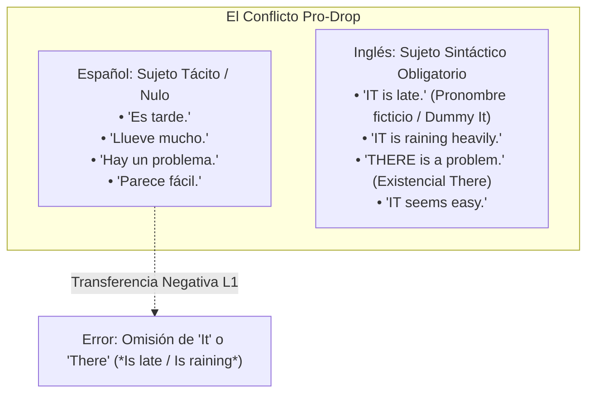
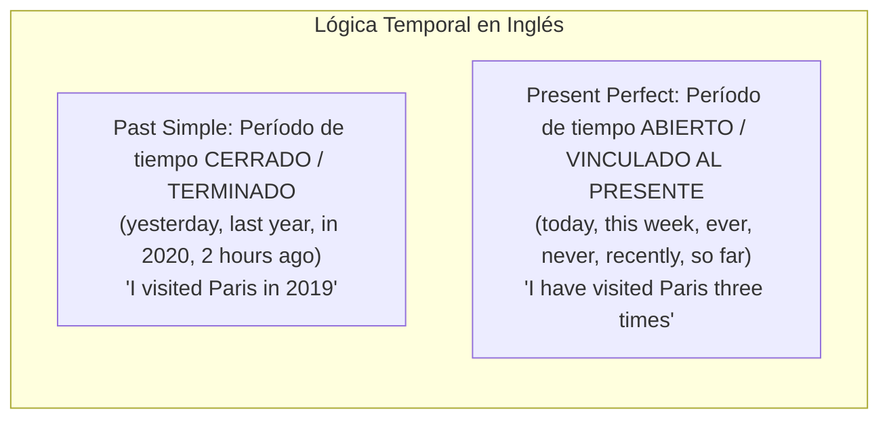

# Matriz Exhaustiva de Transferencia Morfosintáctica L1 (Español $\rightarrow$ Inglés)
## English Learning Assistant (ELA)

Este documento cataloga de forma exhaustiva las discrepancias estructurales, gramaticales y sintácticas entre el español y el inglés. Proporciona las reglas de detección analítica que utiliza el motor `DiagnosticEngine` y el sistema de evaluación socrática de Gemini para identificar la causa raíz de los errores del usuario.

---

## 1. El Parámetro del Sujeto Nulo (Pro-Drop Parameter) y Pronombres Ficticios

El español es una lengua de **sujeto nulo (*pro-drop*)**, cuya rica morfología verbal permite omitir el pronombre sin ambigüedad (*"Comemos pizza"* $\rightarrow$ sabemos que el sujeto es *nosotros*). 

En contraste, el inglés estándar es estrictamente **no pro-drop**: toda oración finita exige un sujeto sintáctico explícito en la posición preverbal.

| Oración en Español | Error Común por Transferencia L1 | Forma Correcta en Inglés | Regla Sintáctica Explicativa |
| :--- | :--- | :--- | :--- |
| *"Está lloviendo"* | ❌ *"Is raining"* | ✅ *"**It is raining**"* | Los verbos meteorológicos exigen el pronombre expletivo impersonal *It*. |
| *"Es importante practicar"* | ❌ *"Is important to practice"* | ✅ *"**It is important** to practice"* | Una cláusula infinitiva o adjetival requiere *It* como sujeto gramatical anticipatorio. |
| *"Hay tres personas esperando"* | ❌ *"Are three people waiting"* o *"Have three people"* | ✅ *"**There are** three people waiting"* | En inglés la existencia no se expresa con *have*, sino con la estructura *There is / There are*. |
| *"Parece que va a nevar"* | ❌ *"Seems that will snow"* | ✅ *"**It seems** that **it will** snow"* | Tanto la cláusula principal como la subordinada exigen sujetos explícitos (*It / it*). |

---

## 2. Conflictos de Tiempo-Aspecto-Modo (TAM)

### 2.1. Present Perfect vs. Past Simple (Acción Acabada vs. No Concluida)
- **El Conflicto:** En español de España o América Latina, los límites entre el pretérito perfecto compuesto (*he comido*) y el pretérito simple (*comí*) son fluidos o dialectales. En inglés, la frontera temporal es matemáticamente binaria:

| Expresión Temporal | Error Típico del Hispanohablante | Corrección Nativa | Justificación |
| :--- | :--- | :--- | :--- |
| *"Hoy vi a María"* | ❌ *"I saw Maria today"* (si el día aún no termina) | ✅ *"I have seen Maria today"* | *Today* es un período de tiempo abierto e incompleto. |
| *"Ayer he visto a María"* | ❌ *"I have seen Maria yesterday"* | ✅ *"I saw Maria yesterday"* | *Yesterday* es un período cerrado; prohíbe el *Present Perfect*. |
| *"Vivo aquí desde hace 3 años"* | ❌ *"I live here since 3 years"* o *"I am living here for 3 years"* | ✅ *"I have lived / have been living here for 3 years"* | Una acción iniciada en el pasado que continúa en el presente exige *Present Perfect*, no presente simple. |

### 2.2. Verbos Estativos y la Prohibición del Aspecto Continuo (-ing)
En español es común decir *"estoy entendiendo"* o *"estoy necesitando"*. En inglés, los **Stative Verbs** (que describen estados mentales, emociones, sentidos o posesión) prohíben por regla general los tiempos continuos:
- ❌ *"I am knowing the answer"* $\longrightarrow$ ✅ *"I know the answer"*.
- ❌ *"I am not believing you"* $\longrightarrow$ ✅ *"I don't believe you"*.
- ❌ *"This car is belonging to me"* $\longrightarrow$ ✅ *"This car belongs to me"*.
- ❌ *"Are you understanding?"* $\longrightarrow$ ✅ *"Do you understand?"*.

### 2.3. Las Estructuras Condicionales y el Subjuntivo
El español utiliza el subjuntivo imperfecto en la condición (*"Si tuviera dinero..."*). El hispanohablante tiende a transferir el modal *would* a ambas cláusulas:
- ❌ *"If I **would have** time, I **would go** with you."* (**Error recurrente grave**).
- ✅ *"If I **had** time, I **would go** with you."* (2nd Conditional: *If + Past Simple, would + base verb*).
- ❌ *"If it will rain, I will stay at home."*
- ✅ *"If it **rains**, I will stay at home."* (1st Conditional: la cláusula con *if* va en presente simple).

---

## 3. Matriz de Regímenes Preposicionales Dependientes (Divergencia L1 $\rightarrow$ L2)

Las preposiciones dependientes son la mayor fuente de errores fosilizados porque no admiten traducción literal:

### 3.1. Verbos con Preposición Divergente

| Verbo en Inglés | Preposición Obligatoria | En Español se dice... | Error Habitual Hispanohablante | Ejemplo Correcto |
| :--- | :--- | :--- | :--- | :--- |
| **Depend** | **ON / UPON** | Depender *de* | ❌ *depends of* | *"It depends **on** the circumstances."* |
| **Consist** | **OF** | Consistir *en* | ❌ *consists in* | *"The team consists **of** five members."* |
| **Married / Engaged** | **TO** | Casado / Comprometido *con* | ❌ *married with* | *"She is married **to** an engineer."* |
| **Good / Bad** | **AT** | Bueno / Malo *en* | ❌ *good in* | *"He is very good **at** mathematics."* |
| **Interested** | **IN** | Interesado *en/por* | ❌ *interested for* | *"Are you interested **in** history?"* |
| **Dream** | **ABOUT / OF** | Soñar *con* | ❌ *dream with* | *"I dreamt **about** you last night."* |
| **Arrive** | **AT (lugar) / IN (ciudad)** | Llegar *a* | ❌ *arrive to* | *"We arrived **at** the airport / **in** Madrid."* |
| **Congratulate** | **ON** | Felicitar *por* | ❌ *congratulate for* | *"I congratulated him **on** his promotion."* |
| **Think** | **OF / ABOUT** | Pensar *en* | ❌ *think in* | *"What are you thinking **about**?"* |
| **Pay** | **FOR (cosa)** | Pagar *por* | ❌ *pay the dinner* | *"Let me pay **for** the dinner."* |

### 3.2. Verbos Transitivos Directos en Inglés (Que en Español Llevan Preposición)
En español muchos verbos exigen preposiciones (*a, de, con, sobre*). En inglés son **transitivos directos y prohíben cualquier preposición**:

| Verbo en Inglés | En Español se dice... | Error Típico Hispanohablante | Forma Correcta en Inglés |
| :--- | :--- | :--- | :--- |
| **Discuss** | Discutir *sobre* / hablar *de* | ❌ *discuss about the problem* | ✅ *"We need to **discuss the problem**."* |
| **Enter** | Entrar *a / en* | ❌ *enter to the building* | ✅ *"He **entered the building**."* |
| **Call** | Llamar *a* | ❌ *call to my brother* | ✅ *"I will **call my brother**."* |
| **Approach** | Acercarse *a* | ❌ *approach to the door* | ✅ *"She **approached the door**."* |
| **Reach** | Llegar *a* / alcanzar | ❌ *reach to an agreement* | ✅ *"They **reached an agreement**."* |
| **Contact** | Ponerse en contacto *con* | ❌ *contact with customer support* | ✅ *"Please **contact customer support**."* |

---

## 4. Orden Sintáctico, Invariable Adjetival e Inversión

### 4.1. Invariabilidad y Posición del Adjetivo
- En español los adjetivos van pospuestos y concuerdan en género y número (*los coches azules*).
- En inglés los adjetivos calificativos son **estrictamente antepuestos e invariables (nunca admiten plural)**:
  - ❌ *"The cars blues are fast."*
  - ❌ *"The blues cars are fast."*
  - ✅ *"The **blue cars** are fast."*

### 4.2. Inversión en Preguntas Indirectas (*Embedded Questions*)
En español, tanto una pregunta directa como una indirecta mantienen el mismo orden (*"¿Dónde está el banco?"* vs. *"¿Puedes decirme dónde está el banco?"*).

En inglés, una pregunta incrustada dentro de otra cláusula **pierde la inversión interrogativa y adopta el orden declarativo (Sujeto + Verbo)**:
- Pregunta directa: *"Where **is the station**?"*
- ❌ Pregunta indirecta errónea: *"Could you tell me where **is the station**?"*
- ✅ Pregunta indirecta correcta: *"Could you tell me where **the station is**?"*
- ❌ *"I don't know what **did he do**."*
- ✅ *"I don't know what **he did**."*

---

## 5. El Patrón de Negación: La Doble Negación del Español

El español estándar exige la concordancia negativa múltiple (*"**No** vi a **nadie**"*, *"**No** tengo **nada**"*).

En inglés estándar, dos negaciones lógicas dentro de la misma cláusula forman una afirmación afirmativa (*cancelling out*), por lo que **se prohíbe taxativamente la doble negación**:
- ❌ *"I didn't see nobody."*
- ✅ *"I didn't see **anybody**."* (Negación en el auxiliar + pronombre indefenido de polaridad negativa).
- ✅ *"I saw **nobody**."* (Verbo afirmativo + pronombre negativo).
- ❌ *"He doesn't know nothing."* $\longrightarrow$ ✅ *"He doesn't know **anything**"* o *"He knows **nothing**"*.

---

## 6. La Fosilización de la Tercera Persona Singular (*-s / -es*)

### 6.1. La Causa Psicolingüística
En español, cada persona gramatical tiene una desinencia verbal diferenciada (*como, comes, come, comemos, coméis, comen*).
En inglés presente, cinco de las seis personas gramaticales utilizan la forma base invariable (*I work, you work, we work, they work*).
- El cerebro del aprendiz adulto formula la regla procedural por defecto: $\text{Verbo} = \text{Forma Base}$.
- Como la tercera persona singular (*he/she/it works*) es la **única excepción morfológica**, la corteza motora tiende a omitir la desinencia si no se encuentra sometida a práctica deliberada con temporizador.

### 6.2. Estrategia en ELA
Este error no se corrige explicando la regla teórica una y otra vez. Se erradica exclusivamente mediante **Drills de Sustitución Rápida (Speed Drills de 2.0 s)** alternando pronombres en milisegundos:
- *"They like it"* $\longrightarrow$ Estímulo: `[SHE]` $\longrightarrow$ Respuesta forzada: *"She likes it"*.
