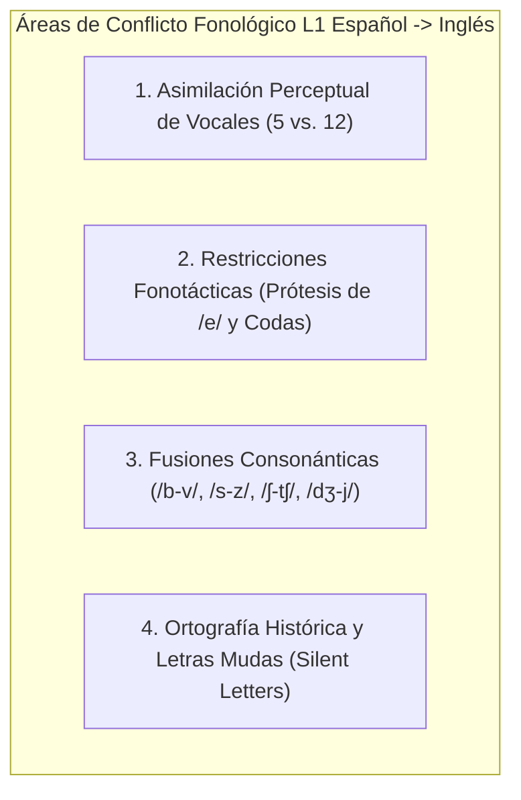
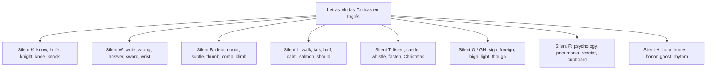

# Matriz Exhaustiva de Interferencia Fonológica L1 (Español $\rightarrow$ Inglés)
## English Learning Assistant (ELA)

Este documento cataloga de forma exhaustiva los patrones sistemáticos de **Interferencia Fonológica y Transferencia Negativa (L1 Phonological Transfer)** que sufren los hispanohablantes al hablar y escuchar inglés. Sirve como matriz de referencia para el motor de diagnóstico `PhoneticEngine` y el generador de ejercicios del **Gimnasio de Pares Mínimos**.

---

## 1. El Origen Psicolingüístico de la Interferencia Fonológica (Stockwell & Bowen)

La transferencia fonológica ocurre cuando los filtros perceptuales y los hábitos motores consolidados en la lengua materna (L1) se imponen automáticamente sobre la lengua meta (L2).

El español tiene un inventario fonológico austero:
- Solo **5 fonemas vocálicos** (frente a 12-14 en inglés).
- Cero distinción fonémica por duración vocálica o tensión muscular.
- Restricciones fonotácticas severas: las palabras en español casi nunca terminan en grupos de dos o tres consonantes (*coda clusters*), y **ninguna palabra puede comenzar por /s/ líquida seguida de consonante**.

---

## 2. Matriz de Pares Mínimos Vocálicos Críticos

Debido al modelo PAM-L2 (Asimilación *Single-Category*), los siguientes contrastes vocálicos representan la mayor tasa de errores fonéticos y malentendidos sociales:

| Contraste Fonético | Fonema A (Tenso / Largo) | Fonema B (Laxo / Corto) | Par Mínimo Clave | Transcripción IPA | Consecuencia / Riesgo Semántico |
| :--- | :--- | :--- | :--- | :--- | :--- |
| **/iː/ vs. /ɪ/** | `/iː/` (sonrisa tensa) | `/ɪ/` (mandíbula relajada) | *sheep* vs. *ship* | `/ʃiːp/` vs. `/ʃɪp/` | Confusión entre oveja y barco. |
| **/iː/ vs. /ɪ/** | `/iː/` | `/ɪ/` | *beach* vs. *bitch* | `/biːtʃ/` vs. `/bɪtʃ/` | **Riesgo crítico:** insulto involuntario por no relajar la vocal. |
| **/iː/ vs. /ɪ/** | `/iː/` | `/ɪ/` | *sheet* vs. *shit* | `/ʃiːt/` vs. `/ʃɪt/` | **Riesgo crítico:** vulgaridad por colapso vocálico. |
| **/iː/ vs. /ɪ/** | `/iː/` | `/ɪ/` | *leave* vs. *live* | `/liːv/` vs. `/lɪv/` | Partir vs. vivir/en vivo. |
| **/iː/ vs. /ɪ/** | `/iː/` | `/ɪ/` | *eat* vs. *it* | `/iːt/` vs. `/ɪt/` | Comer vs. pronombre impersonal. |
| **/æ/ vs. /e/** | `/æ/` (boca muy abierta) | `/e/` (media apertura) | *bad* vs. *bed* | `/bæd/` vs. `/bed/` | Malo vs. cama. |
| **/æ/ vs. /e/** | `/æ/` | `/e/` | *man* vs. *men* | `/mæn/` vs. `/men/` | Singular vs. plural irregular de hombre. |
| **/æ/ vs. /e/** | `/æ/` | `/e/` | *pan* vs. *pen* | `/pæn/` vs. `/pen/` | Sartén vs. bolígrafo. |
| **/æ/ vs. /ʌ/** | `/æ/` (anterior abierta) | `/ʌ/` (central neutra) | *ankle* vs. *uncle* | `/ˈæŋkl/` vs. `/ˈʌŋkl/` | Tobillo vs. tío. |
| **/æ/ vs. /ʌ/** | `/æ/` | `/ʌ/` | *cat* vs. *cut* | `/kæt/` vs. `/kʌt/` | Gato vs. cortar. |
| **/uː/ vs. /ʊ/** | `/uː/` (redondeo tenso) | `/ʊ/` (redondeo laxo) | *pool* vs. *pull* | `/puːl/` vs. `/pʊl/` | Piscina vs. halar / tirar. |
| **/uː/ vs. /ʊ/** | `/uː/` | `/ʊ/` | *fool* vs. *full* | `/fuːl/` vs. `/fʊl/` | Tonto vs. lleno. |
| **/uː/ vs. /ʊ/** | `/uː/` | `/ʊ/` | *Luke* vs. *look* | `/luːk/` vs. `/lʊk/` | Nombre propio vs. mirar. |

---

## 3. Matriz de Fusiones y Contrastes Consonánticos

El aparato auditivo del hispanohablante tiende a fusionar consonantes inglesas distintas en un solo alófono familiar:

### 3.1. La Fusión Bilabial vs. Labiodental (/b/ vs. /v/)
En español no existe la distinción fonológica entre 'b' y 'v': ambas son bilabiales.
- **/b/ inglesa:** Oclusiva bilabial sonora (labios juntos).
- **/v/ inglesa:** Fricativa labiodental sonora (dientes superiores sobre el labio inferior).

| Par Mínimo | /b/ Bilabial | /v/ Labiodental | Transcripción IPA |
| :--- | :--- | :--- | :--- |
| *berry* vs. *very* | *berry* (baya) | *very* (muy) | `/ˈberi/` vs. `/ˈveri/` |
| *boat* vs. *vote* | *boat* (barco) | *vote* (voto) | `/bəʊt/` vs. `/voʊt/` |
| *best* vs. *vest* | *best* (mejor) | *vest* (chaleco) | `/best/` vs. `/vest/` |
| *ban* vs. *van* | *ban* (prohibición) | *van* (furgoneta) | `/bæn/` vs. `/væn/` |
| *curb* vs. *curve* | *curb* (bordillo) | *curve* (curva) | `/kɜːrb/` vs. `/kɜːrv/` |

### 3.2. La Fusión Sorda vs. Sonora en Sibilantes Alveolares (/s/ vs. /z/)
En español estándar, la letra 's' siempre es sorda (/s/). En inglés, el contraste entre /s/ (sorda) y /z/ (sonora con vibración laríngea como el zumbido de una abeja) es fonémico y distingue significados y terminaciones gramaticales:

| Par Mínimo | /s/ Sorda (Sin vibración) | /z/ Sonora (Con vibración laríngea) | Transcripción IPA |
| :--- | :--- | :--- | :--- |
| *price* vs. *prize* | *price* (precio) | *prize* (premio) | `/praɪs/` vs. `/praɪz/` |
| *loose* vs. *lose* | *loose* (holgado / suelto) | *lose* (perder) | `/luːs/` vs. `/luːz/` |
| *bus* vs. *buzz* | *bus* (autobús) | *buzz* (zumbido) | `/bʌs/` vs. `/bʌz/` |
| *peace* vs. *peas* | *peace* (paz) | *peas* (guisantes/arvejas) | `/piːs/` vs. `/piːz/` |
| *ice* vs. *eyes* | *ice* (hielo) | *eyes* (ojos) | `/aɪs/` vs. `/aɪz/` |

### 3.3. Fricativa Postalveolar vs. Africada (/ʃ/ vs. /tʃ/)
El hispanohablante tiende a pronunciar la fricativa continua /ʃ/ (*sh*) como la africada /tʃ/ (*ch* de chocolate):

| Par Mínimo | /ʃ/ (Fricativa continua: shhh) | /tʃ/ (Africada con corte explosivo) | Transcripción IPA |
| :--- | :--- | :--- | :--- |
| *share* vs. *chair* | *share* (compartir) | *chair* (silla) | `/ʃeər/` vs. `/tʃeər/` |
| *wash* vs. *watch* | *wash* (lavar) | *watch* (mirar / reloj) | `/wɒʃ/` vs. `/wɒtʃ/` |
| *shoes* vs. *choose* | *shoes* (zapatos) | *choose* (elegir) | `/ʃuːz/` vs. `/tʃuːz/` |
| *sheep* vs. *cheap* | *sheep* (oveja) | *cheap* (barato) | `/ʃiːp/` vs. `/tʃiːp/` |
| *wish* vs. *witch* | *wish* (deseo) | *witch* (bruja) | `/wɪʃ/` vs. `/wɪtʃ/` |

### 3.4. La Africada Sonora vs. Semivocal Palatal (/dʒ/ vs. /j/)
Confusión entre la 'j' inglesa (/dʒ/ explosiva como en *job*) y la 'y' inglesa (/j/ suave como en *yes*):
- *jew* `/dʒuː/` vs. *you* `/juː/`.
- *joke* `/dʒəʊk/` vs. *yoke* `/jəʊk/`.
- *jet* `/dʒet/` vs. *yet* `/jet/`.
- *major* `/ˈmeɪdʒər/` vs. *mayor* `/ˈmeɪər/` (alcalde).

---

## 4. Conflictos Fonotácticos Estructurales

### 4.1. Prótesis Vocálica ante /s/ Líquida Inicial (#sC Clusters)
- **Causa Estructural:** En español no existe ninguna palabra que comience por /s/ seguida de consonante (*s-cluster*). Todas llevan una /e/ de apoyo (*escuela, escribir, especial, España*).
- **El Error:** El hispanohablante inserta inconscientemente un sonido vocálico [e] antes de cualquier palabra en inglés con este patrón:
  - *school* $\rightarrow$ pronunciado erróneamente `[esˈkuːl]`.
  - *student* $\rightarrow$ `[esˈtjuːdənt]`.
  - *special* $\rightarrow$ `[esˈpeʃəl]`.
  - *start* $\rightarrow$ `[esˈtɑːrt]`.
  - *Spain* $\rightarrow$ `[esˈpeɪn]`.
- **Protocolo de Corrección en ELA:**
  1. *Fase 1 (Siseo Sostenido):* Entrenar la prolongación inicial del aire sibilante sin encender las cuerdas vocales: `ssssss-chool`.
  2. *Fase 2 (Enlace C-V):* Unir la palabra previa terminada en vocal directamente con la 's' sin pausa: *"go to school"* $\rightarrow$ `[ɡəʊ tə ˈskuːl]`.

### 4.2. Simplificación y Caída de Grupos Consonánticos Finales (Final Coda Clusters)
El español prohíbe terminar palabras en grupos consonánticos como /-pt/, /-kt/, /-st/, /-ld/, /-nd/, /-fts/. 
- **La Manifestación en Inglés:** El estudiante hispanohablante tiende a eliminar la consonante oclusiva final:
  - *kept* $\rightarrow$ pronunciado como *"kep"*.
  - *walked* `/wɔːkt/` $\rightarrow$ pronunciado como *"walk"*.
  - *passed* `/pɑːst/` $\rightarrow$ pronunciado como *"pass"*.
  - *hold* `/həʊld/` $\rightarrow$ pronunciado como *"hole"*.
- **Consecuencia Gramatical Grave:** Al omitir la /t/ o /d/ final del pasado regular (*-ed*), el hispanohablante cree que está hablando en pasado, pero el nativo anglosajón escucha tiempo presente, destruyendo la coherencia temporal del mensaje.

---

## 5. Catálogo Exhaustivo de Letras Mudas (Silent Letters)

A diferencia del español (que es una lengua fonética ortográficamente casi transparente), el inglés conserva la grafía histórica de consonantes que dejaron de pronunciarse hace siglos:

| Letra Muda | Patrón Ortográfico Típico | Palabras Clave de Alta Frecuencia | Error Habitual Hispanohablante | Transcripción Correcta |
| :--- | :--- | :--- | :--- | :--- |
| **K muda** | *kn-* al inicio | *know, knee, knife, knight, knock* | Intentar pronunciar la 'k'. | `/nəʊ/`, `/niː/`, `/naɪf/` |
| **W muda** | *wr-* inicial o *-sw-* | *write, wrong, wrist, answer, sword* | Pronunciar la 'w' o 'gu'. | `/raɪt/`, `/rɒŋ/`, `/ˈɑːnsər/` |
| **B muda** | *-bt* o *-mb* final | *debt, doubt, subtle, comb, thumb, climb* | Pronunciar la 'b' (*deb-ta*). | `/det/`, `/daʊt/`, `/ˈsʌtl/`, `/kəʊm/` |
| **L muda** | *-alk, -alf, -alm, -ould* | *walk, talk, half, calm, salmon, could, would* | Pronunciar la 'l' (*wal-k*). | `/wɔːk/`, `/tɔːk/`, `/hɑːf/`, `/kɑːm/` |
| **T muda** | *-sten, -stle, -ften* | *listen, castle, fasten, whistle, soften, Christmas* | Pronunciar la 't' (*lis-ten*). | `/ˈlɪsn/`, `/ˈkɑːsl/`, `/ˈfɑːsn/` |
| **G muda** | *-gn* final | *sign, design, foreign, campaign, resign* | Pronunciar la 'g' (*sig-no*). | `/saɪn/`, `/dɪˈzaɪn/`, `/ˈfɒrən/` |
| **GH muda** | *-igh, -ought, -aught* | *night, high, bought, taught, daughter, thought* | Pronunciar 'g' o 'j'. | `/naɪt/`, `/haɪ/`, `/bɔːt/`, `/θɔːt/` |
| **P muda** | *ps-, pn-, -pt* | *psychology, pneumonia, receipt, cupboard* | Pronunciar la 'p'. | `/saɪˈkɒlədʒi/`, `/rɪˈsiːt/`, `/ˈkʌbərd/` |
| **H muda** | *h-* etimológica francesa | *hour, honest, honor, ghost, vehicle, rhythm* | Aspirar la 'h' como /h/. | `/ˈaʊər/`, `/ˈɒnɪst/`, `/ˈɒnər/` |
