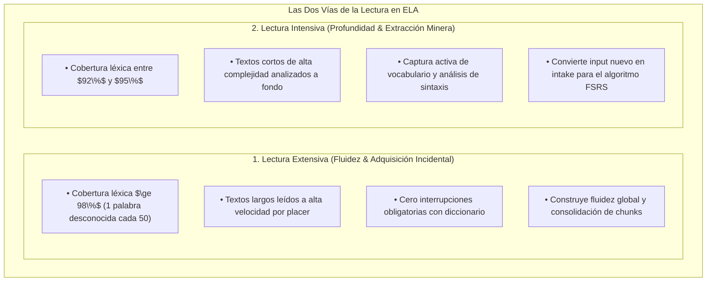
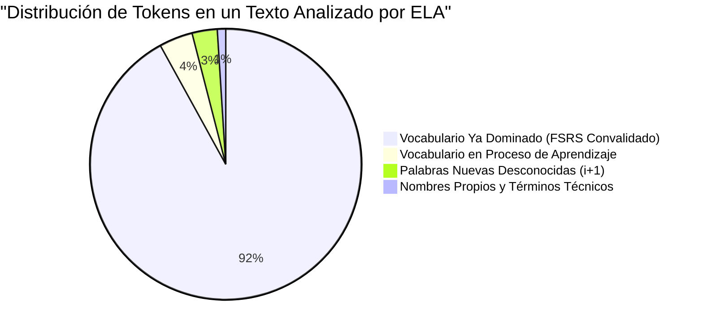
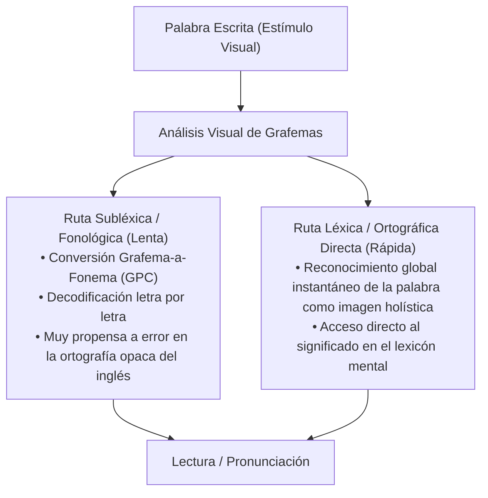
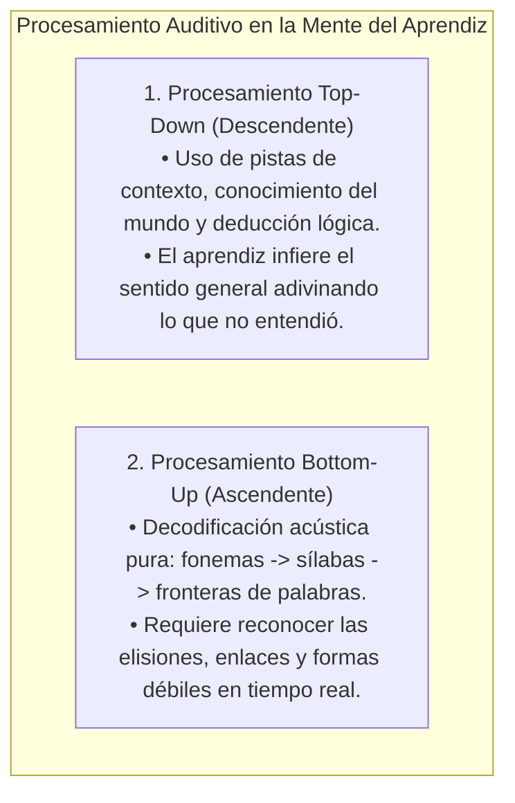
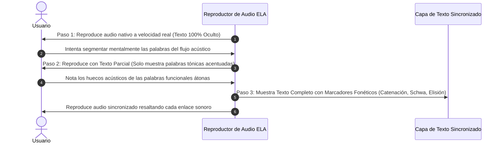

# Input Comprensible, Lectura Graduada y Psicolingüística de la Comprensión
## English Learning Assistant (ELA)

Este documento expone los fundamentos psicolingüísticos de la **Comprensión Lectora y Auditiva** en la adquisición de segundas lenguas. Establece la distinción entre **Lectura Extensiva vs. Intensiva**, el **Modelo de Doble Ruta de Lectura**, y los mecanismos de **Procesamiento Acústico Ascendente (*Bottom-Up*) vs. Descendente (*Top-Down*)** implementados en el *Smart Graded Reader* y el reproductor de audio de ELA.

---

## 1. Lectura Extensiva vs. Lectura Intensiva (Day & Bamford / Nation)

Para maximizar el crecimiento léxico y la automaticidad lectora, ELA combina dos modalidades complementarias:

---

## 2. El Perfilador Léxico Algorítmico del *Smart Graded Reader*

Cuando un estudiante carga un artículo, libro o ensayo en el *Smart Graded Reader*, el motor `ReaderEngine` de ELA ejecuta un análisis de frecuencia computacional basado en los corpus NGSL, AWL y el historial personal del estudiante:

### Clasificación y Acción Automática del Sistema:
- **Tasa de Comprensibilidad $\ge 98\%$:** Modo de "Lectura Fluida". Las palabras desconocidas se destacan sutilmente mediante un subrayado punteado casi imperceptible para no interrumpir el flujo visual.
- **Tasa entre $95\%$ y $97\%$:** Modo de "Lectura Guiada". Al tocar cualquier palabra desconocida, se despliega una tarjeta flotante no intrusiva con definición adaptada al nivel CEFR, audio IPA y botón de captura en 1 clic para FSRS.
- **Tasa $< 95\%$:** El sistema activa una advertencia de sobrecarga cognitiva y ofrece un botón de **"Simplificación Contextual Inteligente con Gemini"**, que reescribe el texto conservando la trama pero ajustando el léxico al umbral de $95\%$.

---

## 3. El Modelo de Doble Ruta de Lectura (Coltheart et al., 2001)

Max Coltheart formuló el **Modelo de Doble Ruta en Cascada (*Dual-Route Cascaded Model*)**, que explica cómo el cerebro adulto decodifica la palabra escrita:

### La Trampa del Hispanohablante:
El español es una lengua de ortografía fonética casi perfecta, por lo que los hispanohablantes están neurológicamente habituados a utilizar la **Ruta Subléxica (leer letra a letra pronunciando todo lo que ven)**. 
- Al aplicar esta estrategia al inglés, pronuncian letras mudas (*doubt, listen, knife*) y confunden la pronunciación de dígrafos como *ough* (*though, thought, through, rough*).
- **Entrenamiento en ELA:** ELA acelera el desarrollo de la **Ruta Léxica Directa** sincronizando el texto escrito con el audio nativo y resaltando visualmente la palabra completa al unísono con su sonido real.

---

## 4. Psicolingüística de la Comprensión Auditiva: Bottom-Up vs. Top-Down (Field & Vandergrift)

John Field (2008) y Larry Vandergrift (2012) analizaron por qué los estudiantes que leen bien en inglés sufren una parálisis casi total al escuchar a nativos hablar a velocidad normal:

### El Síntoma del Aprendiz Intermedio:
Muchos cursos recomiendan "adivinar por el contexto" (*Top-Down*). Field demostró que **los estudiantes intermedios ya abusan del Top-Down** para compensar su incapacidad acústica. El verdadero cuello de botella es el colapso del **procesamiento Bottom-Up**: al no reconocer las fronteras silábicas borradas por el *Connected Speech*, el oído no puede segmentar dónde termina una palabra y dónde empieza la siguiente.

---

## 5. El Protocolo de Decodificación Auditiva en Tres Pasos de ELA

Para subsanar el déficit *bottom-up*, el módulo de audio de ELA utiliza un protocolo de escucha escalonada:

Este protocolo transforma la comprensión auditiva de un acto pasivo de adivinanza en un **entrenamiento perceptivo riguroso**, obligando a la corteza auditiva a construir mapeos neuronales robustos entre la onda acústica real y el léxico mental.
