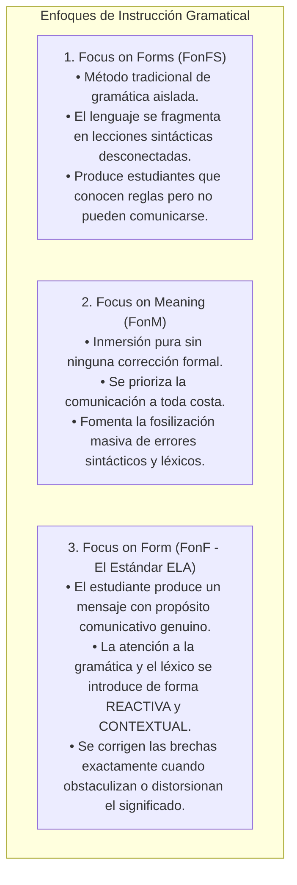
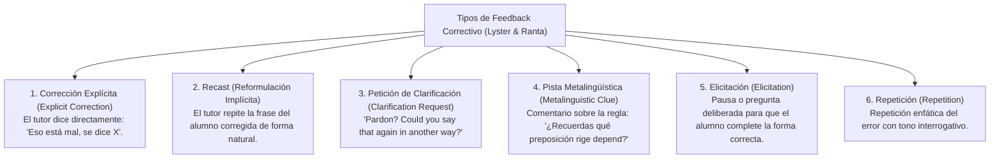
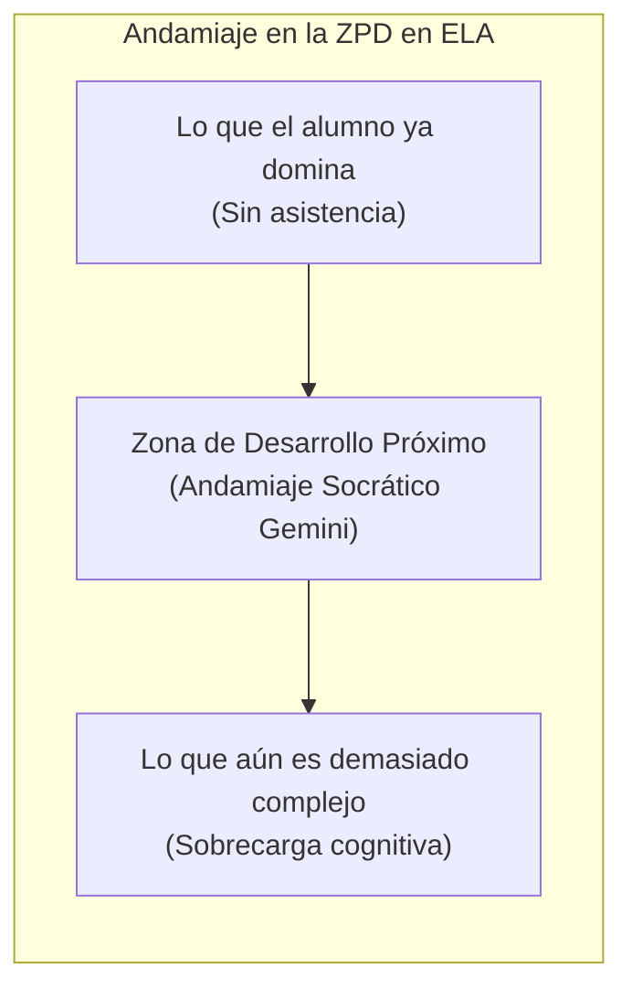
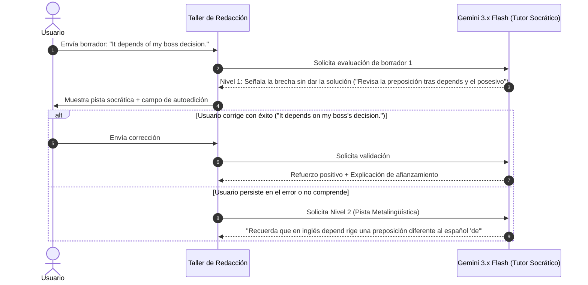

# Feedback Correctivo, Enfoque en la Forma (FonF) y Tutoría Socrática con IA
## English Learning Assistant (ELA)

Este documento define la metodología de **Feedback Correctivo (Corrective Feedback - CF)**, el principio de **Enfoque en la Forma (*Focus on Form - FonF*)** y el andamiaje socrático en la **Zona de Desarrollo Próximo (ZPD)**. Establece las directivas pedagógicas formales que gobiernan las llamadas al modelo de Inteligencia Artificial (Google Gemini) en los módulos de redacción y conversación.

---

## 1. La Distinción Fundamental: Focus on Form (FonF) vs. Focus on Forms (FonFS)

Michael Long (1991) y Rod Ellis (2001, 2016) delimitaron tres enfoques pedagógicos en la enseñanza de idiomas:

---

## 2. Taxonomía de Feedback Correctivo (Roy Lyster & Leila Ranta)

Roy Lyster y Leila Ranta (1997, 2010) catalogaron los tipos de feedback correctivo y evaluaron su impacto en la reestructuración del interlenguaje:

### 2.1. La Jerarquía del Rendimiento Cognitivo
- **El Defecto de la Corrección Explícita y el Recast Pasivo:** Entregar la respuesta correcta inmediatamente genera la **"Ilusión de Comprensión"**. El alumno asiente, lee el texto pulido y asume que ya lo aprendió, sin haber forzado a su cerebro a buscar en sus propios almacenes de memoria.
- **La Superioridad del Andamiaje Elicitador (*Prompts & Elicitation*):** Las investigaciones demuestran que las pistas metalingüísticas y la elicitación generan las tasas más altas de **Reparación Autónoma (*Learner Repair*)**, produciendo una reestructuración sináptica sustancialmente más duradera.

---

## 3. Andamiaje en la Zona de Desarrollo Próximo (Lev Vygotsky & Jerome Bruner)

Lev Vygotsky formuló el concepto de **Zona de Desarrollo Próximo (ZPD)**: la distancia entre lo que el estudiante puede lograr de forma totalmente autónoma y lo que puede lograr con la guía o andamiaje (*scaffolding*) de un tutor más competente.

### El Principio de Máxima Economía de Asistencia:
El tutor de IA nunca debe proporcionar más ayuda de la estrictamente necesaria para que el estudiante dé el siguiente paso. La ayuda se modula de menor a mayor intervención.

---

## 4. El Protocolo Socrático de 4 Niveles para Google Gemini en ELA

Cuando un usuario comete un error en el Taller de Redacción o en los desafíos de conversación, la API de Gemini ejecuta un protocolo de **Feedback Escalonado en 4 Niveles**:

### Especificación Formal de los 4 Niveles de Andamiaje:

#### Nivel 1: Elicitación Socrática Focalizada
- **Objetivo:** Estimular el *Noticing the Gap* con la mínima intervención posible.
- **Acción de la IA:** Resalta la palabra u oración errónea y formula una pregunta orientadora.
- **Prompt Directive:** *"No proporciones la respuesta correcta bajo ninguna circunstancia. Señala amablemente la ubicación de la anomalía e invita al usuario a reconsiderar la forma gramatical o léxica."*

#### Nivel 2: Pista Metalingüística y Contraste L1
- **Objetivo:** Activar el conocimiento explícito si el usuario no logró corregirse en el Nivel 1.
- **Acción de la IA:** Explica el principio lingüístico o advierte sobre una interferencia típica del español.
- **Ejemplo:** *"En español decimos 'depende de', pero en inglés este verbo rige obligatoriamente la preposición ON. Intenta reescribirlo."*

#### Nivel 3: Plantilla con Hueco (*Cloze Prompt*)
- **Objetivo:** Reducir la carga de búsqueda en la memoria de trabajo si el estudiante sigue bloqueado.
- **Acción de la IA:** Provee el esqueleto de la frase dejando exclusivamente el hueco del error.
- **Ejemplo:** *"Completa la frase: It depends ___ my boss's decision."*

#### Nivel 4: Modelado Explícito y Reformulación Nativa
- **Objetivo:** Cerrar el ciclo pedagógico si el usuario no pudo resolverlo en los niveles anteriores.
- **Acción de la IA:** Entrega la versión nativa pulida, un desglose comparativo (*diff*) y añade automáticamente la regla a la cola de estudio FSRS.

---

## 5. Parámetros Psicológicos de la Interacción con la IA

Para mantener bajo el **Filtro Afectivo (Krashen)** y proteger la motivación del alumno:
1. **Tono Empático y Constructor:** La IA nunca utiliza lenguaje punitivo (*"Incorrecto"*, *"Mal"*). Utiliza encabezados constructivos: *"Buena intención comunicativa; ajustemos este matiz para que suene 100% natural"*.
2. **Validación Pragmática Previa:** Antes de señalar un desvío gramatical, la IA valida si el mensaje cumplió su objetivo comunicativo (*"Tu mensaje se entiende con claridad; ahora perfeccionemos la concordancia"*).
3. **Límite de Correcciones Simultáneas:** La IA jamás abruma al usuario señalando 15 errores a la vez. Prioriza un **máximo de 2 o 3 errores críticos por borrador** (los que tienen mayor impacto en el significado o causan mayor interferencia).
