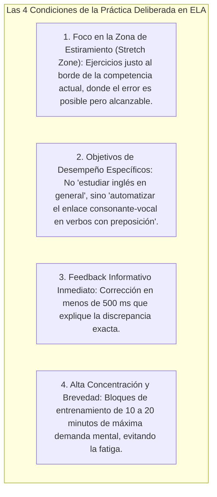
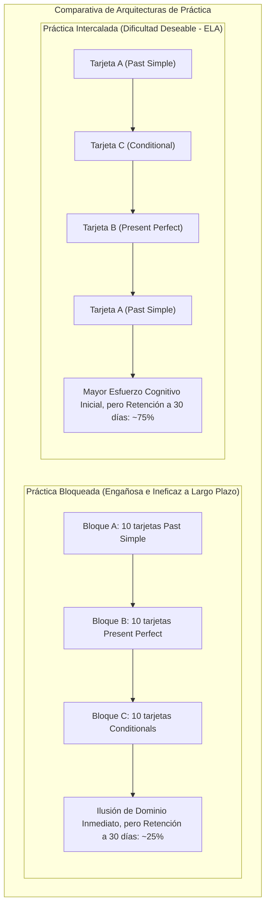
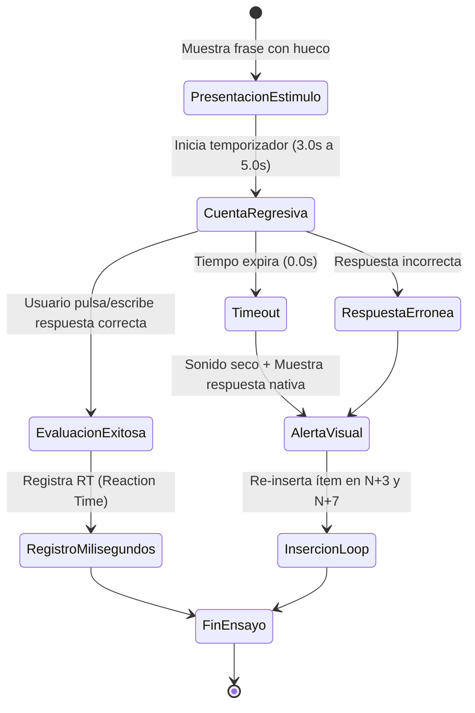

# Práctica Deliberada, Práctica Intercalada (Interleaving) y Drills de Velocidad
## English Learning Assistant (ELA)

Este documento detalla los protocolos de entrenamiento basados en la **Práctica Deliberada (K. Anders Ericsson)**, el efecto de **Práctica Intercalada (*Interleaving Practice*, Rohrer & Taylor)** y las especificaciones algorítmicas de los **Drills de Velocidad (*Speed Drills*)** de ELA.

---

## 1. El Principio de la Práctica Deliberada (K. Anders Ericsson)

La creencia popular de que "la práctica hace al maestro" es incompleta. La repetición pasiva y monótona de lo que uno ya sabe no produce mejoras en el cerebro adulto; solo afianza hábitos mediocres.

K. Anders Ericsson (1993, 2016) demostró que el rendimiento experto se alcanza exclusivamente a través de la **Práctica Deliberada (*Deliberate Practice*)**, caracterizada por cuatro condiciones estrictas:

---

## 2. Práctica Intercalada (*Interleaving*) vs. Práctica Bloqueada (*Blocking*)

Uno de los mayores defectos de los libros de texto y las aplicaciones comerciales de idiomas es el uso de la **Práctica Bloqueada (*Blocked Practice*)**: estudiar 30 frases consecutivas del *Present Perfect*, luego 30 frases del *Past Simple*, y luego 30 frases del *First Conditional*.

### 2.1. El Beneficio de la Discriminación Categorial (Rohrer & Taylor, 2007)
En la práctica bloqueada, el estudiante sabe de antemano qué regla aplicar (porque todas las preguntas son iguales), eludiendo el paso más difícil de una conversación real: **discriminar qué estructura gramatical o colocación es la adecuada para la situación**.

La práctica intercalada introduce **Interferencia Contextual (*Contextual Interference*)**:
- Obliga al cerebro a recargar el esquema mental en cada ejercicio.
- Entrena al sistema motor a seleccionar activamente la estrategia correcta entre múltiples alternativas competidoras.

### 2.2. Algoritmo de Desagrupación Semántica en ELA
El programador de repasos de ELA prohíbe que dos tarjetas de la misma categoría gramatical (p. ej. dos phrasal verbs con la misma partícula *look after* y *look for*) aparezcan consecutivamente en la cola de estudio, barajando activamente los campos léxicos.

---

## 3. Especificación Técnica de los Drills de Velocidad (`SpeedEngine`)

Los Drills de Velocidad tienen como única finalidad **transferir el conocimiento de la memoria declarativa a la memoria procedural** mediante la imposición de una ventana temporal estricta que inhabilita el traductor consciente.

---

## 4. Las Cuatro Modalidades de Drills en ELA

### Modalidad 1: Transformación Rápida de Cláusulas (Rapid Clause Shift)
- **Objetivo:** Automatizar la mecánica de los verbos auxiliares y las negaciones sin titubear.
- **Mecánica:** Se muestra una afirmación y un operador de cambio:
  - Estímulo: *"They went to the party last night."* + Operador: `[NEGATIVE ?]`
  - Ventana: 3.5 segundos.
  - Respuesta requerida: *"They didn't go to the party last night."*

### Modalidad 2: Sustitución de Sujetos para Erradicación de la 3ra Persona Singular
- **Objetivo:** Forzar la activación automática de la terminación *-s / -es* y auxiliares *does / has*.
- **Mecánica:** Se presenta una oración y un nuevo sujeto en pantalla:
  - Estímulo: *"I usually finish work at six."* + Nuevo Sujeto: `[HE]`
  - Ventana: 2.5 segundos.
  - Respuesta requerida: *"He usually finishes work at six."*

### Modalidad 3: Reflejo de Preposiciones Dependientes (Preposition Reflex)
- **Objetivo:** Neutralizar la interferencia L1 del español (*depend of, interested for*).
- **Mecánica:** Una oración incompleta con límite de 2.0 segundos:
  - Estímulo: *"This decision will have a huge impact ___ our budget."*
  - Opciones de teclado directo: `[ ON ]` `[ IN ]` `[ AT ]`
  - Respuesta requerida: `[ ON ]`.

### Modalidad 4: Discriminación de Pares Mínimos a Ciegas (Auditory Snap)
- **Objetivo:** Reentrenar el filtro perceptual auditivo bajo el protocolo HVPT.
- **Mecánica:** Se reproduce un audio nativo a ciegas (voz aleatoria masculina/femenina):
  - Audio: `[ʃɪp]`
  - Pantalla: Dos botones de alta visibilidad: `[ SHIP ]` vs `[ SHEEP ]`.
  - Ventana de respuesta: 2.0 segundos exactos.

---

## 5. El Bucle de Micro-Recuperación de Errores (Error Recovery Loop)

Cuando el usuario falla un ejercicio en un drill de velocidad (ya sea por error sintáctico o por agotamiento del tiempo):
1. **Feedback Inmediato de 1 Segundo:** La pantalla muestra la solución nativa resaltada en verde, suprimiendo la explicación teórica larga (para no romper el flujo motor).
2. **Re-inyección en $N+3$:** El mismo estímulo vuelve a presentarse tres ejercicios después, obligando a una recuperación casi inmediata en caliente.
3. **Re-inyección en $N+7$:** Si acierta en $N+3$, se vuelve a presentar tras 7 ejercicios con una variación de contexto ligero.
4. **Persistencia en el Heatmap:** El fallo se anota en la tabla `error_heatmap` como una debilidad activa que alimentará las sesiones del día siguiente.
