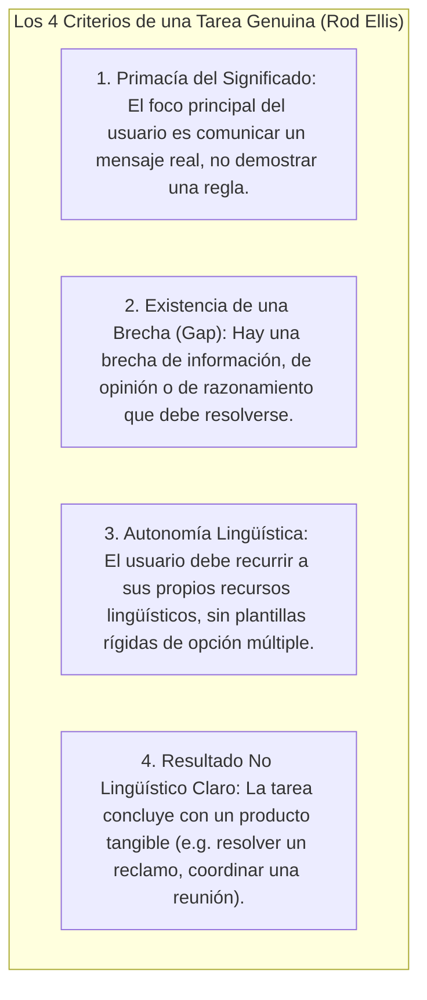
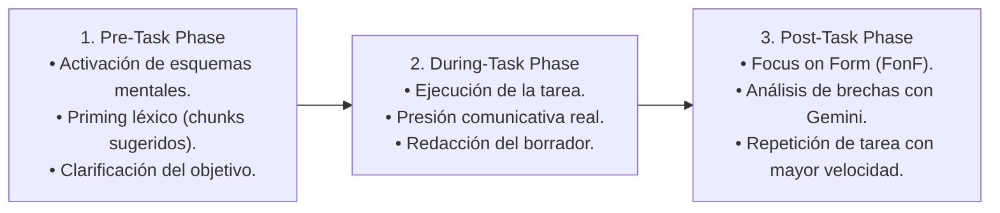
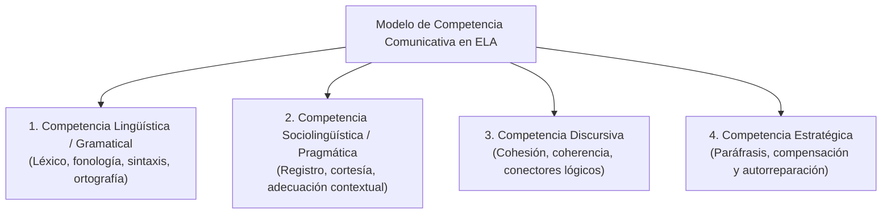

# Enfoque Basado en Tareas (TBLT) y Competencia Comunicativa
## English Learning Assistant (ELA)

Este documento define la metodología de **Enseñanza de Lenguas Basada en Tareas (Task-Based Language Teaching - TBLT)** y el desarrollo integral de las cuatro dimensiones de la **Competencia Comunicativa** en ELA. Proporciona el marco pedagógico para el diseño de los retos diarios (*Daily Quests*) y los talleres de redacción guiada con Google Gemini.

---

## 1. La Definición Rigurosa de "Tarea" frente a "Ejercicio" (Rod Ellis)

En la pedagogía tradicional, los estudiantes suelen resolver "ejercicios" (rellenar un hueco con un verbo en pasado, transformar una frase en pasiva). Rod Ellis (2003, 2018) demostró que los ejercicios artificiales no preparan para la comunicación real porque carecen de propósito pragmático.

Una **Tarea (*Task*)** en ELA cumple obligatoriamente con cuatro criterios científicos:

---

## 2. El Ciclo de Instrucción TBLT de Tres Fases (Peter Skehan & Rod Ellis)

Para equilibrar la fluidez comunicativa con la precisión sintáctica, las misiones de redacción e interacción en ELA siguen el ciclo clásico de 3 etapas:

### 2.1. Fase 1: Pre-Task (Activación y Preparación)
- El sistema contextualiza la situación de la vida real (p. ej. *"Debes redactar un correo formal a un cliente notificando un retraso en la entrega y proponiendo una compensación"*).
- Se suministran entre 3 y 4 **unidades fraseológicas (*chunks*) de andamiaje** opcionales para cebar la memoria de trabajo (*lexical priming*), sin imponer una estructura rígida.

### 2.2. Fase 2: During-Task (Ciclo de Ejecución)
- El estudiante redacta activamente su respuesta en el taller de redacción.
- **Presión Cognitiva Realista:** El sistema incentiva completar la tarea en una ventana de tiempo razonable para simular el ritmo del entorno profesional.

### 2.3. Fase 3: Post-Task (Enfoque en la Forma y Reflexión)
- La IA evalúa la tarea y abre la sesión de **Focus on Form (FonF)**:
  - Destaca los aciertos pragmáticos de la comunicación.
  - Señala socráticamente las discrepancias de interlenguaje.
  - Guarda automáticamente los nuevos giros y colocaciones descubiertos en la cola de estudio FSRS.

---

## 3. Las Cuatro Dimensiones de la Competencia Comunicativa (Canale & Swain / Bachman)

Aprender una lengua no es solo dominar su gramática. ELA entrena y evalúa las cuatro competencias interdependientes establecidas por Canale & Swain (1980) y Lyle Bachman (1990):

### 3.1. Competencia Lingüística (Gramatical)
El conocimiento de las reglas formales del código: pronunciación exacta (IPA), vocabulario contextualizado, concordancia morfológica y orden canónico de palabras.

### 3.2. Competencia Sociolingüística y Pragmática
La capacidad de producir enunciados apropiados al contexto social y a la relación jerárquica con el interlocutor:
- **Modulación del Registro:** Diferenciar entre la informalidad de un chat (*"Hey, what's up?"*) y el tono diplomático corporativo (*"I would appreciate it if you could confirm..."*).
- **Directness vs. Indirectness:** En la cultura anglosajona, las órdenes directas se perciben como agresivas o groseras. ELA entrena el uso de *hedging* y peticiones indirectas (*"Could you possibly look into this?"* en lugar de *"Look into this"*).

### 3.3. Competencia Discursiva
La habilidad de combinar formas gramaticales y significados para construir textos orales o escritos coherentes:
- Uso preciso de marcadores del discurso (*However, Furthermore, Consequently, In spite of*).
- Mantenimiento de la referencia anafórica y catafórica mediante pronombres y sustitución léxica para evitar redundancias monótonas.

### 3.4. Competencia Estratégica
Las estrategias de comunicación que emplea el hablante cuando se enfrenta a un bloqueo o vacíos en su interlenguaje:
- **Circunlocución y Paráfrasis:** Si el usuario olvida la palabra *"corkscrew"* (sacacorchos), debe ser capaz de describirla fluidamente: *"the tool you use to open a wine bottle"*.
- **Petición de Clarificación:** Interrumpir cortésmente para negociar el significado en tiempo real.

---

## 4. Tipología de Tareas en ELA (Módulos de Micro-Writing y Daily Quests)

| Nivel CEFR | Tipo de Tarea TBLT | Escenario Pragmático en ELA | Competencia Primaria |
| :--- | :--- | :--- | :--- |
| **A2** | Intercambio de Información Básica | Confirmar una reserva de hotel o pedir indicaciones en una estación. | Lingüística y Estratégica. |
| **B1** | Resolución de Problemas Cotidianos | Escribir un correo solicitando el reembolso de un producto defectuoso. | Pragmática y Discursiva. |
| **B2** | Negociación y Argumentación | Justificar ante el equipo técnico por qué adoptar una arquitectura de software frente a otra. | Discursiva y Sociolingüística. |
| **C1** | Persuasión y Matiz Diplomático | Responder a un cliente enfadado rechazando su solicitud sin perder la relación comercial. | Pragmática Avanzada (Hedging). |
