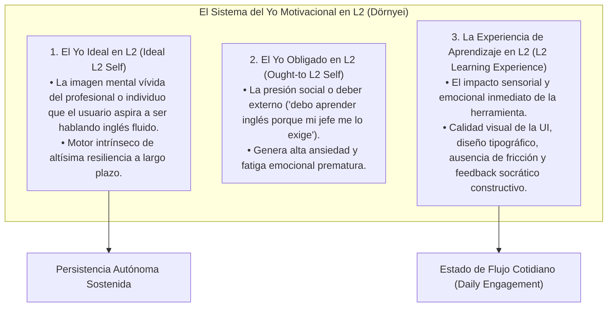
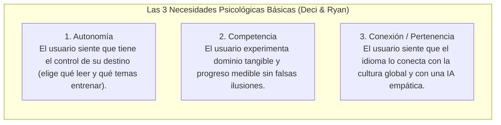
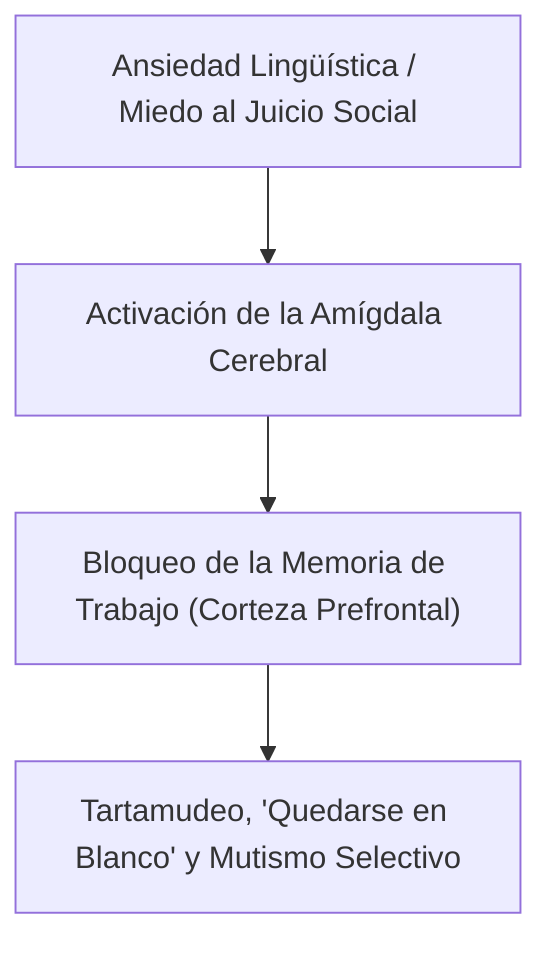

# Filtro Afectivo, Motivación en L2 y Psicología de la Autodeterminación
## English Learning Assistant (ELA)

Este documento expone los fundamentos de la **Psicología Afectiva y Motivacional** en el aprendizaje de lenguas. Integra el **Sistema del Yo Motivacional en L2 (*L2 Motivational Self System*)** de Zoltán Dörnyei, la **Teoría de la Autodeterminación (SDT)** de Deci y Ryan, y los protocolos de mitigación de la **Ansiedad Lingüística Extranjera (*Foreign Language Anxiety*)** de Elaine Horwitz en la interfaz y la Inteligencia Artificial de ELA.

---

## 1. El Sistema del Yo Motivacional en L2 (Zoltán Dörnyei)

Zoltán Dörnyei (2005, 2009) revolucionó la investigación de la motivación en segundas lenguas al demostrar que el motor de persistencia más poderoso no son los "premios externos", sino la **reconfiguración de la identidad del aprendiz**:

### Directiva de Diseño en ELA:
El software no apela al "Yo Obligado" mediante notificaciones culpabilizadoras (*"¡Has descuidado tu lección, tu racha morirá!"*). En su lugar, alimenta el **Yo Ideal en L2** conectando cada sesión de redacción y habla con escenarios profesionales, creativos e intelectuales auténticos.

---

## 2. Teoría de la Autodeterminación (Deci & Ryan) y la Trampa de la Gamificación Tóxica

Edward Deci y Richard Ryan (2000, 2017) formularon la **Teoría de la Autodeterminación (Self-Determination Theory - SDT)**, demostrando que la motivación intrínseca sostenida depende de la satisfacción de tres necesidades psicológicas básicas:

### El Efecto de Sobrejustificación (*Overjustification Effect*):
Las aplicaciones comerciales de idiomas llenan la pantalla de monedas ficticias, ligas competitivas semanales, gemas y fuegos artificiales. La psicología cognitiva ha demostrado que recompensar extrínsecamente una actividad intrínsecamente noble destruye el interés genuino:
- Cuando la app retira o devalúa las gemas, el usuario abandona el estudio porque su cerebro fue condicionado a "jugar por puntos", no a "adquirir una lengua".
- **La Filosofía de ELA:** Gamificación sobria y madura (*Editorial Tech*). La recompensa es el **dominio tangible del inglés**: ver cómo disminuyen los tiempos de reacción en los drils, cómo se expande la cobertura léxica en el lector y cómo se eliminan los errores del mapa de calor.

---

## 3. Ansiedad Lingüística Extranjera (Elaine Horwitz - Escala FLCAS)

Elaine Horwitz (1986, 2010) demostró que el mayor bloqueador del aprendizaje en adultos no es cognitivo, sino emocional: la **Ansiedad ante la Lengua Extranjera (*Foreign Language Anxiety - FLA*)**.

Los adultos temen parecer incompetentes, infantiles o tontos frente a otros al expresarse en una lengua que no dominan. Esta ansiedad activa la amígdala cerebral, secuestrando los recursos de la corteza prefrontal y elevando el **Filtro Afectivo (Krashen)** al máximo.

---

## 4. Mitigaciones Arquitectónicas en la UI/UX y la IA de ELA

ELA está diseñado como un **entorno seguro y libre de juicio social** para reconstruir la autoconfianza del aprendiz:

1. **La IA como Interlocutor Libre de Juicio:** Google Gemini actúa como un tutor socrático infinitamente paciente que jamás emite valoraciones personales o juicios condescendientes. El usuario puede equivocarse 50 veces seguidas sin ninguna vergüenza social.
2. **Eliminación del Lenguaje Punitivo en la UI:**
   - Cero cruces rojas gigantes $\times$ acompañadas de sonidos estridentes de zumbador o fallo.
   - Los errores se presentan como **"Oportunidades de Ajuste Fonético/Sintáctico"**, acompañados de explicaciones contrastivas respetuosas en español.
3. **Control Total del Ritmo:** En las sesiones de lectura y redacción, no existen temporizadores obligatorios de cuenta regresiva (los temporizadores se reservan exclusivamente para los *Speed Drills* donde el usuario decide voluntariamente ingresar a la modalidad deportiva de proceduralización).
4. **Respeto a la Privacidad:** Toda la base de datos de errores, historial de repasos y textos redactados se almacena localmente en SQLite, garantizando al estudiante que su proceso de aprendizaje es 100% privado y confidencial.
