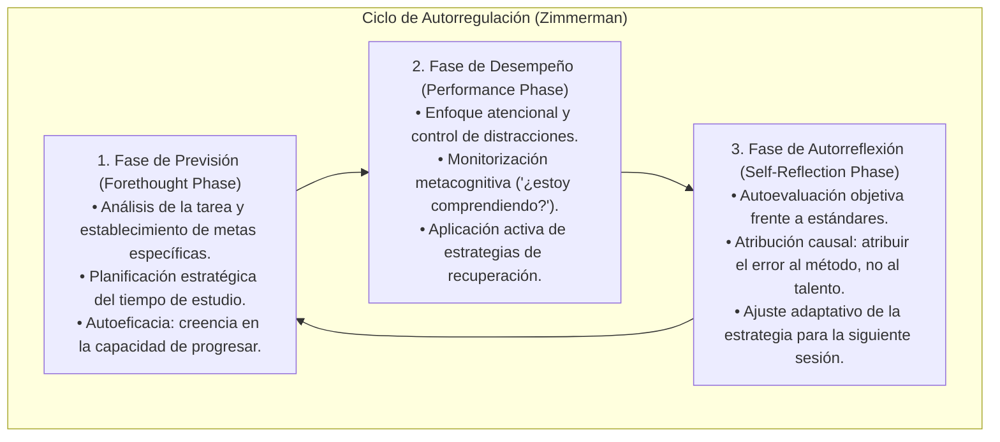
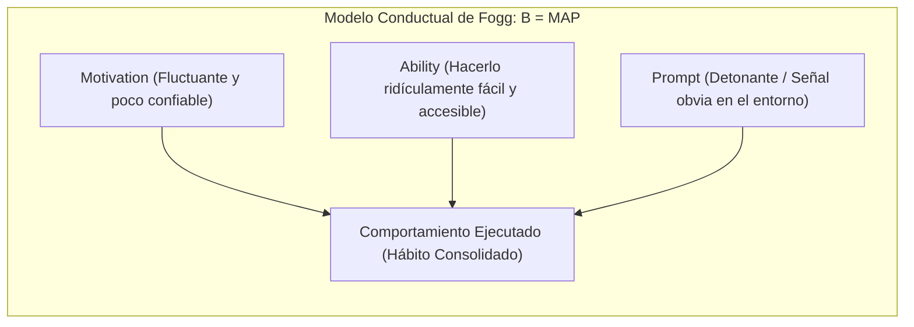
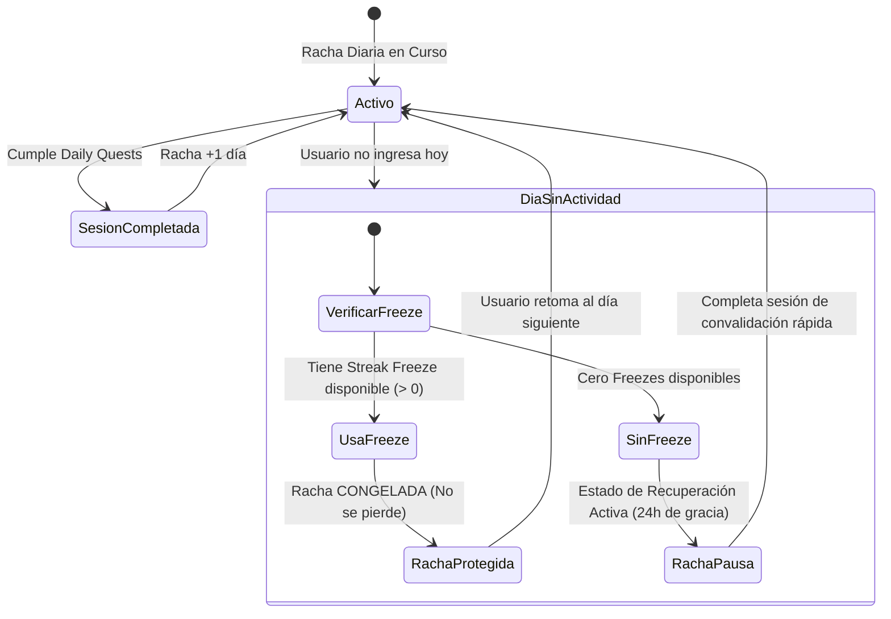

# Aprendizaje Autorregulado (SRL), Neurociencia de Hábitos y Resiliencia
## English Learning Assistant (ELA)

Este documento detalla los fundamentos de la **Psicología Cognitiva de la Autorregulación (Self-Regulated Learning - SRL)** de Barry Zimmerman, los modelos de formación de hábitos de James Clear y BJ Fogg, y la ingeniería de **hábitos antifrágiles** implementada en el Dashboard y la máquina de estados de rachas de ELA.

---

## 1. El Ciclo Tripartito del Aprendizaje Autorregulado (Barry Zimmerman)

El éxito a largo plazo en el dominio de una segunda lengua en adultos no depende de una "fuerza de voluntad sobrehumana", sino de la capacidad metacognitiva de autorregular el propio proceso de estudio.

Barry Zimmerman (2000, 2008) demostró que los estudiantes de alto rendimiento operan mediante un ciclo recursivo de 3 fases:

### Implementación en la Experiencia de Usuario de ELA:
1. **Previsión (Dashboard Matutino):** Al abrir la aplicación, el usuario no encuentra un menú confuso: visualiza inmediatamente las **"3 Misiones Clave del Día" (*Daily Quests*)** calculadas según su retención real, con estimación exacta de tiempo (p. ej. *"15 minutos para completar"*).
2. **Desempeño (Modo Foco):** Las sesiones de repaso FSRS y Drills eliminan todo banner, contador social o distracción, maximizando la inmersión.
3. **Autorreflexión (Heatmap de Debilidades):** Al finalizar la sesión, ELA no muestra una puntuación abstracta; muestra un informe visual claro de qué patrones fonéticos o sintácticos mejoraron hoy y cuáles requieren ajuste.

---

## 2. Arquitectura de Formación de Hábitos: Clear & Fogg

La adquisición de una lengua exige constancia acumulativa: **15 minutos diarios durante 365 días producen una reestructuración neural infinitamente más sólida que 3 horas seguidas una vez al mes**.

ELA implementa el modelo conductual de BJ Fogg ($B = MAP$) y las cuatro leyes de James Clear (*Atomic Habits*):

### Las Cuatro Leyes del Hábito Aplicadas en ELA:
1. **Hacerlo Obvio (*Cue*):** Notificaciones contextuales vinculadas a rutinas preexistentes (*Habit Stacking*: *"Justo después de mi café matutino, abro mis 5 tarjetas de ELA"*).
2. **Hacerlo Fácil (*Ability*):** Cero fricción de arranque. El software carga en menos de 500 ms y la primera tarjeta de repaso se presenta inmediatamente en el centro de la pantalla.
3. **Hacerlo Atractivo (*Craving*):** Visualización del mapa de calor (*Heatmap*) en verde degradado, transformando el progreso intangible del idioma en un artefacto visual que produce dopamina constructiva.
4. **Hacerlo Satisfactorio (*Reward*):** Micro-celebraciones sensoriales breves al concluir las misiones diarias, sin infantilizar la experiencia.

---

## 3. Neutralización del Efecto "What-the-Hell" y Rachas Antifrágiles

### 3.1. El Fenómeno Psicológico del *"What-the-Hell Effect"*
Cochran y Tesser (1996) identificaron una patología cognitiva universal en los sistemas de metas:
- Un usuario mantiene una racha de 25 días seguidos estudiando.
- El día 26, por una emergencia laboral o fatiga, no puede abrir la aplicación.
- Al día siguiente, la app le comunica que "ha perdido su racha y vuelve a día 0".
- **Consecuencia Emocional:** El usuario experimenta una sensación desmedida de fracaso, culpa y desánimo (*"¿Qué más da? Ya lo arruiné todo"*) y abandona la aplicación de manera definitiva en el 70% de los casos.

### 3.2. La Ingeniería Antifrágil de ELA: Congeladores de Racha y Recuperación Dinámica

### Reglas de Diseño Antifrágil en ELA:
1. **El Principio de "Nunca Falles Dos Veces" (*Never Miss Twice*):** Fallar un día es un accidente inevitable de la vida; fallar dos días seguidos es el inicio de un nuevo hábito destructivo. ELA protege el primer fallo mediante **Congeladores de Racha (*Streak Freezes*)** otorgados por constancia previa.
2. **Prevención del "Infierno de Repasos" (*Review Hell Overload*):**
   - En sistemas tradicionales como Anki, si el alumno no estudia durante 10 días, el software le acumula 400 tarjetas pendientes de golpe, provocando pánico y abandono.
   - En ELA, el algoritmo `FSRSEngine` activa la **Carga Máxima de Recuperación (*Backlog Throttling*)**: limita los repasos diarios a un tope manejable (p. ej. 25-30 tarjetas prioritarias) y redistribuye suavemente el resto de las tarjetas atrasadas a lo largo de los siguientes 7 días.
