# Marco Pedagógico y Fundamentos Científicos de Aprendizaje (Pedagogical Framework)
## English Learning Assistant (ELA)

El propósito del **English Learning Assistant (ELA)** es convertirse en el software asistido por Inteligencia Artificial más riguroso, eficaz y científicamente fundamentado del mundo para la adquisición del inglés como segunda lengua en adultos (con especialización en hablantes nativos de español).

A diferencia de las aplicaciones comerciales basadas en gamificación superficial (puntos cosméticos, emparejamiento pasivo de palabras sueltas o traducción descontextualizada), ELA se sustenta estrictamente en la convergencia de seis disciplinas científicas:
1. **Adquisición de Segundas Lenguas (Second Language Acquisition - SLA)**
2. **Psicología Cognitiva de la Memoria y Recuperación (Cognitive Psychology of Memory)**
3. **Neurobiología del Lenguaje y Adquisición de Habilidades (Cognitive Skill Acquisition & ACT-R)**
4. **Fonética Acústica, Articulataria y Percepción del Habla (Acoustic Phonetics & Speech Perception)**
5. **Lingüística de Corpus y el Enfoque Léxico (Corpus Linguistics & Lexical Approach)**
6. **Diseño Instruccional Basado en Tareas y Autorregulación (TBLT & Self-Regulated Learning)**

---

## 🗺️ Mapa de Navegación del Marco Pedagógico

El marco pedagógico se organiza en 6 submódulos temáticos de alta densidad científica y aplicabilidad técnica:

```mermaid
graph TD
    Root["Marco Pedagógico ELA"] --> S1["01. Fundamentos Científicos<br/>(SLA & Neurociencia)"]
    Root --> S2["02. Marco Léxico & Semántica<br/>(Corpus & Chunking)"]
    Root --> S3["03. Fonética & Habla Conectada<br/>(Percepción & Prosodia)"]
    Root --> S4["04. Transferencia L1 Español<br/>(Interferencia Contrastiva)"]
    Root --> S5["05. Metodología de Instrucción<br/>(TBLT, Drills & Feedback Socrático)"]
    Root --> S6["06. Psicología & Autorregulación<br/>(Hábitos & Filtro Afectivo)"]

    S1 --> M1["Hipótesis SLA (Krashen, Schmidt, Swain, Long)"]
    S1 --> M2["Memoria & FSRS (Bjork, Roediger, DSR)"]
    S1 --> M3["Carga Cognitiva & Multimedia (Sweller, Paivio)"]
    S1 --> M4["Adquisición de Habilidades (DeKeyser, ACT-R, Ullman)"]

    S2 --> L1["The Lexical Approach (Lewis, Collocations, Phrasals)"]
    S2 --> L2["Amplitud & Profundidad Léxica (Nation, CEFR, NGSL)"]
    S2 --> L3["Thinking for Speaking & Polisemia (Slobin, Satélites)"]

    S3 --> P1["Percepción Auditiva & HVPT (Kuhl, Flege, Best)"]
    S3 --> P2["Mecánica Articulataria & IPA Contrastivo"]
    S3 --> P3["Habla Conectada (Elisión, Asimilación, Linking, Schwa)"]
    S3 --> P4["Suprasegmentales (Acento Nuclear, Entonación, Ritmo)"]

    S4 --> T1["Interferencia Fonológica L1 (Pares Mínimos, Prótesis)"]
    S4 --> T2["Interferencia Morfosintáctica (TAM, Pro-Drop, Preposiciones)"]
    S4 --> T3["Falsos Amigos & Colocaciones Contrastivas"]

    S5 --> I1["Task-Based Language Teaching (Ellis, Skehan, Long)"]
    S5 --> I2["Práctica Deliberada & Drills de Velocidad (Ericsson, Interleaving)"]
    S5 --> I3["Feedback Correctivo & Tutoría Socrática IA (Lyster, Vygotsky)"]
    S5 --> I4["Input Comprensible & Lectura Graduada (Nation 95/98%)"]

    S6 --> R1["Autorregulación & Formación de Hábitos (Zimmerman, Clear, Fogg)"]
    S6 --> R2["Filtro Afectivo & Motivación L2 (Dörnyei, Deci & Ryan, Horwitz)"]
```

---

## 📚 Estructura Detallada de Módulos y Documentos

### [`01_scientific_foundations/`](./01_scientific_foundations/) - Fundamentos Científicos y Neurociencia
Establece las bases biológicas y cognitivas sobre cómo el cerebro humano codifica, consolida, automatiza y recupera una segunda lengua:
- [`sla_core_hypotheses.md`](./01_scientific_foundations/sla_core_hypotheses.md): Tríada de Adquisición: *Comprehensible Input* ($i+1$, Krashen), *Noticing Hypothesis* (Schmidt), *Comprehensible Output* (Swain) y la *Hipótesis de Interacción* y Negociación de Significado (Long).
- [`memory_and_retrieval_science.md`](./01_scientific_foundations/memory_and_retrieval_science.md): Dinámica de Memoria: Fuerza de Almacenamiento vs Recuperación y Dificultades Deseables (Bjork), el Efecto de Evaluación (*Testing Effect*, Roediger & Karpicke), el Efecto de Hipercorrección (Metcalfe) y el modelo matemático DSR de FSRS.
- [`cognitive_load_and_multimedia.md`](./01_scientific_foundations/cognitive_load_and_multimedia.md): Teoría de la Carga Cognitiva (Sweller: intrínseca, extrínseca, germana), Teoría de la Codificación Dual (Paivio), Principios de Aprendizaje Multimedia (Mayer) y el Efecto de Inversión de la Experiencia (*Expertise Reversal Effect*).
- [`skill_acquisition_and_automaticity.md`](./01_scientific_foundations/skill_acquisition_and_automaticity.md): Teoría de Adquisición de Habilidades Cognitivas (DeKeyser), arquitectura ACT-R (Anderson: etapas declarativa, procedural y autónoma), Ley de Potencia de la Práctica y el Modelo Declarativo/Procedural de Michael Ullman.

### [`02_lexical_and_semantic_framework/`](./02_lexical_and_semantic_framework/) - Marco Léxico y Semántica
Supera el paradigma obsoleto de listas de vocabulario estático mediante la lingüística de corpus:
- [`lexical_approach_and_chunking.md`](./02_lexical_and_semantic_framework/lexical_approach_and_chunking.md): El Enfoque Léxico de Michael Lewis. Taxonomía de *Chunks*: Colocaciones léxicas, modismos (*idioms*), clasificación sintáctica de 4 tipos de *phrasal verbs* y marcos oracionales (*gambits*).
- [`vocabulary_breadth_and_depth.md`](./02_lexical_and_semantic_framework/vocabulary_breadth_and_depth.md): Amplitud vs Profundidad léxica (Nation & Schmitt). Listas de frecuencia de corpus (NGSL, COCA, CEFR-J), familias morfológicas y vocabulario receptivo vs productivo.
- [`conceptual_framing_and_polysemy.md`](./02_lexical_and_semantic_framework/conceptual_framing_and_polysemy.md): Pensamiento para Hablar (*Thinking for Speaking*, Dan Slobin): Tipología de marco satelital (inglés) vs marco verbal (español). Desmitificación de verbos polisémicos y esquemas espaciales de preposiciones (Lakoff & Johnson).

### [`03_phonetics_and_phonology/`](./03_phonetics_and_phonology/) - Fonética, Percepción y Habla Natural
Aborda la causa raíz del bloqueo auditivo y la producción no inteligible:
- [`speech_perception_and_hvpt.md`](./03_phonetics_and_phonology/speech_perception_and_hvpt.md): Modelos perceptivos fonológicos: *Native Language Magnet* (Kuhl), *Speech Learning Model* (SLM-r, Flege), *Perceptual Assimilation Model* (PAM-L2, Best) y Entrenamiento Auditivo de Alta Variabilidad (HVPT: múltiples voces nativas).
- [`articulatory_mechanics_and_ipa.md`](./03_phonetics_and_phonology/articulatory_mechanics_and_ipa.md): Fisiología articulatoria y mapa IPA comparado: Cuadriláteros vocálicos (vocales tensas vs laxas), fricativas dentales (/θ, ð/), labiodental /v/, sibilantes palatales, 'l' oscura ([ɫ]) y Voice Onset Time (VOT / aspiración de /p, t, k/).
- [`connected_speech_mechanisms.md`](./03_phonetics_and_phonology/connected_speech_mechanisms.md): Fenómenos del habla rápida: Elisión consonántica y síncopa vocálica, Asimilación regresiva y coalescente (Yod-coalescence), Enlace (catenación, glides intrusivos /j, w/ y linking/intrusive 'r'), geminación y reducción masiva al Schwa (/ə/).
- [`suprasegmentals_prosody_intonation.md`](./03_phonetics_and_phonology/suprasegmentals_prosody_intonation.md): Prosodia avanzada: Conflicto isocrónico acentual (*stress-timed*) vs silábico (*syllable-timed*), Acento nuclear de frase (*Tonic/Nuclear Pitch Accent*), Grupos de pensamiento (*Thought Groups*) y curvas de entonación funcional.

### [`04_cross_linguistic_transfer_l1_spanish/`](./04_cross_linguistic_transfer_l1_spanish/) - Interferencia L1 Español $\rightarrow$ Inglés
Mapeo exhaustivo de los desvíos sistemáticos producidos por la lengua materna:
- [`phonological_interference_matrix.md`](./04_cross_linguistic_transfer_l1_spanish/phonological_interference_matrix.md): Matriz de pares mínimos críticos vulnerables en hispanohablantes, prótesis de /e/ ante /s/ líquida, neutralización /b/ vs /v/, /ʃ/ vs /tʃ/, simplificación de grupos consonánticos finales y letras mudas.
- [`morphosyntactic_transfer_matrix.md`](./04_cross_linguistic_transfer_l1_spanish/morphosyntactic_transfer_matrix.md): Conflictos de Tiempo-Aspecto-Modo (Pretérito vs Present Perfect), parámetro de sujeto nulo (*pro-drop* y pronombres ficticios *it/there*), regímenes preposicionales dependientes divergentes, posición adjetival invariable y fosilización de la 3ra persona singular *-s*.
- [`false_cognates_and_collocations.md`](./04_cross_linguistic_transfer_l1_spanish/false_cognates_and_collocations.md): Diccionario exhaustivo de Falsos Amigos críticos graduados por nivel CEFR (A1 a C1) y matriz de choque de colocaciones (*take a decision* $\rightarrow$ *make a decision*).

### [`05_instructional_methodologies_and_practice/`](./05_instructional_methodologies_and_practice/) - Metodologías de Instrucción y Práctica
Define los protocolos de entrenamiento aplicados en las vistas y flujos de usuario:
- [`task_based_language_teaching.md`](./05_instructional_methodologies_and_practice/task_based_language_teaching.md): Enfoque Basado en Tareas (TBLT, Ellis, Skehan, Nunan): Ciclo de 3 fases (Pre-Task, Task Cycle, Post-Task Form Focus) y desarrollo integrado de las 4 Competencias Comunicativas (Lingüística, Sociolingüística/Pragmática, Discursiva y Estratégica).
- [`deliberate_practice_and_drills.md`](./05_instructional_methodologies_and_practice/deliberate_practice_and_drills.md): Práctica Deliberada (Ericsson). Práctica intercalada (*Interleaving*) vs bloqueada (*Blocking*). Algoritmo de Drills de Velocidad (3-5 s) para proceduralización inmediata.
- [`corrective_feedback_and_socratic_ai.md`](./05_instructional_methodologies_and_practice/corrective_feedback_and_socratic_ai.md): Enfoque en la Forma (*Focus on Form - FonF*). Taxonomía de Feedback Correctivo de Lyster & Ranta (Recasts, Pistas Metalingüísticas, Elicitación). Andamiaje en la Zona de Desarrollo Próximo (Vygotsky) y directivas formales para los prompts de Gemini.
- [`comprehensible_input_and_reading.md`](./05_instructional_methodologies_and_practice/comprehensible_input_and_reading.md): Lectura comprensible e incidental: Umbrales matemáticos del 95% y 98% (Nation). Lectura extensiva vs intensiva. Modelo de doble ruta de lectura y decodificación auditiva bottom-up vs inferencia top-down.

### [`06_psychology_and_self_regulation/`](./06_psychology_and_self_regulation/) - Psicología del Aprendiz y Hábitos
Garantiza la persistencia a largo plazo y neutraliza las barreras afectivas:
- [`self_regulated_learning_and_habits.md`](./06_psychology_and_self_regulation/self_regulated_learning_and_habits.md): Aprendizaje Autorregulado (Zimmerman: Previsión, Desempeño y Autorreflexión). Los 4 pilares de *Atomic Habits* (Clear), el modelo conductual de Fogg ($B=MAP$), y la arquitectura de protección contra el efecto *"What-the-hell"* (*Streak Freezes*).
- [`affective_filter_and_motivation.md`](./06_psychology_and_self_regulation/affective_filter_and_motivation.md): Sistema del Yo Motivacional en L2 (Dörnyei: Yo Ideal, Yo Obligado, Experiencia L2). Teoría de la Autodeterminación (Deci & Ryan: Autonomía, Competencia, Relación). Escala de Ansiedad Lingüística Extranjera (Horwitz) y mitigación en la UI/UX asistida por IA.

---

## ⚡ Matriz de Traducibilidad Científica a Componentes de Software

Cada principio pedagógico documentado en este marco gobierna componentes específicos de la arquitectura técnica:

| Principio Científico | Autor / Referencia | Componente de Software de ELA |
| :--- | :--- | :--- |
| **Noticing & Gap Identification** | Schmidt (1990) | Resaltado visual de brechas morfosintácticas en el Taller de Redacción. |
| **Comprehensible Output** | Swain (1985) | Taller de Micro-Writing con generación activa de oraciones contextuales. |
| **Desirable Difficulties & DSR** | Bjork (1994) / FSRS | Planificador matemático de repetición espaciada `FSRSEngine`. |
| **High-Variability Phonetic Training** | Logan et al. (1991) | Banco de audio TTS/grabaciones con múltiples voces y acentos nativos. |
| **Interleaving Practice** | Rohrer & Taylor (2007) | Desagrupación semántica y gramatical en la cola de repaso SRS. |
| **Proceduralization Drills** | DeKeyser (2007) / Ullman (2001) | Temporizador estricto de 3-5 s en `SpeedEngine` para bloquear la traducción consciente. |
| **Socratic Corrective Feedback** | Lyster & Ranta (1997) / Vygotsky | Prompts multi-etapa de Gemini (Pistas $\rightarrow$ Autocorrección $\rightarrow$ Explicación). |
| **Lexical Coverage Threshold (95/98%)** | Nation (2006) | Analizador de densidad léxica del `ReaderEngine` previo a la lectura. |
| **L1 Negative Transfer Mitigation** | Odlin (1989) / Flege (1995) | Detección automática en `DiagnosticEngine` y Heatmap de debilidades. |
| **Self-Regulated Learning Loop** | Zimmerman (2002) / Clear (2018) | Sistema de Daily Quests, métricas de retención y rachas protegidas. |
