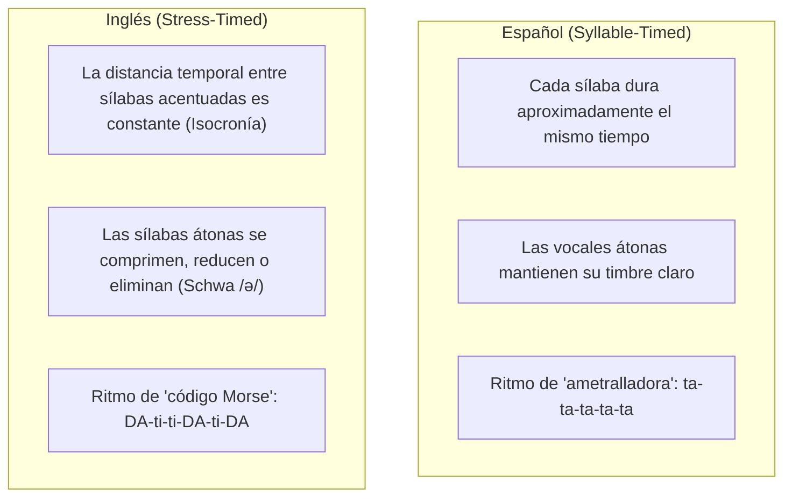
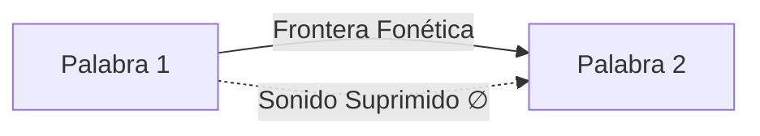
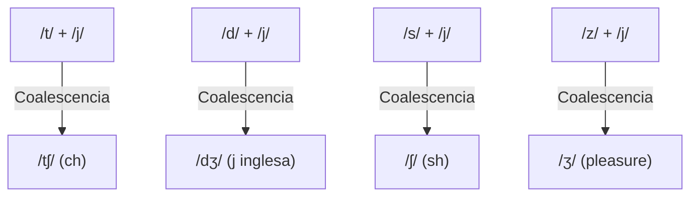

# Guía Integral de Fonética y Habla Conectada (Connected Speech)
## English Learning Assistant (ELA)

Este documento es el manual técnico y pedagógico de **Habla Conectada** (*Connected Speech*) de ELA. 

El principal obstáculo de comprensión auditiva para un hispanohablante radica en que el inglés es una **lengua con ritmo acentual (*stress-timed*)**, donde las palabras aisladas cambian radicalmente de forma al integrarse en una frase, mientras que el español es una **lengua con ritmo silábico (*syllable-timed*)**.

---

## 1. El Conflicto Rítmico: Español vs. Inglés

Cuando un nativo habla, no pronuncia palabras aisladas (*citation forms*), sino un flujo fonético ininterrumpido gobernado por cuatro fenómenos: **Elisión**, **Asimilación**, **Enlace (Linking)** y **Formas Débiles**.

---

## 2. Fenómeno 1: Elisión (Elision - Omisión de Sonidos)

La elisión es la desaparición completa de uno o más sonidos (consonantes o vocales) en el habla rápida para facilitar la economía articulatoria.

### 2.1. Elisión de Oclusivas Alveolares (/t/ y /d/)
Ocurre cuando /t/ o /d/ se encuentran al final de una palabra precedidas por una consonante y seguidas por otra consonante:
- **Regla:** $C_1 + \text{/t, d/} + C_2 \rightarrow C_1 + \emptyset + C_2$
- **Ejemplos Reales:**
  - *"last night"* $\rightarrow$ Pronunciado formal: `/lɑːst naɪt/` $\rightarrow$ **Habla conectada:** `[lɑːs naɪt]` (desaparece la /t/).
  - *"next door"* $\rightarrow$ Formal: `/nekst dɔː/` $\rightarrow$ **Habla conectada:** `[neks dɔː]`.
  - *"stand there"* $\rightarrow$ Formal: `/stænd ðeə/` $\rightarrow$ **Habla conectada:** `[stæn ðeə]`.
  - *"hold tight"* $\rightarrow$ Formal: `/həʊld taɪt/` $\rightarrow$ **Habla conectada:** `[həʊl taɪt]`.

### 2.2. Síncopa de Vocales Débiles Átonas
Las vocales átonas /ə/ o /ɪ/ se omiten entre consonantes en palabras polisilábicas:
- *"camera"* $\rightarrow$ No se pronuncia ca-me-ra (3 sílabas), sino `[ˈkæmrə]` (2 sílabas).
- *"family"* $\rightarrow$ `[ˈfæmli]` (2 sílabas).
- *"history"* $\rightarrow$ `[ˈhɪstri]` (2 sílabas).
- *"chocolate"* $\rightarrow$ `[ˈtʃɒklət]` (2 sílabas).
- *"police"* $\rightarrow$ `[pliːs]` (la /ə/ inicial desaparece en habla rápida).

### 2.3. Caída de Aspiración /h/ (H-Dropping)
En pronombres y verbos auxiliares átonos (*he, him, his, her, have, has, had*), el sonido /h/ se omite por completo a menos que esté al inicio absoluto de la frase:
- *"Tell him"* $\rightarrow$ `/tel ɪm/` (suena idéntico a *"tell 'im"*).
- *"Ask her"* $\rightarrow$ `/ɑːsk ɜː/` o `/æsk ər/`.
- *"What have you done?"* $\rightarrow$ `/wɒt əv juː dʌn/`.

### 2.4. Elisión de /v/ en la preposición "of"
Antes de consonante, la /v/ de *of* suele desaparecer:
- *"Cup of tea"* $\rightarrow$ `[kʌp ə tiː]`.
- *"Piece of cake"* $\rightarrow$ `[piːs ə keɪk]`.

---

## 3. Fenómeno 2: Asimilación (Assimilation - Sonidos que Mutan)

La asimilación ocurre cuando un sonido modifica su punto o modo de articulación para parecerse al sonido que le sigue (regresiva) o que le precede (progresiva).

### 3.1. Asimilación Regresiva de Punto de Articulación
Las consonantes alveolares /t/, /d/, /n/ cambian de punto cuando chocan con consonantes bilabiales (/p/, /b/, /m/) o velares (/k/, /ɡ/):

| Sonido Original | Siguiente Sonido | Sonido Asimilado | Texto Escrito | IPA Cita | IPA Habla Conectada |
| :--- | :--- | :--- | :--- | :--- | :--- |
| **/n/** (alveolar) | **/b, p, m/** (bilabial) | **/m/** (bilabial) | *"ten boys"* | `/ten bɔɪz/` | `[tem bɔɪz]` |
| **/n/** (alveolar) | **/b, p, m/** (bilabial) | **/m/** (bilabial) | *"in Paris"* | `/ɪn ˈpærɪs/` | `[ɪm ˈpærɪs]` |
| **/t/** (alveolar) | **/p, b, m/** (bilabial) | **/p/** (bilabial) | *"hot potato"* | `/hɒt pəˈteɪtəʊ/`| `[hɒp pəˈteɪtəʊ]` |
| **/d/** (alveolar) | **/b, p, m/** (bilabial) | **/b/** (bilabial) | *"good boy"* | `/ɡʊd bɔɪ/` | `[ɡʊb bɔɪ]` |
| **/n/** (alveolar) | **/k, ɡ/** (velar) | **/ŋ/** (velar) | *"ten cups"* | `/ten kʌps/` | `[teŋ kʌps]` |
| **/t/** (alveolar) | **/k, ɡ/** (velar) | **/k/** (velar) | *"white coffee"* | `/waɪt ˈkɒfi/` | `[waɪk ˈkɒfi]` |
| **/d/** (alveolar) | **/k, ɡ/** (velar) | **/ɡ/** (velar) | *"bad girl"* | `/bæd ɡɜːl/` | `[bæɡ ɡɜːl]` |

### 3.2. Asimilación Coalescente (Yod-Coalescence)
Es la fusión más frecuente e importante en el inglés cotidiano. Ocurre cuando una consonante alveolar final choca con el sonido semivocálico /j/ (la "y" de *you, your, yet*), fusionándose en un sonido africado o fricativo post-alveolar:

- **/t/ + /j/ $\rightarrow$ /tʃ/:**
  - *"Don't you"* $\rightarrow$ `/ˈdəʊntʃuː/` ("don-chu").
  - *"Meet you"* $\rightarrow$ `/ˈmiːtʃuː/` ("mi-chu").
  - *"Not yet"* $\rightarrow$ `/nɒtʃet/` ("not-chet").
- **/d/ + /j/ $\rightarrow$ /dʒ/:**
  - *"Did you"* $\rightarrow$ `/ˈdɪdʒuː/` ("di-ju").
  - *"Would you"* $\rightarrow$ `/ˈwʊdʒuː/` ("wou-ju").
  - *"Could you"* $\rightarrow$ `/ˈkʊdʒuː/` ("cou-ju").
- **/s/ + /j/ $\rightarrow$ /ʃ/:**
  - *"Bless you"* $\rightarrow$ `/ˈbleʃuː/` ("blesh-u").
  - *"This year"* $\rightarrow$ `/ðɪʃ jɪə/`.
- **/z/ + /j/ $\rightarrow$ /ʒ/:**
  - *"As you know"* $\rightarrow$ `/əʒ uː nəʊ/`.

### 3.3. Asimilación de Sonoridad (Voice Assimilation)
- *"have to"* $\rightarrow$ La /v/ sonora se ensordece en /f/ por influencia de la /t/ sorda: `[ˈhæftuː]`.
- *"used to"* $\rightarrow$ La /z/ sonora se ensordece en /s/: `[ˈjuːstuː]`.

---

## 4. Fenómeno 3: Enlace (Linking & Liaison)

En inglés, nunca debe haber un corte o golpe de glotis abrupto entre palabras dentro del mismo grupo de entonación.

### 4.1. Enlace Consonante a Vocal (Catenación / Resilabeo)
La consonante final de una palabra se traslada como ataque de la vocal siguiente:
- *"Hold on"* $\rightarrow$ Suena como: `[həʊl - dɒn]`.
- *"Take off"* $\rightarrow$ Suena como: `[teɪ - kɒf]`.
- *"Check it out"* $\rightarrow$ Suena como: `[tʃe - kɪ - daʊt]` (en inglés americano la /t/ intermedia se convierte además en un flap alveolar `[ɾ]`: `[tʃe - kɪ - ɾaʊt]`).

### 4.2. Enlace Vocal a Vocal con Intrusión de Semivocales (Intrusive Glides)
Cuando una palabra termina en vocal y la siguiente comienza con vocal, el aparato fonador inserta un puente sonoro (*glide*) para no cortar el aire:

#### A. Intrusión de /j/ (Intrusive 'y'):
Se produce si la primera palabra termina en una vocal anterior cerrada o diptongo que culmina en /ɪ/ o /iː/ (`/iː/`, `/ɪ/`, `/eɪ/`, `/aɪ/`, `/ɔɪ/`):
- *"I agree"* $\rightarrow$ `[aɪ - j - əˈɡriː]`.
- *"See it"* $\rightarrow$ `[siː - j - ɪt]`.
- *"They are"* $\rightarrow$ `[ðeɪ - j - ɑː]`.
- *"My eyes"* $\rightarrow$ `[maɪ - j - aɪz]`.

#### B. Intrusión de /w/ (Intrusive 'w'):
Se produce si la primera palabra termina en una vocal posterior redondeada o diptongo que culmina en /ʊ/ o /uː/ (`/uː/`, `/ʊ/`, `/əʊ/`, `/aʊ/`):
- *"Go out"* $\rightarrow$ `[ɡəʊ - w - aʊt]`.
- *"You are"* $\rightarrow$ `[juː - w - ɑː]`.
- *"Do it"* $\rightarrow$ `[duː - w - ɪt]`.
- *"How is it?"* $\rightarrow$ `[haʊ - w - ɪz ɪt]`.

#### C. Linking 'r' e Intrusive 'r' (Acentos no róticos como RP):
- **Linking 'r':** Si una palabra termina ortográficamente en 'r' y la siguiente inicia en vocal, la 'r' que normalmente es muda se pronuncia:
  - *"Four"* `/fɔː/` $\rightarrow$ *"Four apples"* `[fɔːr ˈæplz]`.
  - *"Car"* `/kɑː/` $\rightarrow$ *"Car engine"* `[kɑːr ˈendʒɪn]`.
- **Intrusive 'r':** Si una palabra termina en sonido /ə/, /ɔː/ o /ɑː/ (sin 'r' ortográfica) y la siguiente inicia en vocal, los nativos insertan una /r/:
  - *"Law and order"* $\rightarrow$ `[lɔːr ənd ˈɔːdə]`.
  - *"The idea of it"* $\rightarrow$ `[ði aɪˈdɪər əv ɪt]`.

### 4.3. Geminación Consonántica (Twin Consonants)
Cuando el sonido consonántico final es idéntico al consonántico inicial de la siguiente palabra, no se pronuncian dos consonantes separadas, sino una sola consonante prolongada:
- *"Black cat"* $\rightarrow$ `[blækːæt]` (no *black-cat* con pausa).
- *"Bad day"* $\rightarrow$ `[bædːeɪ]`.
- *"Social life"* $\rightarrow$ `[ˈsəʊʃəlːaɪf]`.

---

## 5. Formas Débiles (Weak Forms) y la Vocal Schwa /ə/

En inglés, las palabras funcionales pierden casi todo su valor vocálico y se reducen a la vocal central neutra **Schwa /ə/** cuando no están bajo énfasis.

| Palabra | Forma Fuerte (Aislada) | Forma Débil (En Discurso) | Ejemplo en Oración | Transcripción Real |
| :--- | :--- | :--- | :--- | :--- |
| **to** | `/tuː/` | `/tə/` | *"Go to work"* | `[ɡəʊ tə wɜːk]` |
| **of** | `/ɒv/` | `/əv/` | *"Most of all"* | `[məʊst əv ɔːl]` |
| **for** | `/fɔː/` | `/fə/` | *"Wait for me"* | `[weɪt fə miː]` |
| **and** | `/ænd/` | `/ənd/` o `/ən/` | *"Fish and chips"* | `[fɪʃ ən tʃɪps]` |
| **can** | `/kæn/` | `/kən/` | *"I can do it"* | `[aɪ kən duː ɪt]` *(Nótese: solo se dice /kæn/ en negativo can't o énfasis)* |
| **was** | `/wɒz/` | `/wəz/` | *"He was right"* | `[hiː wəz raɪt]` |
| **at** | `/æt/` | `/ət/` | *"Look at that"* | `[lʊk ət ðæt]` |
| **from** | `/frɒm/` | `/frəm/` | *"Back from home"* | `[bæk frəm həʊm]` |

---

## 6. Arquitectura del Motor de Connected Speech en ELA

El software integrará un motor de análisis de reglas fonéticas que toma una oración ingresada por el usuario o extraída de un texto y genera:
1. Cadena ortográfica original con separadores de frontera de palabra.
2. Detección automática de patrones fonéticos (p. ej. detección de regex `[td]\s+[j]` para asimilación coalescente; consonante final seguida de vocal para catenación).
3. Salida visual con etiquetas de color:
   - 🔵 **Azul:** Enlace / Linking (C-V o V-V).
   - 🔴 **Rojo tachado:** Elisión (sonido que desaparece).
   - 🟡 **Amarillo:** Asimilación (sonido que se transforma).
   - 🟢 **Verde:** Forma débil (reducción a Schwa).
4. Audio sincronizado resaltando cada bloque sonoro.
