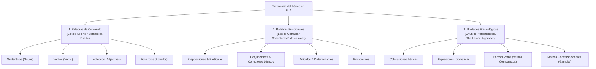

# Taxonomía y Categorización del Vocabulario y Léxico
## English Learning Assistant (ELA)

Este documento detalla la **Taxonomía Léxica Integral** que gobernará la base de datos de vocabulario, los algoritmos de repetición espaciada y el análisis de textos. 

Superando las clasificaciones simplistas de los diccionarios tradicionales, esta estructura organiza el léxico en función de su rol gramatical, su naturaleza sintáctica y su comportamiento fraseológico.

---

## 1. Macro-Estructura de Tres Niveles

---

## 2. Dimensión 1: Palabras de Contenido (Content Words)

Constituyen el núcleo informativo de la oración. En el habla conectada suelen recibir el **acento oracional primario o secundario** (*pitch accent*).

### 2.1. Sustantivos (Nouns)
- **Concretos vs. Abstractos:** *computer*, *bridge* vs. *freedom*, *determination*.
- **Contables vs. Incontables (Countable vs. Uncountable):** 
  - Crítico para hispanohablantes debido a interferencias comunes: *information* (nunca *informations*), *advice* (nunca *advices*), *furniture*, *luggage*, *news*.
- **Sustantivos Compuestos (Compound Nouns):** *deadline*, *breakthrough*, *feedback*. Reglas de acentuación fonética (primer elemento casi siempre acentuado: /ˈded.laɪn/).
- **Sustantivos Colectivos:** concordancia verbal en inglés británico vs. americano (*The team is / The team are*).

### 2.2. Verbos (Verbs)
- **Dinámicos (Action) vs. Estativos (Stative):**
  - Verbos de estado que generalmente **no se usan en tiempos continuos (-ing)**: *know, believe, understand, belong, depend, seem*. (Prevención del error hispano: *"I am knowing the answer"*).
- **Transitividad:**
  - Verbos transitivos que obligatoriamente requieren objeto (*discuss the problem*, nunca *"discuss about the problem"*).
  - Verbos intransitivos (*arrive, laugh*).
- **Morfología Irregular:** Agrupación por familias de cambio de vocal (*sing-sang-sung*, *drive-drove-driven*, *buy-bought-bought*).

### 2.3. Adjetivos (Adjectives)
- **Gradables vs. No Gradables / Extremos:**
  - *cold* $\rightarrow$ modificable con *very cold*.
  - *freezing* $\rightarrow$ no gradable, modificable solo con *absolutely freezing* (nunca *"very freezing"*).
- **Regla OSASCOMP (Orden Natural de Múltiples Adjetivos):**
  1. Opinion (*lovely*)
  2. Size (*small*)
  3. Age (*ancient*)
  4. Shape (*round*)
  5. Color (*black*)
  6. Origin (*Italian*)
  7. Material (*leather*)
  8. Purpose (*riding*)
  - Ejemplo natural: *"A lovely small round Italian leather bag"*.
- **Pares de Participios Adjetivales (-ed vs. -ing):**
  - Confusión típica: *bored* (cómo me siento) vs. *boring* (lo que causa la sensación). Error hispano frecuente: *"I am very boring"* en lugar de *"I am very bored"*.

### 2.4. Adverbios (Adverbs)
- **Adverbios de Frecuencia y su Posición Sintáctica:** *always, rarely, seldom, usually* (antes del verbo principal, pero después del verbo *to be*).
- **Adverbios de Grado y Atenuadores:** *quite, fairly, slightly, utterly, virtually*.
- **Adverbios Oracionales / Discursivos:** *fortunately, presumably, inadvertently*.

---

## 3. Dimensión 2: Palabras Funcionales (Function Words)

Son el "pegamento sintáctico" del idioma. En el habla conectada, las palabras funcionales son **casi siempre átonas (unstressed) y se pronuncian con su forma débil (weak form con Schwa /ə/)**.

### 3.1. Preposiciones y Regímenes Preposicionales
- **Preposiciones Espaciales y Temporales Básicas:**
  - *At, In, On* para tiempo y espacio (diagrama piramidal de especificidad).
- **Regímenes Preposicionales Dependientes (Dependent Prepositions):**
  - La mayor fuente de errores de transferencia para hispanohablantes:
    - *depend ON* (en español: depende DE).
    - *interested IN* (en español: interesado EN).
    - *good AT* (en español: bueno EN/PARA).
    - *arrive AT/IN* (nunca *arrive to*).
    - *dream ABOUT/OF* (en español: soñar CON).

### 3.2. Conjunciones y Conectores Lógicos
- **Coordinantes (FANBOYS):** *For, And, Nor, But, Or, Yet, So*.
- **Subordinantes:** *Although, Even though, While, Whereas, Unless, Provided that*.
- **Correlativas:** *Neither... nor*, *Either... or*, *Not only... but also*.

### 3.3. Artículos y Determinantes
- **Artículo Determinado (*The*) vs. Artículo Cero ($\emptyset$):**
  - Error común hispanohablante: uso excesivo de *the* al hablar de conceptos generales (*"The life is beautiful"* $\rightarrow$ Correcto: *"Life is beautiful"*).
- **Cuantificadores de Contables vs. Incontables:**
  - *Many / Few / Fewer* (para contables) vs. *Much / Little / Less* (para incontables).

---

## 4. Dimensión 3: Unidades Fraseológicas (The Lexical Chunks)

### 4.1. Colocaciones Léxicas (Collocations)
Combinaciones de palabras que coocurren con una frecuencia natural muy superior al azar estadístico:
- **Verbo + Sustantivo:** *make a mistake* (nunca *do a mistake*), *take a shower*, *pay attention*, *gain experience*.
- **Adjetivo + Sustantivo:** *heavy rain* (no *strong rain*), *harsh reality*, *crucial role*.
- **Adverbio + Adjetivo:** *deeply concerned*, *highly likely*, *fully aware*.

### 4.2. Phrasal Verbs (Taxonomía Sintáctica de 4 Tipos)
Los *phrasal verbs* se categorizan según su transitividad y separabilidad:
1. **Tipo 1: Intransitivos e Inseparables:** No admiten objeto directo (*wake up, show up, break down*). Ejemplo: *"My car broke down"*.
2. **Tipo 2: Transitivos y Separables:** Si el objeto es un pronombre, **debe** ir en medio (*turn off, pick up, call off*). Ejemplo: *"Turn off the light"* o *"Turn it off"* (nunca *"Turn off it"*).
3. **Tipo 3: Transitivos e Inseparables:** El objeto debe ir siempre después de la partícula (*look after, run into, come across*). Ejemplo: *"I ran into him"* (nunca *"I ran him into"*).
4. **Tipo 4: Phrasal-Prepositional Verbs (Tres Partes):** Tienen dos partículas e inseparables (*look forward to, run out of, get along with, put up with*).

### 4.3. Expresiones Idiomáticas y Fórmulas Conversacionales
- Modismos de uso cotidiano: *piece of cake, bite the bullet, under the weather, cut corners*.
- Marcos conversacionales y marcadores del discurso: *In my opinion, To tell you the truth, As far as I can tell, Having said that*.

---

## 5. Correlación con el Marco Común Europeo (CEFR)

Cada ítem léxico se etiqueta según los corpus de referencia (*Oxford 3000/5000* y *Cambridge English Vocabulary Profile*):
- **A1-A2 (Básico):** Vocabulario cotidiano esencial y palabras de contenido concretas (2.000 palabras más frecuentes).
- **B1-B2 (Independiente):** Verbos estativos, adjetivos gradables/extremos, colocaciones de negocios/académicas y phrasal verbs comunes (3.500 - 5.000 palabras).
- **C1-C2 (Avanzado):** Modismos sutiles, colocaciones precisas de registro formal, conectores discursivos sofisticados (7.000+ palabras).
