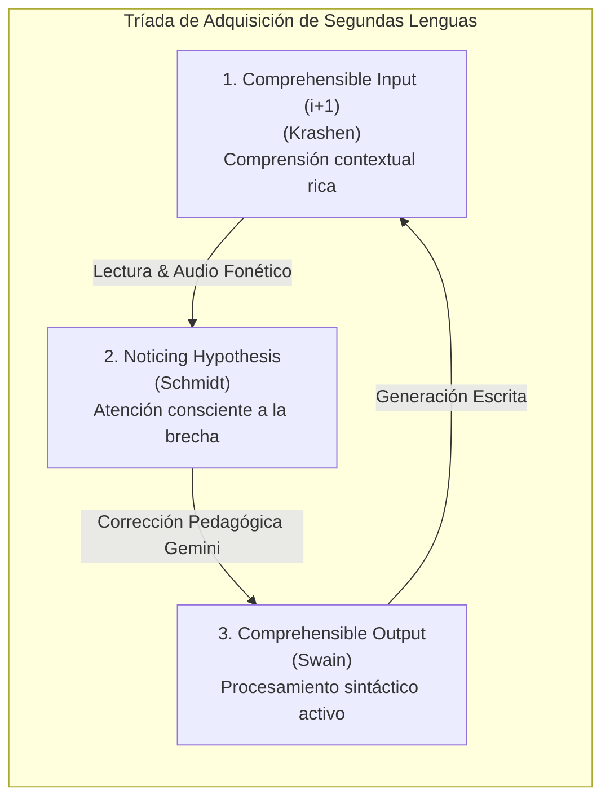
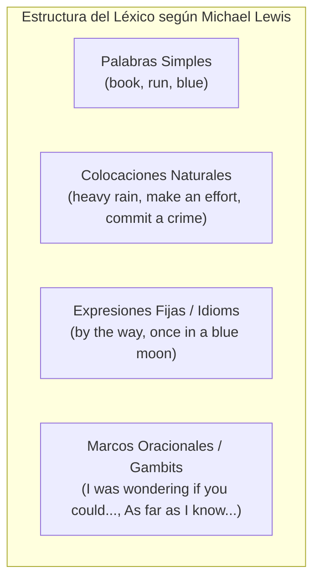
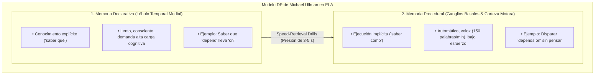

# Fundamentación en Ciencias de Adquisición de Segundas Lenguas (SLA)
## English Learning Assistant (ELA)

Este documento expone las bases científicas, lingüísticas y psicológicas que sustentan el diseño de cada módulo de ELA. Para que un software educativo no sea una mera lista de preguntas estáticas ni una "gamificación superficial", debe alinearse rigurosamente con los hallazgos contemporáneos de la **Adquisición de Segundas Lenguas (SLA)** y la **Psicología Cognitiva de la Memoria**.

---

## 1. Los Tres Pilares de la Lingüística Aplicada en ELA

### 1.1. La Hipótesis del Noticing (Richard Schmidt)
- **El Principio:** Los estudiantes adultos no adquieren características gramaticales o fonéticas nuevas simplemente por estar expuestos a ellas de forma pasiva; deben **notar conscientemente** (*notice*) la discrepancia entre su propia producción lingüística ("interlenguaje") y la norma nativa (*target language*).
- **Implementación en ELA:**
  - Cuando el estudiante comete un error en el módulo de redacción, la evaluación de Google Gemini no solo reescribe el texto, sino que **resalta visualmente la brecha** (*gap-highlighting*) y explica explícitamente el principio que causó el desvío.
  - En fonética, el software expone visualmente el fenómeno de Habla Conectada (p. ej. cómo *"don't you"* se transforma en `/ˈdəʊntʃuː/`), haciendo visible lo que el oído hispanohablante tiende a ignorar.

### 1.2. La Hipótesis del Output Comprensible (Merrill Swain)
- **El Principio:** Swain demostró que escuchar y leer (*input*) permite procesar el lenguaje de forma puramente semántica (adivinar el sentido general por el contexto). En contraste, **producir lenguaje** (*output*, hablar o escribir) es la única actividad que obliga al cerebro a procesar la lengua de forma **sintáctica** (elegir terminaciones, preposiciones y orden de palabras).
- **Implementación en ELA:**
  - El estudiante no se limita a responder preguntas de opción múltiple (reconocimiento pasivo).
  - El sistema integra un **Taller de Redacción con IA** donde el usuario genera oraciones y párrafos completos, activando activamente la construcción gramatical.

### 1.3. El Filtro Afectivo y el Input Comprensible $i+1$ (Stephen Krashen)
- **El Principio:** El aprendizaje óptimo ocurre cuando la dificultad está exactamente un escalón por encima de la competencia actual del aprendiz ($i+1$) y cuando la ansiedad y el miedo al juicio son mínimos (*low affective filter*).
- **Implementación en ELA:**
  - La IA de Gemini está instruida con un tono socrático, empático y constructivo en español, eliminando la frustración o la vergüenza de equivocarse.
  - La dificultad de las tarjetas SRS se calibra automáticamente según la retención real del usuario, evitando tanto el aburrimiento por tareas triviales como la sobrecarga cognitiva.

---

## 2. El Enfoque Léxico (The Lexical Approach - Michael Lewis)

El modelo tradicional de enseñanza solía enseñar "reglas gramaticales aisladas" y luego rellenarlas con "palabras de vocabulario". La lingüística de corpus moderna demostró que los hablantes nativos almacenan y recuperan el lenguaje en forma de **unidades fraseológicas prefabricadas** (*lexical chunks*).

### Directrices de Diseño Léxico en ELA:
1. **Prioridad a las Colocaciones (*Collocations*):** En lugar de aprender el verbo *make* y el sustantivo *decision* por separado, se entrena la colocación indivisible *"make a decision"*.
2. **Desmitificación de Phrasal Verbs:** Se clasifican según su naturaleza semántica y sintáctica (separables vs. inseparables) con ejemplos reales de uso.
3. **Falsos Amigos (*False Cognates*):** Para los hispanohablantes, palabras como *actually* (en realidad), *eventually* (con el tiempo / finalmente), *sensible* (sensato) o *realize* (darse cuenta) provocan errores fosilizados si no se alertan de inmediato.

---

## 3. Psicología Cognitiva de la Memoria y Repetición Espaciada

### 3.1. Teoría de la Fuerza de Recuperación vs. Fuerza de Almacenamiento (Bjork & Bjork)
- Robert Bjork estableció que la memoria tiene dos componentes:
  - **Storage Strength (Fuerza de Almacenamiento):** Cuán arraigado está un concepto en las redes neuronales a largo plazo.
  - **Retrieval Strength (Fuerza de Recuperación):** Cuán accesible está el concepto en la memoria de trabajo en este instante exacto.
- **La Dificultad Deseable (*Desirable Difficulty*):** Cuanto mayor es el esfuerzo mental para evocar un recuerdo justo antes de olvidarlo, mayor es el incremento resultante en su Fuerza de Almacenamiento.

### 3.2. FSRS vs. SM-2: La Evolución de la Repetición Espaciada
Durante décadas, los sistemas de flashcards utilizaron el algoritmo SM-2 (diseñado en 1987). ELA adopta el estado del arte: **FSRS (Free Spaced Repetition Scheduler)** basado en el modelo DSR de 3 variables:

| Dimensión | Significado Cognitivo | Modelado en FSRS |
| :--- | :--- | :--- |
| **D (Difficulty)** | Dificultad intrínseca del concepto (varía de 1 a 10). | Un falso amigo o una regla de Habla Conectada compleja tiene un $D$ alto; una palabra transparente tiene un $D$ bajo. |
| **S (Stability)** | Días que transcurrirán hasta que la probabilidad de recuerdo caiga al 90%. | Crece exponencialmente con repasos exitosos (*Good* / *Easy*) y se recalibra ante fallos (*Again*). |
| **R (Retrievability)** | Probabilidad matemática instantánea de recordar el ítem hoy ($t$ días después del último repaso). | $R(t) = \left(1 + F \cdot \frac{t}{S}\right)^{-w}$. El sistema programa el repaso cuando $R$ se aproxima al 90%. |

---

## 4. Neurociencia de los Hábitos: De la Fricción a la Automatización

La constancia supera a la intensidad en la adquisición lingüística: 15 minutos diarios durante 1 año producen un impacto neurológico sustancialmente superior a 4 horas un solo día a la semana.

ELA implementa los 4 principios de *Atomic Habits* (James Clear) y el *Fogg Behavior Model* ($B = MAP$):
1. **Hacerlo Obvio (Cue):** El Dashboard muestra inmediatamente las "Tareas del Día" (Daily Quests) sin menús laberínticos.
2. **Hacerlo Fácil (Ability):** La carga diaria está calibrada para no superar los 15-20 minutos, evitando el agotamiento cognitivo.
3. **Hacerlo Atractivo (Motivation):** Visualización del progreso en el Heatmap de debilidades y micro-retos interactivos.
4. **Mecanismo Antifrustración (Streak Freeze):** La pérdida de una racha suele generar el fenómeno de *"What-the-hell effect"* (sensación de fracaso que conduce a abandonar por completo). Los congeladores de racha protegen la inversión emocional del aprendiz.

---

## 5. El Modelo Declarativo / Procedural (Michael Ullman) y la Automaticidad

Uno de los mayores hallazgos de la neurobiología del lenguaje es que los adultos procesan su lengua materna (L1) predominantemente en la **Memoria Procedural**, mientras que tienden a aprender segundas lenguas (L2) confinadas en la **Memoria Declarativa**.

### El Principio de Proceduralización:
- Conocer la regla gramatical de forma consciente no previene que el estudiante se trabe al hablar en una reunión en tiempo real.
- **Implementación en ELA:** Para forzar la migración desde la memoria declarativa hacia los ganglios basales, ELA incorpora **Drills de Velocidad (Speed-Retrieval Drills)** con cuenta regresiva estricta de 3 a 5 segundos. La presión temporal impide la intervención del "traductor consciente" y automatiza las colocaciones y regímenes sintácticos.

---

## 6. Conciencia Fonológica y Discriminación Auditiva Crítica (Patricia Kuhl)

La comprensión y la pronunciación precisas descansan sobre una base indispensable: la **discriminación acústica perceptiva**. Si el cerebro del estudiante no puede diferenciar dos frecuencias o alófonos al escuchar, es incapaz de codificarlos en la memoria a largo plazo o producirlos voluntariamente.

- **El Conflicto Perceptual L1 (Imán de la Lengua Materna):** Siguiendo el modelo *Native Language Magnet* (NLM) de Patricia Kuhl, los hispanohablantes adultos poseen un "filtro perceptual" ajustado a los 5 fonemas vocálicos del español (/a, e, i, o, u/). Ante las más de 12 vocales del inglés (como el contraste tenso/laxo /iː/ frente a /ɪ/), el cerebro asimila ambos sonidos en una sola categoría equivalente (/i/), volviendo incomprensible la diferencia entre palabras como *sheep* y *ship*.
- **La Solución por Discriminación Forzada y Habla Conectada:**
  - ELA implementa un **Gimnasio de Pares Mínimos** con estímulos a ciegas y selección rápida (límite de 2.0 s). La decisión forzada sin apoyo visual entrena a los circuitos auditivos a desacoplarse del mapa fonológico del español y forzar la creación de nuevas categorías perceptuales.
  - El **Laboratorio de Habla Conectada** decodifica visualmente las fronteras de palabra (elisiones, asimilaciones, enlaces y reducciones al Schwa /ə/), permitiendo al alumno "ver" los fenómenos acústicos que la velocidad de conversación oculta a su oído.

---

## 7. Auto-Corrección Guiada y Andamiaje Socrático (Vygotsky & Schmidt)

En la pedagogía de la composición escrita, la entrega inmediata de un texto 100% corregido y reformulado genera un fenómeno cognitivo adverso: **la ilusión de competencia**. El estudiante lee la solución, comprende el sentido general y asume falsamente que ya la domina, pero no reestructura su interlenguaje.

- **Andamiaje en la Zona de Desarrollo Próximo (ZPD):**
  - ELA implementa la corrección en **dos etapas**:
    1. *Pistas de Noticing:* La IA identifica la anomalía y genera una pregunta socrática (*"Revisa la preposición en la línea 2"*).
    2. *Resolución Activa del Problema:* El estudiante edita activamente su propio texto. La autocorrección exitosa genera un anclaje dopaminérgico y sináptico significativamente más fuerte que la lectura pasiva de un diff.

---

## 8. Input Comprensible Extensivo ($i+1$) y Adquisición Incidental

Aunque la repetición espaciada (FSRS) es insuperable para fijar conceptos específicos, la mayor parte del vocabulario de un hablante avanzado se adquiere de forma **incidental** mediante la lectura contextual masiva de textos con una tasa de comprensión superior al 95% ($i+1$).

- **El Lector Inteligente de ELA (*Smart Graded Reader*):**
  - Permite la lectura inmersiva con doble vía:
    1. *Reconocimiento de Noticing:* Los términos que el alumno tiene en estudio se destacan sutilmente en el texto real.
    2. *Extracción Léxica Instantánea:* Con un solo toque, cualquier palabra desconocida se decodifica fonéticamente y se transfiere de inmediato a la cola de estudio FSRS.

