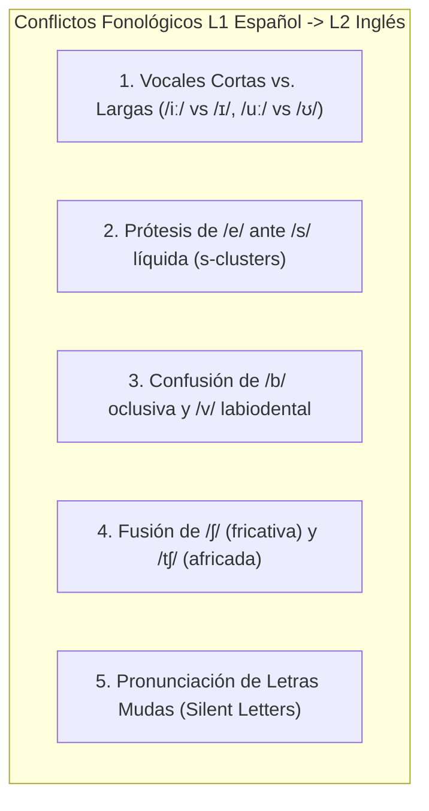
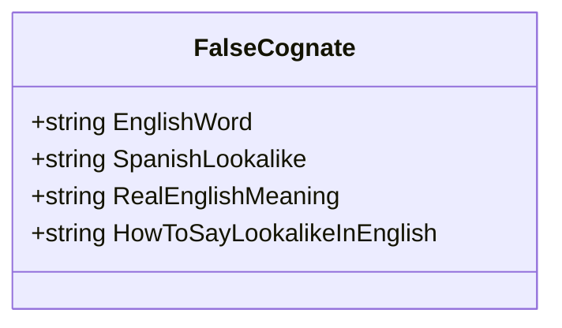

# Matriz de Interferencia y Transferencia Negativa L1 (Español $\rightarrow$ Inglés)
## English Learning Assistant (ELA)

Este documento cataloga los patrones sistemáticos de **Transferencia Negativa de la Lengua Materna (L1 Transfer)** que sufren los hispanohablantes al aprender inglés. 

El motor de diagnóstico de ELA y los evaluadores de IA utilizan esta matriz para identificar la causa raíz de los errores del usuario y ofrecer explicaciones pedagógicas contrastivas.

---

## 1. Interferencia Fonológica y Articulatoria

El sistema fonológico del español posee solo 5 fonemas vocálicos puros y carece de varios contrastes consonánticos cruciales en inglés.

### 1.1. Las Vocales Tensas vs. Laxas
- **El Problema:** El español no distingue entre /iː/ (larga tensa) e /ɪ/ (corta laxa). El estudiante hispanohablante tiende a pronunciar ambas como la /i/ española.
- **Pares Mínimos Críticos:**
  - *sheep* `/ʃiːp/` (oveja) vs. *ship* `/ʃɪp/` (barco).
  - *beach* `/biːtʃ/` (playa) vs. *bitch* `/bɪtʃ/` (grosería / perra).
  - *sheet* `/ʃiːt/` (sábana/hoja) vs. *shit* `/ʃɪt/` (grosería).
  - *leave* `/liːv/` (partir) vs. *live* `/lɪv/` (vivir).
  - *eat* `/iːt/` (comer) vs. *it* `/ɪt/` (pronombre).

### 1.2. Prótesis Vocálica en Grupos /s/ + Consonante (S líquida)
- **El Problema:** Las palabras en español nunca inician con /s/ seguida de consonante sin una vocal de apoyo previa (*escuela, España, estudiante*).
- **Manifestación:** El hispanohablante añade instintivamente una /e/ al inicio:
  - *school* $\rightarrow$ pronunciado erróneamente `[esˈkuːl]`.
  - *student* $\rightarrow$ `[esˈtjuːdənt]`.
  - *special* $\rightarrow$ `[esˈpeʃəl]`.
  - *start* $\rightarrow$ `[esˈtɑːt]`.
- **Estrategia en ELA:** Ejercicios de prolongación continua del siseo: `ssss-chool`, `ssss-tudent`.

### 1.3. La Confusión entre /b/ y /v/
- En español, las letras 'b' y 'v' representan exactamente el mismo fonema bilabial /b/ (o alófono [β]).
- En inglés, /b/ es bilabial (*lips together*), pero /v/ es **labiodental sonora** (dientes superiores rozando el labio inferior).
- Confusión: *berry* vs. *very*, *boat* vs. *vote*, *best* vs. *vest*.

### 1.4. Confusión /ʃ/ (*sh*) vs. /tʃ/ (*ch*)
- En español solo existe el fonema africado /tʃ/ (*chocolate, chico*). El sonido fricativo continuo /ʃ/ (el sonido para pedir silencio: *shhh*) no es fonema nativo.
- Confusión: *share* vs. *chair*, *wash* vs. *watch*, *shoes* vs. *choose*.

### 1.5. Letras Mudas (*Silent Letters*)
El español es una lengua fonética casi transparente (lo que se escribe se lee). El inglés tiene una ortografía histórica no fonética:
- */k/ muda:* *know, knee, knight, knife*.
- */w/ muda:* *write, wrong, answer, sword*.
- */b/ muda:* *debt, doubt, subtle, comb, thumb*.
- */l/ muda:* *walk, talk, half, calm, salmon*.
- */t/ muda:* *listen, castle, fasten, whistle*.

---

## 2. Interferencia Sintáctica y Gramatical

| Error Típico del Estudiante | Causa de la Transferencia L1 | Forma Correcta en Inglés | Explicación Pedagógica |
| :--- | :--- | :--- | :--- |
| *"It depends **of** the price"* | En español se usa la preposición *"de"*. | *"It depends **on** the price"* | En inglés, el verbo *depend* rige obligatoriamente la partícula *on*. |
| *"I **have** 25 years"* | En español la edad se "tiene" (*tener X años*). | *"I **am** 25 years old"* | En la cosmovisión anglosajona, la edad es un estado de existencia; se usa el verbo *to be*. |
| *"I **am agree** with you"* | En español se dice *"estoy de acuerdo"*. | *"I **agree** with you"* | *Agree* ya es un verbo de acción/estado en inglés; no requiere auxiliar *to be*. |
| *"**Is raining** heavily today"* | El español es una lengua *pro-drop* (omite el sujeto tácito). | *"**It is raining** heavily today"* | En inglés, toda oración requiere un sujeto sintáctico explícito (pronombre impersonal *it*). |
| *"She is married **with** a doctor"* | En español se dice *"casada con"*. | *"She is married **to** a doctor"* | La colocación natural en inglés para el vínculo matrimonial es *married to*. |
| *"I didn't see **nobody**"* | El español exige doble negación (*no vi a nadie*). | *"I didn't see **anybody**"* o *"I saw **nobody**"* | En inglés estándar rige la regla de negación única; dos negaciones forman una afirmación. |
| *"I need an **advice**"* | En español *consejo* es contable (*un consejo*). | *"I need **some advice**"* o *"**a piece of advice**"* | *Advice* es un sustantivo incontable (*mass noun*) en inglés. |
| *"The **cars blues** are fast"* | En español los adjetivos van después y se pluralizan. | *"The **blue cars** are fast"* | En inglés los adjetivos van antes del sustantivo y **nunca** admiten plural. |
| *"He **play** soccer every day"* | En español la 3ra persona cambia mucho, pero en inglés solo se añade *-s*. | *"He **plays** soccer every day"* | La omisión de la *-s* en tercera persona singular es el error más recurrente de fosilización. |

---

## 3. Catálogo de Falsos Amigos Críticos (False Cognates)

Palabras que se asemejan gráficamente al español pero poseen significados radicalmente divergentes:

| Palabra en Inglés | Parece en Español... | Significado REAL en Inglés | ¿Cómo se dice lo que creías en inglés? |
| :--- | :--- | :--- | :--- |
| **Actually** | *Actualmente* | En realidad / De hecho | *Currently / Nowadays* |
| **Eventually** | *Eventualmente* (a veces/quizás) | Con el tiempo / A la larga / Finalmente | *Occasionally / Possibly* |
| **Sensible** | *Sensible* | Sensato / Razonable / Con sentido común | *Sensitive* |
| **Sensitive** | *Sensitivo* | Sensible / Delicado / Susceptible | *Sensible* |
| **Realize** | *Realizar* (hacer/ejecutar) | Darse cuenta de algo | *To carry out / To perform / To make* |
| **Notice** | *Noticia* | Notar / Percibir / Darse cuenta | *News / Notification* |
| **Embarrassed** | *Embarazada* | Avergonzado / Apenado | *Pregnant* |
| **Career** | *Carrera universitaria* | Trayectoria profesional a lo largo de la vida | *University degree / Major* |
| **Library** | *Librería* (tienda de libros) | Biblioteca pública o comunitaria | *Bookstore / Bookshop* |
| **Pretend** | *Pretender* (intentar/querer) | Fingir / Simular algo | *To intend / To aim* |
| **Fabric** | *Fábrica* | Tela / Tejido textil | *Factory / Plant* |
| **Constipated** | *Constipado* (resfriado) | Estreñido | *To have a cold* |
| **Argument** | *Argumento* (trama de una película) | Discusión acalorada / Pelea verbal | *Plot / Storyline* |
| **Assist** | *Asistir* (ir a un lugar) | Ayudar o socorrer a alguien | *To attend (a meeting/class)* |
