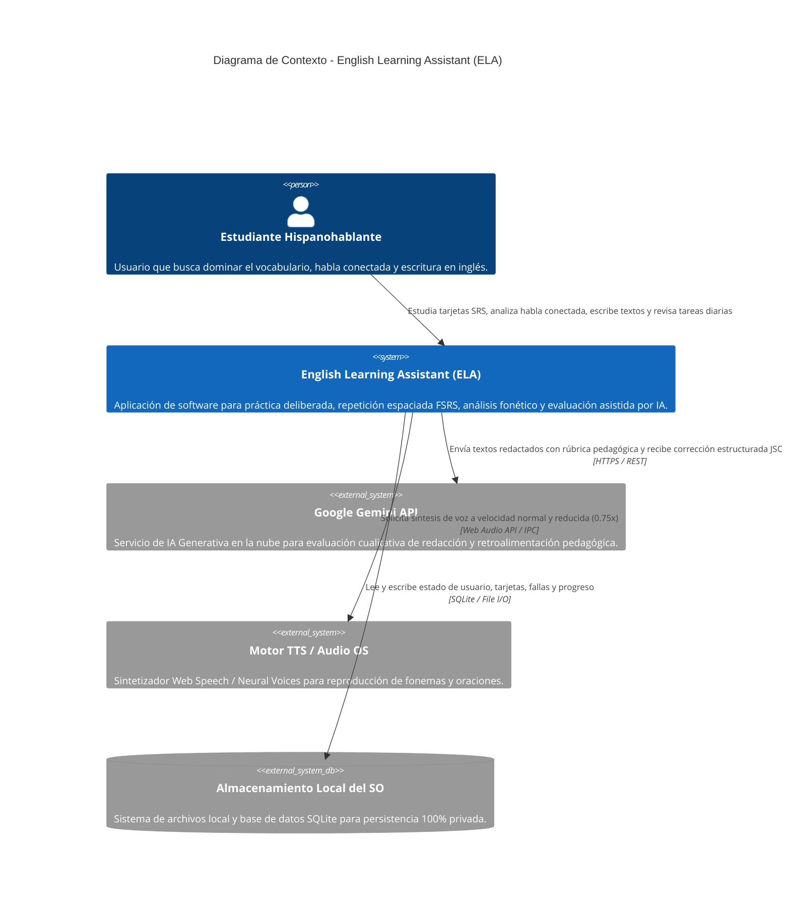
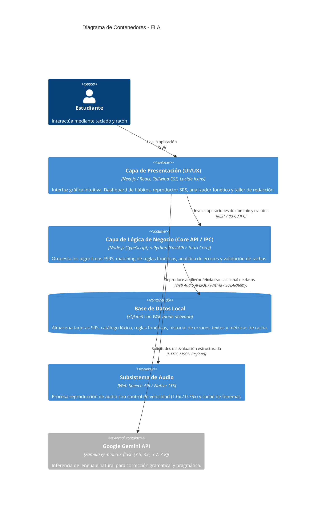
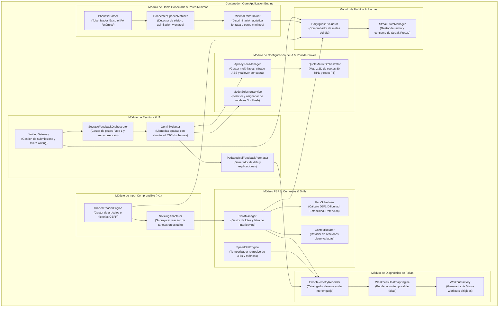

# Arquitectura del Sistema (Modelo C4)
## English Learning Assistant (ELA)

Este documento especifica la arquitectura del sistema utilizando el **Modelo C4** (Contexto, Contenedores, Componentes y Patrones de Código), diseñado para comunicar la estructura del software con claridad técnica estricta.

---

## 1. Nivel 1: Diagrama de Contexto del Sistema (System Context)

El diagrama de contexto ilustra cómo el usuario interactúa con ELA y los límites del sistema con servicios externos.

---

## 2. Nivel 2: Diagrama de Contenedores (Container Diagram)

El sistema se compone de contenedores de ejecución ligera que garantizan una experiencia local-first ultrarrápida:

---

## 3. Nivel 3: Diagrama de Componentes (Component Diagram)

Detalla los componentes internos dentro del contenedor de lógica de negocio (**Core Application Engine**):

---

## 4. Nivel 4: Patrones de Diseño y Principios de Código

Para garantizar la mantenibilidad y desacoplamiento del sistema, se adoptan los siguientes patrones:

1. **Repository Pattern (Patrón Repositorio):**
   - Aísla la capa de acceso a datos (`ICardRepository`, `IVocabRepository`, `IErrorRepository`). Si en el futuro se migra de SQLite a PostgreSQL en la nube, el dominio permanece intacto.
2. **Strategy Pattern (Patrón Estrategia) para Prompts de IA:**
   - La interfaz `IEvaluationStrategy` permite alternar entre estrategias de inferencia según el modelo seleccionado de la familia 3.x Flash (`gemini-3.5-flash`, `gemini-3.6-flash`, `gemini-3.7-flash` y `gemini-3.8-flash`) para calibrar latencia y profundidad de análisis pedagógico.
3. **State Machine Pattern (Máquina de Estados) para Rachas y FSRS:**
   - La vida de una tarjeta pasa por estados formales: `New` $\rightarrow$ `Learning` $\rightarrow$ `Review` $\rightarrow$ `Relearning`.
   - La racha diaria opera bajo una máquina de estados determinista (`Pending` $\rightarrow$ `Completed` $\rightarrow$ `Frozen` $\rightarrow$ `Broken`).
4. **Observer Pattern / Event Bus (Bus de Eventos Interno):**
   - Cuando ocurre el evento `CardReviewedEvent` o `WritingEvaluatedEvent`, los suscriptores (`ErrorRecorder`, `DailyQuestEvaluator`) reaccionan asíncronamente sin acoplamiento directo.
