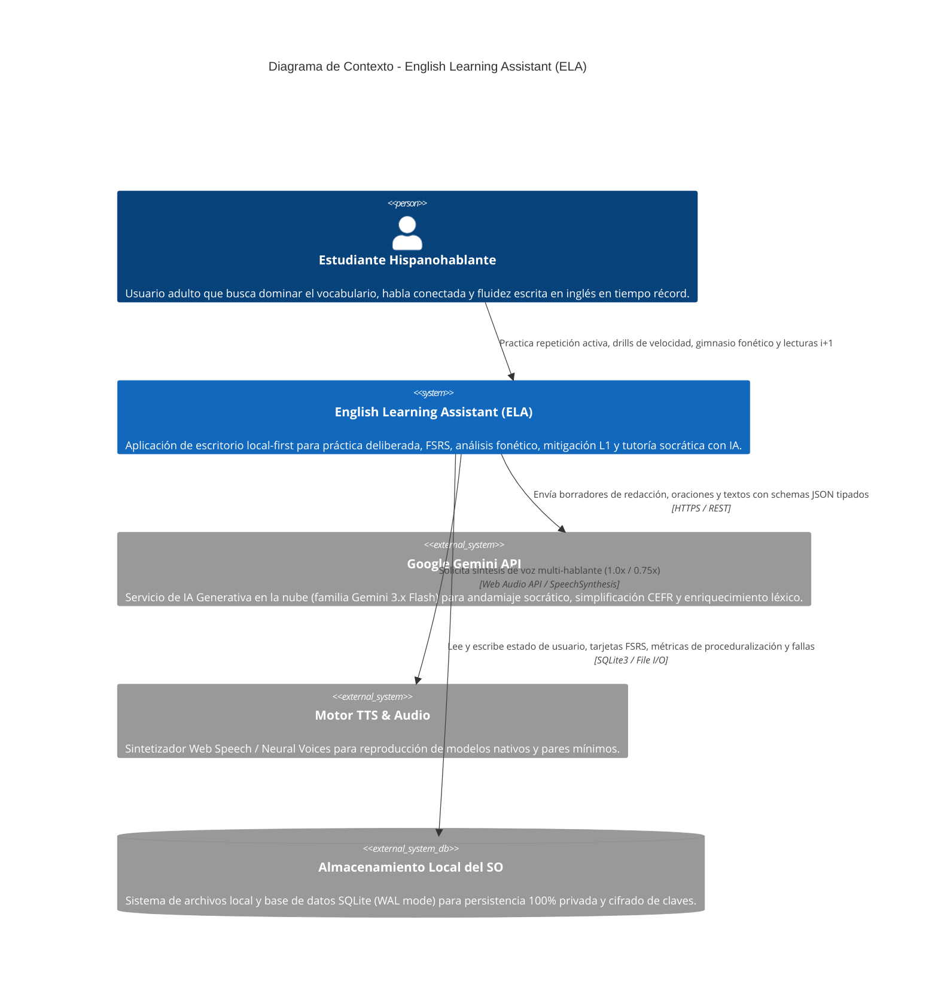
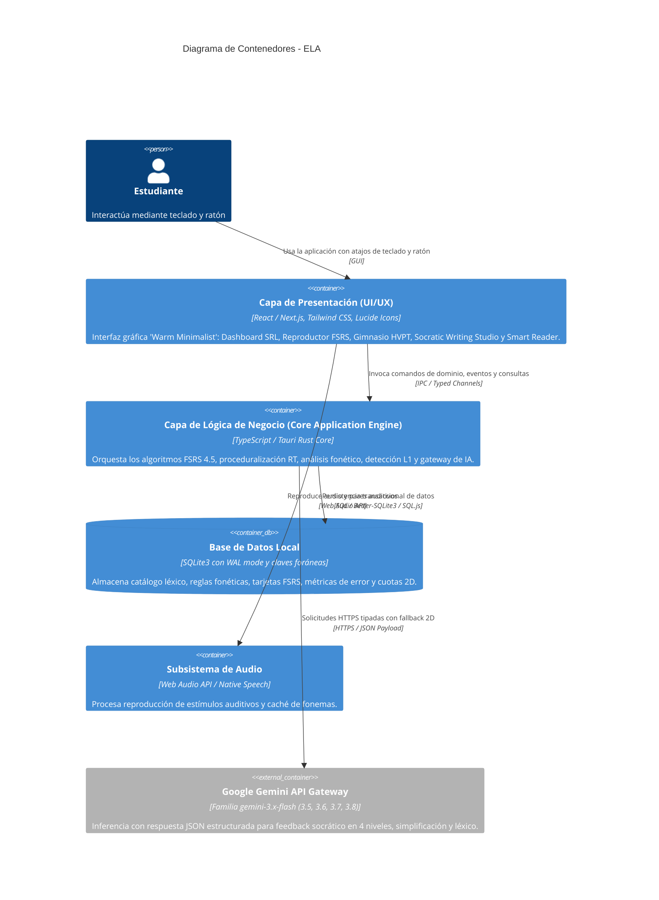
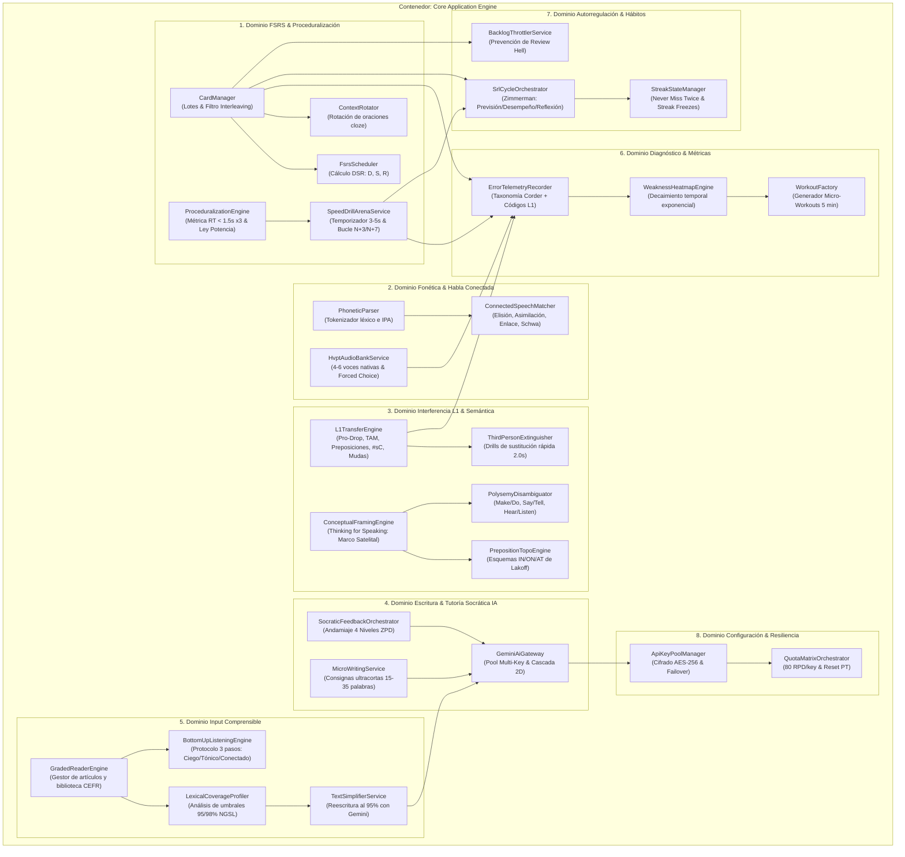

# Arquitectura del Sistema (Modelo C4)
## English Learning Assistant (ELA)

Este documento especifica la arquitectura del sistema utilizando el **Modelo C4** (Contexto, Contenedores, Componentes y Patrones de Código), diseñado para comunicar la estructura del software con claridad técnica estricta y alineación con los principios pedagógicos de [`docs/02_pedagogical_framework/`](../02_pedagogical_framework/).

---

## 1. Nivel 1: Diagrama de Contexto del Sistema (System Context)

El diagrama de contexto ilustra cómo el usuario interactúa con ELA y los límites del sistema con subsistemas y servicios externos.

---

## 2. Nivel 2: Diagrama de Contenedores (Container Diagram)

El sistema se compone de contenedores de ejecución ligera que garantizan una experiencia local-first de latencia ultrabaja:

---

## 3. Nivel 3: Diagrama de Componentes (Component Diagram)

Detalla la arquitectura modular desacoplada dentro del contenedor de lógica de negocio (**Core Application Engine**):

---

## 4. Nivel 4: Patrones de Diseño y Principios Arquitectónicos

1. **Repository Pattern (Patrón Repositorio):**
   - Aísla la persistencia de datos tras interfaces agnósticas (`ICardRepository`, `IVocabRepository`, `IErrorRepository`).
2. **Strategy Pattern (Patrón Estrategia) para Evaluación y Scaffolding:**
   - La interfaz `IEvaluationStrategy` desacopla los distintos tipos de inferencia pedagógica (`SocraticScaffoldingStrategy`, `TextSimplificationStrategy`, `VocabularyEnrichmentStrategy`).
3. **State Machine Pattern (Máquina de Estados Finita) Determinista:**
   - Vida de tarjetas FSRS: `NEW` $\rightarrow$ `LEARNING` $\rightarrow$ `REVIEW` $\rightarrow$ `RELEARNING`.
   - Proceduralización: `DECLARATIVE` $\rightarrow$ `COMPILING` $\rightarrow$ `PROCEDURALIZED` (certificación a $RT < 1.5$ s en 3 sesiones).
   - Racha diaria: `PENDING` $\rightarrow$ `COMPLETED` $\rightarrow$ `FROZEN` $\rightarrow$ `GRACE_PERIOD` $\rightarrow$ `RESET`.
   - Decodificación auditiva: `STEP1_BLIND` $\rightarrow$ `STEP2_TONIC` $\rightarrow$ `STEP3_FULL_CONNECTED`.
4. **Observer Pattern / Event Bus Desacoplado:**
   - Eventos de dominio centrales (`CardReviewedEvent`, `ErrorCommittedEvent`, `DrillCompletedEvent`) notifican a los suscriptores (`WeaknessHeatmapEngine`, `DailyQuestEvaluator`, `StreakStateManager`) de forma asíncrona sin acoplamiento temporal ni espacial.
5. **Circuit Breaker & Fallback 2D para IA:**
   - Protección contra HTTP 429 (`RESOURCE_EXHAUSTED`): conmutación horizontal de clave y degradación vertical de modelo (3.8 $\rightarrow$ 3.7 $\rightarrow$ 3.6 $\rightarrow$ 3.5 Flash).

