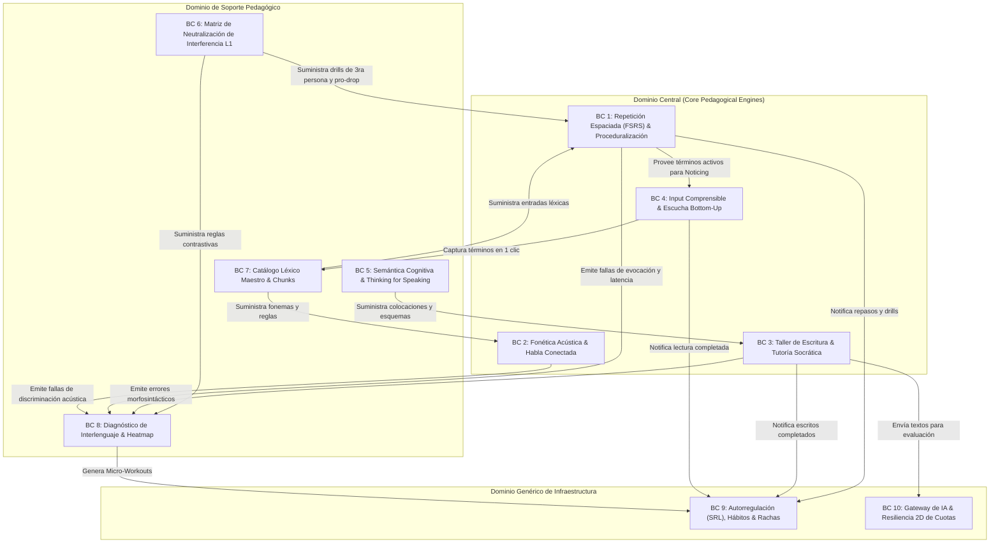

# Diseño Guiado por el Dominio (Domain-Driven Design - DDD)
## English Learning Assistant (ELA)

Este documento modela la arquitectura lógica de ELA bajo los principios de **Domain-Driven Design (DDD)** de Eric Evans. Define los **Contextos Delimitados (Bounded Contexts)**, **Agregados**, **Entidades**, **Objetos de Valor (Value Objects)** y **Eventos de Dominio**, estructurados para materializar rigurosamente los fundamentos científicos de [`docs/02_pedagogical_framework/`](../02_pedagogical_framework/).

---

## 1. Mapa de Contextos Delimitados (Context Map)

---

## 2. Especificación Detallada de Contextos Delimitados

### 2.1. Contexto Delimitado: Repetición Espaciada & Proceduralización (`SrsProceduralContext`)
- **Propósito:** Gobernar la consolidación mnemotécnica (modelo DSR de FSRS) y la compilación motora en ganglios basales (Ley de Potencia de Newell & Rosenbloom).
- **Raíz del Agregado (Aggregate Root):** `SrsCard`
  - *Atributos:* `cardId`, `targetType` (VOCAB, PHRASE, GRAMMAR, PHONETICS), `targetId`, `state` (NEW, LEARNING, REVIEW, RELEARNING), `stability`, `difficulty`, `scheduledFor`, `isProceduralized` (boolean), `consecutiveFastRetrievals` (contador hacia 3).
  - *Método de Dominio:* `evaluateReview(grade, elapsedMs)`: recalcula estabilidad y dificultad bajo FSRS 4.5. Si `elapsedMs < 1500` y respuesta correcta, incrementa `consecutiveFastRetrievals`. Al llegar a 3, conmuta `isProceduralized = true`.
- **Entidades de Dominio:**
  - `SpeedDrillSession`: sesión de ráfaga continua con `drillType`, `promptsCount`, `avgReactionTimeMs`, `proceduralPassCount`.
  - `ErrorRecoveryLoop`: gestiona la reinyección de fallos en $N+3$ y $N+7$.
- **Value Objects:**
  - `FsrsGrade` (1: Again, 2: Hard, 3: Good, 4: Easy).
  - `MemoryStateDSR` (Dificultad $D$, Estabilidad $S$, Retención esperada $R$).
  - `ReactionLatency` (Milisegundos exactos con flag de ventana procedural $<1.5$ s).
- **Eventos de Dominio:**
  - `CardReviewedDomainEvent` (Emite: cardId, grade, newStability, wasFailure).
  - `ItemProceduralizedDomainEvent` (Emite: cardId, targetId, finalLatencyMs).
  - `DrillFailedDomainEvent` (Dispara reinyección en $N+3$).

---

### 2.2. Contexto Delimitado: Fonética Acústica & Habla Conectada (`PhonologyContext`)
- **Propósito:** Segmentar oraciones, identificar fenómenos de habla rápida y entrenar pares mínimos multi-hablante.
- **Raíz del Agregado:** `ConnectedSentence`
  - *Atributos:* `sentenceId`, `orthographicText`, `ipaCitation`, `ipaConnected`, `boundaryEvents` (colección de enlaces, elisiones, asimilaciones y formas débiles).
- **Entidades de Dominio:**
  - `HvptMinimalPairTrial`: reto a ciegas con estímulo acústico de voz nativa ($V_1$ a $V_6$), opciones visuales y temporizador de 2.0 s.
- **Value Objects:**
  - `IpaPhoneme` (Glifos IPA normalizados, diacríticos y acentos).
- **Eventos de Dominio:**
  - `HvptTrialCompletedDomainEvent` (Emite: contrastPair, voiceId, reactionTimeMs, isCorrect).

---

### 2.3. Contexto Delimitado: Taller de Escritura & Tutoría Socrática (`SocraticWritingContext`)
- **Propósito:** Orquestar actividades de escritura reflexiva y andamiaje socrático en la ZPD con Gemini.
- **Raíz del Agregado:** `WritingSubmission`
  - *Atributos:* `submissionId`, `promptId`, `userId`, `originalText`, `status`.
  - *Colección:* `DraftRevisions` (Borrador 1 $\rightarrow$ Pistas Nivel 1/2 $\rightarrow$ Borrador 2 $\rightarrow$ Resolución).
- **Value Objects:**
  - `SocraticScaffoldLevel` (Level1_Elicitation, Level2_Metalinguistic, Level3_Cloze, Level4_ExplicitModel).
  - `NoticingGapDiff` (Segmento erróneo del interlenguaje vs. reformulación nativa).
- **Eventos de Dominio:**
  - `WritingDraftSubmittedDomainEvent`.
  - `SocraticScaffoldRequestedDomainEvent`.
  - `WritingSubmissionEvaluatedDomainEvent` (Emite: feedback socrático y lista de errores de interlenguaje).

---

### 2.4. Contexto Delimitado: Semántica Cognitiva & Thinking for Speaking (`CognitiveSemanticsContext`)
- **Propósito:** Desarticular las trampas de polisemia del español y guiar la transición del marco verbal al marco satelital.
- **Agregados:**
  - `SatelliteMotionVerb`: verbo de manera (*rush, sneak, crawl*) + satélites preposicionales (*in, out, across, through*).
  - `TopologicalPrepositionSchema`: modelo espacial corporizado para *IN* (contenedor 3D), *ON* (superficie 2D) y *AT* (punto 0D).
  - `PolysemicDisambiguationPair`: modelo de contraste para *Make/Do*, *Say/Tell/Speak/Talk*, *Borrow/Lend*, *Miss/Lose*.
- **Eventos de Dominio:**
  - `PolysemyMasteredDomainEvent`.

---

### 2.5. Contexto Delimitado: Matriz de Neutralización de Interferencia L1 (`L1InterferenceContext`)
- **Propósito:** Catalogar desvíos sistemáticos producidos por la lengua materna y proveer motores de erradicación inmediata.
- **Agregados:**
  - `L1ConflictPattern`: identificador canónico (`L1_PRO_DROP`, `L1_TAM_PRES_PERF`, `L1_PREP_DEPEND_ON`, `L1_3RD_PERSON_S`, `L1_PROTHESIS_SC`).
  - `ThirdPersonSubstitutionDrill`: ráfaga de pronombres en 2.0 s para desfosilizar *-s*.
  - `SilentLetterCatalog`: palabras con grafías mudas atenuadas visualmente.
- **Eventos de Dominio:**
  - `L1InterferenceTriggeredDomainEvent` (Registra un desvío L1 en el heatmap de diagnóstico).

---

### 2.6. Contexto Delimitado: Input Comprensible & Escucha Bottom-Up (`ComprehensibleInputContext`)
- **Propósito:** Evaluar la densidad léxica de textos y entrenar la decodificación auditiva ascendente.
- **Raíz del Agregado:** `GradedArticle`
  - *Atributos:* `articleId`, `contentRaw`, `lexicalCoveragePercentage`, `cefrClassification`, `readingMode` (EXTENSIVE $\ge 98\%$, INTENSIVE $92-95\%$, OVERLOAD $<95\%$).
- **Entidad:** `BottomUpListeningSession`
  - Estado secuencial: `STEP1_BLIND_AUDIO` $\rightarrow$ `STEP2_TONIC_SKELETON` $\rightarrow$ `STEP3_FULL_CONNECTED_TEXT`.
- **Eventos de Dominio:**
  - `LexicalCaptureRequestedDomainEvent` (Captura en 1 clic de una palabra desconocida hacia `SrsProceduralContext`).
  - `TextSimplificationRequestedDomainEvent` (Solicitud de reescritura al 95% con Gemini).

---

### 2.7. Contexto Delimitado: Diagnóstico & Heatmap (`DiagnosticsContext`)
- **Propósito:** Computarizar la telemetría de errores con decaimiento temporal y generar *Micro-Workouts* dirigidos.
- **Raíz del Agregado:** `LearnerWeaknessHeatmap`
  - Colección de `WeaknessMetric`: regla violada, ocurrencias en los últimos 7 días, score de criticidad decreciente.
  - Generador de `MicroWorkout`: sesión de 5 minutos cuando la criticidad supera el umbral.
- **Eventos de Dominio:**
  - `ChronicWeaknessDetectedDomainEvent`.
  - `MicroWorkoutCompletedDomainEvent`.

---

### 2.8. Contexto Delimitado: Autorregulación (SRL), Hábitos & Rachas (`SelfRegulationContext`)
- **Propósito:** Implementar el ciclo tripartito de Zimmerman, rachas antifrágiles y prevención de *Review Hell*.
- **Raíz del Agregado:** `UserStreak`
  - `streakCount`, `availableFreezes`, `lastActiveDate`, `isInGracePeriod`.
  - Lógica de dominio: *Never Miss Twice* (consumo automático de Streak Freeze o gracia de 24h).
- **Entidades:**
  - `DailyQuestPlan`: misiones del día calculadas dinámicamente con estimación de tiempo.
  - `BacklogThrottler`: limita la cola diaria de FSRS a 25-30 tarjetas si el alumno regresa tras una pausa.
- **Eventos de Dominio:**
  - `DailyQuestsCompletedDomainEvent`.
  - `StreakProtectedWithFreezeDomainEvent`.
