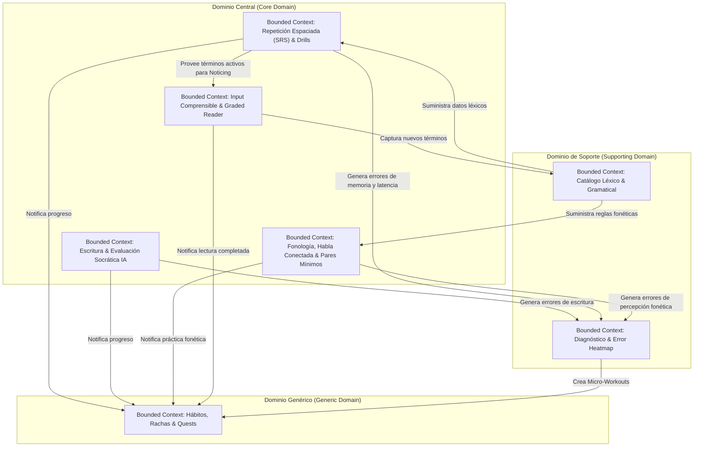

# Diseño Guiado por el Dominio (Domain-Driven Design - DDD)
## English Learning Assistant (ELA)

Este documento modela la lógica del software utilizando los principios de **Domain-Driven Design (DDD)** de Eric Evans, separando el sistema en **Contextos Delimitados (Bounded Contexts)**, definiendo sus **Agregados**, **Entidades**, **Objetos de Valor (Value Objects)** y **Eventos de Dominio**.

---

## 1. Mapa de Contextos Delimitados (Context Map)

---

## 2. Definición Detallada de Bounded Contexts

### 2.1. Contexto Delimitado: Catálogo Léxico & Gramatical (`LexiconContext`)
- **Propósito:** Administrar el repositorio maestro de conocimiento del idioma inglés (vocabulario, taxonomía funcional, chunks fraseológicos, falsos amigos y gramática).
- **Entidades:**
  - `VocabItem` (Identificador, término en inglés, categoría gramatical, traducción, nivel CEFR).
  - `PhraseChunk` (Identificador, colocación/phrasal verb/idiom, componentes, patrón sintáctico).
  - `GrammarRule` (Identificador, nombre, explicación contrastiva, ejemplos).
- **Value Objects:**
  - `GrammaticalCategory` (Content vs. Function, tipo específico).
  - `CefrLevel` (A1, A2, B1, B2, C1, C2).
  - `FalseFriendAlert` (Palabra española similar, significado real, prevención).
  - `MorphologicalFamily` (Raíz, prefijos, sufijos derivados).

### 2.2. Contexto Delimitado: Repetición Espaciada & Proceduralización (`SrsContext`)
- **Propósito:** Orquestar el ciclo de vida de la memoria del estudiante utilizando FSRS y gestionar los drills de velocidad para automatización procedural.
- **Raíz del Agregado (Aggregate Root):** `SrsCard`
  - Contiene: `cardId`, `targetType`, `targetId`, `state`, `stability`, `difficulty`, `lastReviewedAt`, `scheduledFor`.
  - Mantiene la colección de `ReviewHistory`.
  - Referencia al banco de `VocabContextExample` para rotación de oraciones en cada repaso.
- **Entidades de Dominio:**
  - `SpeedDrillSession` (Sesión cronometrada de 3-5 s por prompt, latencia promedio y porcentaje de precisión).
- **Value Objects:**
  - `FsrsGrade` (Again: 1, Hard: 2, Good: 3, Easy: 4).
  - `MemoryState` (Estabilidad $S$, Dificultad $D$, Retención estimada $R$).
  - `ReviewInterval` (Días calculados para el siguiente repaso).
- **Eventos de Dominio:**
  - `CardReviewedDomainEvent` (Emite: cardId, grade, newStability, wasFailure).
  - `SpeedDrillCompletedDomainEvent` (Emite: drillType, avgLatencyMs, accuracyRate).

### 2.3. Contexto Delimitado: Fonología, Habla Conectada & Pares Mínimos (`PhonologyContext`)
- **Propósito:** Desglosar fonológicamente oraciones, transcribir en IPA y entrenar la agudeza perceptiva mediante pares mínimos y reconocimiento de habla conectada.
- **Raíz del Agregado:** `PhoneticSentence`
  - Contiene: texto ortográfico, tokens de palabras, lista de fenómenos fonéticos detectados en fronteras (`PhoneticBoundaryEvent`).
- **Entidades de Dominio:**
  - `MinimalPairChallenge` (Ítem de contraste fonético, audio del estímulo, opciones contrastivas y tiempo límite de respuesta).
- **Value Objects:**
  - `IpaTranscription` (Cadena IPA normalizada, símbolos de acento `ˈ` y `ˌ`).
  - `ConnectedSpeechRuleType` (Elision, Assimilation, Linking_CV, Linking_VV_j, Linking_VV_w, WeakForm).
  - `PhonemicContrast` (Par fonológico contrastado, p. ej. /iː/ vs /ɪ/).
- **Eventos de Dominio:**
  - `PhoneticPracticeCompletedDomainEvent` (Emite: practiceType, accuracyRate, reactionTimeMs).

### 2.4. Contexto Delimitado: Escritura & Evaluación Socrática (`WritingEvaluationContext`)
- **Propósito:** Gestionar el ciclo de redacción libre/guiada, el andamiaje socrático en 2 fases y la evaluación analítica con Google Gemini.
- **Raíz del Agregado:** `WritingSubmission`
  - Contiene: `submissionId`, `promptId`, `originalText`, `createdAt`, `evaluationStatus` (Draft, InSocraticReview, Evaluated, Failed).
  - Colección de `WritingDraftRevision` (Historial de iteraciones del usuario tras recibir pistas).
  - Entidad interna: `EvaluationResult` (puntuación CEFR, lista de `CorrectionFeedback`).
- **Value Objects:**
  - `SocraticClue` (Pista reflexiva sin solución directa para guiar la autocorrección).
  - `CorrectionFeedback` (Segmento problemático, tipo de error, explicación en español, reformulación nativa).
  - `MicroChallenge` (Pregunta rápida generada para verificar la asimilación).
- **Eventos de Dominio:**
  - `SocraticCluesDeliveredDomainEvent`.
  - `WritingEvaluatedDomainEvent` (Emite: submissionId, errorCount, errorsIdentified).

### 2.5. Contexto Delimitado: Diagnóstico & Heatmap (`DiagnosticsContext`)
- **Propósito:** Recopilar eventos de error provenientes de todos los contextos, calcular la severidad ponderada y disparar sesiones correctivas dirigidas.
- **Raíz del Agregado:** `UserWeaknessProfile`
  - Contiene: mapa de categorías de error con sus índices de frecuencia temporal (`WeaknessIndex`).
- **Entidades:**
  - `UserErrorLog` (Instancia de un fallo con marca de tiempo, contexto de texto y regla violada).
  - `MicroWorkout` (Sesión de práctica express de 5 minutos generada automáticamente).
- **Eventos de Dominio:**
  - `ChronicWeaknessDetectedDomainEvent` (Disparado cuando un error supera el umbral crítico).

### 2.6. Contexto Delimitado: Hábitos & Gamificación (`HabitContext`)
- **Propósito:** Fomentar la disciplina y la consistencia diaria del aprendiz.
- **Raíz del Agregado:** `UserStreak`
  - Atributos: `currentStreakCount`, `longestStreakRecord`, `lastActiveDate`, `availableFreezes`.
- **Entidad:** `DailyQuestPlan`
  - Lista de metas del día (`QuestItem`: SRS terminado, Fonética/Pares Mínimos, Texto/Micro-writing, Lectura i+1, Speed Drill).
- **Eventos de Dominio:**
  - `DailyGoalCompletedDomainEvent`.
  - `StreakFrozenDomainEvent`.
  - `StreakBrokenDomainEvent`.

### 2.7. Contexto Delimitado: Input Comprensible & Lectura Graduada (`ReadingInputContext`)
- **Propósito:** Proveer un entorno de lectura inmersiva con anotación reactiva de Noticing y extracción instantánea de léxico hacia SQLite.
- **Raíz del Agregado:** `GradedArticle`
  - Atributos: `articleId`, `title`, `contentHtml`, `cefrLevel`, `wordCount`, `readPercentage`.
- **Entidades:**
  - `NoticingTokenHighlight` (Posición de palabras activas en la memoria del estudiante destacadas en el texto).
- **Value Objects:**
  - `ArticleSource` (Texto propio del usuario, artículo provisto por la biblioteca ELA).
- **Eventos de Dominio:**
  - `WordCapturedFromReaderDomainEvent` (Disparado al hacer clic en "Añadir a FSRS", emite el término hacia `LexiconContext`).
  - `ArticleReadingCompletedDomainEvent`.
