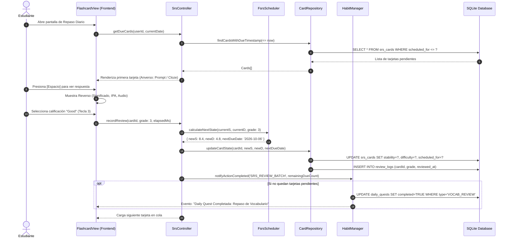
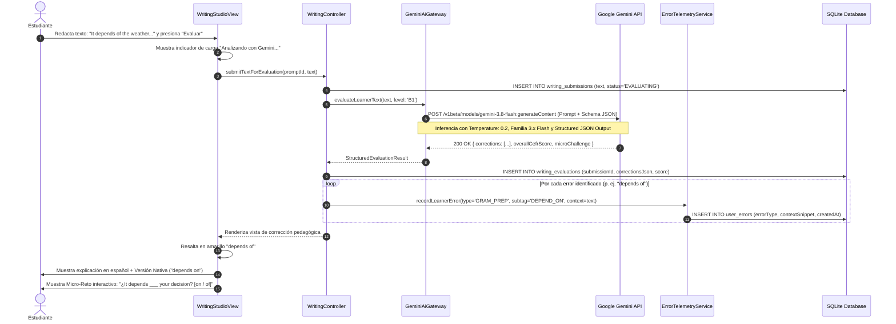
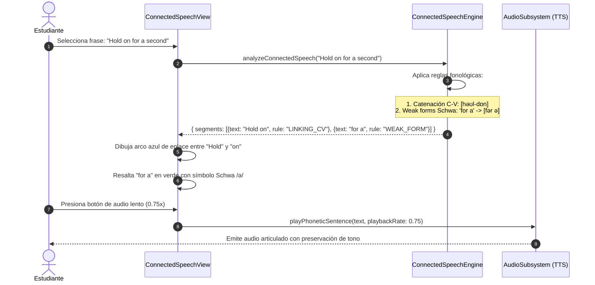
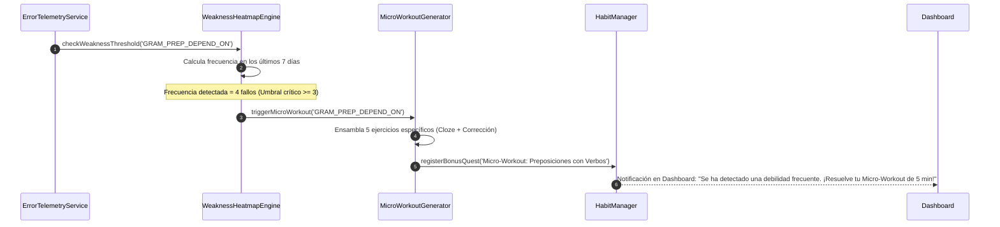
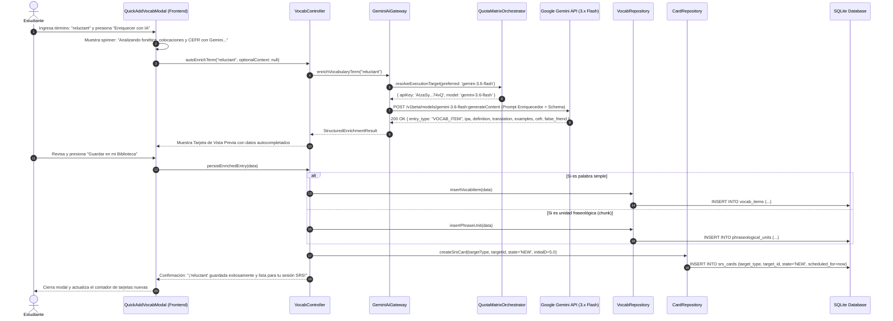
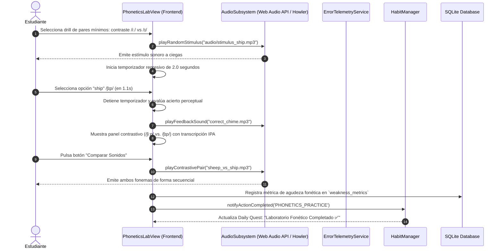
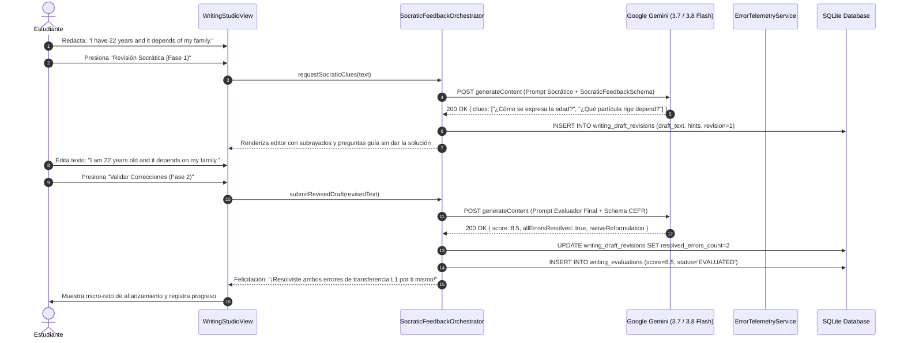
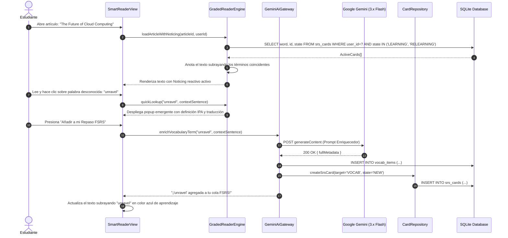

# Diagramas de Secuencia de Flujos Clave
## English Learning Assistant (ELA)

Este documento detalla los flujos de interacción temporal entre los componentes del sistema mediante **Diagramas de Secuencia UML (Mermaid)** para los cuatro procesos más críticos de la aplicación.

---

## 1. Flujo 1: Sesión de Repaso FSRS y Actualización de Hábitos

Describe cómo se cargan las tarjetas pendientes, cómo se calcula el algoritmo FSRS y cómo impacta en las metas diarias:

---

## 2. Flujo 2: Taller de Redacción y Evaluación Pedagógica con Google Gemini

Describe el ciclo desde que el usuario redacta su texto hasta que la IA devuelve el feedback estructurado con explicaciones en español y micro-retos:

---

## 3. Flujo 3: Desglose Interactivo de Habla Conectada (Connected Speech)

Describe cómo el sistema tokeniza y visualiza las reglas fonéticas al reproducir audio:

---

## 4. Flujo 4: Detección de Falla Crónica y Generación de Micro-Workout

Describe cómo un error reiterado dispara automáticamente un entrenamiento express:

---

## 5. Flujo 5: Ingesta Rápida y Auto-Enriquecimiento de Vocabulario con Gemini

Describe el proceso donde el usuario ingresa solo una palabra y la IA deduce toda la información lingüística, insertándola en la base de datos y programando su tarjeta FSRS:

---

## 6. Flujo 6: Discriminación Auditiva Forzada de Pares Mínimos y Habla Conectada

Describe cómo el estudiante escucha un estímulo fonético a ciegas, toma una decisión rápida bajo presión de tiempo (límite de 2.0s) y analiza el contraste fonético resultante:

---

## 7. Flujo 7: Taller de Redacción Socrática en Dos Fases

Describe el ciclo donde Gemini entrega primero pistas de andamiaje y el usuario auto-corrige su propio texto antes de revelar la versión nativa final:

---

## 8. Flujo 8: Lectura de Input Comprensible ($i+1$) y Captura en 1 Clic

Describe cómo el usuario lee un artículo, visualiza palabras en estudio resaltadas y extrae nuevos términos hacia FSRS:

