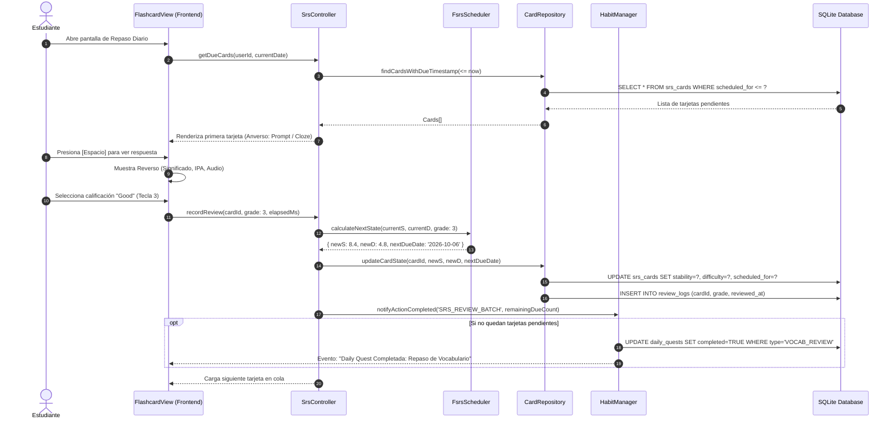
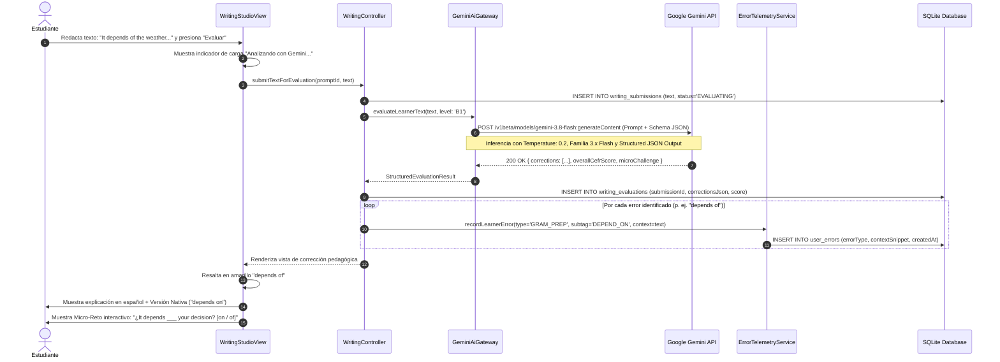
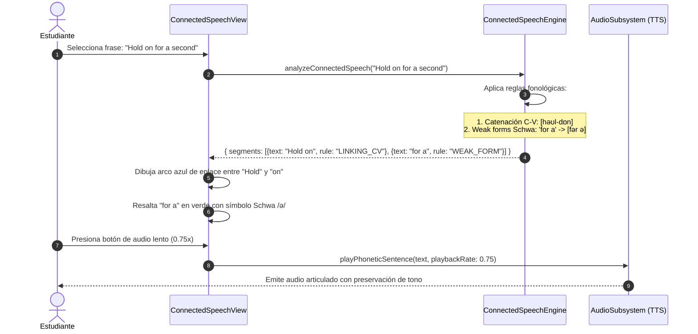
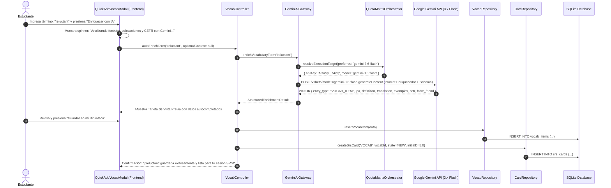
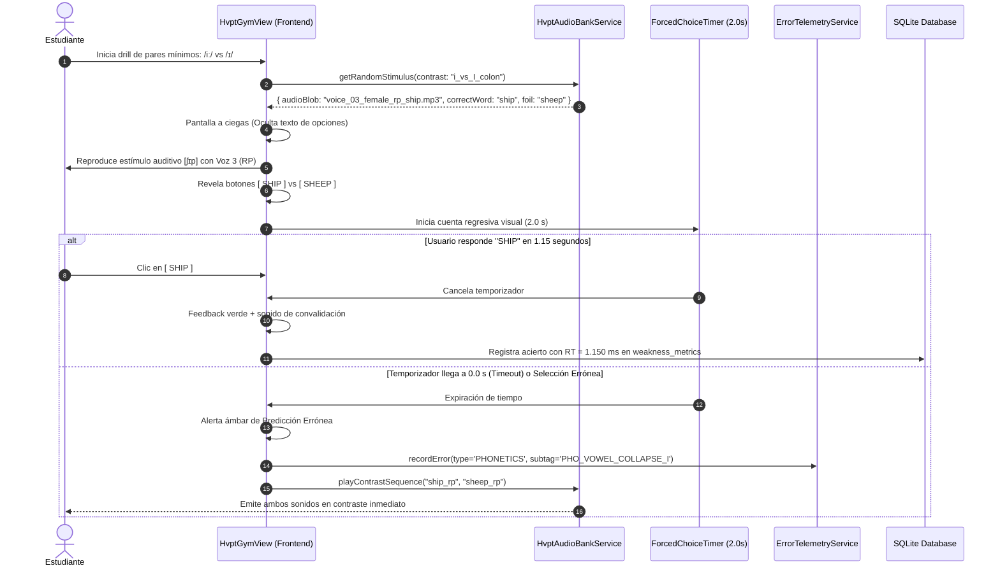
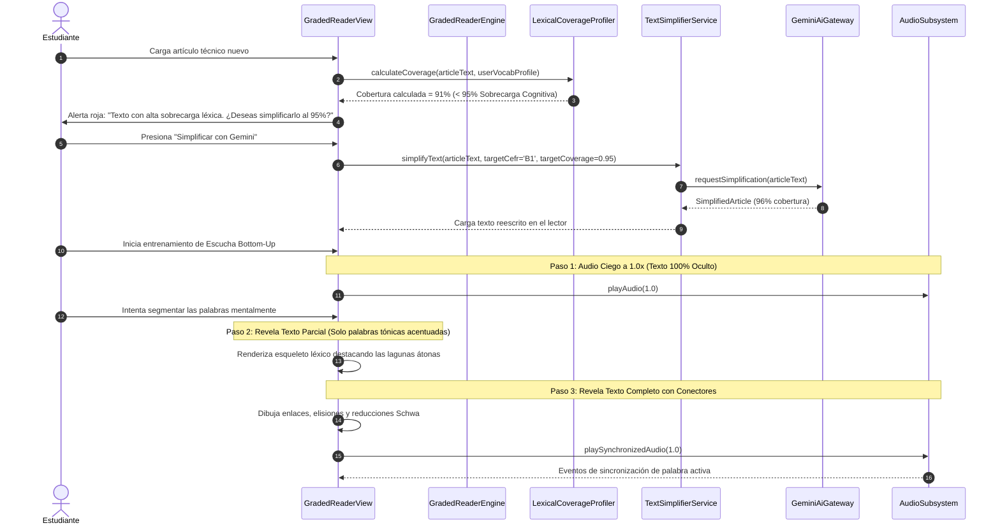
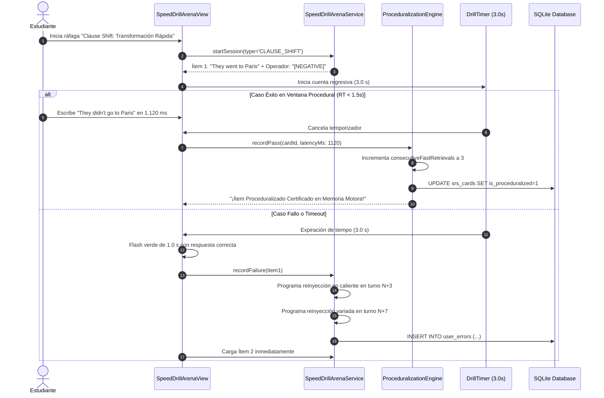

# Diagramas de Secuencia de Flujos Clave
## English Learning Assistant (ELA)

Este documento detalla los flujos de interacción temporal entre los componentes del sistema mediante **Diagramas de Secuencia UML (Mermaid)** para los procesos fundamentales del software, reflejando fielmente el marco pedagógico de [`docs/02_pedagogical_framework/`](../02_pedagogical_framework/).

---

## 1. Flujo 1: Sesión de Repaso FSRS y Actualización de Hábitos

Describe cómo se cargan las tarjetas pendientes, cómo se calcula el algoritmo FSRS y cómo impacta en las metas diarias:

---

## 2. Flujo 2: Taller de Redacción y Evaluación Pedagógica con Google Gemini

Describe el ciclo desde que el usuario redacta su texto hasta que la IA devuelve el feedback estructurado con explicaciones en español y micro-retos:

---

## 3. Flujo 3: Desglose Interactivo de Habla Conectada (Connected Speech)

Describe cómo el sistema tokeniza y visualiza las reglas fonéticas al reproducir audio:

---

## 4. Flujo 4: Ingesta Rápida y Auto-Enriquecimiento de Vocabulario con Gemini

Describe el proceso donde el usuario ingresa solo una palabra y la IA deduce toda la información lingüística, insertándola en SQLite y programando su tarjeta FSRS:

---

## 5. Flujo 5: Gimnasio HVPT Multi-Voz con Elección Forzada a Ciegas (2.0s)

Describe cómo el estudiante es expuesto a estímulos auditivos a ciegas entre 4 a 6 voces nativas con restricción estricta de tiempo:

---

## 6. Flujo 6: Decodificación Auditiva Bottom-Up en Tres Pasos con Simplificación al 95%

Describe cómo el alumno entrena su audición segmentando el habla continua de forma ascendente:

---

## 7. Flujo 7: Speed Drills, Bucle de Micro-Recuperación (N+3/N+7) y Certificación de Proceduralización

Describe el proceso de compilación motora en ganglios basales:

