# Diagrama Entidad-Relación (ER Diagram)
## English Learning Assistant (ELA)

Este documento detalla el **Modelo Entidad-Relación Lógico y Físico v2.0** de ELA, modelando las entidades, sus atributos, tipos de datos, claves primarias (`PK`), claves foráneas (`FK`) y relaciones de cardinalidad, reflejando el esquema en [`sqlite_schema.sql`](./sqlite_schema.sql).

---

## 1. Diagrama ER Completo (Mermaid)

```mermaid
erDiagram
    USERS ||--|| USER_STREAKS : "posee"
    USERS ||--o{ DAILY_QUESTS : "tiene asignadas"
    USERS ||--o{ SRS_CARDS : "estudia"
    USERS ||--o{ WRITING_SUBMISSIONS : "redacta"
    USERS ||--o{ TBLT_TASK_SUBMISSIONS : "ejecuta misiones en"
    USERS ||--o{ AI_API_KEYS : "administra"
    USERS ||--o{ READER_ARTICLES : "lee textos en"
    USERS ||--o{ SPEED_DRILL_SESSIONS : "ejecuta drills en"
    USERS ||--o{ PROSODY_SHADOWING_RECORDS : "graba voz en"
    USERS ||--o{ USER_ERRORS : "comete fallos en"

    AI_API_KEYS ||--o{ API_KEY_MODEL_QUOTAS : "monitorea cuota"
    USER_STREAKS ||--o{ STREAK_FREEZE_LOGS : "consume / gana"

    VOCAB_ITEMS ||--o{ PHRASEOLOGICAL_UNITS : "forma parte de"
    VOCAB_ITEMS ||--o{ SRS_CARDS : "se estudia en"
    VOCAB_ITEMS ||--o{ VOCAB_CONTEXT_EXAMPLES : "posee contextos de"
    PHRASEOLOGICAL_UNITS ||--o{ VOCAB_CONTEXT_EXAMPLES : "posee contextos de"

    GRAMMAR_RULES ||--o{ SRS_CARDS : "se practica en"
    PHONETIC_RULES ||--o{ SRS_CARDS : "se entrena en"
    PROSODY_RULES ||--o{ PROSODY_SHADOWING_RECORDS : "evalúa imitación de"
    L1_TRANSFER_RULES ||--o{ SRS_CARDS : "genera drills en"
    TBLT_TASKS ||--o{ TBLT_TASK_SUBMISSIONS : "recibe entregables de"

    SRS_CARDS ||--o{ REVIEW_LOGS : "registra historial"
    SRS_CARDS ||--o{ USER_ERRORS : "produce fallos en"

    WRITING_PROMPTS ||--o{ WRITING_SUBMISSIONS : "inspira"
    WRITING_SUBMISSIONS ||--|| WRITING_EVALUATIONS : "es evaluada en"
    WRITING_SUBMISSIONS ||--o{ WRITING_DRAFT_REVISIONS : "itera borradores"

    USER_ERRORS }o--|| ERROR_TAXONOMY : "clasificado como"
    ERROR_TAXONOMY ||--o{ WEAKNESS_METRICS : "calcula índice"
    WEAKNESS_METRICS ||--o{ MICRO_WORKOUTS : "dispara práctica"

    USERS {
        string id PK
        string username
        string target_accent "GENERAL_AMERICAN | RECEIVED_PRONUNCIATION"
        string current_cefr_target "A1 | A2 | B1 | B2 | C1 | C2"
        string default_ai_model
        string api_key_rotation_mode
        boolean backlog_throttling_enabled
        integer max_daily_review_limit
        datetime created_at
    }

    VOCAB_ITEMS {
        string id PK
        string word
        string grammatical_dimension "CONTENT | FUNCTION | CHUNK"
        string part_of_speech "NOUN | VERB | ADJ | ADV | PREP | CONJ | DET | PRON"
        string subcategory
        string definition_en
        string translation_es
        string ipa_general_american
        string ipa_received_pronunciation
        string cefr_level "A1 | A2 | B1 | B2 | C1 | C2"
        boolean is_false_friend
        string false_friend_note
        json morphological_family_json
        datetime created_at
    }

    PHRASEOLOGICAL_UNITS {
        string id PK
        string primary_vocab_id FK
        string chunk_type "COLLOCATION | PHRASAL_VERB | IDIOM | BINOMIAL | SENTENCE_FRAME"
        string text
        string meaning_es
        string phrasal_verb_type "TYPE_1 | TYPE_2 | TYPE_3 | TYPE_4"
        boolean pronoun_must_split
        string example_1
        string example_2
        string cefr_level
        datetime created_at
    }

    CONCEPTUAL_MOTION_VERBS {
        string id PK
        string verb_base
        string manner_description_es
        json satellite_particles_json
        string spanish_static_equivalent
        string cefr_level
        string example_sentence
    }

    TOPOLOGICAL_SCHEMAS {
        string id PK
        string preposition "IN | ON | AT"
        string spatial_dimension "3D_CONTAINER | 2D_SURFACE | 0D_POINT"
        string core_concept_es
        json spatial_rules_json
        json temporal_rules_json
        string svg_diagram_key
    }

    POLYSEMIC_PAIRS {
        string id PK
        string pair_code "MAKE_VS_DO | SAY_TELL | HEAR_LISTEN"
        string title
        string explanation_es
        json contrast_matrix_json
    }

    GRAMMAR_RULES {
        string id PK
        string code "e.g. GRAM_CONDITIONAL_2"
        string title
        string category
        string explanation_es
        string formula_syntax
        string contrastive_l1_note
        string cefr_level
    }

    L1_TRANSFER_RULES {
        string id PK
        string rule_code "L1_PREP_DEPEND_ON | L1_3RD_PERSON_S"
        string domain "MORPHOSYNTACTIC | PHONOLOGICAL | LEXICAL"
        string spanish_misconception
        string target_english_rule
        json exercise_template_json
        string severity "LOW | MEDIUM | HIGH | CRITICAL"
    }

    PHONETIC_RULES {
        string id PK
        string rule_type "ELISION | ASSIMILATION | LINKING_CV | WEAK_FORM | VOT_ASPIRATION"
        string rule_name
        string pattern_regex
        string description_es
        string example_sentence
        string example_ipa_breakdown
        string audio_sample_path
    }

    PROSODY_RULES {
        string id PK
        string prosody_type "NUCLEAR_STRESS | THOUGHT_GROUP | PITCH_FALLING | PITCH_RISING | PITCH_FALL_RISE"
        string title
        string pragmatic_function_es
        string example_sentence
        integer tonic_word_index
        json native_f0_curve_json
    }

    PROSODY_SHADOWING_RECORDS {
        string id PK
        string user_id FK
        string prosody_rule_id FK
        json user_f0_curve_json
        json target_f0_curve_json
        float prosodic_match_score
        string audio_recording_path
        datetime recorded_at
    }

    SRS_CARDS {
        string id PK
        string user_id FK
        string target_type "VOCAB | PHRASE | GRAMMAR | PHONETICS | L1_TRANSFER"
        string target_id
        string state "NEW | LEARNING | REVIEW | RELEARNING"
        float stability
        float difficulty
        integer reps
        integer lapses
        boolean is_proceduralized
        integer consecutive_fast_retrievals
        integer last_reaction_time_ms
        datetime scheduled_for
    }

    SPEED_DRILL_SESSIONS {
        string id PK
        string user_id FK
        string drill_type "CLAUSE_SHIFT | THIRD_PERSON | PREPOSITION_REFLEX | AUDITORY_SNAP"
        integer total_prompts
        integer correct_count
        integer procedural_pass_count
        float avg_response_time_ms
        datetime completed_at
    }

    TBLT_TASKS {
        string id PK
        string title
        text scenario_description
        string cefr_level
        string task_type "INFO_EXCHANGE | PROBLEM_SOLVING | NEGOTIATION | PERSUASION"
        json suggested_priming_chunks_json
        string expected_non_linguistic_outcome
        integer time_limit_minutes
    }

    TBLT_TASK_SUBMISSIONS {
        string id PK
        string task_id FK
        string user_id FK
        text during_task_text
        float linguistic_score
        float sociolinguistic_score
        float discursive_score
        float strategic_score
        float overall_score
        json fonf_feedback_json
        datetime submitted_at
    }

    READER_ARTICLES {
        string id PK
        string user_id FK
        string title
        text content_text
        string cefr_level
        integer total_words
        float lexical_coverage_ratio
        string reading_mode "EXTENSIVE | INTENSIVE | OVERLOAD"
        boolean is_simplified
        string bottom_up_stage "STEP_1_BLIND | STEP_2_TONIC | STEP_3_FULL"
        float read_percentage
    }

    USER_ERRORS {
        string id PK
        string user_id FK
        string error_taxonomy_id FK
        string source "SRS | WRITING_EVALUATION | PHONETICS_DRILL | SPEED_DRILL | TBLT"
        string source_reference_id
        text context_snippet
        text incorrect_token
        text correct_token
        datetime committed_at
    }
```

