# Diagrama Entidad-Relación (ER Diagram)
## English Learning Assistant (ELA)

Este documento detalla el **Modelo Entidad-Relación Lógico y Físico** del sistema, modelando las entidades, sus atributos, tipos de datos, claves primarias (`PK`), claves foráneas (`FK`) y relaciones de cardinalidad.

---

## 1. Diagrama ER Completo (Mermaid)

```mermaid
erDiagram
    VOCAB_ITEMS ||--o{ PHRASEOLOGICAL_UNITS : "forma parte de"
    VOCAB_ITEMS ||--o{ SRS_CARDS : "se estudia en"
    VOCAB_ITEMS ||--o{ VOCAB_CONTEXT_EXAMPLES : "posee contextos de"
    PHRASEOLOGICAL_UNITS ||--o{ VOCAB_CONTEXT_EXAMPLES : "posee contextos de"
    GRAMMAR_RULES ||--o{ SRS_CARDS : "se practica en"
    PHONETIC_RULES ||--o{ SRS_CARDS : "se entrena en"

    SRS_CARDS ||--o{ REVIEW_LOGS : "registra historial"
    SRS_CARDS ||--o{ USER_ERRORS : "produce fallos en"

    WRITING_PROMPTS ||--o{ WRITING_SUBMISSIONS : "inspira"
    WRITING_SUBMISSIONS ||--|| WRITING_EVALUATIONS : "es evaluada en"
    WRITING_SUBMISSIONS ||--o{ WRITING_DRAFT_REVISIONS : "itera borradores"
    WRITING_EVALUATIONS ||--o{ USER_ERRORS : "detecta fallos en"

    USER_ERRORS }o--|| ERROR_TAXONOMY : "clasificado como"
    ERROR_TAXONOMY ||--o{ WEAKNESS_METRICS : "calcula índice"
    WEAKNESS_METRICS ||--o{ MICRO_WORKOUTS : "dispara práctica"

    USERS ||--|| USER_STREAKS : "posee"
    USERS ||--o{ DAILY_QUESTS : "tiene asignadas"
    USERS ||--o{ SRS_CARDS : "estudia"
    USERS ||--o{ WRITING_SUBMISSIONS : "redacta"
    USERS ||--o{ AI_API_KEYS : "administra"
    USERS ||--o{ READER_ARTICLES : "lee textos en"
    USERS ||--o{ SPEED_DRILL_SESSIONS : "ejecuta drills en"
    AI_API_KEYS ||--o{ API_KEY_MODEL_QUOTAS : "monitorea cuota"

    USER_STREAKS ||--o{ STREAK_FREEZE_LOGS : "consume / gana"

    VOCAB_ITEMS {
        string id PK
        string word
        string grammatical_dimension "CONTENT | FUNCTION | CHUNK"
        string part_of_speech "NOUN | VERB | ADJ | ADV | PREP | CONJ | DET | PRON"
        string subcategory
        string definition_en
        string translation_es
        string ipa_general_american
        string ipa_received_pronunciation
        string cefr_level "A1 | A2 | B1 | B2 | C1 | C2"
        boolean is_false_friend
        string false_friend_note
        string morphological_family_json
        datetime created_at
    }

    PHRASEOLOGICAL_UNITS {
        string id PK
        string primary_vocab_id FK
        string chunk_type "COLLOCATION | PHRASAL_VERB | IDIOM | SENTENCE_FRAME"
        string text
        string meaning_es
        string phrasal_verb_type "TYPE_1_INTRANSITIVE | TYPE_2_SEPARABLE | TYPE_3_INSEPARABLE | TYPE_4_THREE_PART"
        string example_1
        string example_2
        string cefr_level
    }

    GRAMMAR_RULES {
        string id PK
        string code "e.g. GRAM_CONDITIONAL_2"
        string title
        string category "TENSES | MODALS | PREPOSITIONS | CLAUSES"
        string explanation_es
        string formula_syntax
        string contrastive_l1_note
        string cefr_level
    }

    PHONETIC_RULES {
        string id PK
        string rule_type "ELISION | ASSIMILATION | LINKING_CV | LINKING_VV_J | LINKING_VV_W | WEAK_FORM"
        string rule_name
        string pattern_regex
        string description_es
        string example_sentence
        string example_ipa_breakdown
        string audio_sample_path
    }

    SRS_CARDS {
        string id PK
        string user_id FK
        string target_type "VOCAB | PHRASE | GRAMMAR | PHONETICS"
        string target_id "Polymorphic reference"
        string state "NEW | LEARNING | REVIEW | RELEARNING"
        float stability "S in days"
        float difficulty "D (1.0 - 10.0)"
        integer reps
        integer lapses
        datetime last_reviewed_at
        datetime scheduled_for
        datetime created_at
    }

    REVIEW_LOGS {
        string id PK
        string card_id FK
        integer rating "1: Again, 2: Hard, 3: Good, 4: Easy"
        string state_before
        float stability_before
        float difficulty_before
        float new_stability
        float new_difficulty
        integer elapsed_ms
        datetime reviewed_at
    }

    WRITING_PROMPTS {
        string id PK
        string title
        string prompt_text
        string topic "WORK | DAILY_LIFE | TECHNOLOGY | PHILOSOPHY"
        string cefr_level
        string suggested_vocabulary_json
    }

    WRITING_SUBMISSIONS {
        string id PK
        string user_id FK
        string prompt_id FK
        text user_text
        integer word_count
        string status "DRAFT | EVALUATING | EVALUATED | ERROR"
        datetime submitted_at
    }

    WRITING_EVALUATIONS {
        string id PK
        string submission_id FK
        string model_used "gemini-3.5-flash | gemini-3.6-flash | gemini-3.7-flash | gemini-3.8-flash"
        string estimated_cefr
        float grammar_score
        float vocabulary_score
        float coherence_score
        text overall_feedback_es
        json corrections_json
        json micro_challenge_json
        datetime evaluated_at
    }

    ERROR_TAXONOMY {
        string id PK
        string code "e.g. L1_PREP_DEPENDS_ON"
        string domain "GRAMMAR | LEXICON | PHONETICS | PRAGMATICS"
        string severity "LOW | MEDIUM | HIGH | CRITICAL"
        string label_es
        string detailed_explanation_es
    }

    USER_ERRORS {
        string id PK
        string user_id FK
        string error_taxonomy_id FK
        string source "SRS | WRITING_EVALUATION | PHONETICS_DRILL"
        string source_reference_id
        text context_snippet
        text incorrect_token
        text correct_token
        datetime committed_at
    }

    WEAKNESS_METRICS {
        string id PK
        string user_id FK
        string error_taxonomy_id FK
        integer occurrences_last_7_days
        integer total_occurrences
        float weakness_score
        datetime last_detected_at
    }

    MICRO_WORKOUTS {
        string id PK
        string user_id FK
        string weakness_metric_id FK
        string title
        json exercises_json
        boolean is_completed
        datetime completed_at
        datetime created_at
    }

    USERS {
        string id PK
        string username
        string target_accent "GENERAL_AMERICAN | RECEIVED_PRONUNCIATION"
        string current_cefr_target "B1 | B2 | C1"
        string default_ai_model "gemini-3.5-flash | gemini-3.6-flash | gemini-3.7-flash | gemini-3.8-flash"
        string api_key_rotation_mode "FAILOVER_ON_QUOTA | MANUAL_PRIMARY | ROUND_ROBIN"
        datetime created_at
    }

    AI_API_KEYS {
        string id PK
        string user_id FK
        string label "e.g. Personal, Trabajo, Backup"
        string api_key_encrypted
        string masked_key "e.g. AIza...4xK9"
        boolean is_active
        boolean is_primary
        string status "VALID | INVALID | QUOTA_EXCEEDED | UNTESTED"
        datetime last_tested_at
        datetime created_at
    }

    API_KEY_MODEL_QUOTAS {
        string id PK
        string api_key_id FK
        string model_id "gemini-3.5-flash | gemini-3.6-flash | gemini-3.7-flash | gemini-3.8-flash"
        integer requests_today
        integer daily_limit "20 RPD per model"
        integer rpm_limit "5 RPM"
        datetime last_request_timestamp
        datetime rpm_cooldown_until
        string rpd_status "AVAILABLE | EXHAUSTED_UNTIL_MIDNIGHT_PT"
        date last_pt_reset_date "Pacific Time Date"
        datetime created_at
    }

    USER_STREAKS {
        string id PK
        string user_id FK
        integer current_streak
        integer longest_streak
        date last_activity_date
        integer available_freezes
        datetime updated_at
    }

    STREAK_FREEZE_LOGS {
        string id PK
        string user_streak_id FK
        string event_type "CONSUMED | EARNED_BONUS | PURCHASED"
        date affected_date
        string reason
        datetime created_at
    }

    DAILY_QUESTS {
        string id PK
        string user_id FK
        date quest_date
        string quest_type "VOCAB_SRS | PHONETICS_LISTEN | WRITING_SUBMISSION | MICRO_WORKOUT | SPEED_DRILL | GRADED_READER"
        string description
        integer target_count
        integer current_count
        boolean is_completed
        datetime completed_at
    }

    VOCAB_CONTEXT_EXAMPLES {
        string id PK
        string vocab_id FK
        string phrase_id FK
        string sentence_en
        string sentence_es
        string cloze_target
        string audio_url
        string cefr_level
        datetime created_at
    }

    READER_ARTICLES {
        string id PK
        string user_id FK
        string title
        text content_text
        string source_url
        string cefr_level
        integer total_words
        float read_percentage
        datetime created_at
    }

    WRITING_DRAFT_REVISIONS {
        string id PK
        string submission_id FK
        integer revision_number
        text draft_text
        json ai_hints_json
        integer resolved_errors_count
        datetime created_at
    }

    SPEED_DRILL_SESSIONS {
        string id PK
        string user_id FK
        string drill_type "COLLOCATION_BLITZ | PREPOSITION_RAPID_FIRE | CONNECTED_SPEECH_EAR"
        integer total_prompts
        integer correct_count
        float avg_response_time_ms
        datetime completed_at
    }
```

---

## 2. Descripción de Integridad Referencial

- **Borrado en Cascada Seguro:** Las tarjetas `SRS_CARDS` y los `REVIEW_LOGS` mantienen integridad referencial. Si un usuario elimina un elemento de vocabulario personalizado, sus registros históricos se archivan o borran ordenadamente mediante políticas `ON DELETE CASCADE`.
- **Campos Polimórficos de Estudio:** `SRS_CARDS` referencia a través de `target_type` y `target_id` a palabras de vocabulario, chunks fraseológicos, reglas gramaticales o fenómenos de habla conectada, permitiendo que el motor de repetición espaciada unifique todo el aprendizaje en una única cola de memoria.
- **Indexación Clave:** Se proyectan índices B-Tree específicos en campos de fecha (`scheduled_for`, `reviewed_at`, `quest_date`, `committed_at`) para garantizar lecturas instantáneas en menos de 5 ms.
