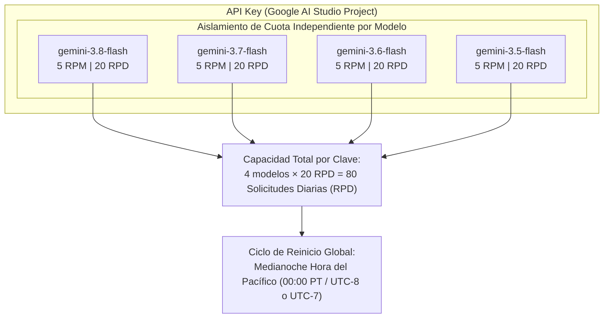
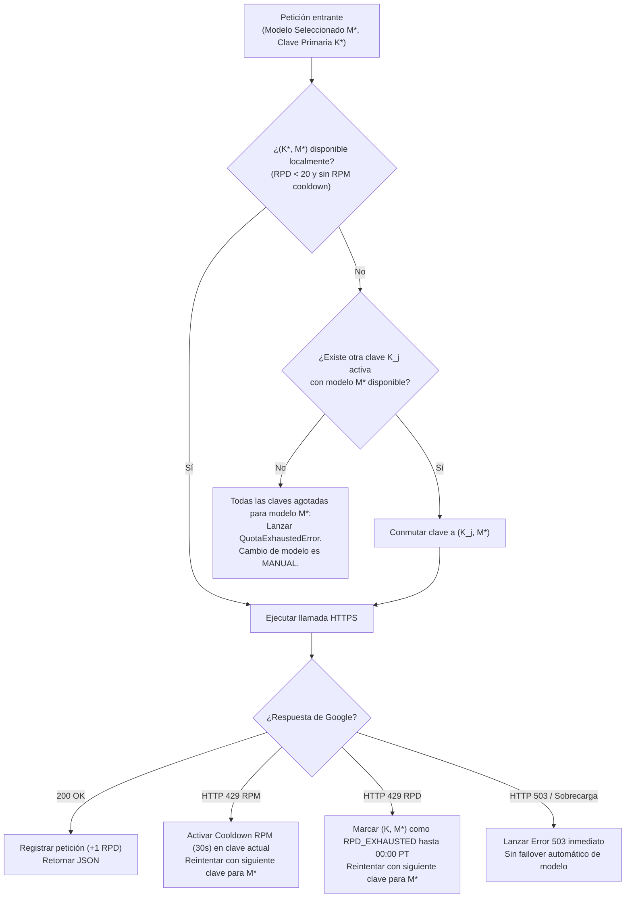

# Algoritmo de Resiliencia de Cuotas IA (Matriz 2D Modelo x Clave)
## English Learning Assistant (ELA)

Este documento especifica la arquitectura matemática y algorítmica del **Orquestador de Resiliencia de Cuotas 2D** para Google AI Studio / Gemini API, diseñado para aprovechar al máximo las cuotas de la familia 3.x Flash y garantizar tolerancia a fallos.

---

## 1. Topología de Cuotas de Google AI Studio

Conforme a la documentación oficial de Google AI Studio ([API Error Codes & Quotas](https://aistudio.google.com/docs/api-errors)), los límites de la capa gratuita/estándar se estructuran con las siguientes propiedades críticas:



### 1.1. Principio de Aislamiento de Cuota por Modelo
- El límite de **20 solicitudes por día (RPD)** y **5 solicitudes por minuto (RPM)** **NO** se comparte globalmente entre los modelos de una misma clave.
- Si una clave agota sus 20 peticiones diarias en `gemini-3.8-flash`, dicha clave **aún dispone de 20 peticiones intactas en `gemini-3.7-flash`, 20 en `gemini-3.6-flash` y 20 en `gemini-3.5-flash`**.
- Por ende, el presupuesto operativo real de cada API Key es de **80 RPD**.
- Con $N$ claves configuradas en el pool, el sistema administra un presupuesto diario de:
$$\text{Presupuesto RPD Total} = N \times 4 \times 20 = 80N \text{ solicitudes/día}$$

### 1.2. El Ciclo de Reinicio a Medianoche del Pacífico (Pacific Time)
- Google AI Studio reinicia los contadores de cuota diaria a las **00:00:00 PT** (Pacific Time), correspondiente a:
  - **UTC-8** durante el horario estándar (PST).
  - **UTC-7** durante el horario de verano (PDT).
- El software calcula la hora local del estudiante frente al meridiano del Pacífico para sincronizar el reinicio automático de los contadores locales.

---

## 2. Anatomía de Errores HTTP 429 (`RESOURCE_EXHAUSTED`)

Cuando Google devuelve un código HTTP 429, el orquestador inspecciona el payload JSON para discriminar la causa raíz:

| Causa del Error | Identificador en Payload de Error / Cabeceras | Diagnóstico | Acción del Orquestador |
| :--- | :--- | :--- | :--- |
| **Saturación por Minuto (RPM)** | `GenerateContentRequestsPerMinutePerProjectPerModel` o cabecera `Retry-After: < 60s` | Se enviaron más de 5 peticiones en los últimos 60 segundos. | **Cooldown Temporal:** Esperar 15-30s con backoff o alternar a otra clave activa para el mismo modelo inmediatamente. |
| **Agotamiento Diario (RPD)** | `GenerateContentRequestsPerDayPerProjectPerModel` o `Quota exceeded for quota metric 'Generate Content Requests' and limit 'Requests per day'` | Se alcanzaron las 20 peticiones del día para ese modelo específico en esa clave. | **Bloqueo hasta 00:00 PT:** Marcar el par `(clave, modelo)` en `RPD_EXHAUSTED` y ejecutar la cascada 2D. |

---

## 3. Algoritmo de Rotación de Claves (Sin Failover Automático de Modelo)

El orquestador resuelve la siguiente petición utilizando estrictamente el **modelo seleccionado manualmente**. No se realiza degradación ni conmutación automática de modelo ante saturación ni errores 503; el usuario gestiona el modelo de manera manual:



---

## 4. Pseudocódigo del Orquestador (TypeScript)

```typescript
export interface ModelQuotaState {
  apiKeyId: string;
  modelId: 'gemini-3.5-flash' | 'gemini-3.6-flash' | 'gemini-3.7-flash' | 'gemini-3.8-flash';
  requestsToday: number;
  dailyLimit: number; // 20
  rpmCooldownUntil: Date | null;
  rpdStatus: 'AVAILABLE' | 'EXHAUSTED_UNTIL_MIDNIGHT_PT';
  lastPtResetDate: string; // YYYY-MM-DD
}

export class QuotaMatrixOrchestrator {
  private readonly modelHierarchy = [
    'gemini-3.8-flash',
    'gemini-3.7-flash',
    'gemini-3.6-flash',
    'gemini-3.5-flash',
  ] as const;

  /**
   * Obtiene la fecha actual en hora del Pacífico (PT)
   */
  public getCurrentPacificDate(): string {
    return new Intl.DateTimeFormat('en-CA', {
      timeZone: 'America/Los_Angeles',
      year: 'numeric',
      month: '2-digit',
      day: '2-digit',
    }).format(new Date());
  }

  /**
   * Reinicia los contadores diarios si ha cambiado la fecha en Pacific Time
   */
  public verifyPacificMidnightReset(quotas: ModelQuotaState[]): void {
    const todayPt = this.getCurrentPacificDate();
    for (const q of quotas) {
      if (q.lastPtResetDate !== todayPt) {
        q.requestsToday = 0;
        q.rpdStatus = 'AVAILABLE';
        q.lastPtResetDate = todayPt;
        q.rpmCooldownUntil = null;
      }
    }
  }

  /**
   * Resuelve el mejor par (clave, modelo) disponible
   */
  public resolveExecutionTarget(
    preferredModel: string,
    primaryKeyId: string,
    activeKeys: string[],
    quotas: ModelQuotaState[],
    now: Date = new Date()
  ): { apiKeyId: string; modelId: string } | null {
    this.verifyPacificMidnightReset(quotas);

    // Prioridad de modelos: empezando por el preferido, luego degradación
    const modelOrder = [
      preferredModel,
      ...this.modelHierarchy.filter((m) => m !== preferredModel),
    ];

    // Prioridad de claves: empezando por la primaria
    const keyOrder = [
      primaryKeyId,
      ...activeKeys.filter((k) => k !== primaryKeyId),
    ];

    for (const model of modelOrder) {
      for (const key of keyOrder) {
        const q = quotas.find((item) => item.apiKeyId === key && item.modelId === model);
        if (!q) continue;

        const isRpmFree = !q.rpmCooldownUntil || q.rpmCooldownUntil <= now;
        const isRpdFree = q.rpdStatus === 'AVAILABLE' && q.requestsToday < q.dailyLimit;

        if (isRpmFree && isRpdFree) {
          return { apiKeyId: key, modelId: model };
        }
      }
    }

    return null; // Capacidad 80N RPD completamente saturada
  }

  /**
   * Manejador de errores HTTP 429 de Google AI Studio
   */
  public handleHttp429Error(
    errorPayload: any,
    apiKeyId: string,
    modelId: string,
    quotas: ModelQuotaState[]
  ): void {
    const q = quotas.find((item) => item.apiKeyId === apiKeyId && item.modelId === modelId);
    if (!q) return;

    const message = JSON.stringify(errorPayload).toLowerCase();

    if (message.includes('requestsperday') || message.includes('per day')) {
      // Agotamiento RPD (20 peticiones del día para este modelo)
      q.rpdStatus = 'EXHAUSTED_UNTIL_MIDNIGHT_PT';
      q.requestsToday = q.dailyLimit;
    } else {
      // Saturación temporal RPM (5 peticiones por minuto)
      const cooldownSeconds = 30; // Cooldown por defecto
      q.rpmCooldownUntil = new Date(Date.now() + cooldownSeconds * 1000);
    }
  }
}
```
