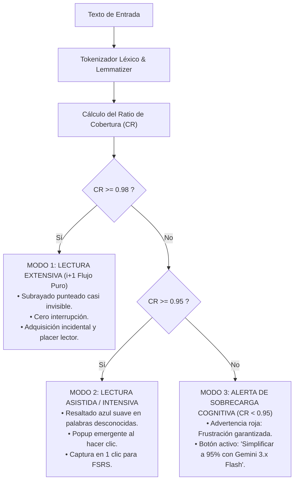
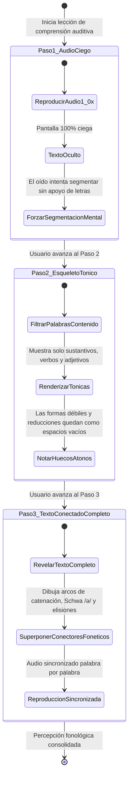

# Algoritmo del Perfilador Léxico y Decodificación Auditiva Bottom-Up
## English Learning Assistant (ELA) - Especificación Algorítmica

Este documento detalla la especificación matemática y la máquina de estados finita del **Perfilador Léxico Algorítmico (`LexicalCoverageProfiler`)** y del motor de **Decodificación Auditiva Ascendente (`BottomUpListeningEngine`)**, basados en los umbrales de cobertura de Paul Nation y Batia Laufer, y la psicolingüística de la comprensión auditiva de John Field (2008).

---

## 1. El Algoritmo del Perfilador Léxico (Nation & Laufer)

### 1.1. Ecuación de Cobertura Léxica
Para cualquier texto ingresado o seleccionado por el estudiante, el perfilador calcula el ratio de cobertura léxica conocida ($\text{CR}$):

$$\text{CR} = \frac{T_{\text{conocidos}}}{T_{\text{totales}} - T_{\text{propios}}}$$

Donde:
- $T_{\text{totales}}$: Número total de tokens de palabras en el documento.
- $T_{\text{propios}}$: Tokens identificados como nombres propios, números o acrónimos reconocidos.
- $T_{\text{conocidos}}$: Tokens cuyos lemas o familias morfológicas:
  1. Pertenecen a la lista de alta frecuencia NGSL Nivel 1 (Top 1.000 palabras más frecuentes).
  2. O están registrados en la base de datos personal del usuario (`srs_cards`) con un estado $\text{state} \in \{\text{'REVIEW'}, \text{'LEARNING'}\}$ y estabilidad $S \ge 3.0$ días.

### 1.2. Clasificación Algorítmica en 3 Modos



### 1.3. Pseudocódigo del Perfilador Léxico

```python
class LexicalCoverageProfiler:
    EXTENSIVE_THRESHOLD = 0.98
    INTENSIVE_THRESHOLD = 0.95

    def analyze_document(self, text: str, user_id: str) -> dict:
        tokens = tokenize_and_lemmatize(text)
        user_known_lemmas = db.get_user_known_lemmas(user_id, min_stability_days=3.0)
        ngsl_tier1_lemmas = corpus.get_ngsl_tier1_lemmas()

        total_content_tokens = 0
        known_tokens_count = 0
        unknown_tokens_list = []

        for token in tokens:
            if token.is_proper_noun or token.is_punctuation or token.is_numeric:
                continue
            
            total_content_tokens += 1
            lemma = token.lemma.lower()

            if lemma in ngsl_tier1_lemmas or lemma in user_known_lemmas:
                known_tokens_count += 1
            else:
                unknown_tokens_list.append(token)

        coverage_ratio = known_tokens_count / max(1, total_content_tokens)

        if coverage_ratio >= self.EXTENSIVE_THRESHOLD:
            mode = "EXTENSIVE"
            recommendation_es = "Texto ideal para lectura fluida por placer sin diccionario."
        elif coverage_ratio >= self.INTENSIVE_THRESHOLD:
            mode = "INTENSIVE"
            recommendation_es = "Texto óptimo para estudio asistido y extracción de vocabulario."
        else:
            mode = "OVERLOAD"
            recommendation_es = "Sobrecarga léxica detectada. Se recomienda simplificar antes de leer."

        return {
            "coverage_ratio": round(coverage_ratio, 4),
            "total_tokens": len(tokens),
            "content_tokens": total_content_tokens,
            "unknown_tokens_count": len(unknown_tokens_list),
            "mode": mode,
            "recommendation_es": recommendation_es
        }
```

---

## 2. Máquina de Estados del Protocolo de Decodificación Auditiva Bottom-Up

John Field (2008) demostró que el mayor déficit del estudiante intermedio es el colapso del procesamiento acústico ascendente (*Bottom-Up*): al escuchar a velocidad normal, no distingue las fronteras de palabra borradas por el habla conectada y abusa de la adivinanza contextual (*Top-Down*).

El reproductor de historias de ELA fuerza la calibración perceptual mediante un protocolo de **3 Pasos Finitos**:



---

## 3. Parámetros de Decodificación y Transición entre Estados

1. **Estado 1 (`STEP_1_BLIND`):**
   - Interfaz: Visualizador de espectro acústico animado en tiempo real sin texto ortográfico.
   - Velocidad: 1.0x (Velocidad nativa real obligatoria).
   - Función Cognitiva: Inhabilita la ruta visual subléxica y activa la corteza auditiva primaria para análisis de formantes y límites silábicos.
2. **Estado 2 (`STEP_2_TONIC`):**
   - Interfaz: Se renderizan exclusivamente las palabras que llevan acento léxico tónico en su grupo de entonación.
   - Puntos de Información: Las partículas funcionales (*to, of, and, can, for*) aparecen representadas por un guion bajo punteado (`_`), haciendo evidente qué sonidos se perdieron en la primera escucha.
3. **Estado 3 (`STEP_3_FULL_CONNECTED`):**
   - Interfaz: Texto íntegro con código de color semántico (Azul: enlace, Verde: Schwa, Rojo: elisión).
   - Audio sincronizado con resaltado en tiempo real (`<span class="active-word">`).
   - Opción de alternar a velocidad pedagógica (0.75x con pitch preservado) para verificación articulatoria.
