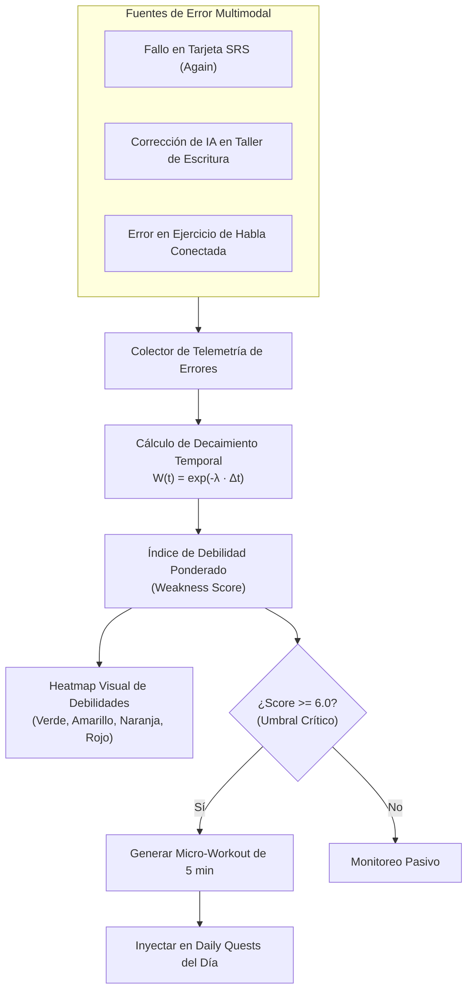

# Algoritmo de Detección de Fallas Crónicas y Heatmap de Debilidades
## English Learning Assistant (ELA)

Este documento especifica el algoritmo estadístico para la **Detección de Fallas Recurrentes**, la construcción del **Mapa de Calor de Debilidades (Weakness Heatmap)** y el desencadenamiento automático de **Micro-Workouts**.

---

## 1. Fundamento: Prevenir la Fosilización Lingüística

En la teoría de SLA de Larry Selinker, la **fosilización** es el proceso por el cual errores lingüísticos incorrectos se graban de manera permanente en los circuitos neuronales del estudiante debido a la repetición desatendida. 

Para evitar la fosilización, ELA no trata los errores como eventos aislados, sino como un **flujo continuo de telemetría de fallos** analizado mediante decaimiento temporal.

---

## 2. Formulación Matemática del Algoritmo

### 2.1. Ponderación por Decaimiento Temporal $W(\Delta t)$
Un error cometido hace 1 hora indica una debilidad activa en la memoria de trabajo inmediata; un error cometido hace 45 días ya ha sido potencialmente superado. Se aplica una función de decaimiento exponencial con una **vida media ($\tau_{1/2}$) de 7 días**:

$$\lambda = \frac{\ln(2)}{\tau_{1/2}} = \frac{0.69315}{7} \approx 0.09902 \text{ días}^{-1}$$

Para un error ocurrido hace $\Delta t$ días:

$$W(\Delta t) = e^{-\lambda \cdot \Delta t}$$

### 2.2. Factor de Severidad del Error $S_e$
No todas las incorrecciones tienen el mismo impacto comunicativo. Cada código de error en la taxonomía posee un multiplicador de severidad:

| Nivel de Severidad | Multiplicador $S_e$ | Ejemplo |
| :--- | :--- | :--- |
| **LOW** | 1.0 | Puntuación menor, espacio extra. |
| **MEDIUM** | 1.5 | Omisión de tercera persona singular *-s*, confusión de adjetivo gradable. |
| **HIGH** | 2.5 | Régimen preposicional incorrecto (*depends of*), orden de palabras (*cars blues*). |
| **CRITICAL** | 4.0 | Falso amigo grave (*actually* como actualmente), negación doble que invierte el sentido lógico. |

### 2.3. Puntuación Total de Debilidad por Categoría ($\text{Score}_k$)
Para cada regla o categoría de error $k$, su puntuación acumulada en el instante actual $t_{\text{now}}$ es:

$$\text{Score}_k = \sum_{i=1}^{N_k} S_{e, i} \cdot e^{-\lambda \cdot (t_{\text{now}} - t_i)}$$

---

## 3. Estados del Heatmap y Clasificación de Criticidad

| Rango de Score | Estado del Heatmap | Color Visual | Diagnóstico Clínico de Interlenguaje | Acción del Sistema |
| :--- | :--- | :--- | :--- | :--- |
| **$0.0 \le \text{Score} < 1.0$** | **Dominado** | 🟢 Verde | Regla controlada; deslices estadísticos esporádicos. | Repaso estándar espaciado en FSRS. |
| **$1.0 \le \text{Score} < 3.0$** | **Bajo Control** | 🟡 Amarillo | Duda ocasional en contextos de alta carga cognitiva. | Recordatorio visual pasivo en tarjetas. |
| **$3.0 \le \text{Score} < 6.0$** | **Debilidad Emergente** | 🟠 Naranja | Patrón repetido; el estudiante vacila con frecuencia. | Inclusión preferente de ejemplos en sesiones SRS. |
| **$\text{Score} \ge 6.0$** | **Falla Crónica / Fosilizada** | 🔴 Rojo Crítico | Error sistemático y recurrente de transferencia L1. | **Disparo inmediato de Micro-Workout**. |

---

## 4. Generación y Extinción de Micro-Workouts

Cuando una regla alcanza el estado **Rojo Crítico ($\ge 6.0$)**:
1. **Generación del Entrenador:** Se crea una entidad `micro_workouts` compuesta de 5 micro-ejercicios complementarios:
   - *Ejercicio 1:* Explicación contrastiva breve (por qué el cerebro hispano tiende a errar).
   - *Ejercicio 2:* Identificación binaria (elegir entre la opción nativa y la opción con interferencia).
   - *Ejercicio 3:* Completar el hueco (*Cloze fill-in*).
   - *Ejercicio 4:* Corrección de oración errónea (*Spot the error*).
   - *Ejercicio 5:* Generación de una oración original libre aplicando la regla corregida.
2. **Reducción de Puntuación (Extinción del Error):**
   - Al completar satisfactoriamente los 5 ejercicios del Micro-Workout, se aplica una bonificación inmediata multiplicando el Score actual por $0.5$ ($\text{Score}' = \text{Score} \cdot 0.5$).
   - Si no se cometen nuevos errores en los siguientes días, el decaimiento exponencial natural devolverá la categoría a la zona verde.
