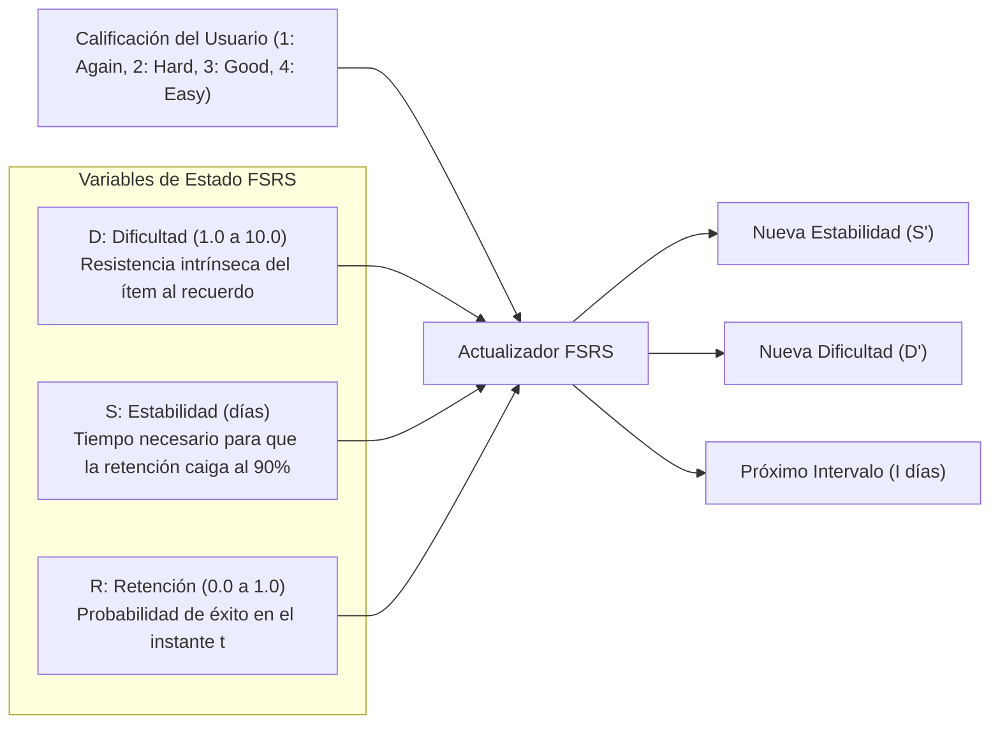

# Especificación Formal del Algoritmo FSRS (Spaced Repetition)
## English Learning Assistant (ELA)

Este documento contiene la formulación matemática rigurosa, las ecuaciones diferenciales discretas y el pseudocódigo del algoritmo **FSRS (Free Spaced Repetition Scheduler)** implementado en ELA.

---

## 1. El Modelo DSR (Dificultad, Estabilidad y Retención)

A diferencia de algoritmos heurísticos antiguos como SM-2 (cuyos factores de facilidad *Ease Factor* sufren del problema de "infierno de repetición"), FSRS modela el olvido humano sobre tres dimensiones cognitivas continuas:



---

## 2. Ecuaciones Matemáticas de FSRS

### 2.1. Función de Retención / Probabilidad de Recuerdo $R(t, S)$
La probabilidad de que el usuario recuerde con éxito una tarjeta $t$ días después del último repaso sigue una curva de decaimiento de ley de potencia (*power law*):

$$R(t, S) = \left( 1 + \text{FACTOR} \cdot \frac{t}{S} \right)^{-\text{DECAY}}$$

Donde:
- $\text{FACTOR} = \frac{19}{81} \approx 0.2345$ (tal que cuando $t = S$, $R(S, S) = 0.90$, es decir, 90% de retención).
- $\text{DECAY} = 0.5$.

### 2.2. Cálculo del Intervalo Óptimo de Repaso $I(r, S)$
Dado un objetivo de retención deseado $r$ (por defecto $r = 0.90$):

$$I(r, S) = \frac{S}{\text{FACTOR}} \cdot \left( r^{-1/\text{DECAY}} - 1 \right)$$

Para $r = 0.90$, el intervalo óptimo es exactamente igual a la estabilidad de la tarjeta:
$$I(0.90, S) = S \text{ días}$$

### 2.3. Inicialización para Tarjetas Nuevas ($S_0$ y $D_0$)
Cuando el usuario califica una tarjeta por primera vez con una nota $G \in \{1, 2, 3, 4\}$:

$$S_0(G) = w_G \quad (w_1, w_2, w_3, w_4 \text{ son los parámetros iniciales de estabilidad})$$

$$D_0(G) = w_4 - e^{w_5 \cdot (G - 1)} + 1$$
*(Acotado estrictamente en el intervalo $[1.0, 10.0]$).*

### 2.4. Actualización de Dificultad $D'(D, G)$
En cada repaso posterior con calificación $G$:

$$\Delta D = -w_6 \cdot (G - 3)$$
$$D_{\text{raw}} = D + \Delta D$$
$$D' = w_7 \cdot D_0(3) + (1 - w_7) \cdot D_{\text{raw}} \quad \text{(Regresión a la media para estabilidad)}$$
$$D' = \min(\max(D', 1.0), 10.0)$$

### 2.5. Actualización de Estabilidad ante Recuerdo Exitoso ($G \in \{2, 3, 4\}$)
Cuando el usuario recuerda la tarjeta, la nueva estabilidad $S'_r$ se incrementa proporcionalmente a la dificultad del esfuerzo deseable:

$$S'_r(D, S, R, G) = S \cdot \left( 1 + e^{w_8} \cdot (11 - D) \cdot S^{-w_9} \cdot \left(e^{w_{10} \cdot (1 - R)} - 1\right) \cdot h(G) \right)$$

Donde el modificador de calificación $h(G)$ es:
- Si $G = 2$ (Hard): $h(2) = w_{11}$
- Si $G = 3$ (Good): $h(3) = 1.0$
- Si $G = 4$ (Easy): $h(4) = w_{12}$

> **Intuición Pedagógica:** Nótese el término $(e^{w_{10} \cdot (1 - R)} - 1)$. Si la retención $R$ era muy baja (el usuario estuvo a punto de olvidar la tarjeta) pero logró recordarla, el incremento de estabilidad es **masivo** (efecto de *Desirable Difficulty* de Bjork).

### 2.6. Actualización de Estabilidad ante Olvido ($G = 1$ - Again)
Cuando el usuario olvida la tarjeta, la estabilidad colapsa para re-anclar el recuerdo:

$$S'_f(D, S, R) = w_{13} \cdot D^{-w_{14}} \cdot \left( S + 1 \right)^{w_{15}} \cdot e^{w_{16} \cdot (1 - R)}$$
*(La tarjeta pasa al estado de `RELEARNING`).*

---

## 3. Pesos por Defecto de FSRS (Default Weights $w$)

Los pesos estándar calibrados sobre millones de repasos empíricos son:

| Parámetro | Valor por Defecto | Interpretación |
| :--- | :--- | :--- |
| $w_0$ | 0.40255 | Estabilidad inicial si Again |
| $w_1$ | 1.18385 | Estabilidad inicial si Hard |
| $w_2$ | 3.173 | Estabilidad inicial si Good |
| $w_3$ | 15.69105 | Estabilidad inicial si Easy |
| $w_4$ | 7.1949 | Base de dificultad inicial |
| $w_5$ | 0.5345 | Factor de escala de dificultad inicial |
| $w_6$ | 1.4604 | Tasa de cambio de dificultad |
| $w_7$ | 0.0046 | Tasa de regresión a la media de dificultad |
| $w_8$ | 1.54576 | Factor base de aumento de estabilidad |
| $w_9$ | 0.19914 | Factor de amortiguación de estabilidad |
| $w_{10}$ | 1.0124 | Multiplicador de dificultad deseable ($1 - R$) |
| $w_{11}$ | 0.4466 | Penalización por Hard ($G=2$) |
| $w_{12}$ | 1.4897 | Bonificación por Easy ($G=4$) |
| $w_{13}$ | 0.2189 | Estabilidad base tras olvido (Lapse) |
| $w_{14}$ | 0.318 | Sensibilidad a la dificultad en olvido |
| $w_{15}$ | 0.2823 | Retención de estabilidad histórica en olvido |
| $w_{16}$ | 0.2802 | Factor de olvido retardado |

---

## 4. Implementación en Código Limpio (TypeScript)

```typescript
export interface FsrsCard {
  stability: number;
  difficulty: number;
  reps: number;
  lapses: number;
  state: 'NEW' | 'LEARNING' | 'REVIEW' | 'RELEARNING';
  lastReviewedAt: Date | null;
  scheduledFor: Date;
}

export type FsrsGrade = 1 | 2 | 3 | 4; // 1: Again, 2: Hard, 3: Good, 4: Easy

export class FsrsScheduler {
  private readonly requestedRetention = 0.90;
  private readonly factor = 19.0 / 81.0;
  private readonly decay = 0.5;

  private readonly w = [
    0.40255, 1.18385, 3.173, 15.69105, 7.1949, 0.5345, 1.4604, 0.0046,
    1.54576, 0.19914, 1.0124, 0.4466, 1.4897, 0.2189, 0.318, 0.2823, 0.2802
  ];

  public calculateRetrievability(card: FsrsCard, now: Date): number {
    if (!card.lastReviewedAt || card.stability <= 0) return 0.0;
    const elapsedDays = Math.max(0, (now.getTime() - card.lastReviewedAt.getTime()) / (1000 * 60 * 60 * 24));
    return Math.pow(1.0 + this.factor * (elapsedDays / card.stability), -this.decay);
  }

  public nextInterval(stability: number): number {
    const interval = (stability / this.factor) * (Math.pow(this.requestedRetention, -1.0 / this.decay) - 1.0);
    return Math.max(1, Math.round(interval));
  }

  public review(card: FsrsCard, grade: FsrsGrade, now: Date): FsrsCard {
    let newS: number;
    let newD: number;
    let newState = card.state;
    let newLapses = card.lapses;

    if (card.state === 'NEW') {
      newS = this.w[grade - 1];
      newD = Math.min(Math.max(this.w[4] - Math.exp(this.w[5] * (grade - 1)) + 1, 1.0), 10.0);
      newState = grade === 1 ? 'LEARNING' : 'REVIEW';
    } else {
      const R = this.calculateRetrievability(card, now);
      
      // Actualizar Dificultad
      const deltaD = -this.w[6] * (grade - 3);
      const dRaw = card.difficulty + deltaD;
      const d0 = this.w[4] - Math.exp(this.w[5] * (3 - 1)) + 1;
      newD = Math.min(Math.max(this.w[7] * d0 + (1 - this.w[7]) * dRaw, 1.0), 10.0);

      if (grade === 1) {
        // Fallo (Again)
        newS = this.w[13] * Math.pow(newD, -this.w[14]) * Math.pow(card.stability + 1, this.w[15]) * Math.exp(this.w[16] * (1 - R));
        newState = 'RELEARNING';
        newLapses += 1;
      } else {
        // Éxito (Hard, Good, Easy)
        const gradeBonus = grade === 2 ? this.w[11] : grade === 4 ? this.w[12] : 1.0;
        const sInc = 1.0 + Math.exp(this.w[8]) * (11 - newD) * Math.pow(card.stability, -this.w[9]) * (Math.exp(this.w[10] * (1 - R)) - 1) * gradeBonus;
        newS = Math.max(0.1, card.stability * sInc);
        newState = 'REVIEW';
      }
    }

    const intervalDays = this.nextInterval(newS);
    const nextDate = new Date(now.getTime() + intervalDays * 24 * 60 * 60 * 1000);

    return {
      ...card,
      stability: parseFloat(newS.toFixed(4)),
      difficulty: parseFloat(newD.toFixed(4)),
      reps: card.reps + 1,
      lapses: newLapses,
      state: newState,
      lastReviewedAt: now,
      scheduledFor: nextDate,
    };
  }
}
```

---

## 5. Algoritmo de Rotación de Contextos (Encoding Variability)

Para evitar la fosilización de pistas visuales superficiales y robustecer la *Storage Strength* (Bjork & Bjork), el planificador de tarjetas implementa rotación pseudo-aleatoria de contextos:

```typescript
export interface ContextExample {
  id: string;
  sentenceEn: string;
  sentenceEs: string;
  clozeTarget: string;
}

export class ContextRotator {
  /**
   * Selecciona el próximo contexto para una tarjeta asegurando que no se repita
   * el mismo contexto visto en el repaso inmediato anterior.
   */
  public selectNextContext(
    availableContexts: ContextExample[],
    lastContextIdShown?: string
  ): ContextExample {
    if (availableContexts.length === 0) {
      throw new Error("No hay contextos registrados para esta tarjeta");
    }
    if (availableContexts.length === 1) {
      return availableContexts[0];
    }

    const filtered = availableContexts.filter(c => c.id !== lastContextIdShown);
    const randomIndex = Math.floor(Math.random() * filtered.length);
    return filtered[randomIndex];
  }
}
```

---

## 6. Algoritmo de Desagrupación Semántica (Semantic Interleaving)

Previene la interferencia proactiva y retroactiva reordenando la cola de tarjetas del día para garantizar una separación mínima entre pares confusos:

```typescript
export interface QueueItem {
  cardId: string;
  taxonomyCode: string; // Ej: 'L1_FALSE_FRIEND_ACTUALLY'
  semanticClusterId?: string; // Ej: 'CLUSTER_SENSITIVE_SENSIBLE'
}

export class SemanticInterleaver {
  private readonly minSeparation = 5;

  /**
   * Reordena la cola de tarjetas asegurando que tarjetas del mismo cluster
   * no queden a menos de minSeparation posiciones de distancia.
   */
  public interleaveQueue(queue: QueueItem[]): QueueItem[] {
    const result: QueueItem[] = [];
    const pending = [...queue];

    while (pending.length > 0) {
      let placed = false;
      for (let i = 0; i < pending.length; i++) {
        const candidate = pending[i];
        
        // Verificar si colisiona con las últimas N tarjetas colocadas
        const recentSlice = result.slice(-this.minSeparation);
        const hasConflict = candidate.semanticClusterId && recentSlice.some(
          item => item.semanticClusterId === candidate.semanticClusterId
        );

        if (!hasConflict || pending.length <= this.minSeparation) {
          result.push(candidate);
          pending.splice(i, 1);
          placed = true;
          break;
        }
      }

      if (!placed) {
        // Si no se puede evitar el conflicto estricto, colocar el primero disponible
        result.push(pending.shift()!);
      }
    }

    return result;
  }
}
```

---

## 7. Calibración y Optimización Adaptativa de Pesos FSRS

Aunque los 17 pesos por defecto ($w$) proporcionan una excelente aproximación inicial, ELA incorpora un proceso de optimización periódica:

1. **Umbral de Calibración:** Tras registrar un mínimo de **200 repasos** en la tabla `review_logs`, el sistema habilita el optimizador local.
2. **Función de Pérdida (Loss Function):** Minimiza la pérdida logarítmica binaria (*Binary Cross-Entropy Loss*) entre la probabilidad de recuerdo predicha $\hat{R}_i = R(t_i, S_i)$ y el resultado real observado $y_i \in \{0, 1\}$ (donde $y_i = 1$ para $G \ge 2$, y $y_i = 0$ para $G = 1$):
   $$\mathcal{L}(w) = -\frac{1}{N} \sum_{i=1}^N \left[ y_i \ln(\hat{R}_i) + (1 - y_i) \ln(1 - \hat{R}_i) \right]$$
3. **Ejecución Local Desacoplada:** El cálculo se ejecuta en un *Web Worker* o proceso en segundo plano de Tauri mediante el algoritmo de optimización Nelder-Mead / Descenso de Gradiente Adam, actualizando los pesos personalizados en la configuración del usuario sin congelar la interfaz.

