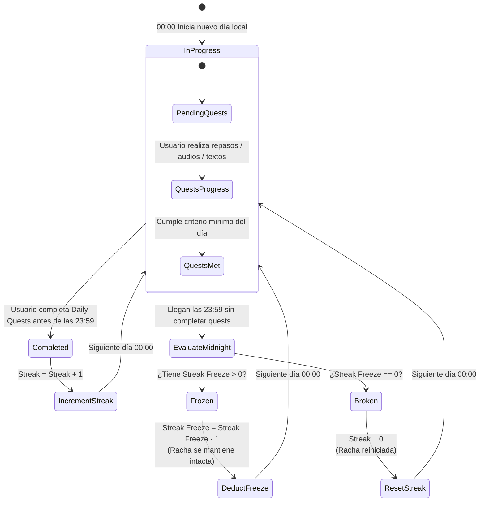
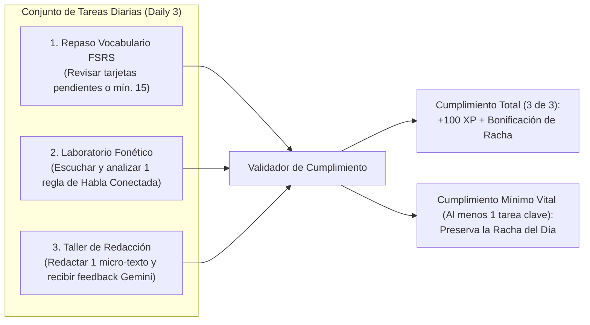

# Máquina de Estados de Hábitos, Tareas Diarias y Rachas
## English Learning Assistant (ELA)

Este documento especifica el funcionamiento determinista de la **Máquina de Estados de Rachas (Streak State Machine)**, la gestión de la zona horaria del usuario y la mecánica de protección contra el abandono (**Streak Freeze**).

---

## 1. Diagrama de Transición de Estados de Racha Diaria

Cada día calendario a las 00:00 (hora local del usuario), el estado de la racha para la nueva jornada se evalúa y transiciona según el siguiente autómata finito:

---

## 2. Definición Formal de Estados y Transiciones

### 2.1. Estados del Sistema
1. **`IN_PROGRESS` (En Curso):**
   - Estado por defecto durante el transcurso del día.
   - La lista de verificación de *Daily Quests* muestra las metas pendientes.
2. **`COMPLETED` (Jornada Superada):**
   - El estudiante completó el umbral mínimo de tareas antes de las 23:59:59.
   - El contador de racha actual (`current_streak`) se incrementa en +1.
   - Si la nueva racha alcanza un múltiplo de 7 (7, 14, 21, 28...), se dispara la regla de bonificación de *Streak Freeze*.
3. **`FROZEN` (Jornada Salvada / Congelada):**
   - El estudiante no estudió durante el día (por viaje, enfermedad, descanso o imprevisto), pero poseía al menos 1 ficha de congelación (`available_freezes > 0`).
   - Se consume 1 ficha de congelación (`available_freezes = available_freezes - 1`).
   - El contador de racha **no se reinicia** ni se incrementa; se preserva intacto.
   - Se registra el evento en `streak_freeze_logs` con fecha y motivo automático.
4. **`BROKEN` (Racha Rota):**
   - El estudiante no completó las tareas y no disponía de fichas de protección.
   - El contador de racha vuelve a cero (`current_streak = 0`).
   - El récord histórico (`longest_streak`) permanece intacto.

---

## 3. Criterio de Cumplimiento de las Daily Quests

Para evitar que una sesión extensa de escritura opaque el repaso o que el usuario se sienta bloqueado en días de alta carga laboral, el sistema define dos niveles de cumplimiento:

---

## 4. Política de Adquisición y Límites de Streak Freezes

Para evitar el abuso del sistema y mantener un equilibrio pedagógico entre compasión y disciplina:
- **Ficha Inicial de Bienvenida:** Todo nuevo usuario comienza con **1 ficha de Streak Freeze** gratuita al registrarse.
- **Premio por Constancia:** Por cada **7 días consecutivos de racha completada**, el usuario gana automáticamente **+1 ficha de Streak Freeze**.
- **Tope Máximo de Acumulación (Cap):** Un usuario puede acumular como máximo **2 fichas simultáneas**. Esto previene que un aprendiz acumule 20 fichas y deje de estudiar durante tres semanas consecutivas sin consecuencias.
