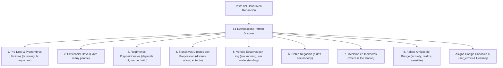

# Reglas Deterministas de Detección de Interferencia L1 Español
## English Learning Assistant (ELA) - Especificación Algorítmica

Este documento formaliza las reglas analíticas, patrones de expresiones regulares (RegEx) y heurísticas morfosintácticas utilizadas por el motor **`L1TransferEngine`** y el analizador previo de textos para detectar y etiquetar de forma instantánea desvíos sistemáticos producidos por la lengua materna antes de consultar la API de Gemini.

---

## 1. Matriz de Expresiones Regulares y Heurísticas de Detección L1



---

## 2. Catálogo Formal de Reglas de Detección

### 2.1. Regla `L1_PRO_DROP_DUMMY_IT` (Omisión de Pronombre Sujeto Impersonal)
- **Patrón Erróneo:** Verbo meteorológico o cópula adjetival al inicio de cláusula sin sujeto *It*.
- **Regex Heurístico:**
  ```regex
  (?i)(?:^|[.!?]\s+)(is\s+(?:raining|snowing|cold|hot|late|early|important|necessary|impossible|true|false)\b)
  ```
- **Error Detectado:** *"Is raining"*, *"Is important to practice"*.
- **Corrección Canónica:** Insertar pronombre ficticio *It*: *"It is raining"*, *"It is important to practice"*.
- **Severidad:** `HIGH`.

### 2.2. Regla `L1_EXISTENTIAL_HAVE` (Uso de 'Have' como Existencial)
- **Patrón Erróneo:** Uso del verbo *have / has* para denotar existencia en lugar de *there is / there are*.
- **Regex Heurístico:**
  ```regex
  (?i)(?:^|[.!?]\s+)(have|has)\s+(?:a lot of|many|several|\d+|two|three|some|no)\s+([a-z]+)
  ```
- **Error Detectado:** *"Have three people waiting"*, *"In this room have a problem"*.
- **Corrección Canónica:** *"There are three people waiting"*, *"In this room there is a problem"*.
- **Severidad:** `CRITICAL`.

### 2.3. Regla `L1_PREP_DIVERGENCE` (Regímenes Preposicionales Chocantes)
- **Catálogo de Expresiones Regulares Específicas:**

| Código de Error | Patrón Regex de Detección | Forma Errónea | Forma Correcta | Explicación Pedagógica |
| :--- | :--- | :--- | :--- | :--- |
| `L1_PREP_DEPEND_OF` | `(?i)\b(depends?|depended|depending)\s+of\b` | *depends of* | *depends on* | El verbo *depend* rige obligatoriamente la preposición ON. |
| `L1_PREP_MARRIED_WITH` | `(?i)\b(married|engaged)\s+with\b` | *married with* | *married to* | En inglés el vínculo conyugal se expresa con TO. |
| `L1_PREP_GOOD_IN` | `(?i)\b(good|bad|terrible|excellent)\s+in\s+([a-z]+ing|[a-z]+)` | *good in math* | *good at math* | Habilidades y aptitudes rigen AT. |
| `L1_PREP_INTERESTED_FOR`| `(?i)\b(interested)\s+(for|at)\b` | *interested for* | *interested in* | El adjetivo *interested* rige IN. |
| `L1_PREP_DREAM_WITH` | `(?i)\b(dream(?:s|ed|t)?|dreaming)\s+with\b` | *dream with you* | *dream about/of you*| En inglés se sueña "sobre" algo/alguien (about/of). |
| `L1_PREP_THINK_IN` | `(?i)\b(think(?:s|ing)?|thought)\s+in\b` | *thinking in you* | *thinking of/about you*| Pensar en alguien/algo es *think of/about*. |
| `L1_PREP_CONGRATULATE_FOR`| `(?i)\b(congratulat(?:e|ed|es|ing))\s+[a-z]+\s+for\b` | *congratulate for* | *congratulate on* | Las felicitaciones en inglés rigen ON. |

### 2.4. Regla `L1_ZERO_PREP_TRANSITIVE` (Preposición Parásita en Transitivos Directos)
- **Patrón Erróneo:** Añadir preposiciones a verbos que en inglés son estrictamente transitivos directos.
- **Regex Heurísticos:**
  ```regex
  # discuss about -> discuss
  (?i)\b(discuss(?:es|ed|ing)?)\s+about\b
  # enter to -> enter
  (?i)\b(enter(?:s|ed|ing)?)\s+(to|into)\s+(the|a|an|this|that|[a-z]+)\b
  # call to someone -> call someone
  (?i)\b(call(?:s|ed|ing)?)\s+to\s+(?:my|his|her|the|a|me|him|them|[A-Z][a-z]+)\b
  # reach to an agreement -> reach an agreement
  (?i)\b(reach(?:es|ed|ing)?)\s+to\b
  # approach to -> approach
  (?i)\b(approach(?:es|ed|ing)?)\s+to\b
  ```
- **Severidad:** `MEDIUM`.

### 2.5. Regla `L1_STATIVE_VERB_CONTINUOUS` (Aspecto Continuo en Verbos Estativos)
- **Patrón Erróneo:** Auxiliar *to be* + gerundio *-ing* en verbos que denotan estados cognitivos o posesión.
- **Regex Heurístico:**
  ```regex
  (?i)\b(am|is|are|was|were|been)\s+(knowing|believing|understanding|belonging|preferring|needing|containing)\b
  ```
- **Error Detectado:** *"I am understanding now"*, *"She is needing help"*.
- **Corrección Canónica:** *"I understand now"*, *"She needs help"*.
- **Severidad:** `HIGH`.

### 2.6. Regla `L1_DOUBLE_NEGATIVE` (Doble Negación por Calco del Español)
- **Patrón Erróneo:** Verbo negado con auxiliar (*didn't, don't, can't*) seguido de pronombre de polaridad negativa (*nobody, nothing, never, nowhere*).
- **Regex Heurístico:**
  ```regex
  (?i)\b(didn't|don't|doesn't|cannot|can't|won't|haven't|hasn't)\s+(?:[a-z]+\s+)?(nobody|nothing|never|nowhere|no\s+one)\b
  ```
- **Error Detectado:** *"I didn't see nobody"*, *"He doesn't know nothing"*.
- **Corrección Canónica:** *"I didn't see anybody"* o *"I saw nobody"*.
- **Severidad:** `CRITICAL`.

### 2.7. Regla `L1_EMBEDDED_QUESTION_INVERSION` (Inversión Errónea en Pregunta Indirecta)
- **Patrón Erróneo:** Pregunta incrustada tras cláusula introductoria (*Could you tell me, I wonder, Do you know*) que mantiene el orden interrogativo con auxiliar antes de sujeto.
- **Regex Heurístico:**
  ```regex
  (?i)\b(could you tell me|can you tell me|do you know|i wonder|i don't know)\s+(where|what|when|why|how)\s+(is|are|was|were|did|do|does)\s+([a-z]+)\b
  ```
- **Error Detectado:** *"Could you tell me where is the station?"*, *"I don't know what did he do"*.
- **Corrección Canónica:** *"Could you tell me where the station is?"*, *"I don't know what he did"*.
- **Severidad:** `HIGH`.

### 2.8. Regla `L1_AGE_HAVE_YEARS` (Expresión de Edad con Have)
- **Patrón Erróneo:** Uso de *have/has* con número y *years* en lugar de *be X years old*.
- **Regex Heurístico:**
  ```regex
  (?i)\b(have|has)\s+(\d{1,2}|twenty|thirty|forty)\s+(?:years|years\s+old)\b
  ```
- **Error Detectado:** *"I have 28 years"*, *"She has 30 years old"*.
- **Corrección Canónica:** *"I am 28 years old"*, *"She is 30 years old"*.
- **Severidad:** `CRITICAL`.

---

## 3. Integración en el Pipeline de Evaluación de ELA

Cuando el usuario redacta en el Taller de Escritura:
1. **Paso 1 (Escaneo Local Instantáneo < 5 ms):** El motor `L1TransferEngine` escanea el texto con este catálogo determinista.
2. **Paso 2 (Inyección Contextual en Gemini):** Si se detectan desvíos deterministas, se inyectan en el prompt a la IA como pistas previas:  
   `"Detected preliminary L1 interference flags: [L1_PREP_DEPEND_OF, L1_PRO_DROP_DUMMY_IT]. Verify and structure pedagogical explanation accordingly."`
3. **Paso 3 (Registro Inmediato en SQLite):** Al confirmar el error, se actualiza el score de debilidad en `weakness_metrics` sin esperar a que el usuario termine su sesión.
