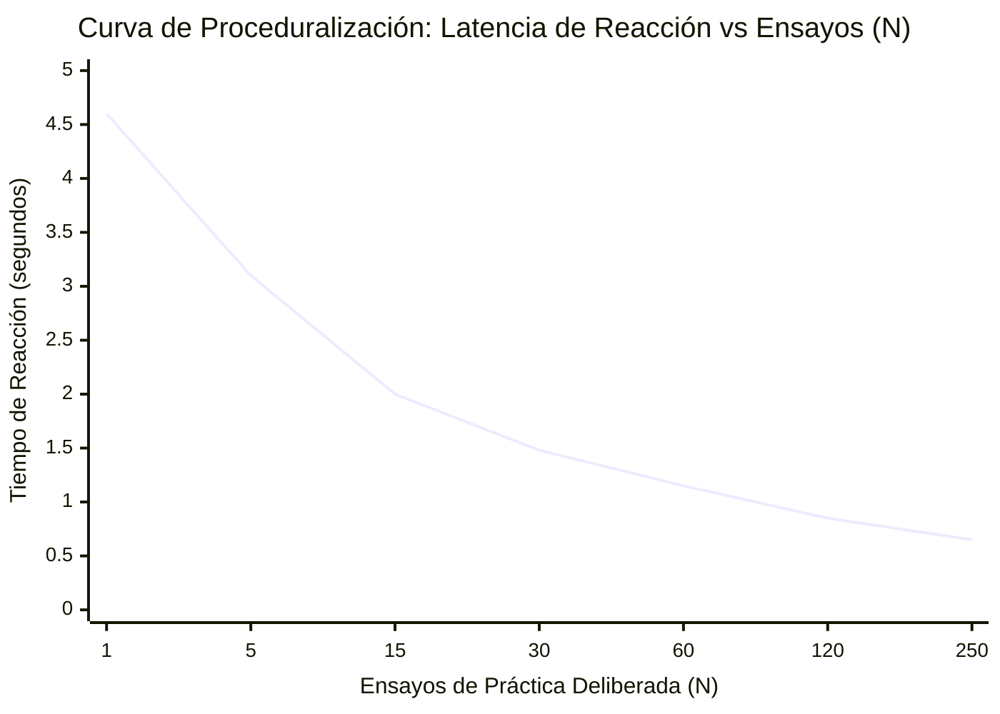
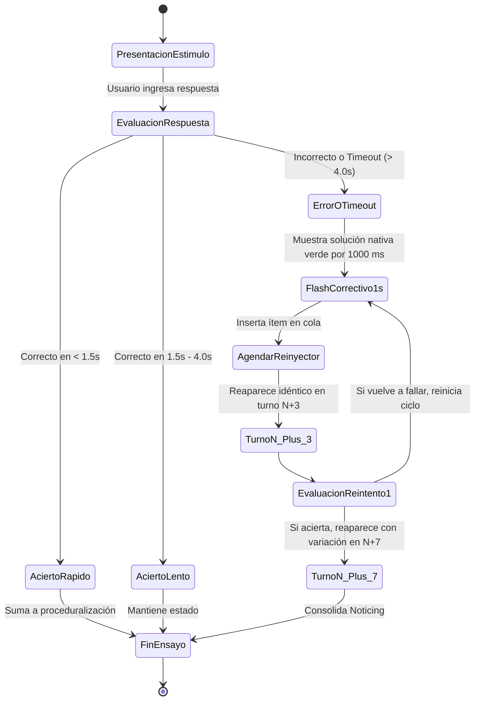

# Algoritmo de Proceduralización, Ley de Potencia y Drills de Velocidad
## English Learning Assistant (ELA) - Especificación Algorítmica

Este documento define la especificación matemática, algorítmica y de máquina de estados para el motor de **Proceduralización y Drills de Velocidad (`SpeedDrillArenaService` y `ProceduralizationEngine`)**, fundamentado en la teoría de adquisición de habilidades de Robert DeKeyser (2007), la arquitectura ACT-R de John Anderson y la Ley de Potencia del Aprendizaje de Newell & Rosenbloom (1981).

---

## 1. Fundamento Matemático y Neurocognitivo

### 1.1. La Ley de Potencia del Aprendizaje (Power Law of Learning)
El tiempo de reacción ($RT$) necesario para procesar y disparar una estructura morfosintáctica o colocación lingüística decrece como una función potencial del número de ensayos de práctica deliberada ($N$):

$$RT(N) = a + b \cdot N^{-c}$$

Donde:
- $a$: Límite fisiológico neuro-motor irreducible ($\approx 400 - 600 \text{ ms}$ para selección y pulsación motora).
- $b$: Ganancia potencial inicial del aprendiz en la fase declarativa.
- $c$: Tasa de proceduralización ($\approx 0.3 - 0.5$).
- $N$: Número acumulado de ensayos bajo presión temporal estricta.



### 1.2. Métrica Formal de Certificación Procedural
Un elemento lingüístico transita de la memoria declarativa (lenta, consciente, mediada por traducción L1) a la memoria procedural (ganglios basales, automática, fluidez a 150 palabras/min) cuando satisface el siguiente criterio matemático:

$$\text{is\_proceduralized} = \text{TRUE} \iff \sum_{s=1}^{3} \mathbb{I}(RT_s < 1.500 \text{ ms} \land \text{correct}_s = \text{TRUE}) = 3$$

Donde $s$ representa 3 sesiones de práctica distintas e independientes (no repeticiones consecutivas en la misma sesión).

---

## 2. Pseudocódigo del Motor de Proceduralización

```python
class ProceduralizationEngine:
    PROCEDURAL_LATENCY_THRESHOLD_MS = 1500  # 1.5 segundos
    REQUIRED_CONSECUTIVE_SESSIONS = 3

    def process_drill_trial(self, card_id: str, is_correct: bool, elapsed_ms: int, user_id: str):
        card = db.get_srs_card(card_id)
        
        if is_correct and elapsed_ms < self.PROCEDURAL_LATENCY_THRESHOLD_MS:
            # Ensayo exitoso dentro de la ventana procedural
            new_consecutive = card.consecutive_fast_retrievals + 1
            is_certified = new_consecutive >= self.REQUIRED_CONSECUTIVE_SESSIONS
            
            db.update_card_procedural_status(
                card_id=card_id,
                consecutive_fast=new_consecutive,
                is_proceduralized=is_certified,
                last_rt_ms=elapsed_ms
            )
            
            if is_certified and not card.is_proceduralized:
                event_bus.publish(ItemProceduralizedDomainEvent(
                    card_id=card_id,
                    target_id=card.target_id,
                    final_latency_ms=elapsed_ms
                ))
            return {"status": "PROCEDURAL_PASS", "consecutive": new_consecutive, "certified": is_certified}
        
        elif is_correct:
            # Correcto pero lento (procesado conscientemente en memoria declarativa)
            # No resetea a 0 pero no suma para certificación procedural inmediata
            db.update_card_last_rt(card_id, elapsed_ms)
            return {"status": "SLOW_CORRECT", "consecutive": card.consecutive_fast_retrievals, "certified": False}
        
        else:
            # Error sintáctico o agotamiento de tiempo
            db.update_card_procedural_status(
                card_id=card_id,
                consecutive_fast=0, # Reseteo de racha por quiebre de automaticidad
                is_proceduralized=False,
                last_rt_ms=elapsed_ms
            )
            return {"status": "PROCEDURAL_FAIL", "consecutive": 0, "certified": False}
```

---

## 3. Algoritmo del Bucle de Micro-Recuperación (Error Recovery Loop)

Cuando el usuario comete un error o agota el tiempo en un drill de velocidad, el sistema activa el **Bucle de Reinyección en Caliente ($N+3$ y $N+7$)**:



### Reglas de la Cola de Reinyección:
1. **Flash Visual de 1.0 s:** Muestra la respuesta nativa sin explicaciones discursivas para no romper el flujo motor del atleta cognitivo.
2. **Turno $N+3$:** El mismo estímulo reaparece exactamente 3 ítems después, evaluando la memoria de trabajo inmediata en caliente.
3. **Turno $N+7$:** Si superó $N+3$, se presenta 7 ítems después con una variación ligera de sujeto o tiempo para verificar la generalización del esquema.
4. **Registro en Heatmap:** Se envía telemetría a `user_errors` con el código L1 correspondiente.

---

## 4. Cuatro Modalidades de Drills de Velocidad

| Modalidad | Duración por Ítem | Estímulo | Operador de Cambio | Respuesta Esperada | Función Cognitiva |
| :--- | :--- | :--- | :--- | :--- | :--- |
| **1. Rapid Clause Shift** | 3.5 segundos | *"They went to London."* | `[NEGATIVE]` | *"They didn't go to London."* | Automatización de auxiliares y verbos base. |
| **2. Third Person Automation** | 2.5 segundos | *"I usually finish at six."* | `[HE]` | *"He usually finishes at six."* | Erradicación de la fosilización de la terminación *-s*. |
| **3. Preposition Reflex** | 2.0 segundos | *"Depends ___ the budget."* | `[ON / OF / AT]` | *"ON"* | Neutralización del régimen preposicional L1. |
| **4. Auditory Snap (HVPT)** | 2.0 segundos | Audio ciego: `[ʃɪp]` | `[ SHIP / SHEEP ]` | *"SHIP"* | Categorización perceptual fonémica forzada. |
