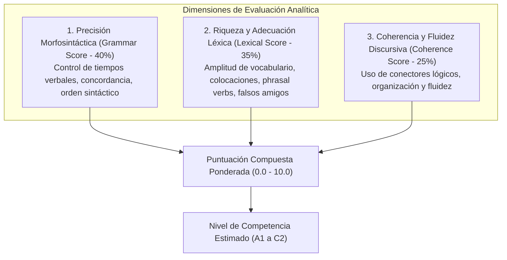

# Rúbricas de Evaluación Pedagógica y Calibración CEFR
## English Learning Assistant (ELA)

Este documento formaliza las **Rúbricas de Evaluación Multidimensional** alineadas con el **Marco Común Europeo de Referencia para las Lenguas (CEFR)** utilizadas por el motor de IA para calificar las producciones escritas.

---

## 1. Dimensiones de Calificación Analítica (Escala 0.0 a 10.0)

La evaluación cuantitativa no es arbitraria; se descompone en tres dimensiones ortogonales:

---

## 2. Bandas Descriptivas por Dimensión

### 2.1. Dimensión 1: Precisión Morfosintáctica (Gramática)
- **Banda 9.0 - 10.0 (C1-C2):** Mantiene un control gramatical constante de estructuras sintácticas complejas (inversión, condicionales mixtos, voz pasiva avanzada). Los errores son deslices (*slips*) aislados prácticamente imperceptibles.
- **Banda 7.5 - 8.9 (B2):** Buen control gramatical. Rara vez comete errores que dificulten la comprensión. Utiliza con soltura tiempos compuestos y cláusulas relativas.
- **Banda 5.5 - 7.4 (B1):** Control razonable de estructuras simples (presente, pasado simple, futuro con *will/going to*). Comete errores sistemáticos en estructuras complejas y preposiciones dependientes.
- **Banda 3.5 - 5.4 (A2):** Emplea algunas estructuras sencillas correctamente, pero continúa cometiendo errores elementales sistemáticos (omisión de tercera persona *-s*, confusión de tiempos verbales).
- **Banda 0.0 - 3.4 (A1):** Solo maneja patrones muy breves y aislados. Fallas generalizadas de concordancia y sintaxis.

### 2.2. Dimensión 2: Riqueza y Adecuación Léxica (Vocabulario & Chunks)
- **Banda 9.0 - 10.0 (C1-C2):** Amplio repertorio léxico que incluye expresiones idiomáticas naturales, colocaciones sofisticadas y precisión de matices. Sin interferencia de falsos cognados.
- **Banda 7.5 - 8.9 (B2):** Vocabulario suficiente para expresarse sobre temas abstractos y laborales con colocaciones naturales (*take into account*, *reach a consensus*). Errores mínimos de precisión.
- **Banda 5.5 - 7.4 (B1):** Posee vocabulario suficiente para desenvolverse en situaciones cotidianas, pero recurre a circunloquios o repetición de palabras básicas (*good*, *bad*, *big*).
- **Banda 3.5 - 5.4 (A2):** Vocabulario elemental limitado a necesidades concretas. Presencia recurrente de falsos amigos del español (*actually* por actualmente, *career* por carrera universitaria).
- **Banda 0.0 - 3.4 (A1):** Solo palabras aisladas de supervivencia.

### 2.3. Dimensión 3: Coherencia y Cohesión Discursiva
- **Banda 9.0 - 10.0 (C1-C2):** Texto fluido y estructurado de forma impecable con variedad de conectores complejos (*Furthermore, Nevertheless, On the contrary*).
- **Banda 7.5 - 8.9 (B2):** Uso claro de párrafos y conectores discursivos variados. Las ideas fluyen de manera lógica.
- **Banda 5.5 - 7.4 (B1):** Enlaza una serie de elementos breves y discretos mediante conectores lineales (*and, but, because, so, then*).
- **Banda 3.5 - 5.4 (A2):** Une palabras o grupos de palabras con conectores muy básicos (*and, but*).
- **Banda 0.0 - 3.4 (A1):** Frases desconectadas o yuxtapuestas sin conectores.

---

## 3. Fórmula del Nivel CEFR Compuesto

La puntuación global se calcula con la siguiente ponderación:

$$\text{Score}_{\text{global}} = 0.40 \cdot \text{Grammar} + 0.35 \cdot \text{Vocabulary} + 0.25 \cdot \text{Coherence}$$

### Tabla de Conversión a Nivel CEFR:
| Puntuación Global | Nivel CEFR Asignado | Denominación Oficial |
| :--- | :--- | :--- |
| **$0.0 - 3.4$** | **A1** | Acceso / Principiante |
| **$3.5 - 5.4$** | **A2** | Plataforma / Elemental |
| **$5.5 - 7.4$** | **B1** | Umbral / Intermedio |
| **$7.5 - 8.8$** | **B2** | Avanzado / Intermedio Alto |
| **$8.9 - 9.6$** | **C1** | Dominio Operativo Eficaz |
| **$9.7 - 10.0$**| **C2** | Maestría Nativa |
