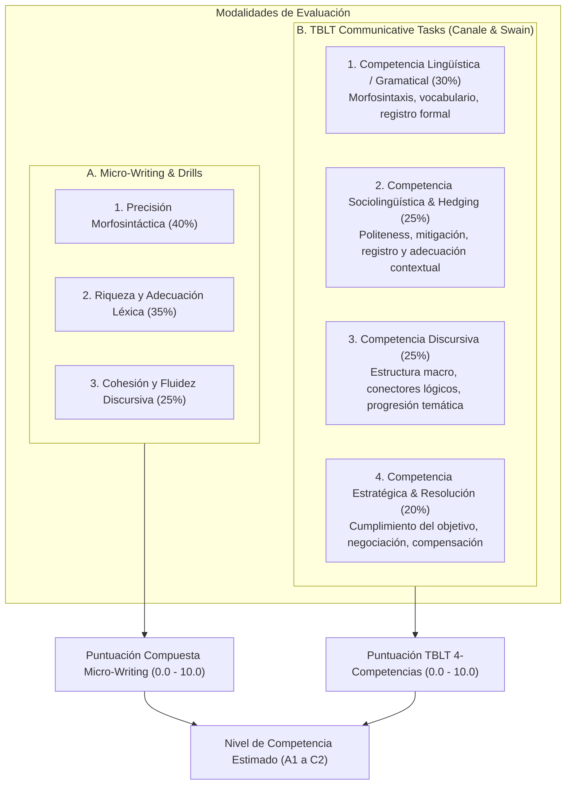

# Rúbricas de Evaluación Pedagógica y Calibración CEFR
## English Learning Assistant (ELA)

Este documento formaliza las **Rúbricas de Evaluación Multidimensional** alineadas con el **Marco Común Europeo de Referencia para las Lenguas (CEFR)** y el modelo de **Competencia Comunicativa** (Canale & Swain, 1980; Bachman, 1990; Ellis, 2003) utilizadas por el motor de IA (Gemini 3.x Flash) para calificar las producciones escritas y las misiones TBLT (*Task-Based Language Teaching*).

---

## 1. Arquitectura de Evaluación Multidimensional

La evaluación en ELA opera bajo dos modalidades complementarias:
1. **Evaluación de Micro-Writing / Producción General:** Enfocada en precisión morfosintáctica, riqueza léxica y cohesión básica (0.0 a 10.0).
2. **Evaluación TBLT de Tareas Comunicativas:** Enfocada en las cuatro competencias comunicativas completas (Lingüística, Sociolingüística, Discursiva y Estratégica) y el cumplimiento pragmático del objetivo de la misión.

---

## 2. Bandas Descriptivas para Micro-Writing (Producción General)

### 2.1. Dimensión 1: Precisión Morfosintáctica (Gramática - 40%)
- **Banda 9.0 - 10.0 (C1-C2):** Mantiene un control gramatical constante de estructuras sintácticas complejas (inversión sujeto-auxiliar, condicionales mixtos, cláusulas reducidas de participio, pasivas avanzadas). Los errores son deslices (*slips*) aislados prácticamente imperceptibles.
- **Banda 7.5 - 8.9 (B2):** Buen control gramatical. Rara vez comete errores que dificulten la comprensión. Utiliza con soltura tiempos verbales compuestos (*present perfect continuous, past perfect*), oraciones subordinadas y cláusulas relativas defining/non-defining.
- **Banda 5.5 - 7.4 (B1):** Control razonable de estructuras simples (presente simple/continuo, pasado simple, futuro con *will/going to*). Comete errores sistemáticos en estructuras complejas, inversión de preguntas indirectas y preposiciones dependientes.
- **Banda 3.5 - 5.4 (A2):** Emplea algunas estructuras sencillas correctamente, pero continúa cometiendo errores elementales sistemáticos de transferencia L1 (omisión de tercera persona singular *-s*, confusión de tiempos verbales, omisión de sujeto pronominal *pro-drop*).
- **Banda 0.0 - 3.4 (A1):** Solo maneja patrones muy breves y aislados memorizados. Fallas generalizadas de concordancia, orden sintáctico y estructura oracional.

### 2.2. Dimensión 2: Riqueza y Adecuación Léxica (Vocabulario & Chunks - 35%)
- **Banda 9.0 - 10.0 (C1-C2):** Amplio repertorio léxico (familias BNC/COCA 5k+) que incluye colocaciones sofisticadas (*harbor doubts, strike a balance*), phrasal verbs idiomáticos y precisión de matices. Sin interferencia de falsos cognados.
- **Banda 7.5 - 8.9 (B2):** Vocabulario suficiente para expresarse sobre temas abstractos y laborales con colocaciones naturales (*take into account, reach a consensus, address an issue*). Errores mínimos de precisión léxica.
- **Banda 5.5 - 7.4 (B1):** Posee vocabulario suficiente para desenvolverse en situaciones cotidianas, pero recurre con frecuencia a circunloquios o repetición de palabras genéricas de alta frecuencia (*good, bad, big, make, do*).
- **Banda 3.5 - 5.4 (A2):** Vocabulario elemental limitado a necesidades concretas e inmediatas. Presencia recurrente de falsos amigos del español (*actually* por actualmente, *career* por carrera universitaria, *assist* por asistir/ayudar).
- **Banda 0.0 - 3.4 (A1):** Solo palabras aisladas de supervivencia y sustantivos concretos.

### 2.3. Dimensión 3: Coherencia y Cohesión Discursiva (25%)
- **Banda 9.0 - 10.0 (C1-C2):** Texto articulado y fluido con variedad de conectores subordinantes y adverbiales complejos (*Furthermore, Nevertheless, Inasmuch as, Conversely*). Progresión temática elegante sin saltos abruptos.
- **Banda 7.5 - 8.9 (B2):** Uso claro de párrafos y conectores discursivos variados (*Although, In addition, Consequently*). Las ideas fluyen de manera lógica y las anáforas pronominales son claras.
- **Banda 5.5 - 7.4 (B1):** Enlaza una serie de elementos breves y discretos mediante conectores lineales repetitivos (*and, but, because, so, then*).
- **Banda 3.5 - 5.4 (A2):** Une palabras o grupos de palabras con conectores muy básicos (*and, but*). Cohesión interoracional deficiente.
- **Banda 0.0 - 3.4 (A1):** Frases desconectadas o yuxtapuestas sin conectores lógicos.

---

## 3. Rúbricas TBLT de Competencia Comunicativa (4 Dimensiones)

Para las misiones de **Task-Based Language Teaching (TBLT)**, la IA califica con base en la matriz canónica Canale & Swain (1980) y Bachman (1990):

### 3.1. Matriz de Calibración por Competencia y Nivel CEFR

| Nivel CEFR | Competencia Lingüística (Gramática & Léxico) | Competencia Sociolingüística (Hedging & Cortesía) | Competencia Discursiva (Cohesión & Flujo) | Competencia Estratégica (Resolución del Objetivo) |
| :--- | :--- | :--- | :--- | :--- |
| **C1** | Control sintáctico impecable. Uso espontáneo de condicionales mixtos, estructuras de énfasis (*cleft sentences*), colocaciones naturales de registro técnico/profesional. | Domina matices sutiles de cortesía y mitigación epistémica (*I would be inclined to suggest*, *it might be prudent to*). Adapta registro de formal a informal sin esfuerzo. | Organización macro-textual impecable (párrafos temáticos, conectores cohesivos sofisticados: *nonetheless, in light of this*). Fluidez nativa. | Negocia con maestría, anticipa contraargumentos de la contraparte, propone soluciones creativas que satisfacen todos los criterios de la misión. |
| **B2** | Buen control de oraciones complejas y tiempos perfectos. Amplio rango léxico con pocas imprecisiones. Sin interferencia obstructiva de L1. | Emplea fórmulas de cortesía estándar y modales mitigadores (*could you please*, *would you mind*, *perhaps we should consider*). Mantiene el tono formal requerido. | Texto claramente estructurado con apertura, desarrollo y cierre. Conectores variados (*however, therefore, as a result*). | Cumple todos los requerimientos de la tarea de forma autónoma. Resuelve discrepancias y aporta argumentos convincentes con solvencia. |
| **B1** | Domina oraciones compuestas simples (*because, although*). Errores ocasionales en preposiciones dependientes y tiempos perfectos que no impiden la comprensión. | Conciencia básica de formalidad. Uso elemental de mitigadores (*I think maybe*, *could you*), aunque a veces suena demasiado directo o imperativo (*You must do this*). | Enlaza ideas en párrafos sencillos con conectores básicos (*first, then, but, so*). Transiciones algo mecánicas. | Cumple los objetivos principales de la misión, pero requiere clarificaciones o apoyo léxico. Argumentación elemental. |
| **A2** | Estructuras sintácticas muy elementales. Frecuentes errores de concordancia de tercera persona (*he have*), omisión de sujeto (*is good*), y orden de palabras. | Registro indiferenciado (trata al cliente/jefe con imperativos directos *give me, tell me*). Desconoce fórmulas de hedging y cortesía diplomática. | Yuxtaposición de frases cortas. Conectores limitados a *and*, *but*. Sin estructura de párrafos formal. | Cumple parcialmente la tarea; deja puntos clave sin abordar o no logra transmitir el mensaje central sin ambigüedades. |

---

## 4. Criterios de Mitigación Epistémica (*Hedging*) y Registro Sociolingüístico

Uno de los principales problemas de los hispanohablantes al comunicarse en inglés en entornos profesionales es la **falsa rudeza o agresividad pragmática involuntaria**, debida a la transferencia directa de órdenes directas del español (*"Send me the report"*, *"You are wrong"*).

### 4.1. Taxonomía de Marcadores de Hedging Evaluados por la IA:
1. **Verbos Modales de Posibilidad/Condicional:**
   - Alto valor pragmático: *could, would, might*.
   - Penalización en peticiones formales: uso excesivo de *must, need to, have to* dirigidos al interlocutor.
2. **Adverbios y Frases Epistémicas:**
   - Mitigadores positivos: *perhaps, possibly, presumably, relatively, somewhat, to some extent*.
3. **Verbos Proposicionales de Actitud Subjetiva:**
   - Mitigadores naturales: *it seems that, it appears that, I would suggest that, we tend to believe*.
4. **Preguntas Negativas y Peticiones Indirectas:**
   - *Would it be possible to...? Could we consider...?*

### 4.2. Escala de Calificación de Hedging:
- **10 / 10:** Grado óptimo de asertividad diplomática. Matiza opiniones controvertidas sin perder firmeza profesional.
- **7.5 / 10:** Incluye fórmulas de cortesía estándar (*please, could you*), aunque con alguna frase categórica evitable.
- **5.0 / 10:** Tono neutro tirando a imperativo. Usa *I want* o *you should* en contextos que requieren negociación delicada.
- **2.5 / 10:** Agresividad pragmática evidente por transferencia L1 (*"You must pay now"*, *"I need that you do this"*).

---

## 5. Fórmulas de Calificación y Algoritmo de Conversión CEFR

### 5.1. Puntuación Compuesta para Micro-Writing
$$\text{Score}_{\text{writing}} = 0.40 \cdot \text{Grammar} + 0.35 \cdot \text{Vocabulary} + 0.25 \cdot \text{Cohesion}$$

### 5.2. Puntuación Compuesta para Misiones TBLT
$$\text{Score}_{\text{tblt}} = 0.30 \cdot \text{Linguistic} + 0.25 \cdot \text{Sociolinguistic} + 0.25 \cdot \text{Discourse} + 0.20 \cdot \text{Strategic}$$

### 5.3. Tabla Maestra de Mapeo a Niveles CEFR

| Puntuación Compuesta | Nivel CEFR Asignado | Denominación Oficial | Descriptor Operativo de Competencia |
| :---: | :---: | :---: | :--- |
| **$0.0 - 3.4$** | **A1** | Acceso / Principiante | Vocabulario aislado, frases memorizadas, alta interferencia L1. |
| **$3.5 - 5.4$** | **A2** | Plataforma / Elemental | Comunicación sobre rutinas y necesidades inmediatas; errores fosilizados frecuentes. |
| **$5.5 - 7.4$** | **B1** | Umbral / Intermedio | Capaz de desenvolverse de manera funcional, narrar sucesos y justificar opiniones de forma simple. |
| **$7.5 - 8.8$** | **B2** | Avanzado / Intermedio Alto | Fluidez operativa en entornos profesionales; control de registro y mitigación adecuada. |
| **$8.9 - 9.6$** | **C1** | Dominio Operativo Eficaz | Expresión espontánea y flexible sobre temas complejos; amplio control estilístico e idiomático. |
| **$9.7 - 10.0$**| **C2** | Maestría | Precisión y sutileza comparables a un hablante nativo educado. |

---

## 6. Formato de Salida y Retroalimentación Pedagógica

Para garantizar que el aprendiz active el principio de **Noticing** (Schmidt, 1990) y reciba retroalimentación accionable, el payload generado por Gemini debe contener:

1. **`scores`**: Puntuaciones numéricas desglosadas por cada dimensión analítica (0.0 a 10.0).
2. **`cefr_level`**: Nivel resultante según el mapeo cuantitativo.
3. **`task_completed`**: Booleano que indica si se resolvió el objetivo funcional de la tarea.
4. **`hedging_analysis`**: Lista de marcadores de cortesía detectados y sugerencias de reformulación diplomática.
5. **`strengths`**: Puntos fuertes comunicativos demostrados por el usuario.
6. **`actionable_corrections`**: Correcciones quirúrgicas con explicación en español de la causa del error (foco en transferencia L1) y su reformulación nativa.
