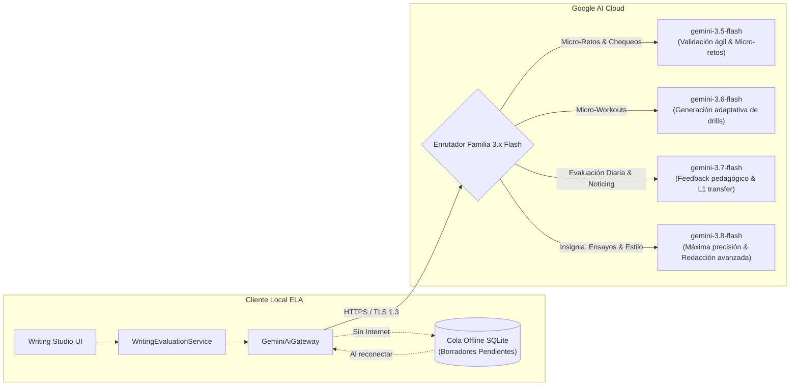
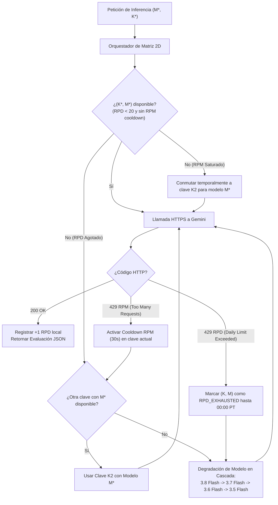

# Arquitectura de Integración con Google Gemini API
## English Learning Assistant (ELA)

Este documento especifica la integración técnica, la estrategia de selección de modelos, el manejo de cuotas y la resiliencia en la comunicación con la **API de Google Gemini**.

---

## 1. Topología del Gateway de IA

---

## 2. Estrategia de Selección de Modelos (Familia 3.x Flash)

Todos los modelos seleccionados operan en modalidad **Flash**, garantizando baja latencia, costo optimizado y soporte estricto para salida estructurada JSON (`response_schema`):

| Modelo Gemini (Familia 3.x Flash) | Rol Pedagógico Principal | Parámetros de Inferencia | Justificación Técnica |
| :--- | :--- | :--- | :--- |
| **`gemini-3.5-flash`** | **Micro-Retos y Chequeos Rápidos de Sintaxis** | `temperature: 0.1` `top_p: 0.90` `response_schema: JSON` | Latencia ultrarrápida (< 800 ms), ideal para interacciones instantáneas en el reproductor de tarjetas y verificación de opciones en micro-retos. |
| **`gemini-3.6-flash`** | **Generación Dinámica de Micro-Workouts** | `temperature: 0.2` `top_p: 0.95` `response_schema: JSON` | Excelente balance entre ensamblaje estructurado de ejercicios personalizados y tiempo de respuesta (< 1.2 s). |
| **`gemini-3.7-flash`** | **Evaluación de Micro-Textos Diarios y Noticing** | `temperature: 0.2` `top_p: 0.95` `response_schema: JSON` | Capacidad superior de razonamiento lingüístico para desglosar la transferencia L1 del español y formular explicaciones didácticas empáticas. |
| **`gemini-3.8-flash`** | **Evaluación Avanzada de Redacción, Estilo y Ensayos** | `temperature: 0.25` `top_p: 0.95` `response_schema: JSON` | Modelo insignia de la familia 3.x Flash. Máxima precisión en análisis de coherencia discursiva, colocaciones sofisticadas, registro formal y calibración CEFR hasta C1/C2 manteniendo velocidad Flash. |

---

## 3. Configuración y Parámetros de Inferencia

### 3.1. Control Determinista de Temperatura
Para fines pedagógicos y corrección gramatical, la creatividad descontrolada es perjudicial:
- Se fija una **temperatura baja de 0.2**.
- Esto garantiza que las explicaciones de reglas gramaticales sean rigurosas, consistentes y no inventen excepciones inexistentes ni sufran alucinaciones.

### 3.2. Salida Estructurada Obligatoria (Structured JSON Output)
No se permite que el modelo devuelva prosa libre conversacional como *"¡Hola! He revisado tu texto y veo los siguientes errores..."*. 
Toda respuesta se procesa con:
- `response_mime_type: "application/json"`
- `response_schema`: El esquema formal definido en `docs/04_data_models_and_schemas/json_schemas_and_payloads.md`.

---

## 4. Resiliencia, Reintentos y Modo Fuera de Línea

### 4.1. Política de Reintentos con Retroceso Exponencial (Exponential Backoff)
En caso de saturación temporal de cuota (HTTP 429) o fallos de conexión (HTTP 503):
- Reintento 1: A los 1.000 ms.
- Reintento 2: A los 2.500 ms con fluctuación aleatoria (*jitter*).
- Reintento 3: A los 6.000 ms.
- Si tras 3 intentos no hay respuesta, se notifica amigablemente al usuario y se guarda el borrador localmente.

### 4.2. Cola de Borradores Fuera de Línea (Offline Drafting)
Si el usuario redacta un texto mientras viaja sin conexión a Internet:
1. El texto se almacena en SQLite en la tabla `writing_submissions` con estado `DRAFT`.
2. El sistema marca la tarea de redacción como "Borrador guardado localmente".
3. Un monitor en segundo plano detecta la restauración de la red y envía automáticamente la solicitud a Gemini, actualizando el estado a `EVALUATED` sin que el usuario pierda su trabajo.

---

## 5. Gestión del Pool de Múltiples Claves de API y Matriz de Resiliencia 2D

Para evitar la interrupción del estudio por agotamiento de cuotas y maximizar el aprovechamiento de la capa gratuita/estándar de Google AI Studio:

### 5.1. Reglas Oficiales de Cuota de Google AI Studio ([API Errors Docs](https://aistudio.google.com/docs/api-errors))
1. **Límites Estándar por Modelo:**
   - Cada modelo individual posee un límite de **5 RPM (Requests Per Minute)** y **20 RPD (Requests Per Day)**.
2. **Aislamiento de RPD por Modelo (Multiplicador de 80 RPD por Clave):**
   - El límite diario de 20 RPD **no es global por proyecto**, sino independiente para cada modelo.
   - Puesto que ELA integra 4 modelos de la familia 3.x Flash (`gemini-3.5-flash`, `gemini-3.6-flash`, `gemini-3.7-flash` y `gemini-3.8-flash`), **una sola clave API Key dispone de un presupuesto diario de hasta 80 peticiones RPD** ($4 \times 20$).
   - Con $N$ claves en el pool, la capacidad total disponible es de $80N$ peticiones al día.
3. **Reinicio Oficial a Medianoche del Pacífico (00:00 Pacific Time):**
   - Google reinicia los contadores diarios a las 00:00:00 PT (UTC-8 en PST / UTC-7 en PDT).
   - ELA sincroniza un temporizador local que restablece a cero los contadores de `api_key_model_quotas` exactamente en dicho instante, notificando en el panel cuántas horas y minutos restan para el reset diario.

### 5.2. Diagnóstico de Errores HTTP 429 (`RESOURCE_EXHAUSTED`)
- **Detección de RPM:** Cabecera `Retry-After: < 60s` o cuerpo con cadena `RequestsPerMinute`. El sistema aplica un enfriamiento breve de 30 segundos o conmuta inmediatamente de clave para el mismo modelo.
- **Detección de RPD:** Mensaje de error con `RequestsPerDay` o cuota diaria excedida. El sistema marca el par `(clave, modelo)` como bloqueado hasta las 00:00 PT y degrada al siguiente modelo o clave según la especificación de [`ai_quota_resilience_matrix.md`](../05_algorithms/ai_quota_resilience_matrix.md).

### 5.3. Seguridad y Cifrado de Claves en Reposo
- Cada clave se almacena en la tabla `ai_api_keys` cifrada con **AES-256-GCM**.
- En la interfaz de usuario, las claves siempre se presentan enmascaradas (`AIzaSy...74vQ`), impidiendo filtraciones involuntarias.
- El usuario puede añadir ilimitadas claves secundarias o de respaldo desde el **Panel de Configuración de IA**.
