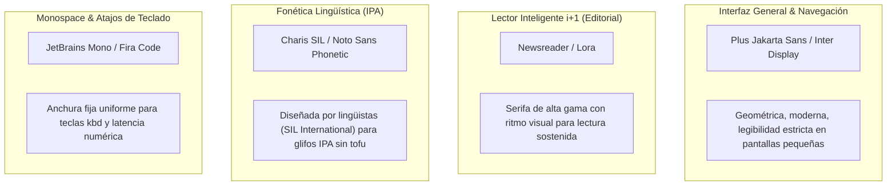
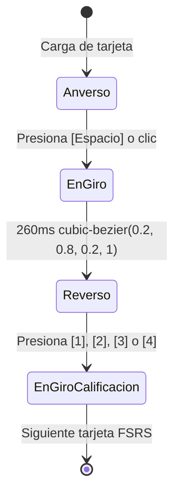

# Sistema de Diseño y Guía de Estilos UI/UX (Design System)
## English Learning Assistant (ELA) — "Warm Minimalist & Editorial Tech"

---

## 1. Filosofía Visual y Principios de Diseño

El sistema de diseño de **ELA** está concebido bajo la filosofía **"Warm Minimalist & Editorial Tech"**, inspirada en la sobriedad funcional de herramientas de ingeniería como *Linear*, la serenidad tipográfica de *iA Writer* y la calidez editorial de publicaciones de lectura prolongada (*The Atlantic*, *Substack*).

### Principios Rectores:

1. **Cero Fricción Cognitiva (Atomic Habits):**
   - La interfaz elimina adornos superfluos, modales invasivos y patrones de gamificación infantil (estilo "casino/Duolingo" con gemas fluorescentes y personajes ruidosos).
   - La atención del estudiante se canaliza al 100% en la práctica deliberada: recuperación activa, análisis de patrones fonológicos y redacción guiada.

2. **Calidez Óptica y Descanso Visual Prolongado:**
   - **Modo Claro:** Sustituye el blanco puro `#FFFFFF` estridente por un lienzo cálido hueso/marfil (`#FBFBF9`), reduciendo el deslumbramiento y la fatiga ocular en lecturas de más de 30 minutos.
   - **Modo Oscuro:** Sustituye el negro absoluto `#000000` (que genera artefactos fantasma y contraste agresivo en paneles IPS/OLED) por carbón profundo con tinte índigo (`#0B0D13` para el fondo y `#131722` para superficies), emulando una sala de estudio nocturna en penumbra.

3. **Fidelidad Lingüística y Tipográfica Prístina:**
   - Soporte nativo absoluto para caracteres del Alfabeto Fonético Internacional (IPA) sin sustituciones de glifos defectuosas ("tofu"), desalineaciones verticales ni cortes de diacríticos fonéticos.

4. **Micro-Interacciones Táctiles y Respuesta Inmediata:**
   - Toda interacción de teclado (volteo de tarjetas, reproducción de audio, calificación FSRS) ofrece feedback visual y háptico en menos de 50 ms con transiciones físicas calibradas mediante curvas Bézier suaves (`cubic-bezier(0.2, 0.8, 0.2, 1)`).

---

## 2. Tokens de Color y Paletas Cromáticas

### 2.1 Paleta Neutra (Warm Neutrals)

| Token Semántico | Variable CSS | HEX Modo Claro | HEX Modo Oscuro | Clase Tailwind Modo Claro | Clase Tailwind Modo Oscuro | Propósito |
| :--- | :--- | :--- | :--- | :--- | :--- | :--- |
| `canvas` | `--color-bg-canvas` | `#FBFBF9` | `#0B0D13` | `bg-[#FBFBF9]` | `dark:bg-[#0B0D13]` | Fondo de la aplicación completa |
| `surface-0` | `--color-bg-surface-0` | `#FFFFFF` | `#131722` | `bg-white` | `dark:bg-[#131722]` | Tarjetas base, paneles de contenido |
| `surface-1` | `--color-bg-surface-1` | `#F4F4F1` | `#1B2030` | `bg-[#F4F4F1]` | `dark:bg-[#1B2030]` | Superficies secundarias, campos de entrada |
| `surface-2` | `--color-bg-surface-2` | `#EAEAE5` | `#23293D` | `bg-[#EAEAE5]` | `dark:bg-[#23293D]` | Elementos interactivos en reposo, hover |
| `border-subtle` | `--color-border-subtle` | `#E5E7EB` | `#1F2637` | `border-gray-200` | `dark:border-[#1F2637]` | Separadores sutiles, bordes de tarjeta |
| `border-strong` | `--color-border-strong` | `#D1D5DB` | `#2E3851` | `border-gray-300` | `dark:border-[#2E3851]` | Bordes interactivos, focus no activo |
| `text-primary` | `--color-text-primary` | `#111827` | `#F9FAFB` | `text-gray-900` | `dark:text-gray-50` | Títulos, cuerpo principal, fonética clave |
| `text-secondary`| `--color-text-secondary`| `#4B5563` | `#94A3B8` | `text-gray-600` | `dark:text-slate-400` | Explicaciones, etiquetas de metadatos |
| `text-muted` | `--color-text-muted` | `#6B7280` | `#7C8B9E` | `text-gray-500` | `dark:text-[#7C8B9E]` | Placeholders, atajos inactivos (WCAG AA) |

---

### 2.2 Paleta de Acento y Marca (Focus Indigo)

El índigo profundo ha sido seleccionado cromáticamente por su capacidad de inducir concentración sostenida sin saturación retiniana.

| Token | Variable CSS | HEX Claro | HEX Oscuro | Clase Tailwind | Uso |
| :--- | :--- | :--- | :--- | :--- | :--- |
| `accent-primary` | `--color-accent` | `#4F46E5` | `#6366F1` | `bg-indigo-600 dark:bg-indigo-500` | Botones de acción primaria, estados activos |
| `accent-hover` | `--color-accent-hover` | `#4338CA` | `#4F46E5` | `hover:bg-indigo-700 dark:hover:bg-indigo-600` | Estados hover de acción primaria |
| `accent-text` | `--color-accent-text` | `#4338CA` | `#818CF8` | `text-indigo-700 dark:text-indigo-400` | Enlaces, texto resaltado, términos activos |
| `accent-subtle` | `--color-accent-subtle`| `#EEF2FF` | `#1E1B4B` | `bg-indigo-50 dark:bg-indigo-950/60` | Fondos de badges de acento, pistas activas |
| `accent-ring` | `--color-accent-ring` | `rgba(79, 70, 229, 0.35)` | `rgba(99, 102, 241, 0.45)` | `focus-visible:ring-indigo-500/40` | Anillo de accesibilidad para foco de teclado |

---

### 2.3 Paleta Semántica Pedagógica (SLA & FSRS Feedback)

Codificación cromática estricta para estados del algoritmo de repetición espaciada FSRS y retroalimentación lingüística:

| Estado Pedagógico | Variable CSS | HEX Claro (Texto/Icono) | HEX Oscuro (Texto/Icono) | Fondo Sutil (Claro/Oscuro) | Uso en ELA |
| :--- | :--- | :--- | :--- | :--- | :--- |
| **Dominado / Good / Easy** | `--color-success` | `#047857` (Emerald 700) | `#34D399` (Emerald 400) | `#ECFDF5` / `#064E3B/40` | Calificación FSRS Good/Easy, Daily Quests completadas, pronunciación fluida |
| **Duda / Hard / Warning** | `--color-warning` | `#B45309` (Amber 700) | `#FBBF24` (Amber 400) | `#FFFBEB` / `#78350F/40` | Calificación FSRS Hard, alerta de debilidad frecuente, aviso de latencia lenta |
| **Error / Again / Fosilización** | `--color-danger` | `#B91C1C` (Red 700) | `#F87171` (Red 400) | `#FEF2F2` / `#7F1D1D/40` | Calificación FSRS Again, transferencia negativa L1, falsos amigos detectados |
| **Informativo / Pista ZPD** | `--color-info` | `#0369A1` (Sky 700) | `#38BDF8` (Sky 400) | `#F0F9FF` / `#0C4A6E/40` | Pregunta orientadora socrática, metadatos sintácticos, badges de nivel CEFR |

---

### 2.4 Paleta Cromática para Fonética y Habla Conectada

Cada fenómeno de fonología conectada posee una identidad cromática inequívoca para facilitar el mapeo perceptual en el *Connected Speech Lab* y en el *Gimnasio de Pares Mínimos*:

```
    Hold on        for a      second and     meet you
     \____/        \___/        \      /      \____/
    🔵 Linking    🟢 Weak       🔴 Elisión   🟣 Asimilación
```

| Fenómeno Fonético | Token | HEX Claro | HEX Oscuro | Símbolo / Indicador | Ejemplo Visual |
| :--- | :--- | :--- | :--- | :--- | :--- |
| **Linking (Catenación C-V / V-V)** | `--phonetic-linking` | `#2563EB` | `#60A5FA` | Arco conector inferior `\___/` | `Hold‿on` [həʊl-dɒn] |
| **Weak Forms / Schwa /ə/** | `--phonetic-weak` | `#059669` | `#34D399` | Glifo verde /ə/ | `for a` [fər-ə] |
| **Elisión (Omisión de sonido)** | `--phonetic-elision` | `#E11D48` | `#FB7185` | Glifo tachado `~` | `second and` [ˈsekən-ən] |
| **Asimilación (Yod-Coalescence)** | `--phonetic-assim` | `#7C3AED` | `#A78BFA` | Fusión de doble flecha `><` | `meet you` [ˈmiːtʃuː] |
| **Acento Léxico Tónico** | `--phonetic-stress` | `#111827` | `#F9FAFB` | Barra vertical `ˈ` en negrita | `ˈrecord` vs `reˈcord` |

---

## 3. Tipografía y Escala Tipográfica

### 3.1 Tríada Tipográfica Especializada



#### Pilas de Fuentes CSS (`font-family`):

```css
/* Interfaz de Usuario y Navegación */
--font-sans: 'Plus Jakarta Sans', 'Inter', -apple-system, BlinkMacSystemFont, 'Segoe UI', Roboto, sans-serif;

/* Lector Graduado i+1 (Serifa Editorial) */
--font-serif: 'Newsreader', 'Lora', Charter, 'Bitstream Charter', Georgia, serif;

/* Fonética IPA Rigurosa */
--font-phonetic: 'Charis SIL', 'Gentium Plus', 'Noto Sans Phonetic', 'Doulos SIL', sans-serif;

/* Teclas Físicas, Métricas y Latencia */
--font-mono: 'JetBrains Mono', 'Fira Code', Menlo, Monaco, Consolas, monospace;
```

---

### 3.2 Escala Tipográfica Formal (Type Scale)

Basada en una progresión armónica **Minor Third (1.200)** con calibración de altura de línea (*line-height*) y espaciado de caracteres (*letter-spacing / tracking*) para garantizar máxima legibilidad en monitores de alta resolución:

| Token | Tamaño (px / rem) | Altura de Línea (px / rem) | Tracking (Letter Spacing) | Font Weight | Clases Tailwind | Caso de Uso Pedagógico |
| :--- | :--- | :--- | :--- | :--- | :--- | :--- |
| `text-xs` | `12px` / `0.75rem` | `16px` / `1.0rem` | `+0.025em` (`tracking-wide`) | `500` / `600` | `text-xs font-medium tracking-wide` | Badges de estado, atajos `kbd`, cronómetro de drills |
| `text-sm` | `13.5px` / `0.844rem`| `20px` / `1.25rem` | `+0.010em` (`tracking-normal`)| `400` / `500` | `text-sm font-normal` | Explicaciones gramaticales breves, metadatos FSRS, etiquetas de inputs |
| `text-base`| `15px` / `0.938rem` | `24px` / `1.5rem` | `0em` (`tracking-normal`) | `400` / `500` | `text-base font-normal leading-relaxed` | Oraciones de ejemplo, transcripción IPA estándar, cuerpo de artículos en el Lector |
| `text-lg` | `17px` / `1.063rem` | `26px` / `1.625rem`| `-0.010em` (`tracking-tight`)| `500` / `600` | `text-lg font-medium` | Prompt frontal de flashcards, encabezados de tarjeta, términos en glosario |
| `text-xl` | `20px` / `1.25rem` | `28px` / `1.75rem` | `-0.015em` (`tracking-tight`)| `600` / `700` | `text-xl font-semibold tracking-tight` | Título de secciones, término revelado en reverso de tarjeta |
| `text-2xl` | `24px` / `1.5rem` | `32px` / `2.0rem` | `-0.020em` (`tracking-tight`)| `700` | `text-2xl font-bold tracking-tight` | Contador de racha en Header, títulos principales de módulo |
| `text-3xl` | `30px` / `1.875rem` | `38px` / `2.375rem`| `-0.025em` (`tracking-tighter`)| `700` / `800` | `text-3xl font-bold tracking-tighter` | Saludo del Dashboard, métricas destacadas del Heatmap |

---

## 4. Espaciado, Dimensionamiento y Sistema de Retícula

### 4.1 Retícula Base de 4px / 8px

El espaciado vertical y horizontal sigue múltiplos estrictos de 4px y 8px para crear consistencia rítmica:

- `space-1` (4px): Espaciado entre iconos y etiquetas de badges.
- `space-2` (8px): Espacio interior de botones compactos, padding de teclas `kbd`.
- `space-3` (12px): Separación entre elementos de listas compactas, gap de botones de calificación FSRS.
- `space-4` (16px): Padding interior estándar de tarjetas, gap entre columnas de navegación.
- `space-6` (24px): Padding de tarjetas maestras (flashcard player, modal de redacción).
- `space-8` (32px): Separador de secciones mayores en el Dashboard y Heatmap.
- `space-12` (48px): Margen superior de vistas completas.

### 4.2 Densidades de Interfaz (Comfortable vs Compact)

El usuario puede alternar la densidad global en la barra de preferencias:

- **Densidad Cómoda (*Comfortable* - Por Defecto):**
  - Espaciado generoso (`p-6`, `gap-4`). Diseñada para la práctica deliberada, minimizando la carga cognitiva y favoreciendo la absorción profunda.
- **Densidad Compacta (*Compact*):**
  - Espaciado reducido (`p-3.5`, `gap-2.5`). Diseñada para estudiantes avanzados que realizan revisiones de gran volumen (> 50 tarjetas/día) o trabajan en pantallas portátiles compactas.

### 4.3 Radios de Borde (Border Radius)

```
[ rounded-md: 6px ]  --> Badges, chips, teclas kbd, tooltips
[ rounded-xl: 12px ] --> Campos de texto (inputs), botones principales, tarjetas secundarias
[ rounded-2xl: 16px ] --> Flashcard principal, modales contextuales, panel de audio
[ rounded-full: 9999px ] --> Avatares, píldoras de estado de racha, botones de reproducción
```

### 4.4 Elevación, Sombras e Iluminación de Bordes

- **Modo Claro (Luz Difusa Cálida):**
  - `elevation-card`: `box-shadow: 0 1px 3px 0 rgba(0, 0, 0, 0.04), 0 4px 12px -2px rgba(0, 0, 0, 0.05);`
  - `elevation-modal`: `box-shadow: 0 10px 25px -5px rgba(0, 0, 0, 0.08), 0 8px 10px -6px rgba(0, 0, 0, 0.03);`
- **Modo Oscuro (Profundidad por Borde Interior Tonal):**
  - En lugar de sombras oscuras invisibles, la profundidad se logra mediante **bordes de luz interior de 1px**:
    `border: 1px solid rgba(255, 255, 255, 0.07);`
    combinado con la elevación de superficie tonal (`#131722` $\rightarrow$ `#1B2030`).

---

## 5. Especificaciones de Componentes Clave y Micro-Interacciones

### 5.1 Componente: Flashcard FSRS con Volteo 3D (Spatial Flip Card)

La tarjeta de repaso no desaparece ni recarga el DOM. Utiliza transformación 3D con aceleración de hardware:



#### Parámetros Técnicos de Animación:
- **Perspectiva del contenedor:** `perspective: 1000px;`
- **Preservación 3D:** `transform-style: preserve-3d;`
- **Duración del giro:** `260ms`
- **Curva de velocidad:** `cubic-bezier(0.2, 0.8, 0.2, 1)` (arranque ágil, amortiguación final sedosa sin rebote exagerado).
- **Visibilidad posterior:** `backface-visibility: hidden;`
- **Accesibilidad (`prefers-reduced-motion`):** Desactiva la rotación 3D y aplica un fundido cruzado instantáneo de opacidad (`opacity: 0 -> 1` en 80 ms).

---

### 5.2 Componente: Tecla Física de Navegación (`Kbd Pill`)

Para reforzar el principio de interacción por teclado en el SRS y los Drills, las teclas se muestran con relieve tridimensional táctil:

```html
<!-- Componente Tailwind Kbd Pill -->
<kbd class="inline-flex items-center justify-center px-2 py-0.5 text-xs font-mono font-semibold 
            text-gray-700 dark:text-gray-300 bg-gray-100 dark:bg-[#1B2030] 
            border border-gray-300 dark:border-[#2E3851] border-b-2 rounded-md shadow-xs">
  Espacio
</kbd>
```

---

### 5.3 Componente: Tarjeta de Contraste Fonético y Pares Mínimos (Phonetic Contrast Card)

El *Gimnasio de Pares Mínimos* entrena la discriminación auditiva forzada entre contrastes fonológicos críticos:

- **Lienzo de Decisión Rápida:** Contenedor centrado con feedback visual de borde inmediato (Verde Esmeralda `#10B981` al acertar, Rojo Coral `#EF4444` al fallar).
- **Botón de Estímulo a Ciegas:** Área interactiva con icono de altavoz de alto contraste, activable mediante atajo de teclado (`<kbd>Espacio</kbd>` o `<kbd>R</kbd>`).
- **Botones de Selección Dual:** Opciones de respuesta de gran superficie táctil con tipografía IPA nítida (`Charis SIL`, 18px) para contrastar los alófonos en disputa (/iː/ frente a /ɪ/).
- **Barra de Presión Temporal:** Indicador regresivo de 2.0s con animación fluida `linear` a 60 FPS.

---

### 5.4 Componente: Barra de Progreso Reactiva de Drills de Velocidad

En el módulo de *Speed Drills (Speed-Run 60s)*, el tiempo restante por ítem (límite 3.0s) se representa visualmente con un degradado dinámico:

- **3.0s a 1.5s:** Verde esmeralda (`#10B981`).
- **1.5s a 0.8s:** Ámbar preventivo (`#F59E0B`).
- **< 0.8s:** Rojo coral de urgencia cognitiva (`#EF4444`).
- **Transición:** `transition: width 100ms linear, background-color 200ms ease;`

---

### 5.5 Componente: Editor Socrático y Subrayado de Errores Pedagógicos

En la corrección de redacción guiada por Gemini:

- **Errores de Transferencia L1 / Falsos Amigos:** Subrayado ondulado carmín (`text-decoration: underline wavy #EF4444;`).
- **Sugerencias de Colocación Natural:** Subrayado punteado ámbar (`text-decoration: underline dotted #F59E0B;`).
- **Pista Socrática Activa:** Al hacer clic sobre el subrayado, se despliega una tarjeta flotante (*Pop-over*) con fondo cálido de baja luminancia, planteando la pregunta de Noticing sin desvelar la respuesta directa.

---

## 6. Normativas de Accesibilidad y Ergonomía (WCAG 2.1 AA & AAA)

El sistema de diseño ha sido verificado matemáticamente para cumplir las directrices de accesibilidad web **WCAG 2.1**:

$$\text{Ratio de Contraste} = \frac{L_1 + 0.05}{L_2 + 0.05} \quad (L_1 > L_2)$$

### Matriz de Contrastes Auditada:

| Combinación de Elementos | Luminancia Fondo | Luminancia Texto | Ratio Medido | Nivel WCAG | Cumplimiento |
| :--- | :--- | :--- | :--- | :--- | :--- |
| Texto Principal sobre Fondo Claro (`#111827` en `#FBFBF9`) | 0.945 | 0.013 | **17.12 : 1** | **AAA** ($\ge 7.0:1$) | Supera con holgura |
| Texto Secundario sobre Fondo Claro (`#4B5563` en `#FBFBF9`) | 0.945 | 0.089 | **7.29 : 1** | **AAA** ($\ge 7.0:1$) | Supera con holgura |
| Texto Muted sobre Fondo Claro (`#6B7280` en `#FBFBF9`) | 0.945 | 0.163 | **4.67 : 1** | **AA** ($\ge 4.5:1$) | Cumple texto estándar |
| Acento Índigo sobre Fondo Claro (`#4338CA` en `#FBFBF9`) | 0.945 | 0.080 | **7.63 : 1** | **AAA** ($\ge 7.0:1$) | Supera con holgura |
| Botón Primario Blanco sobre Índigo (`#FFFFFF` en `#4F46E5`) | 0.116 | 1.000 | **6.29 : 1** | **AA** ($\ge 4.5:1$) | Excelente contraste |
| Texto Principal sobre Fondo Oscuro (`#F9FAFB` en `#0B0D13`) | 0.007 | 0.963 | **18.59 : 1** | **AAA** ($\ge 7.0:1$) | Supera con holgura |
| Texto Principal sobre Tarjeta Oscura (`#F9FAFB` en `#131722`) | 0.012 | 0.963 | **17.13 : 1** | **AAA** ($\ge 7.0:1$) | Supera con holgura |
| Texto Secundario sobre Tarjeta Oscura (`#94A3B8` en `#131722`)| 0.012 | 0.366 | **6.98 : 1** | **AA+** ($\approx 7.0:1$) | Casi nivel AAA |
| Texto Muted sobre Tarjeta Oscura (`#7C8B9E` en `#131722`) | 0.012 | 0.252 | **5.15 : 1** | **AA** ($\ge 4.5:1$) | Cumple texto estándar |
| Acento Índigo sobre Tarjeta Oscura (`#818CF8` en `#131722`) | 0.012 | 0.301 | **6.00 : 1** | **AA** ($\ge 4.5:1$) | Cumple para UI interactiva |

### Directivas de Foco Accesible:
- Ningún control interactivo omite el indicador visual de foco (`outline: none` sin sustituto está terminantemente prohibido).
- Todos los elementos interactivos implementan:
  `focus-visible:ring-2 focus-visible:ring-indigo-500 focus-visible:ring-offset-2 focus-visible:outline-none dark:focus-visible:ring-offset-[#0B0D13]`.

---

## 7. Archivo de Configuración de Tailwind CSS de Referencia

A continuación se detalla la configuración formal que debe residir en `tailwind.config.ts` o `tailwind.config.js` para el proyecto:

```javascript
/** @type {import('tailwindcss').Config} */
module.exports = {
  darkMode: 'class',
  content: [
    './src/**/*.{js,ts,jsx,tsx,mdx}',
  ],
  theme: {
    extend: {
      colors: {
        canvas: {
          light: '#FBFBF9',
          dark: '#0B0D13',
        },
        surface: {
          0: { light: '#FFFFFF', dark: '#131722' },
          1: { light: '#F4F4F1', dark: '#1B2030' },
          2: { light: '#EAEAE5', dark: '#23293D' },
        },
        brand: {
          50: '#EEF2FF',
          100: '#E0E7FF',
          400: '#818CF8',
          500: '#6366F1',
          600: '#4F46E5',
          700: '#4338CA',
          900: '#312E81',
          950: '#1E1B4B',
        },
        phonetic: {
          linking: { light: '#2563EB', dark: '#60A5FA' },
          weak: { light: '#059669', dark: '#34D399' },
          elision: { light: '#E11D48', dark: '#FB7185' },
          assimilation: { light: '#7C3AED', dark: '#A78BFA' },
        }
      },
      fontFamily: {
        sans: ['var(--font-sans)', 'Plus Jakarta Sans', 'Inter', 'sans-serif'],
        serif: ['var(--font-serif)', 'Newsreader', 'Lora', 'Georgia', 'serif'],
        phonetic: ['var(--font-phonetic)', 'Charis SIL', 'Noto Sans Phonetic', 'sans-serif'],
        mono: ['var(--font-mono)', 'JetBrains Mono', 'Fira Code', 'monospace'],
      },
      fontSize: {
        'xs': ['0.75rem', { lineHeight: '1.0rem', letterSpacing: '0.025em' }],
        'sm': ['0.844rem', { lineHeight: '1.25rem', letterSpacing: '0.01em' }],
        'base': ['0.938rem', { lineHeight: '1.5rem', letterSpacing: '0em' }],
        'lg': ['1.063rem', { lineHeight: '1.625rem', letterSpacing: '-0.01em' }],
        'xl': ['1.25rem', { lineHeight: '1.75rem', letterSpacing: '-0.015em' }],
        '2xl': ['1.5rem', { lineHeight: '2.0rem', letterSpacing: '-0.02em' }],
        '3xl': ['1.875rem', { lineHeight: '2.375rem', letterSpacing: '-0.025em' }],
      },
      borderRadius: {
        'pill': '9999px',
        'subtle': '6px',
        'card': '12px',
        'master': '16px',
      },
      boxShadow: {
        'subtle-light': '0 1px 3px 0 rgba(0, 0, 0, 0.04), 0 4px 12px -2px rgba(0, 0, 0, 0.05)',
        'modal-light': '0 10px 25px -5px rgba(0, 0, 0, 0.08), 0 8px 10px -6px rgba(0, 0, 0, 0.03)',
        'dark-border': 'inset 0 0 0 1px rgba(255, 255, 255, 0.07)',
      },
      transitionTimingFunction: {
        'tactile': 'cubic-bezier(0.2, 0.8, 0.2, 1)',
      }
    },
  },
  plugins: [],
}
```

---

## 8. Hojas de Estilo Globales (`globals.css`)

```css
@tailwind base;
@tailwind components;
@tailwind utilities;

:root {
  --color-bg-canvas: #FBFBF9;
  --color-bg-surface-0: #FFFFFF;
  --color-bg-surface-1: #F4F4F1;
  --color-bg-surface-2: #EAEAE5;
  --color-border-subtle: #E5E7EB;
  --color-border-strong: #D1D5DB;
  --color-text-primary: #111827;
  --color-text-secondary: #4B5563;
  --color-text-muted: #6B7280;
  --color-accent: #4F46E5;
  --color-accent-hover: #4338CA;
  --color-accent-text: #4338CA;
}

.dark {
  --color-bg-canvas: #0B0D13;
  --color-bg-surface-0: #131722;
  --color-bg-surface-1: #1B2030;
  --color-bg-surface-2: #23293D;
  --color-border-subtle: #1F2637;
  --color-border-strong: #2E3851;
  --color-text-primary: #F9FAFB;
  --color-text-secondary: #94A3B8;
  --color-text-muted: #7C8B9E;
  --color-accent: #6366F1;
  --color-accent-hover: #4F46E5;
  --color-accent-text: #818CF8;
}

/* Reset y Renderizado de Tipografías */
body {
  background-color: var(--color-bg-canvas);
  color: var(--color-text-primary);
  font-family: var(--font-sans);
  text-rendering: optimizeLegibility;
  -webkit-font-smoothing: antialiased;
  -moz-osx-font-smoothing: grayscale;
}

/* Clases Utilitarias Fonéticas Especiales */
.font-ipa {
  font-family: var(--font-phonetic);
  font-feature-settings: "kern" 1, "liga" 1;
}

.font-editorial {
  font-family: var(--font-serif);
}

/* Respeto estricto a la accesibilidad motriz */
@media (prefers-reduced-motion: reduce) {
  *, ::before, ::after {
    animation-duration: 0.01ms !important;
    animation-iteration-count: 1 !important;
    transition-duration: 0.01ms !important;
    scroll-behavior: auto !important;
  }
}
```
