# Arquitectura de la Información y Mapa de Navegación (UI/UX)
## English Learning Assistant (ELA)

Este documento define la estructura de pantallas, la jerarquía de navegación y los componentes de interacción de la plataforma ELA, integrando todos los módulos pedagógicos avanzados: Prosody Studio, Topo-Lab Cognitivo, TBLT Studio, Bottom-Up Listening y Proceduralización de Memoria.

---

## 1. Mapa del Sitio y Jerarquía de Navegación

```mermaid
graph TD
    App["ELA Application Root"] --> Sidebar["Barra de Navegación Lateral (Global Sidebar)"]
    
    Sidebar --> Nav1["1. Dashboard (Panel de Control Principal)<br/>• Quests Diarias Gamificadas<br/>• Racha con 24h Grace Period & 2 Freezes<br/>• Resumen de Debilidades Críticas (Heatmap L1)<br/>• Botón de Acción Inmediata (Quick Start)"]
    
    Sidebar --> Nav2["2. Memoria & Proceduralización (SRS & Drills)<br/>• Repaso FSRS con Throttling (Cap 30/día)<br/>• Speed Drills Motoras (RT < 1.5s, N+3/N+7 loop)<br/>• Curva de Ley de Potencia de Newell & Rosenbloom"]
    
    Sidebar --> Nav3["3. Fonética & Prosody Studio<br/>• Gimnasio HVPT (Pares Mínimos en 2.0s)<br/>• Desglosador de Habla Conectada (Flapping, Linking)<br/>• Prosody Studio: Pitch Contour F0 & Metrónomo Stress-Timed"]
    
    Sidebar --> Nav4["4. Laboratorio Cognitivo (Topo-Lab)<br/>• Simulador Topológico de Preposiciones (In, On, At)<br/>• Verbos de Movimiento Satelital (Tiptoe into, Rush out)<br/>• Redes Polisémicas Radiales (Run, Take, Set)"]
    
    Sidebar --> Nav5["5. Misiones TBLT (Task Studio)<br/>• Fase 1: Pre-Task (Activación de Chunks & Hedging)<br/>• Fase 2: Task Execution (Redacción/Negociación bajo presión)<br/>• Fase 3: Post-Task AI Review (Evaluación 4-Competencias Canale & Swain)"]
    
    Sidebar --> Nav6["6. Taller Socrático de Redacción<br/>• Escaneo Determinista Previo de Transferencia L1<br/>• Modo Socrático de Noticing (Pistas -> Auto-corrección)<br/>• Micro-Reto de Consolidación Inmediata"]
    
    Sidebar --> Nav7["7. Lector Inteligente & Escucha Ascendente (Reading & Listening Lab)<br/>• Lexical Profiler (BNC/COCA 95% / 98% Cobertura)<br/>• Simplificador Dinámico i+1 con Gemini Flash<br/>• Reproductor Bottom-Up en 3 Pasos (Ciego -> Acoustic Noticing -> Integración)"]
    
    Sidebar --> Nav8["8. Analítica & Heatmap de Debilidades<br/>• Matriz Visual de Errores con Decaimiento Temporal (τ = 7d)<br/>• Métricas de Automatización Procedural (RT ms)<br/>• Generador de Micro-Workouts Específicos"]
    
    Sidebar --> Nav9["9. Panel de Configuración de IA & Cuotas<br/>• Selector de Modelo Gemini 3.x Flash<br/>• Pool Multi-Claves con Failover Automático 429<br/>• Matriz 2D de Cuotas (80 RPD por Clave / Reset 00:00 PT)"]
    
    Sidebar --> Nav10["10. Preferencias Generales & Datos<br/>• Acento de Referencia (Americano General / RP Británico)<br/>• Copias de Seguridad (Exportar / Importar SQLite & JSON)<br/>• Modo Oscuro / Claro & Densidad (Cómoda / Compacta)"]
```



---

## 2. Organización Espacial del Layout Principal

El diseño sigue una estructura ergonómica de dos paneles (*Sidebar-Content*) con barra de estado inferior persistente:

```
+--------------------+-------------------------------------------------------------------------+
|  ELA ASSISTANT     |  HEADER: [🔥 Racha: 14d (🛡️ 2 Freezes | Grace 24h)] [🌙 Tema] [⚙️]        |
+--------------------+-------------------------------------------------------------------------+
| [📊 Dashboard]     |  ÁREA DE CONTENIDO PRINCIPAL                                            |
| [🗂️ SRS & Drills]  |                                                                         |
| [🎙️ Fonética & F0] |  (Renderiza la vista activa según la ruta seleccionada en el Sidebar)   |
| [🧭 Topo-Lab]      |                                                                         |
| [💼 TBLT Studio]   |  - Rutas soportadas:                                                    |
| [✍️ Redacción]     |    /dashboard                                                           |
| [🎧 Reading & Lab] |    /srs-drills                                                          |
| [🔥 Heatmap L1]    |    /prosody-studio                                                      |
| [🤖 Config IA]     |    /topo-lab                                                            |
| [⚙️ Preferencias]  |    /tblt-studio                                                         |
|                    |    /writing-lab                                                         |
|                    |    /reading-listening-lab                                               |
|                    |    /heatmap-analytics                                                   |
+--------------------+-------------------------------------------------------------------------+
| ESTUDIANTE:        |  STATUS BAR: SQLite v2.0 Activa | Quota: Clave 1 [14/20] 🟢                 |
| Carlos (B1 Target) |  F0 FFT Audio: Ready (44.1 kHz) | Latencia IA: 850 ms                   |
+--------------------+-------------------------------------------------------------------------+
```

---

## 3. Catálogo de Vistas y Rutas de la Aplicación

| Ruta | Nombre de la Vista | Módulo Pedagógico Asociado | Componentes Principales |
| :--- | :--- | :--- | :--- |
| `/dashboard` | Dashboard Principal | RF-SRL, RF-TRN | Quests diarias, Widget de Racha y Grace Period, Heatmap Widget, Quick-Action CTA. |
| `/srs-drills` | Memoria & Speed Drills | RF-SRS, RF-PROC | Visualizador FSRS, Throttling Counter (30 max/día), Speed-Run Timer (60s), N+3/N+7 Error Loop. |
| `/prosody-studio` | Prosodia & Fonética | RF-PHO, RF-PRO, RF-HVPT | Gym HVPT (Selector 2.0s), Visualizador Canvas de Curva Pitch F0, Metrónomo Stress-Timed, Audio Waveform. |
| `/topo-lab` | Laboratorio Cognitivo | RF-SEM, RF-TRN | Canvas Interactivo Topológico (In/On/At), Comparador Satelital vs Marco Verbal, Inspector Radial de Polisemia. |
| `/tblt-studio` | Misiones TBLT | RF-TBLT, RF-SOC | Wizard 3-Fases: Pre-Task Briefing, Task Editor con cronómetro, Post-Task Evaluation (4 Competencias). |
| `/writing-lab` | Taller Socrático | RF-TRN, RF-AIC | Editor de texto con Noticing reactivo, Detección L1 pre-AI, Panel Socrático, Micro-Challenge Modal. |
| `/reading-listening-lab` | Lector & Escucha Ascendente | RF-INP, RF-VOC | Lexical Profiler (95% coverage highlight), Botón Simplificador i+1, Reproductor Bottom-Up en 3 pasos. |
| `/heatmap-analytics` | Analítica de Debilidades | RF-TRN, RF-PROC | Matriz de Transferencia L1 con decaimiento $\tau = 7\text{d}$, Gráfico de Tiempo de Reacción vs Repeticiones. |
| `/settings-ai` | Configuración de IA | RF-AIC | Gestor de Pool Multi-Claves, Matriz de Cuotas 2D, Selector Gemini 3.x Flash, Probador de Conexión. |
| `/settings-general` | Preferencias del Sistema | RF-SRL | Selector de Acento (GA/RP), Tema (Dark/Light), Respaldo y Restauración de Base de Datos. |

---

## 4. Modales y Vistas Contextuales Especializadas

1. **Modal de Pistas Socráticas (*Socratic Noticing Panel*):**
   - Se despliega tras la evaluación inicial, presentando preguntas orientadoras y resaltando fragmentos sospechosos sin revelar la corrección explícita.
2. **Modal de Captura Léxica Rápida (*1-Click Vocabulary Harvester*):**
   - Al hacer clic sobre cualquier palabra desconocida en el Lector $i+1$, muestra definición simplificada, IPA y botón de un clic para crear una tarjeta FSRS con rotación de contexto.
3. **Modal de Micro-Reto de Consolidación (*Micro-Challenge Modal*):**
   - Ejercicio relámpago de 20 segundos generado automáticamente tras detectar una interferencia recurrente de L1 para obligar a la re-codificación inmediata.
4. **Modal de Notificación de Gracia y Rescate (*Grace Period / Freeze Modal*):**
   - Modal informativo que notifica al usuario si su racha fue rescatada automáticamente por una ficha de Streak Freeze o si se encuentra dentro de las 24 horas de gracia para completarla sin penalización.
5. **Modal de Calificación TBLT (*Communicative Scorecard*):**
   - Desglose gráfico tipo radar de las cuatro competencias (Lingüística, Sociolingüística, Discursiva y Estratégica), con análisis de marcadores de hedging y alternativas profesionales.

---

## 5. Accesibilidad y Atajos de Teclado Globales (Kbd Navigation)

El sistema soporta operación 100% libre de ratón para sesiones de alta concentración y velocidad motora:
- <kbd>Space</kbd>: Reproducir / Pausar audio (HVPT, Bottom-Up Listening, Prosody Shadowing).
- <kbd>1</kbd>, <kbd>2</kbd>, <kbd>3</kbd>, <kbd>4</kbd>: Calificación SRS (Again, Hard, Good, Easy) o selección en opciones múltiples.
- <kbd>Ctrl</kbd> + <kbd>Enter</kbd>: Enviar redacción o misión TBLT para evaluación por IA.
- <kbd>Esc</kbd>: Cerrar cualquier modal o regresar al paso anterior.
- <kbd>R</kbd>: Re-grabar audio en Prosody Studio o reiniciar Speed Drill.
