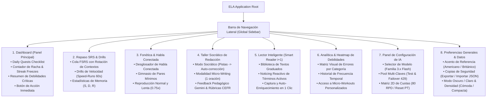

# Arquitectura de la Información y Mapa de Navegación (UI/UX)
## English Learning Assistant (ELA)

Este documento define la estructura de pantallas, la jerarquía de contenidos y el mapa de navegación del sistema para garantizar una experiencia sin fricción cognitiva.

---

## 1. Mapa del Sitio y Jerarquía de Navegación



---

## 2. Organización Espacial del Layout Principal

El diseño sigue una estructura de dos paneles (*Master-Detail / Sidebar-Content Layout*):

```
+-------------------+-------------------------------------------------------------+
|  ELA ASSISTANT    |  HEADER: [🔥 Racha: 14 días (🛡️ 1 Freeze)] [🌙 Tema] [⚙️]  |
+-------------------+-------------------------------------------------------------+
| [📊 Dashboard]    |  ÁREA DE CONTENIDO PRINCIPAL                                |
| [🗂️ Repaso SRS]   |                                                             |
| [⚡ Speed Drills] |  (Renderiza la vista activa según la selección del Sidebar) |
| [🔊 Fonética]     |                                                             |
| [📖 Lector i+1]   |                                                             |
| [✍️ Redacción]    |                                                             |
| [🔥 Heatmap]      |                                                             |
| [🤖 Config IA]    |                                                             |
| [⚙️ Preferencias] |                                                             |
+-------------------+-------------------------------------------------------------+
| ESTUDIANTE:       |  STATUS BAR: Base de datos SQLite activa | Latencia IA: 0.9s|
| Carlos (B1 Target)|  CLAVE ACTIVA: [Personal: AIza...4xK9] 🟢                   |
+-------------------+-------------------------------------------------------------+
```

---

## 3. Modales y Vistas Contextuales

1. **Modal de Pistas Socráticas (*Socratic Hints Panel*):**
   - Se activa tras la Fase 1 del taller de redacción, mostrando las preguntas orientadoras de Noticing sin revelar la solución corregida.
2. **Modal de Captura Rápida desde el Lector (*Quick Lookup & Add*):**
   - Al pulsar cualquier palabra en el Lector $i+1$, muestra definición, IPA y botón de 1 clic para añadirla a FSRS con auto-enriquecimiento de Gemini.
3. **Modal de Micro-Reto (*Micro-Challenge Dialog*):**
   - Se abre al culminar la evaluación de un texto por Gemini si se detectaron errores críticos, validando la regla antes de guardar.
4. **Modal de Notificación de Streak Freeze (*Freeze Saved Alert*):**
   - Alerta motivadora mostrada al iniciar sesión si el día previo fue rescatado por una ficha de congelación.

---

## 4. Guía de Estilos, Tokens y Especificación de Vistas

- Para la especificación exhaustiva de colores (paletas claras y oscuras), tipografía especializada (UI, lectura editorial con serifa, y glifos IPA), retícula de espaciado y directivas de accesibilidad WCAG 2.1 AA/AAA:
  👉 [`design_system_and_style_guide.md`](./design_system_and_style_guide.md)
- Para la especificación profunda de composición visual, ritmo de espaciado macro/micro, elevación tonal y diseño detallado de cada pantalla:
  👉 [`view_design_specifications.md`](./view_design_specifications.md)

