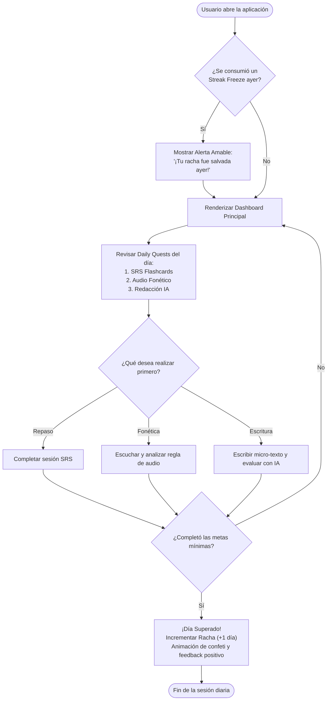
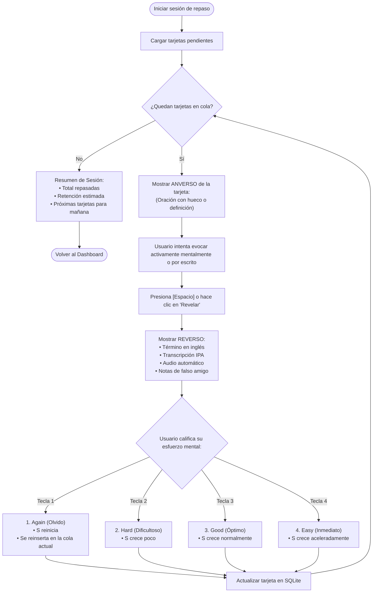
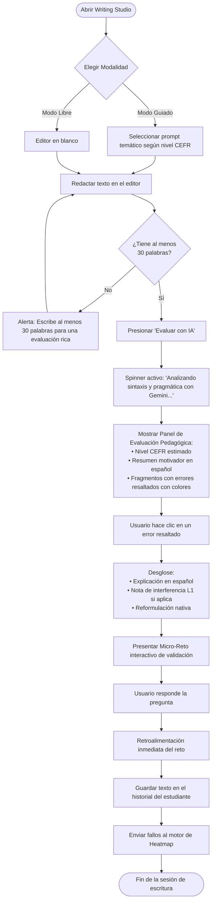
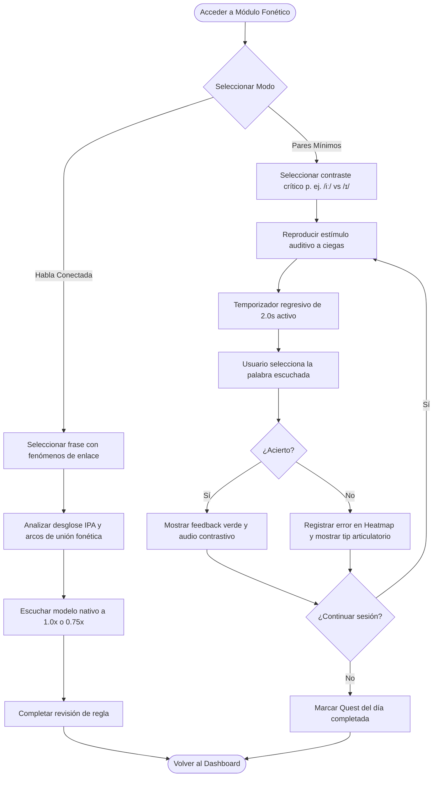
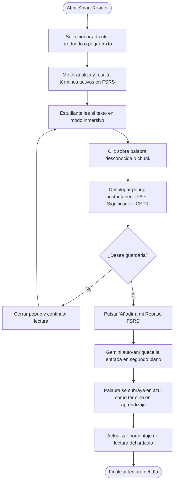
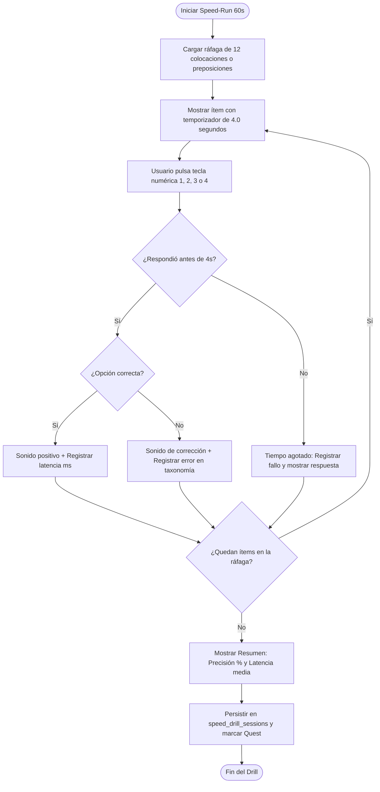

# Diagramas de Flujos de Usuario (User Flows)
## English Learning Assistant (ELA)

Este documento describe los cuatro flujos de interacción paso a paso más relevantes de la experiencia del estudiante.

---

## 1. Flujo de la Rutina Diaria (Daily Routine Flow)

---

## 2. Flujo de Sesión de Repaso con FSRS (Spaced Repetition Flow)

---

## 3. Flujo del Taller de Redacción y Evaluación con Gemini

---

## 4. Flujo de Entrenamiento de Habla Conectada y Pares Mínimos

---

## 5. Flujo del Lector Inteligente ($i+1$ Smart Reader)

---

## 6. Flujo del Gimnasio de Drills de Velocidad (Speed-Run)

