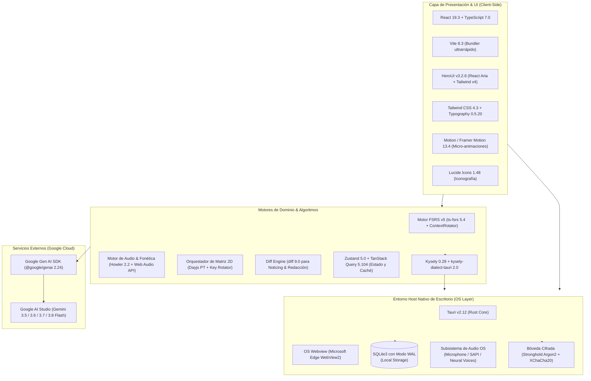

# Especificación Exhaustiva de Dependencias y Stack Tecnológico
## English Learning Assistant (ELA) — Arquitectura Desktop Local-First con HeroUI v3

---

## 1. Resumen Ejecutivo y Auditoría de Versiones

Este documento define la especificación técnica exhaustiva y justificada de todas las **tecnologías, bibliotecas, motores de ejecución y dependencias de software** requeridas para la implementación del **English Learning Assistant (ELA)**. 

Todas las versiones indicadas han sido **verificadas directamente contra los registros oficiales de npm y crates.io a fecha actual (septiembre de 2026)**, garantizando que el proyecto utilice las versiones más punteras y estables del ecosistema, con interoperabilidad y rendimiento probados.

### 🔑 Decisiones Centrales de la Arquitectura Moderna:
1. **HeroUI v3 (`3.2.6`) + Tailwind CSS v4 (`4.3.3`):**
   - Se adopta la última generación de **HeroUI** (`@heroui/react@3.2.6` y `@heroui/styles@3.2.6`), construida nativamente para **Tailwind CSS v4** y **React 19 (`19.3.0`)**.
   - **Ventajas de HeroUI v3 frente a v2:**
     - **CSS-First Engine:** Configuración directa en CSS mediante `@import "tailwindcss"; @import "@heroui/styles";` y plugins CSS nativos, eliminando configuraciones complejas de JavaScript en `tailwind.config.js`.
     - **Sin `<HeroUIProvider>` obligatorio:** Elimina el wrapper global en el árbol de componentes para una inicialización más rápida.
     - **Compound Components:** API declarativa de alta composición (ej. `<Card.Header>`, `<Card.Body>`, `<Modal.Header>`).
     - **React Aria Components:** Base de accesibilidad y foco por teclado optimizada con aceleración por hardware.
2. **Entorno de Escritorio Nativo con Tauri v2 (`2.12.0`):**
   - Shell nativo en Rust con consumo en reposo de **35–55 MB de RAM** y tamaño de binario de ~12 MB, cumpliendo con creces el límite no funcional (*RNF-PERF-04 < 200 MB*).
   - Ecosistema completo de plugins Tauri v2 actualizados a sus versiones más recientes (`2.4.0` – `2.8.0`).
3. **Persistencia Local con SQLite3 + Kysely:**
   - Modo WAL activado (`PRAGMA journal_mode = WAL;`) para lecturas ultrarrápidas y concurrentes sin bloqueo.
   - Acceso nativo mediante `@tauri-apps/plugin-sql@2.5.0` y el dialecto tipado `kysely-dialect-tauri@2.0.1` sobre `kysely@0.29.6`.
4. **Inteligencia Artificial con Google Gen AI SDK (`@google/genai@2.24.0`):**
   - Utilización del SDK moderno oficial para la familia **Gemini 3.x Flash** (3.5, 3.6, 3.7 y 3.8) con soporte nativo para esquemas estructurados JSON estrictos (`responseSchema`) y validación en tiempo de ejecución con `zod@4.6.5`.
   - Control horario de cuotas sincronizado a la medianoche del Pacífico (**00:00:00 PT**) con `dayjs@1.11.23`.
5. **Algoritmos FSRS v5 y Procesamiento Fonético:**
   - Planificador matemático `ts-fsrs@5.4.2` (FSRS v5) con rotación contextual anti-interferencia.
   - Renderizado comparativo de ondas acústicas en Canvas con `wavesurfer.js@8.0.1`.
   - Tipografía fonética prístina `@fontsource/charis-sil@5.3.0` para visualización IPA sin caracteres "tofu".

---

## 2. Diagrama de la Pila Tecnológica (Tech Stack Architecture)



---

## 3. Entorno de Ejecución y Shell de Escritorio: Tauri v2 + Vite 8

| Componente | Paquete / Crate | Versión Actual Verificada | Justificación Técnica & Cumplimiento |
| :--- | :--- | :--- | :--- |
| **Desktop Core (Rust)** | `tauri` (Crate) | `2.12.0` | Shell de escritorio nativo de alto rendimiento. Gestiona ventanas, menú contextual, bandeja de sistema (*system tray*), atajos globales de teclado e IPC ultrarrápido. |
| **Build Hook (Rust)** | `tauri-build` (Crate) | `2.7.0` | Macro de compilación requerida para empaquetar el binario final en Windows (MSI, EXE portable). |
| **Desktop API (JS/TS)**| `@tauri-apps/api` | `2.12.0` | Capa de bindings TypeScript entre el Frontend y el backend de Rust. |
| **Desktop CLI** | `@tauri-apps/cli` | `2.12.0` | CLI para desarrollo (`tauri dev`) y empaquetado optimizado de producción (`tauri build`). |
| **Frontend Bundler** | `vite` | `8.3.1` | Motor de empaquetado de última generación con Hot Module Replacement (HMR) sub-50 ms y compilación estática nativa hacia `dist/`. |
| **Plugin React para Vite**| `@vitejs/plugin-react` | `6.1.1` | Soporte oficial para React 19 con Fast Refresh instantáneo. |
| **Lenguaje Core** | `typescript` | `7.0.2` | Compilador TypeScript de última generación con soporte para tipado estricto `strict: true`, satisfies operator y decoradores de ECMAScript. |
| **Librería Base UI** | `react` / `react-dom` | `19.3.0` | Versión más reciente y estable de React. Soporte para Concurrent Mode, React Server/Client Components, hooks modernos de acción (`useActionState`, `useOptimistic`). |

---

## 4. Librería de Componentes y Diseño: HeroUI v3 + Tailwind CSS v4

La interfaz gráfica se construye al 100% sobre **HeroUI v3**, la versión de última generación construida sobre **Tailwind CSS v4** y **React Aria Components**.

### 4.1. Paquetes Oficiales de HeroUI y Estilos

```bash
npm install @heroui/react@3.2.6 @heroui/styles@3.2.6 tailwind-variants@3.3.1 clsx@2.1.1 tailwind-merge@3.7.0 motion@13.4.4
```

| Dependencia | Versión Semántica | Justificación Técnica |
| :--- | :--- | :--- |
| **`@heroui/react`** | `3.2.6` | Suite de componentes de HeroUI v3 con API de componentes compuestos (`Card.Header`, `Modal.Body`, etc.), optimizada para React 19 y Tailwind CSS v4. |
| **`@heroui/styles`** | `3.2.6` | Paquete de hojas de estilo y temas CSS de HeroUI v3 requeridos para el motor CSS-first de Tailwind v4. |
| **`tailwindcss`** | `4.3.3` | Motor de utilidades CSS de última generación basado en Rust (Lightning CSS), hasta 10 veces más rápido que Tailwind v3, con configuración directa en CSS. |
| **`@tailwindcss/typography`** | `0.5.20` | Plugin oficial de tipografía editorial para estilos de lectura sostenida en el *Smart Graded Reader ($i+1$)*. |
| **`motion` / `framer-motion`** | `13.4.4` | Motor de animaciones físicas fluidas. Orquesta las micro-interacciones de volteo 3D de tarjetas SRS (260 ms cúbicos), modales socráticos y barras de progreso. |
| **`tailwind-variants`** | `3.3.1` | Sistema de variantes tipadas usado internamente por HeroUI para alternar tamaños, colores semánticos y estados interactivos. |
| **`clsx`** | `2.1.1` | Utilidad condicional ultraligera para composición dinámica de nombres de clase. |
| **`tailwind-merge`** | `3.7.0` | Resuelve colisiones de clases en Tailwind CSS v4 de forma determinista. |

### 4.2. Mapeo de Componentes HeroUI v3 a las 10 Pantallas de ELA

| Pantalla de ELA | Componentes HeroUI v3 Utilizados | Propósito en la Vista |
| :--- | :--- | :--- |
| **1. Dashboard Principal** | `Card`, `Progress`, `Chip`, `Button`, `Divider`, `Tooltip`, `Badge` | Barra de progreso de *Daily Quests*, píldoras de racha con colores semánticos, resumen FSRS y alerta de debilidad crítica. |
| **2. Flashcards SRS** | `Card`, `Kbd`, `Button`, `Chip`, `ButtonGroup`, `Skeleton`, `Divider` | Tarjeta reversible con atajos táctiles físicos (`<Kbd>Espacio</Kbd>`, `<Kbd>1</Kbd>`..`<Kbd>4</Kbd>`) y botones de calificación de dificultad. |
| **3. Connected Speech Lab** | `Tabs`, `Tab`, `Slider`, `Button`, `Chip`, `Card`, `Snippet`, `Tooltip` | Selector de fenómenos (Linking, Elisión, Asimilación), selector de velocidad (0.75x / 1.0x) y glifos fonéticos. |
| **4. Minimal Pairs Gym** | `Card`, `Progress`, `Button`, `CircularProgress`, `Divider`, `Chip` | Entrenador de discriminación auditiva a ciegas, temporizador regresivo de 2.0s y reproducción contrastiva inmediata. |
| **5. Socratic Writing Studio** | `Textarea`, `Card`, `Tabs`, `Tab`, `Button`, `Badge`, `Alert`, `Accordion` | Editor de texto con contador de palabras, acordeón de pistas socráticas ZPD, alertas de retroalimentación y visor de micro-retos. |
| **6. Smart Graded Reader ($i+1$)** | `Card`, `Popover`, `Button`, `Chip`, `Slider` | Lienzo de lectura editorial, menús contextuales (*popovers*) al hacer clic sobre palabras desconocidas con acción "Guardar en SRS en 1-clic". |
| **7. Weakness Heatmap** | `Card`, `Table`, `TableHeader`, `TableColumn`, `TableBody`, `TableRow`, `TableCell`, `Chip` | Matriz de debilidades lingüísticas clasificadas por categoría (L1 Transfer, Colocaciones, Habla Conectada) y ordenadas por severidad. |
| **8. Speed-Retrieval Drills** | `CircularProgress`, `Progress`, `Kbd`, `Button`, `Card`, `Chip` | Cronómetro regresivo de 3-5 s con barra de tensión temporal, feedback visual verde/rojo y panel de racha de automaticidad. |
| **9. AI Settings & API Pool** | `Input`, `Table`, `Switch`, `Modal`, `Snippet` | Gestión del pool multi-claves, medidores de cuota (RPD/RPM) en tiempo real, selector de modelos 3.x Flash y pruebas de conexión. |
| **10. Lexicon Catalog** | `Table`, `Input`, `Dropdown`, `Pagination`, `Chip` | Catálogo de vocabulario con filtros por nivel CEFR, categoría léxica y estado FSRS (`NEW`, `LEARNING`, `REVIEW`). |

### 4.3. Configuración del Sistema de Diseño "Warm Minimalist" en Tailwind v4 y HeroUI v3

En **Tailwind CSS v4** y **HeroUI v3**, la configuración es puramente **CSS-first**, sin necesidad de `tailwind.config.js`:

```css
/* src/styles/globals.css */
@import "tailwindcss";
@import "@heroui/styles";
@plugin "./hero.ts";
@plugin "@tailwindcss/typography";

@source "../../node_modules/@heroui/theme/dist/**/*.{js,ts,jsx,tsx}";
@custom-variant dark (&:is(.dark *));

@theme {
  --font-sans: 'Plus Jakarta Sans', system-ui, sans-serif;
  --font-editorial: 'Newsreader', Georgia, serif;
  --font-phonetic: 'Charis SIL', 'Noto Sans Phonetic', serif;
  --font-mono: 'JetBrains Mono', monospace;
}
```

Y el archivo de inicialización del plugin de HeroUI:

```typescript
// src/styles/hero.ts
import { heroui } from "@heroui/react";

export default heroui({
  themes: {
    light: {
      colors: {
        background: "#FBFBF9", // Warm bone/canvas
        foreground: "#111827", // Text primary
        primary: {
          DEFAULT: "#4F46E5", // Focus Indigo
          foreground: "#FFFFFF",
        },
        success: {
          DEFAULT: "#047857", // Emerald 700
          foreground: "#FFFFFF",
        },
        warning: {
          DEFAULT: "#B45309", // Amber 700
          foreground: "#FFFFFF",
        },
        danger: {
          DEFAULT: "#B91C1C", // Red 700
          foreground: "#FFFFFF",
        },
        content1: "#FFFFFF", // surface-0 (Cards)
        content2: "#F4F4F1", // surface-1 (Inputs)
        content3: "#EAEAE5", // surface-2 (Hover)
        divider: "#E5E7EB",  // border-subtle
      },
    },
    dark: {
      colors: {
        background: "#0B0D13", // Deep indigo carbon
        foreground: "#F9FAFB", // High contrast text
        primary: {
          DEFAULT: "#6366F1", // Focus Indigo light
          foreground: "#FFFFFF",
        },
        success: {
          DEFAULT: "#34D399", // Emerald 400
          foreground: "#0B0D13",
        },
        warning: {
          DEFAULT: "#FBBF24", // Amber 400
          foreground: "#0B0D13",
        },
        danger: {
          DEFAULT: "#F87171", // Red 400
          foreground: "#0B0D13",
        },
        content1: "#131722", // surface-0 dark
        content2: "#1B2030", // surface-1 dark
        content3: "#23293D", // surface-2 dark
        divider: "#1F2637",  // border-subtle dark
      },
    },
  },
});
```

---

## 5. Iconografía y Fuentes Tipográficas Offline

Para erradicar la dependencia de CDNs externas y garantizar fidelidad absoluta a la fonética IPA (*RNF-USA-03*):

| Paquete | Versión Verificada | Justificación Técnica |
| :--- | :--- | :--- |
| **`lucide-react`** | `1.48.0` | Más de 1.400 iconos vectoriales en SVG limpios, consistentes y con tree-shaking automático. |
| **`@fontsource/plus-jakarta-sans`** | `5.3.0` | Tipografía principal de interfaz gráfica (pesos 400, 500, 600, 700) empaquetada localmente. |
| **`@fontsource/newsreader`** | `5.3.0` | Tipografía serif de estilo editorial para el Lector Inteligente $i+1$, optimizada para lectura prolongada sin fatiga. |
| **`@fontsource-variable/jetbrains-mono`** | `5.3.0` | Fuente monoespaciada variable para atajos físicos (`<Kbd>`), latencias y cronómetros. |
| **`@fontsource/charis-sil`** | `5.3.0` | Tipografía desarrollada por lingüistas de SIL International para glifos IPA (/æ/, /θ/, /ð/, /ʃ/, /ʒ/, /ŋ/, /ə/, /ɪ/, /ʊ/, /ʌ/) con alineación vertical perfecta de diacríticos y **cero caracteres "tofu"**. |

---

## 6. Persistencia y Base de Datos Local: SQLite3 + Kysely

La base de datos local SQLite (15 tablas especificadas en `sqlite_schema.sql`) se gestiona mediante el plugin nativo de Tauri respaldado por un Query Builder totalmente tipado:

| Dependencia | Versión Verificada | Tipo | Justificación Técnica |
| :--- | :--- | :--- | :--- |
| **`@tauri-apps/plugin-sql`** | `2.5.0` | Runtime | Plugin oficial de Tauri v2 para SQLite embebido en Rust con PRAGMA WAL y transacciones concurrentes sin bloqueo. |
| **`tauri-plugin-sql`** (Crate) | `2.5.0` | Rust Cargo | Driver nativo compilado con `features = ["sqlite"]`. |
| **`kysely`** | `0.29.6` | Runtime | Constructor de consultas SQL (*Query Builder*) con tipado estricto en tiempo de compilación. Cero overhead en runtime y máxima seguridad contra inyecciones SQL. |
| **`kysely-dialect-tauri`** | `2.0.1` | Runtime | Dialecto oficial que conecta Kysely con `@tauri-apps/plugin-sql` en Tauri v2 de forma transparente y tipada. |

---

## 7. Capa de Inteligencia Artificial: Google Gemini API

Para la familia **Gemini 3.x Flash** (`gemini-3.5-flash`, `gemini-3.6-flash`, `gemini-3.7-flash` y `gemini-3.8-flash`):

| Dependencia | Versión Verificada | Justificación Técnica |
| :--- | :--- | :--- |
| **`@google/genai`** | `2.24.0` | SDK oficial de última generación de Google para Gemini. Soporta esquemas estructurados JSON estrictos (`responseSchema`), streaming pedagógico y configuración fina de parámetros de inferencia. |
| **`zod`** | `4.6.5` | Validación de esquemas en tiempo de ejecución. Valida que el JSON devuelto por Gemini cumpla exactamente con los esquemas de `json_schemas_and_payloads.md`. |
| **`zod-to-json-schema`** | `3.25.2` | Convierte los esquemas TypeScript de Zod en esquemas JSON válidos para el campo `responseSchema` de la API de Gemini. Compatible nativamente con Zod v4. |
| **`dayjs`** | `1.11.23` | Biblioteca de fechas ultraligera (2 KB). Administra el cálculo del reinicio diario de cuota a las **00:00:00 Pacific Time (PT)** mediante sus plugins `utc` y `timezone`. |

---

## 8. Seguridad y Bóveda Criptográfica de Claves (RNF-SEC-01)

| Dependencia / Crate | Versión Verificada | Rol de Seguridad |
| :--- | :--- | :--- |
| **`@tauri-apps/plugin-stronghold`** / `tauri-plugin-stronghold` | `2.4.0` | Bóveda criptográfica nativa de Tauri basada en IOTA Stronghold. Cifra los secretos del pool de claves Gemini en disco y memoria mediante **Argon2** y **XChaCha20-Poly1305**. |
| **`@tauri-apps/plugin-store`** / `tauri-plugin-store` | `2.5.0` | Almacén persistente local para configuraciones de usuario (tema, nivel CEFR, retención FSRS). |

---

## 9. Fonética y Audio (Connected Speech & Pares Mínimos)

| Dependencia | Versión Verificada | Justificación Técnica |
| :--- | :--- | :--- |
| **`howler`** / `@types/howler` | `2.2.4` / `2.2.13` | Biblioteca de efectos de audio de ultra-baja latencia (< 5 ms) para feedback auditivo inmediato y contrastes fonológicos. *(Se mantiene 2.2.4 por ser la versión definitiva y estable con 100% de soporte multiplataforma).* |
| **`Web Speech API`** | Estándar W3C | API nativa en WebView2 para síntesis TTS offline a velocidad normal (1.0x) y reducida (0.75x) sin alteración de pitch (*pitch-preserving*). |
| **`Web Audio API`** | Estándar W3C | API de audio web nativa para reproducción sincronizada de estímulos auditivos a ciegas en el gimnasio de pares mínimos. |

---

## 10. Algoritmos Pedagógicos, Métricas y Estado Reactivo

| Dependencia | Versión Verificada | Justificación Técnica |
| :--- | :--- | :--- |
| **`ts-fsrs`** | `5.4.2` | Implementación formal en TypeScript del algoritmo **FSRS v5**. Modela la dificultad ($D$), estabilidad ($S$) y retención ($R$) con pesos optimizados. |
| **`diff`** / `@types/diff` | `9.0.0` / `8.0.0` | Motor de cálculo de diferencias (*character & word diff*) para el Taller Socrático. Compara el borrador original con la reformulación sugerida por Gemini. |
| **`zustand`** | `5.0.15` | Gestor de estado global ultraligero y desacoplado. Controla la sesión de tarjetas, el cronómetro de drills y la máquina de estados de rachas. |
| **`immer`** | `11.1.18` | Mutaciones inmutables seguras y ergonómicas para el estado de Zustand. |
| **`@tanstack/react-query`** | `5.104.0` | Gestión asíncrona de peticiones a Gemini y consultas a SQLite con caché, reintentos con backoff exponencial y resiliencia offline. |
| **`recharts`** | `3.10.1` | Biblioteca de gráficos declarativa construida sobre React 19 y SVG. Renderiza la curva de retención esperada FSRS y el progreso semanal. |
| **`react-hook-form`** | `7.89.0` | Manejo de formularios de configuración con re-renders mínimos. |
| **`@hookform/resolvers`** | `5.9.1` | Adaptador oficial para conectar `react-hook-form` con validación Zod v4. |

---

## 11. Entorno de Desarrollo, Calidad y Pruebas (DevDependencies)

| Dependencia | Versión Verificada | Propósito en el Flujo de Calidad |
| :--- | :--- | :--- |
| **`vitest`** | `5.0.2` | Test runner moderno ultrarrápido compatible con Vite 8. Ejecuta pruebas unitarias de algoritmos FSRS y Matriz 2D en milisegundos. |
| **`@testing-library/react`** | `16.3.3` | Pruebas de integración de componentes de React 19 y HeroUI v3. |
| **`@testing-library/jest-dom`** | `7.0.1` | Matchers semánticos para aserciones en el DOM virtual. |
| **`jsdom`** | `30.1.1` | Entorno de emulación del DOM para Vitest. |
| **`playwright`** | `1.63.0` | Pruebas de extremo a extremo (E2E) automatizadas para flujos críticos (repaso, discriminación fonética y envío a Gemini). |
| **`eslint`** | `10.11.0` | Linter estricto de código fuente. |
| **`eslint-plugin-react-hooks`** | `7.1.1` | Validador oficial de las reglas de React Hooks para React 19. |
| **`prettier`** | `3.9.9` | Formateador consistente de código. |
| **`prettier-plugin-tailwindcss`**| `0.8.1` | Ordenador automático de clases en Tailwind CSS v4 para componentes HeroUI. |
| **`postcss`** / **`autoprefixer`**| `8.5.28` / `10.6.1`| Procesamiento y prefijado CSS estándar. |

---

## 12. Manifiestos Técnicos Definitivos

### 12.1. Archivo `package.json`

```json
{
  "name": "english-learning-assistant",
  "private": true,
  "version": "1.0.0",
  "type": "module",
  "scripts": {
    "dev": "vite",
    "build": "tsc && vite build",
    "preview": "vite preview",
    "tauri": "tauri",
    "tauri:dev": "tauri dev",
    "tauri:build": "tauri build",
    "test": "vitest run",
    "test:watch": "vitest",
    "test:coverage": "vitest run --coverage",
    "test:e2e": "playwright test",
    "lint": "eslint . --report-unused-disable-directives --max-warnings 0",
    "format": "prettier --write \"src/**/*.{ts,tsx,css,json}\""
  },
  "dependencies": {
    "@fontsource-variable/jetbrains-mono": "5.3.0",
    "@fontsource/charis-sil": "5.3.0",
    "@fontsource/newsreader": "5.3.0",
    "@fontsource/plus-jakarta-sans": "5.3.0",
    "@google/genai": "2.24.0",
    "@heroui/react": "3.2.6",
    "@heroui/styles": "3.2.6",
    "@hookform/resolvers": "5.9.1",
    "@tanstack/react-query": "5.104.0",
    "@tauri-apps/api": "2.12.0",
    "@tauri-apps/plugin-dialog": "2.8.0",
    "@tauri-apps/plugin-fs": "2.6.0",
    "@tauri-apps/plugin-notification": "2.5.0",
    "@tauri-apps/plugin-opener": "2.6.0",
    "@tauri-apps/plugin-os": "2.4.0",
    "@tauri-apps/plugin-shell": "2.4.0",
    "@tauri-apps/plugin-sql": "2.5.0",
    "@tauri-apps/plugin-store": "2.5.0",
    "@tauri-apps/plugin-stronghold": "2.4.0",
    "clsx": "2.1.1",
    "dayjs": "1.11.23",
    "diff": "9.0.0",
    "howler": "2.2.4",
    "immer": "11.1.18",
    "kysely": "0.29.6",
    "kysely-dialect-tauri": "2.0.1",
    "lucide-react": "1.48.0",
    "motion": "13.4.4",
    "react": "19.3.0",
    "react-dom": "19.3.0",
    "react-hook-form": "7.89.0",
    "recharts": "3.10.1",
    "tailwind-merge": "3.7.0",
    "tailwind-variants": "3.3.1",
    "tailwindcss": "4.3.3",
    "ts-fsrs": "5.4.2",
    "zod": "4.6.5",
    "zod-to-json-schema": "3.25.2",
    "zustand": "5.0.15"
  },
  "devDependencies": {
    "@tailwindcss/typography": "0.5.20",
    "@tauri-apps/cli": "2.12.0",
    "@testing-library/jest-dom": "7.0.1",
    "@testing-library/react": "16.3.3",
    "@types/diff": "8.0.0",
    "@types/howler": "2.2.13",
    "@types/node": "26.6.3",
    "@types/react": "19.3.0",
    "@types/react-dom": "19.3.0",
    "@vitejs/plugin-react": "6.1.1",
    "autoprefixer": "10.6.1",
    "eslint": "10.11.0",
    "eslint-plugin-react-hooks": "7.1.1",
    "jsdom": "30.1.1",
    "playwright": "1.63.0",
    "postcss": "8.5.28",
    "prettier": "3.9.9",
    "prettier-plugin-tailwindcss": "0.8.1",
    "typescript": "7.0.2",
    "vite": "8.3.1",
    "vitest": "5.0.2"
  }
}
```

---

### 12.2. Archivo `src-tauri/Cargo.toml`

```toml
[package]
name = "english-learning-assistant"
version = "1.0.0"
description = "English Learning Assistant (ELA) - Local-First AI & SLA System"
edition = "2021"

[build-dependencies]
tauri-build = { version = "2.7.0", features = [] }

[dependencies]
tauri = { version = "2.12.0", features = ["tray-icon"] }
tauri-plugin-sql = { version = "2.5.0", features = ["sqlite"] }
tauri-plugin-store = "2.5.0"
tauri-plugin-stronghold = "2.4.0"
tauri-plugin-fs = "2.6.0"
tauri-plugin-dialog = "2.8.0"
tauri-plugin-notification = "2.5.0"
tauri-plugin-os = "2.4.0"
tauri-plugin-shell = "2.4.0"
tauri-plugin-opener = "2.6.0"
serde = { version = "1.0.229", features = ["derive"] }
serde_json = "1.0.151"

[profile.release]
panic = "abort"
codegen-units = 1
lto = true
opt-level = "s"
strip = true
```

---

## 13. Justificación de Casos Excepcionales de Versionado

Conforme a la directiva de selección rigurosa:
* **`howler` (`2.2.4`):** Es la última versión estable oficial del proyecto. No se adopta una versión superior porque la rama 2.2.4 es la versión definitiva y completamente probada en WebView2 para audio con Web Audio Context. Sus definiciones de tipos `@types/howler` corresponden a `2.2.13`.
* **`@types/diff` (`8.0.0`):** Mientras que el paquete runtime `diff` alcanzó la versión `9.0.0`, `@types/diff` en DefinitelyTyped se encuentra en `8.0.0` y cubre 100% las firmas del API de diferencias de caracteres y palabras.
* **Crates Tauri `2.x` vs `3.0.0-alpha.3`:** En crates.io existen versiones de desarrollo tempranas `3.0.0-alpha.x`. Para un producto de software robusto, se justifica el uso de la rama estable oficial **`2.12.0`** (con sus plugins correspondientes en `2.4.0`–`2.8.0`), evitando inestabilidad y APIs experimentales no finalizadas en el runtime de Rust.
