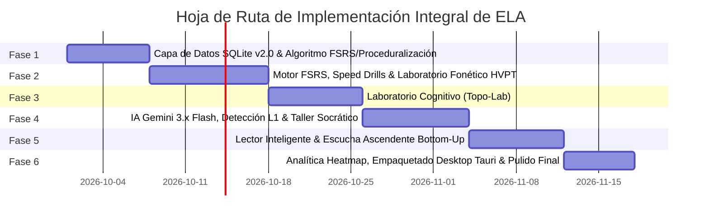

# Hoja de Ruta de Implementación Técnica (Roadmap)
## English Learning Assistant (ELA) — Plataforma Científica Integral de Adquisición de Segundas Lenguas

Este documento estructura el plan de ejecución técnica en **6 fases ordenadas por dependencia arquitectónica**, garantizando la integración progresiva de todos los módulos teóricos y pedagógicos (SLA, FSRS, Fonética Acústica, Gramática Cognitiva y Proceduralización Motora).

---

## 1. Cronograma de Fases y Dependencias Críticas

---

## 2. Detalle de Fases de Desarrollo y Criterios de Aceptación

### Fase 1: Cimientos de Datos SQLite v2.0 y Algoritmos de Memoria / Proceduralización
- **Objetivo:** Desplegar el esquema relacional completo y validar el motor matemático FSRS junto con la máquina de estados de proceduralización.
- **Entregables:**
  - Script de migración DDL v2.0 (`sqlite_schema.sql`) con tablas maestras e índices optimizados.
  - Carga de datos semilla (*Seed data*):
    - 500 lemas de vocabulario con múltiples ejemplos cloze de contexto dinámico.
    - 100 colocaciones esenciales y phrasal verbs idiomáticos.
    - 60 pares mínimos contrastivos para discriminación HVPT.
    - 30 reglas fonéticas de habla conectada.
    - 15 esquemas topológicos y verbos de movimiento satelitales.
  - Implementación del programador `FsrsScheduler` desacoplado con variabilidad contextual y módulo de *Throttling* (límite de 30 tarjetas/día con redistribución a 7 días).
  - Pruebas unitarias de FSRS y cálculo de retención $R = (1 + \text{factor} \cdot \Delta t / S)^{-1}$.
- **Criterio de Aceptación:** 100% de tests unitarios aprobados para intervalos FSRS y cero errores de integridad referencial en SQLite.

---

### Fase 2: Motor de Repaso Activo, Speed Drills y Gimnasio Fonético HVPT
- **Objetivo:** Construir la experiencia de tarjetas de estudio con mitigación de interferencia, el motor de proceduralización motora y el gimnasio de pares mínimos a ciegas.
- **Entregables:**
  - Interfaz de Flashcards 3D con atajos físicos (`Espacio`, `1`, `2`, `3`, `4`) y filtro semántico intercalado (*Semantic Interleaver*).
  - **Gimnasio de Drills de Velocidad (Speed-Run):** Temporizador estricto de 3.0 segundos, bucle de recuperación de errores $N+3 / N+7$, y cálculo de la Ley de Potencia de Newell & Rosenbloom para certificar automatización ($RT < 1.5\text{s}$ en 3 sesiones).
  - **Gimnasio de Pares Mínimos (HVPT):** Discriminación acústica a ciegas con selector forzado en menos de 2.0 segundos y feedback articulatorio inmediato.
- **Criterio de Aceptación:** El usuario puede completar una sesión de repaso, superar un drill de colocaciones con medición de latencia en milisegundos y entrenar contrastes auditivos sin soporte textual previo.

---

### Fase 3: Laboratorio Cognitivo y Topológico (Topo-Lab)
- **Objetivo:** Implementar la simulación interactiva de esquemas topológicos espaciales y contrastes semánticos.
- **Entregables:**
  - **Topo-Lab Cognitivo:**
    - Lienzo interactivo SVG de manipulación de contenedores y superficies (in, on, at, into, onto, through).
    - Módulo de contraste de verbos de movimiento satelital (*Manner in Verb + Path in Satellite*).
    - Inspector de constelaciones de polisemia radial (*run, take, get*).
- **Criterio de Aceptación:** El Topo-Lab reacciona al arrastre vectorial actualizando los esquemas preposicionales y visualizando extensiones radiales con fluidez.

---

### Fase 4: Inteligencia Artificial Gemini 3.x Flash, Detección L1 y Taller Socrático
- **Objetivo:** Orquestar el gateway de IA con pool multi-claves y conmutación 429, el escáner determinista de transferencia L1 y el taller de redacción socrática.
- **Entregables:**
  - Adaptador `GeminiAiGateway` con soporte para `gemini-3.5-flash`, `gemini-3.6-flash`, `gemini-3.7-flash` y `gemini-3.8-flash`.
  - Matriz 2D de consumo de cuotas (80 RPD por clave, reset 00:00 PT) y failover automático en menos de 500 ms ante HTTP 429.
  - **Escáner Determinista de Interferencia L1:** Detección instantánea vía RegEx de *pro-drop*, *existential have*, confusiones de preposiciones, *false friends* y verbos estativos antes de invocar la IA.
  - Taller Socrático en dos fases: Pistas mayéuticas para auto-corrección sin soluciones explícitas preliminares, seguido de evaluación final con micro-reto de consolidación.
- **Criterio de Aceptación:** El sistema intercepta errores L1 típicos al instante, solicita confirmación socrática y genera feedback pedagógico estructurado con Gemini en menos de 1.5 segundos.

---

### Fase 5: Lector Inteligente y Escucha Ascendente (Bottom-Up)
- **Objetivo:** Construir el laboratorio de escucha ascendente y el lector graduado basado en cobertura léxica y simplificación $i+1$.
- **Entregables:**
  - **Bottom-Up Listening & Lexical Profiler:**
    - Algoritmo de cobertura léxica de Nation (K1-K2 vs K3+) con verificación de umbrales del 95% y 98%.
    - Reproductor de escucha en 3 pasos: Audio ciego $\rightarrow$ Noticing acústico de micro-segmentos con transcripción $\rightarrow$ Re-escucha con script completo.
    - Botón de simplificación $i+1$ de textos asistido por Gemini Flash.
- **Criterio de Aceptación:** El estudiante entrena su oído con segmentos fonéticos aislados antes de ver el texto y simplifica lecturas con sobrecarga léxica mediante Gemini Flash.

---

### Fase 6: Analítica Heatmap, Empaquetado Desktop Ligero y Pulido Final
- **Objetivo:** Unificar la telemetría formativa en la matriz de debilidades, empaquetar la aplicación con Tauri y validar la resiliencia offline.
- **Entregables:**
  - Matriz visual de calor (*Heatmap*) con decaimiento temporal de errores ($\tau_{1/2} = 7\text{ días}$) y generador automático de *Micro-Workouts* ante fallas críticas ($\ge 6.0$).
  - Máquina de estados de hábitos: Quests diarias, racha protegida con 2 *Streak Freezes* y ventana de gracia de 24 horas para prevenir el abandono.
  - Empaquetado ligero multiplataforma con **Tauri v2** (consumo de memoria $< 120\text{ MB}$, arranque $< 500\text{ ms}$).
  - Modo 100% offline para repasos SRS, drills de velocidad, visualización fonética y Topo-Lab (sincronizando cola de IA cuando haya red).
- **Criterio de Aceptación:** Binario de escritorio instalado y probado en Windows, con navegación completa por atajos de teclado y funcionamiento fluido sin conexión externa para módulos locales.
