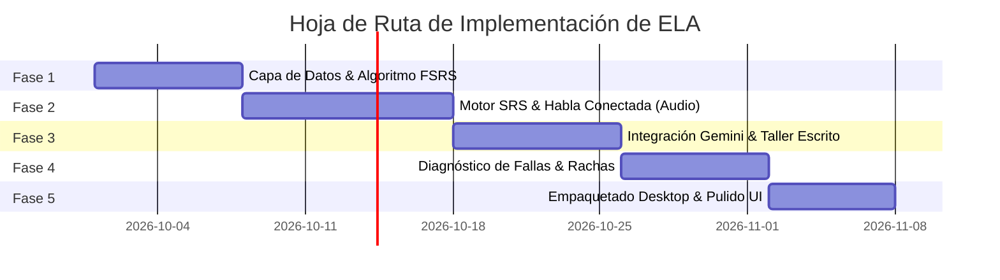

# Hoja de Ruta de Implementación Técnica (Roadmap)
## English Learning Assistant (ELA)

Este documento estructura el plan de ejecución técnica en **5 fases ordenadas por dependencia lógica**, estableciendo entregables concretos y criterios de aceptación para cada hito.

---

## 1. Cronograma de Fases y Dependencias

---

## 2. Detalle de Fases de Desarrollo

### Fase 1: Cimientos de Datos y Algoritmo de Memoria FSRS
- **Objetivo:** Establecer la base de datos local SQLite (15 tablas) y validar el motor matemático FSRS con variabilidad contextual y pruebas unitarias.
- **Entregables:**
  - Script de migración de base de datos SQLite con las 15 tablas e índices validados (`sqlite_schema.sql`).
  - Carga de datos semilla (*Seed data*): 500 palabras de contenido y función frecuentes con banco de contextos dinámicos (`vocab_context_examples`), 100 colocaciones esenciales y 50 reglas fonéticas.
  - Implementación desacoplada de la clase `FsrsScheduler` con cálculo DSR y el rotador de contextos `ContextRotator`.
  - Pruebas unitarias de FSRS con 100% de cobertura.
- **Criterio de Salida:** Validación matemática de que los intervalos de repaso coinciden exactamente con la retención objetivo del 90% y rotación efectiva de oraciones cloze en cada repaso.

### Fase 2: Módulos de Repaso Activo, Habla Conectada y Pares Mínimos
- **Objetivo:** Construir la experiencia de tarjetas de estudio, el desglose fonético y el gimnasio de pares mínimos.
- **Entregables:**
  - Interfaz de Flashcards con soporte completo para atajos de teclado (`Espacio`, `1`, `2`, `3`, `4`) y filtro anti-interferencia (*Semantic Interleaver*).
  - Motor de análisis de Habla Conectada: detección de enlaces consonante-vocal, intrusiones /j/ y /w/, y elisiones /t, d/.
  - **Gimnasio de Pares Mínimos:** Discriminación rápida a ciegas de contrastes fonológicos (/iː/ vs /ɪ/, /b/ vs /v/) con temporizador de 2 segundos.
- **Criterio de Salida:** Un usuario puede repasar una sesión completa de tarjetas, analizar los fenómenos de habla conectada de una frase y completar una ronda de discriminación auditiva de pares mínimos.

### Fase 3: Taller Socrático de Redacción y Evaluación con Google Gemini
- **Objetivo:** Integrar la API de Gemini para corrección pedagógica estructurada, andamiaje socrático y micro-writing.
- **Entregables:**
  - Adaptador `GeminiAiGateway` con soporte para la familia 3.x Flash (`gemini-3.5-flash`, `gemini-3.6-flash`, `gemini-3.7-flash` y `gemini-3.8-flash`).
  - Flujo socrático en 2 etapas: Fase 1 (Pistas de Noticing guiadas sin solución) y Fase 2 (Auto-corrección, diff visual y reformulación nativa).
  - Modalidad de *Micro-Writing* de 1 sola oración para práctica ágil sin fricción.
  - Módulo interactivo de *Micro-Reto* para validar la asimilación tras cada corrección.
  - Panel de Configuración de IA con pool multi-claves y conmutación automática ante cuota excedida (HTTP 429 con Matriz 2D y reloj PT).
- **Criterio de Salida:** El usuario redacta un texto con errores de transferencia L1, recibe pistas reflexivas de Gemini en menos de 1.5 s, auto-corrige su borrador y valida su comprensión en el micro-reto.

### Fase 4: Analítica de Debilidades, Drills de Velocidad y Hábitos
- **Objetivo:** Unificar la telemetría de fallas en el Heatmap, activar la proceduralización y consolidar el bucle de hábitos.
- **Entregables:**
  - Colector de eventos de error que cataloga fallos procedentes de SRS, fonética y redacción.
  - Algoritmo de decaimiento temporal y cálculo del *Weakness Score*.
  - Vista gráfica del *Heatmap* de debilidades categorizadas y generador de *Micro-Workouts* ante fallas críticas ($\ge 6.0$).
  - **Gimnasio de Speed-Run (Drills de Velocidad):** Ráfagas de 60 segundos con temporizador de 3-5 s para automatizar colocaciones en los ganglios basales (Modelo DP de Michael Ullman).
  - Máquina de estados de *Daily Quests* (repaso, fonética, redacción/micro-writing, drills) y racha con *Streak Freezes*.
- **Criterio de Salida:** Al cometer 3 fallos reiterados, se genera automáticamente un Micro-Workout y el alumno puede entrenar reflejos rápidos en el drill de velocidad cronometrado.

### Fase 5: Input Comprensible ($i+1$), Empaquetado Desktop y Modo Offline
- **Objetivo:** Integrar el lector inmersivo, optimizar el empaquetado local y blindar la resiliencia offline.
- **Entregables:**
  - **Lector Inteligente Graduado (*Smart Graded Reader $i+1$*):** Biblioteca de textos graduados, subrayado dinámico de términos en aprendizaje y captura léxica con auto-enriquecimiento en 1 clic.
  - Soporte de cola local fuera de línea para textos y tarjetas pendientes de sincronización.
  - Funcionalidad de exportación e importación completa de la base de datos en JSON/CSV.
  - Empaquetado como aplicación local de escritorio ligera mediante **Tauri** con atajos globales y modo oscuro/claro nativo.
  - Calibrador adaptativo periódico de pesos FSRS en segundo plano.
- **Criterio de Salida:** La aplicación es 100% autónoma, privada y ultrarrápida, permitiendo al usuario avanzar en su rutina diaria de lectura, fonética, drills y repasos incluso sin conexión a Internet.

